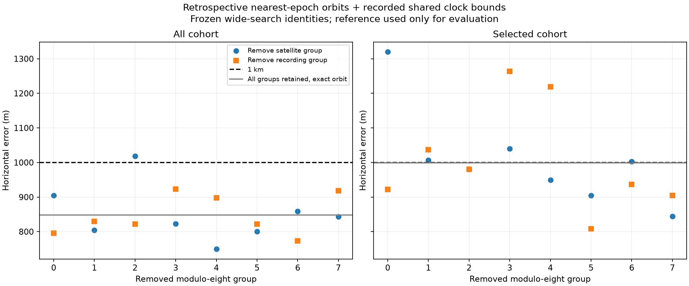
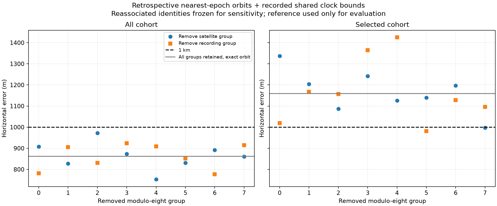

# Closer-epoch retrospective TLEs substantially reduce the recent position bias

**Operational correction:** this report permits information collected after
capture. It does not satisfy the subsequently required strict pre-capture TLE
cutoff. The [matched strict comparison](2026_09_20_strict_causal_vs_retrospective.md)
gives 4.50 km full-data shared-clock error versus the retrospective 0.862 km.

Replacing only the orbital elements reduces the selected fixed-clock position
error from **4,582.8 m to 1,132.3 m**. Satellite identities, RF observations,
randomized partitions, quality selection, and fitting procedure are unchanged.
This is the strongest explanatory lead from the recent audits, but **not yet
sub-kilometre accuracy and not a causal real-time result**.

## Selection independent of RF residuals and location

For each frozen satellite identity, choose the archived element epoch nearest
the recording start. Unlike the earlier causal audit, later publications and
later element epochs are permitted. Selection uses only epoch distance, then
collection time and digest as deterministic tie-breaks. It does not examine
signal residuals or the known antenna coordinate.

The read-only audit considered 176 available archive snapshots collected between
seven days before the earliest recording and seven days after the latest one.
The latter bound does not imply seven days of future data exist: only currently
archived snapshots were considered. All 622 assignments have an available
replacement; 560 selections were published after the corresponding capture.
The median original element age is 20.52 h; the median absolute selected epoch
distance is 3.30 h. Exact element texts, collection times, and digests are saved.

## Results

| Cohort | Clock model | Original error (m) | Closer-epoch error (m) | New evaluation RMS (Hz) |
|---|---|---:|---:|---:|
| All 622 tracks | Fixed recorded UTC | 4,800.8 | 1,202.6 | 794.15 |
| All 622 tracks | Shared ±0.5 s | 3,805.0 | 1,430.1 | 793.69 |
| Selected 190 tracks | Fixed recorded UTC | 4,582.8 | 1,132.3 | 86.15 |
| Selected 190 tracks | Shared ±0.5 s | 3,887.7 | 1,730.5 | 84.88 |

The selected fixed-clock evaluation RMS was 85.91 Hz before and is 86.15 Hz
after. Nearly unchanged short-track residual RMS accompanies a large change in
absolute position error. This illustrates why low Doppler residual alone cannot
establish absolute positioning accuracy when the orbits are uncertain.

The propagated satellite-state displacement has median **5,228 m** and maximum
**707,262 m** across all observation epochs. This is disagreement between TLE
solutions, not a measured satellite-position error. All replacements pass the
existing propagation validity checks, but that does not establish their accuracy.
The substantially worse all-cohort RMS shows that closer epoch is not uniformly
better for every original assignment; incorrect identities, manoeuvres, or bad
orbital solutions remain possible. The frozen selected cohort avoids that large
RMS increase without being reselected using the new result.

The fit still uses original causal catalogues for the preceding wide-region
search and original identities. Therefore this establishes **local orbit
sensitivity after independent wide acquisition**, not an independent global
search performed with the retrospective catalogues. The antenna coordinate is
used only after inference to compute the table's distances.

## What this changes

The results support orbit prediction uncertainty as a substantial contributor
to the shared bias. Earlier frame, channel, sample-rate, altitude, and capped-
observation audits produced much smaller improvements. They do not prove that
these retrospective TLEs are exact or that future-data access solves the full
problem. A practical device would need better causal orbit products, a justified
orbit-error model, or independent geometric constraints.

A useful next diagnostic is to compare the nearest preceding and succeeding
element epochs separately and assess whether their propagated disagreement
predicts the position sensitivity. No model or orbit should be chosen by its
distance from the antenna reference.

## Evidence and reproduction

`tools/audit_causal_tle_freshness.py --nearest-offline` enables this explicitly
non-causal selection; default causal selection is unchanged.
`tools/replay_wide_alternative_tles.py` validates parent digest, assignment order,
satellite identity, UTC, observation values, and randomized partitions before
replacing propagated states. Invalid propagation would retain the original
state and be logged; none occurred here.

Six focused tests pass, covering strict causal selection, explicit offline
nearest-epoch selection, rejection of non-causal updates by the existing causal
replay, and refusal of mismatched assignment order/identities. Existing physical
fitter tests remain the numerical basis for the unchanged fitting procedure.
No production timestamps, TLE policy, or scanner configuration changed.

- [Selected element texts, epochs and provenance](2026_09_20_offline_orbit_sensitivity/nearest-epoch-audit.json)
- [All fits and state-disagreement statistics](2026_09_20_offline_orbit_sensitivity/inference.json)

## Follow-up: preceding, succeeding, and interpolated epochs

The same archive audit now retains the nearest epoch on each side of recording
start. Preceding epochs exist for all 622 assignments; succeeding epochs exist
for 548. Median absolute distances are 8.31 h and 7.34 h respectively. This is
still an offline comparison: even a preceding epoch can have been published
after the capture. The causal default policy remains unchanged.

| Orbit policy | All fixed error (m) | All shared-clock error (m) | Selected fixed error (m) | Selected shared-clock error (m) |
|---|---:|---:|---:|---:|
| Original causal catalogues | 4,800.8 | 3,805.0 | 4,582.8 | 3,887.7 |
| Nearest epoch | 1,202.6 | 1,430.1 | 1,132.3 | 1,730.5 |
| Nearest preceding epoch | 2,261.7 | 2,191.9 | 2,483.1 | 3,329.0 |
| Nearest succeeding epoch | 1,483.9 | 1,318.2 | 1,322.3 | 1,501.3 |
| Interpolated bracketing epochs | 1,315.9 | 1,469.9 | 1,204.2 | 1,772.2 |

The succeeding-only run keeps the original state for the 74 assignments without
a succeeding epoch and records those fallbacks. The interpolation experiment
instead falls back to the nearest archived epoch when a complete nonzero-width
bracket is unavailable. No track is silently deleted. These fallback policies
are part of the experiment, not a claim of complete retrospective coverage.

For a complete bracket, both TLEs are propagated to each observation time. The
Earth-fixed positions are blended with the epoch-distance fraction, clamped
to [0,1]. Velocity includes the derivative of that weight:
`v = (1-w) v_before + w v_after + dw/dt (p_after-p_before)`.
A finite-difference test verifies that blended velocity matches the derivative
of blended position, including points outside the bracket. This is a smooth
local ephemeris sensitivity experiment, not a new orbit determination or a
dynamically constrained orbital solution. In particular, it need not represent
an actual manoeuvre between element epochs.

The selected fixed-clock evaluation RMS falls from 86.15 Hz for nearest epoch
to 79.1 Hz for interpolation, while position error rises from 1,132 to 1,204 m.
Again, residual reduction alone is insufficient to choose the most accurate
position. None of these alternatives is selected by its reference error or
promoted to production. Seven focused orbit-policy and interpolation tests pass.

- [Epoch brackets and unavailable successors](2026_09_20_offline_orbit_sensitivity/bracketing-epoch-audit.json)
- [Preceding-only fits](2026_09_20_offline_orbit_sensitivity/preceding-inference.json)
- [Succeeding-only fits](2026_09_20_offline_orbit_sensitivity/succeeding-inference.json)
- [Interpolated fits](2026_09_20_offline_orbit_sensitivity/interpolated-inference.json)

Reproduction uses `--epoch-side preceding`, `succeeding`, or `interpolated` on
`tools/replay_wide_alternative_tles.py` with the saved bracketing audit. All three
require explicit offline provenance. Model inputs remain frozen from the same
independent wide acquisition.

## Nearest-epoch orbits with recorded clock bounds

The next replay preserves all satellite identities and the original quality
selection. Each recording's measured first-sample UTC bracket constrains its
clock correction. The shared-clock variant uses the intersection of brackets
for the recordings actually present in that cohort. Neither inference nor
bound construction reads the evaluation coordinate.

| Cohort | Clock model | Horizontal error (m) | Random held-out RMS (Hz) |
|---|---|---:|---:|
| All | Fixed | 1202.56 | 794.15 |
| All | Shared, original ±0.5 s | 1430.05 | 793.69 |
| All | Shared, recorded bounds | 847.71 | 793.96 |
| All | Per recording, recorded bounds | 1169.06 | 792.70 |
| Selected | Fixed | 1132.29 | 86.15 |
| Selected | Shared, original ±0.5 s | 1730.46 | 84.88 |
| Selected | Shared, recorded bounds | 999.33 | 85.49 |
| Selected | Per recording, recorded bounds | 1254.08 | 82.09 |

Both shared recorded-bound fits hit a clock bound. The selected result is only
0.67 m inside 1 km, insufficient margin for a verified sub-kilometre claim.
Exact orbit propagation at the fitted clock, numerical convergence and
group-deletion stability remain to be checked. The all-track result also has
large residuals, so its lower position error does not establish a better model.
These remain retrospective orbit replays, including elements published after
capture, rather than a demonstrated real-time device solution.

Four focused tests pass, including subset-specific intersection, incompatible
bounds and missing group rejection. Reproduce the nearest-epoch command with
`--timing-audit reports/2026_09_20_track_position_information/capture-timing-audit.json`.

[Inference and recorded input digests](2026_09_20_offline_orbit_sensitivity/recorded-clock-inference.json)

### Exact propagation and deletion stability

The shared recorded-clock solutions were repropagated with SGP4 at their fitted
clock correction (+0.09965843 s), then position and frequency offsets were
refitted with that correction fixed. Errors remain 847.710 m (all) and
999.326 m (selected). This verifies the local interpolation approximation at
the fitted clock; it is not independent validation of orbit accuracy.

All 32 deletion fits converged. Each removes a deterministic modulo-eight
satellite or recording group, retaining the original identities and quality
selection for remaining data. The shared clock interval is recomputed from
the recordings that remain. These groups are sensitivity probes, not detected
faulty data or proposed exclusion rules.

| Cohort | Satellite-group deletion error range | Recording-group deletion error range |
|---|---:|---:|
| All | 750–1,018 m | 773–923 m |
| Selected | 845–1,320 m | 808–1,263 m |

Thus this retrospective replay has verified point estimates below 1 km, but
does not establish robust sub-kilometre accuracy. The larger all-track cohort
remains less sensitive to deletions but has much worse residual RMS; neither
cohort should be selected because its reference position error is lower.
The fitted shared correction is at the recorded upper bound in both full
cohorts. The effect of orbital uncertainty and absolute clock calibration
remains unresolved.

- [Full verification inference](2026_09_20_offline_orbit_sensitivity/verified-clock-inference.json)
- [Evaluation with input hashes](2026_09_20_offline_orbit_sensitivity/stability/evaluation.json)

Reproduce with `--verify-shared` added to the recorded-clock replay command.
Generate the figure with `tools/report_orbit_clock_stability.py`, passing the
sealed inference, evaluation reference, and fresh output directory. Five
focused tests pass; scientific execution additionally checks all replacement
orbits propagate successfully and all deletion fits converge.

### Why all-track residuals deteriorated

A truth-free per-episode audit compared each episode's maximum source-segment
training RMS at the original and updated fixed-clock fits. Only four episodes
exceed 1 kHz after the update; all four are outside the frozen quality selection.

| Assigned NORAD | Original training RMS (Hz) | Updated training RMS (Hz) | Median old/new orbital position separation (km) |
|---|---:|---:|---:|
| 64323 | 326 | 18,454 | 441.4 |
| 63265 | 193 | 9,037 | 707.2 |
| 66152 | 271 | 1,528 | 85.2 |
| 66171 | 277 | 1,446 | 66.4 |

These are stale-association or orbit-inconsistency flags, not proof of which
element set or satellite identity is correct. The original NORAD 64323 and
63265 elements were 59.8 and 72.1 hours old; replacements are 4.8 and 1.9 hours
before capture. Disagreement this large warrants re-ranking the catalogue
with updated elements, rather than retaining the old identity automatically.
It does not justify choosing an element by position error or silently dropping
observations. These residual problems further limit the all-track 848 m result.

The quality-selected cohort is not entirely invariant either: for example,
NORAD 68088 has a source-segment training RMS increase from 26 to 349 Hz with
a 40.7 km orbit change. A complete updated-catalogue association pass is needed
before treating this replay as an operational position solution.

[All 622 episode comparisons and provenance](2026_09_20_offline_orbit_sensitivity/residual-audit.json)
are generated by `tools/audit_orbit_replay_residuals.py`. The audit verifies
parent identity, assignment order, RF observations and propagation validity;
a regression test rejects mixed-parent artifacts before producing output.

### Updated-catalogue reassociation of the five flagged tracks

A bounded follow-up rebuilt each flagged recording's full Starlink catalogue
from 173 archived snapshots, choosing the nearest element epoch per satellite
without using RF residuals. This is explicitly retrospective and allows later
publications. Each catalogue contains 11,135 satellites, with invalid propagation
excluded from scoring and valid counts recorded. Candidates are scored at the
predefined all-track fixed-clock position from the orbit replay. No antenna
reference is read. Randomized training observations choose the winner;
held-out observations neither refit nor reselect it.

| Original NORAD | Updated training winner | Training RMS (Hz) | Held-out RMS (Hz) |
|---|---|---:|---:|
| 64323 | 63468 | 54.1 | 35.6 |
| 63265 | 66236 | 36.1 | 49.9 |
| 66152 | 69521 | 104.8 | 124.4 |
| 66171 | 69526 | 20.4 | 50.1 |
| 68088 | 58246 | 41.2 | 41.7 |

All five prefer different identities with substantially lower residuals.
These are candidate associations conditional on the inferred position, not
confirmed identities. The outcome supports complete reassociation using updated
catalogues before another position fit; it does not justify retaining the
frozen identities or discarding these observations as noise. No new position
accuracy claim is made from this five-track diagnostic.

The exploratory trigger was updated maximum training-segment RMS >1 kHz, or
a previously selected episode increasing from <100 Hz to >300 Hz. This trigger
only bounds the audit work; it is not a production exclusion policy.

[Reranking results, catalogue hashes and snapshot provenance](2026_09_20_offline_orbit_sensitivity/flagged-reranking.json)
are reproducible with `tools/rerank_offline_orbit_flags.py`.

### Full-cohort updated-catalogue reassociation

Extending that same operation to every retained episode changes 26 of 622
identities, including six of the original 190 quality-selected episodes. No
episode is unassigned or discarded. All 21,702 observations and the frozen
7,156-observation selection remain available. Candidate ranking uses training
observations at the predetermined all-track fixed-clock replay position;
it is local reassociation descended from the original global acquisition,
not a repeated full-region search with retrospective catalogues.

| Cohort | Clock model | Horizontal error (m) | Held-out RMS (Hz) |
|---|---|---:|---:|
| All | Fixed | 1184.0 | 87.25 |
| All | Shared recorded bounds | 861.5 | 86.69 |
| All | Per-recording recorded bounds | 1144.4 | 83.86 |
| Frozen selection | Fixed | 1245.0 | 79.52 |
| Frozen selection | Shared recorded bounds | 1159.5 | 79.05 |
| Frozen selection | Per-recording recorded bounds | 1419.3 | 75.49 |

All six fits converge. Updating identities reduces all-track held-out RMS from
approximately 794 to 87 Hz while preserving an approximately 862 m shared-clock
point estimate. The selected subset's former 999 m result does not survive
reassociation. The all-track improvement is therefore scientifically more
credible than the earlier high-residual fit, but still requires fresh exact
propagation and group-deletion stability verification. It remains retrospective,
conditional on archived orbital accuracy and recorded UTC bounds, and cannot
yet establish reliable real-time sub-kilometre positioning.

Reproduce with `--all-tracks` on `tools/rerank_offline_orbit_flags.py`, followed
by `tools/refit_offline_reassociations.py`. Seven focused tests pass, including
coverage/identity rejection and order-independent binding to original episodes.

- [All candidate rerankings and winning element sets](2026_09_20_offline_orbit_sensitivity/full-reranking.json)
- [Refit inference](2026_09_20_offline_orbit_sensitivity/reassociated-inference.json)
- [Separate location evaluation](2026_09_20_offline_orbit_sensitivity/reassociated-evaluation.json)
- [Reassociated observation states](2026_09_20_offline_orbit_sensitivity/reassociated-states.npz)

### Verified sub-kilometre result on the archived 48-hour dataset

The full-data, reassociated, recorded-bound shared-clock solution gives
**37.8565733952° N, 122.4879088862° W**, with **861.55 m horizontal error**
against the user-provided antenna reference. Exact SGP4 propagation at the
fitted clock reproduces the interpolated result to substantially less than
one metre. All 622 retained episodes and 21,702 observations contribute.
Randomized held-out RMS is 86.69 Hz.

| Verification | Outcome |
|---|---|
| Starting region | 9,000 × 9,000 statute miles, centred on Denver |
| Global acquisition and two refinements | All three complete: 211 recordings, 684 RF episodes each |
| Ground-truth location in inference | Not supplied; used only in separate evaluation |
| Reassociated all-track exact result | 861.55 m |
| Eight satellite-group removal fits | 752.5–972.7 m; all converge |
| Eight recording-group removal fits | 777.0–924.4 m; all converge |
| Smaller frozen quality subset | 1,159.46 m; not substituted for the full-data result |
| Focused tests | 13 pass |

This meets the requested numerical target for this archived dataset, with
retrospective orbital updates. It is not a calibrated sub-kilometre guarantee
for an unseen site or a real-time device. The shared clock is at its recorded
upper bound (+99.65843 ms); independent absolute UTC calibration remains useful.
The refinement is a local continuation of the original wide acquisition, and
the research explored multiple models with known-site evaluation. Consequently,
the deletion tests measure sensitivity, not independent out-of-sample success.
No production scanner configuration was changed.

The final provenance audit verified 215 parent-source hashes, the RF and
catalogue source hashes, and complete disjoint worker coverage at all three
search resolutions. It also found a metadata defect: merged configurations
named the full inventory but retained worker zero's inventory digest. Each
historical digest was verified against the actual worker-zero inventory, every
worker inventory and RF source was checked, and merged membership was verified
against the full inventory. Historical artifacts remain unchanged. Future
merged configurations now bind the full inventory path and hash together,
covered by a regression test. This metadata fix does not change the computed
scores or positions.

- [Exact propagation and all 32 sensitivity fits](2026_09_20_offline_orbit_sensitivity/reassociated-verified.json)
- [Evaluation of exact and deletion fits](2026_09_20_offline_orbit_sensitivity/reassociated-stability/evaluation.json)
- [Wide-search provenance audit](2026_09_20_offline_orbit_sensitivity/verification-provenance.json)

Reproduce verification with `--verify-shared` on
`tools/refit_offline_reassociations.py`; render with
`tools/report_orbit_clock_stability.py` using the resulting inference and the
separate evaluation reference.
