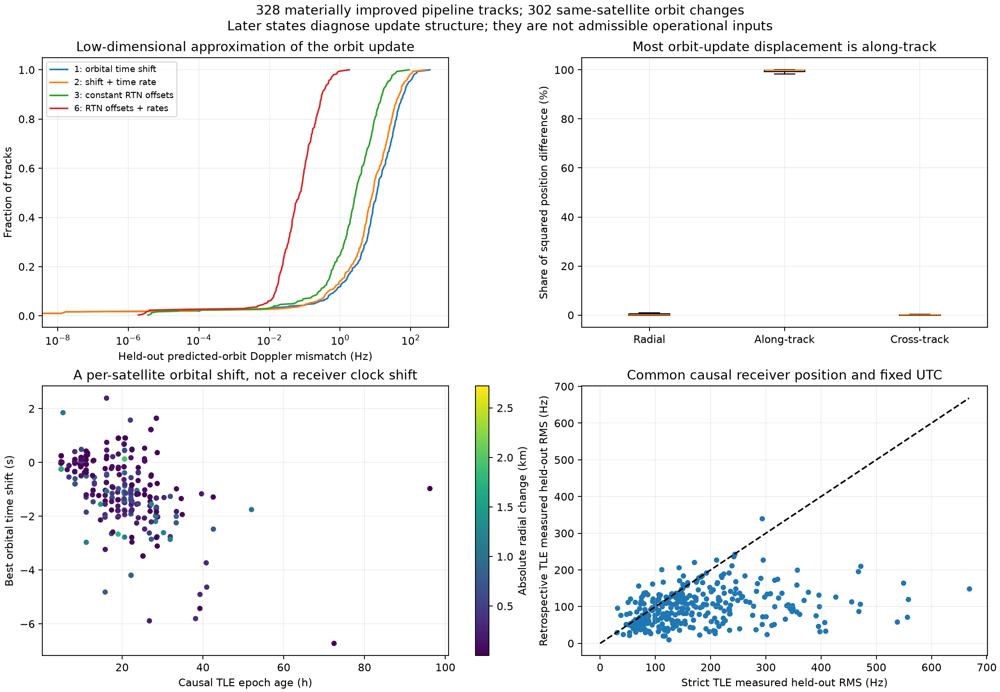
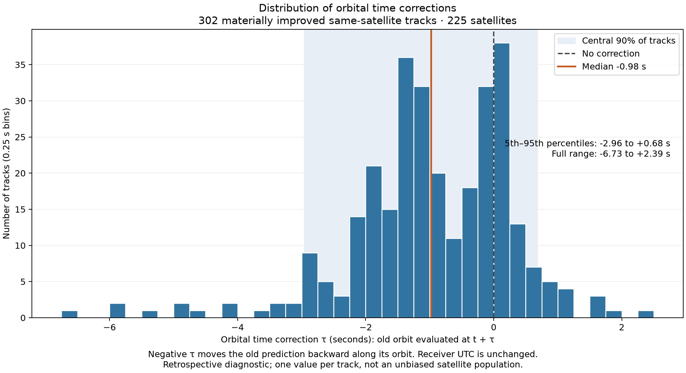
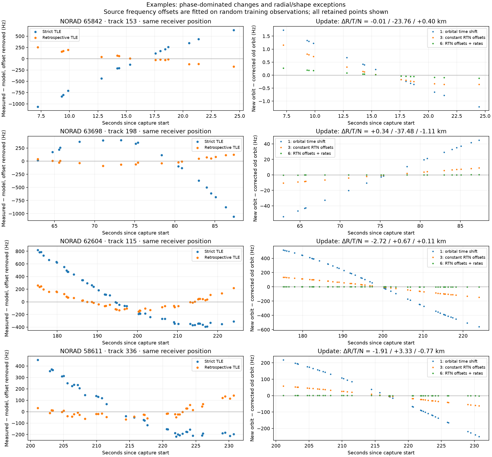

# What changed between the causal and retrospective TLEs?

**Your time-shift intuition is largely correct: most of the change is satellite
phase along the orbit. But the exceptions require radial and velocity changes,
and those smaller components can matter substantially to Doppler.** A single
orbital time shift explains a median **99.83% of the squared position difference**
in the 302 materially improved, same-satellite cases studied here. Its remaining
orbit-to-orbit Doppler mismatch is a median **11.23 Hz**. Three local position
offsets reduce that to **2.77 Hz**; adding their rates reduces it to **0.074 Hz**.

These are retrospective descriptions of the updates, **not demonstrated
corrections available before capture**. The coefficients were fitted using both
element sets. Nothing here changes the strict causal positioning result of
4.50 km, or establishes operational sub-kilometre positioning.

This extends [the strict causal comparison](2026_09_20_strict_causal_vs_retrospective.md).
It compares the exact two element sets selected by that comparison for each
episode, rather than every intervening catalogue update. All 622 episodes and
their original randomized observation partitions are preserved. The known
antenna coordinate is not used in this decomposition.

## What counts as an improvement, and what caused it?

For this audit, a material improvement means pipeline held-out RMS decreases by
**at least 20 Hz and at least 25%**. This is a descriptive threshold, not a
statistical significance test. The complete inventory includes the other cases
so that the threshold can be changed without losing them.

| Comparison | Episodes |
|---|---:|
| All compared episodes | 622 |
| Materially improved | 328 |
| Improved, same satellite, changed element set | 302 |
| Improved, different satellite selected | 13 |
| Improved, identical element set | 13 |

The 302 orbit-update cases cover 225 distinct NORAD IDs. The 328 improved cases
cover 247 distinct causal NORAD IDs. Across the full cohort, 20 identities change
and 55 element sets are identical.

The pipeline comparisons also change the fitted receiver position and clock.
To separate those effects, each episode is rescored twice at a **common receiver
position and fixed UTC**: once using the causal inferred position, and once using
the retrospective inferred position. Only the training-derived source frequency
offset is refitted. At the common causal position, 195 of the 328 cases still
meet the improvement threshold; 184 meet it at both positions. In 56 cases the
new prediction is actually worse at the common causal position, despite the
improvement in the full pipeline. Therefore not every lower RMS can be credited
to an orbit update alone.

The [per-episode audit](2026_09_20_orbit_update_modes/all-improved-tracks.md)
provides an explanation for **every one of the 328 materially improved cases**,
including identity changes and unchanged TLEs. It includes both common-position
controls, epoch ages, radial/along-track/cross-track changes, orbital diagnostics,
and all four approximation scores. Exact element texts and numerical arrays are
in [analysis.json](2026_09_20_orbit_update_modes/analysis.json); the complete
622-episode inventory is [all-tracks.csv](2026_09_20_orbit_update_modes/all-tracks.csv).

## How the orbital changes were measured

Raw TLE angles at different epochs cannot be directly interpreted as a physical
displacement. TLEs contain mean elements fitted for SGP4, rather than an arbitrary
set of instantaneous Keplerian elements. We propagate both TLEs with SGP4 to the
**same observation UTCs in the same TEME frame**, then compare position and
velocity. [CelesTrak's explanation of TLE mean elements](https://www.celestrak.org/columns/v04n05/)
describes why the matching propagator matters.

The old orbit defines three local directions:

- **R, radial:** away from Earth's centre.
- **T, along-track:** forward in the orbital plane, perpendicular to R.
- **N, cross-track:** normal to the orbital plane.

For these 302 episodes, the median total position difference is **7.90 km** and
the median velocity difference is **8.75 m/s**. The median share of squared
position difference in the along-track direction is **99.83%**. However, the
exceptions include kilometre-scale radial corrections.

We also compare common-time osculating quantities derived from the propagated
states: orbital-plane angle, semimajor axis, and eccentricity vector. These are
diagnostics of the predictions, not a claim that the physical spacecraft made
an instantaneous jump. The median plane change is **0.00203°**. The median signed
semimajor-axis change is **+50.9 m**; radial position can change much more than
this through eccentricity and phase.

## Which low-dimensional models explain the updates?

Parameters are fitted to the new orbit's **positions at randomized training
observation times**, then evaluated at the other observation times. They are not
fitted to measured GLRT residuals. For Doppler, each model supplies a consistent
position and velocity; a training-only constant frequency offset is removed,
just as in the measurement comparison.

| Model | Parameters | Median remaining orbit Doppler RMS | 90th percentile RMS | Cases explaining ≥90% of Doppler difference energy |
|---|---:|---:|---:|---:|
| Orbital time shift | 1 | 11.23 Hz | 63.60 Hz | 236 / 302 |
| Time shift plus linear time rate | 2 | 8.52 Hz | 47.80 Hz | 255 / 302 |
| Constant local R/T/N offsets | 3 | 2.77 Hz | 15.49 Hz | 296 / 302 |
| Local R/T/N offsets and their rates | 6 | 0.074 Hz | 0.307 Hz | 302 / 302 |

**These RMS values compare two orbital predictions, not orbital predictions
against the measured RF.** They measure how compactly we can describe a known
update; they do not establish the new orbit's absolute accuracy or an achievable
measurement noise floor. “Energy explained” means one minus residual squared
error divided by the original squared difference, with the same offset removal.
The table reports medians across episodes, not an observation-weighted aggregate.

For the one-parameter model, satellite state is evaluated at `t + tau`, but Earth
rotation and reception UTC remain at `t`. This is **satellite orbital phase**,
not a receiver timestamp correction. Best shifts range from **−6.73 to +2.39 s**
with a signed median of **−0.98 s**. They differ by satellite and cannot all be
absorbed by one common receiver clock. The fits allow ±120 s and none reach that
bound.

The two-parameter model uses `t + tau + rate*(t - centre)` and scales velocity
by `1 + rate`. The three-parameter model adds a vector in the rotating local
orbital frame; velocity includes the rotation of that correction. The six-
parameter model also permits linear change of that vector. It is a local
approximation, not a dynamically validated replacement orbit.

Tracks span 7.7–50.0 s, with median 28.8 s. On a wider ±300 s interval around
the fitted centre, median position mismatch against the new TLE is 281 m for
phase alone, 101 m for three offsets, and 12.5 m for offsets plus rates. Even a
near-perfect short-arc approximation is not globally interchangeable with a TLE.



## Concrete examples: what changed?

The orbital time-correction histogram below uses one fitted phase per materially
improved, same-satellite track: 302 tracks across 225 satellites. The median is
**−0.98 s**, the central 90% spans **−2.96 to +0.68 s**, and the full range is
**−6.73 to +2.39 s**. Negative values evaluate the old orbit at an earlier orbital
time, with reception UTC unchanged. This is the selected improved-track cohort,
not the distribution across all captures or an unbiased satellite population.



The RMS columns below use the **same causal inferred receiver position and fixed
UTC**, to avoid giving orbital updates credit for receiver-position improvement.
Positive epoch age means before capture; negative means after capture.

| NORAD / audit track | Old → new epoch age | Measured held-out RMS, old → new | Mean ΔR / ΔT / ΔN | Interpretation |
|---|---:|---:|---|---|
| 65842 / 153 | 28.70 → −5.69 h | 668.0 → 149.1 Hz | −0.010 / −23.756 / +0.397 km | Almost entirely orbital phase; −3.110 s shift |
| 63698 / 198 | 39.28 → −7.62 h | 556.3 → 72.3 Hz | +0.336 / −37.483 / −1.110 km | Large along-track change; −4.906 s shift, with smaller other components |
| 62604 / 115 | 9.87 → −7.40 h | 426.2 → 127.3 Hz | −2.722 / +0.673 / +0.114 km | Radial/shape change dominates; phase alone fails |
| 58611 / 336 | 20.63 → −2.91 h | 222.0 → 55.3 Hz | −1.910 / +3.325 / −0.775 km | Mixed phase, radial and plane changes |

**NORAD 65842** in `scan-fw-1d6ca9d4aa8febda` is the clean example of your
original hypothesis. Moving the old prediction backwards by about 3.11 seconds
accounts for almost all of the 23.8 km along-track update. The remaining
orbit-to-orbit Doppler difference is small, even though measured RF residuals
are substantially larger.

**NORAD 63698** in `scan-fw-238918c2fc5adbd2` has a still larger phase change,
equivalent to −4.91 seconds. Here a time shift captures the dominant term but
leaves visible Doppler structure; local radial/cross-track offsets improve it.

**NORAD 62604** in `scan-fw-7bd15a039c17b925` is the important counterexample.
Its radial prediction changes by **−2.72 km**, but its phase shift is only
**+0.089 s**. TLE mean eccentricity changes from **0.0005358 to 0.0001509**;
the common-time eccentricity-vector difference is **0.0004133**, while the
semimajor-axis change is only **+66.8 m**. This is consistent with an important
change in orbital shape/phase geometry, rather than a simple altitude-shell
translation. The original orbit Doppler mismatch is **361.1 Hz**. A phase shift
leaves **351.7 Hz**, three offsets leave **90.1 Hz**, and offsets plus rates leave
**1.83 Hz**. The along-track component of the local correction changes at about
**6.09 m/s** during the arc. Constant position offsets alone therefore miss an
important part of the velocity change.

**NORAD 58611** in `scan-fw-a6984e2071268bd9` also resists a time-only correction.
Mean eccentricity changes from **0.0003089 to 0.0000345**, the common-time plane
angle changes by **0.00775°**, and the local along-track correction changes at
**4.23 m/s**. Phase alone leaves **150.9 Hz** of orbit Doppler mismatch; three
offsets leave **38.9 Hz**, and six offset/rate parameters leave **0.84 Hz**.

The raw eccentricity values above refer to different TLE epochs; the common-time
state differences are the stronger evidence. Two element sets do not identify
whether a difference arose from an actual manoeuvre, drag modelling, or revised
orbit determination. Those are possible mechanisms, not diagnoses established
by these measurements. See [CelesTrak's orbit-determination discussion](https://www.celestrak.org/columns/v01n06/).



Left: measured residuals at the same inferred receiver position. Right: the
difference between the new orbital prediction and each approximation of the old
one. All retained points are shown; only randomized training observations set
the nuisance frequency offsets. Each row has its own scales.

## What is the better operational parameterization?

**A per-satellite phase correction remains the best first parameter.** Phase
plus a rate is a useful second step, but it is not enough for all updates. A
local orbital-frame state correction is a more complete description. It should
be constrained by orbital dynamics and realistic uncertainty, rather than
allowing every short RF track six unconstrained corrections.

The reason is observability. Even holding the receiver position fixed, the
training Doppler Jacobian for the three local offsets has a median condition
number of about **24,473** after source-offset removal. Its weakest direction
is poorly constrained by a short Doppler arc. Letting the receiver location vary
introduces further ambiguity: flexible orbit corrections could absorb the very
position error we are trying to estimate. A low-dimensional representation does
not mean its coefficients can be accurately inferred from one track.

The next causal experiment should therefore:

1. Learn distributions of orbital phase/rate and local state prediction errors
   from archive updates **available before each target capture**. Estimate
   dependence on element age and orbital regime without using future updates.
2. Fit position jointly with tightly regularized per-satellite phase/rate
   corrections, keeping receiver clock separate. Add radial/normal freedom only
   where the past-data uncertainty model supports it.
3. Tie repeat observations of the same satellite through a shared evolving
   correction, rather than granting each short arc independent parameters.
4. Compare strict-causal localization and randomized RF residuals with the
   uncorrected causal baseline, reporting uncertainty and sensitivity to removed
   satellites. Future TLEs remain diagnostic outputs only.

This is a proposed next experiment, not implemented operational behaviour. The
current report establishes **which directions the updates occupy**, and why a
time shift often works but sometimes fails. It does not yet establish that we
can predict those corrections causally.

## Reproduction and verification

The computation uses the previously frozen observation/state products and exact
winning TLE texts. It checks observation values, time arrays, randomized masks,
capture epoch, satellite identities, and parent input digests. Original evidence
must be available locally; `--evidence` points to the directory containing its
`evidence/` subdirectory. Output directories must be new.

```sh
OPENBLAS_NUM_THREADS=1 OMP_NUM_THREADS=1 PYTHONPATH=src:tools \
uv run --no-project --with scipy --with matplotlib --with sgp4 \
  --with pydantic --with pyyaml python tools/study_orbit_update_modes.py \
  --causal reports/2026_09_20_strict_causal_vs_retrospective \
  --retrospective reports/2026_09_20_offline_orbit_sensitivity \
  --parent /tmp/leo-current-wide-polish \
  --evidence /tmp/leo-sky-position-48h/evidence-v2 \
  --output /tmp/orbit-update-study

uv run --no-project --with matplotlib --with numpy \
  python tools/report_orbit_update_modes.py \
  --input /tmp/orbit-update-study/analysis.json \
  --output /tmp/orbit-update-report
```

The report renderer can run directly from the committed `analysis.json` without
access to archived RF or orbital catalogues. Tests check the orbital frame,
position/velocity derivative consistency, retention of actual Earth-rotation
time, and separation of changed identities from orbit-update explanations.
All 302 phase and affine fits converged; no scalar phase fit reached its bound.
