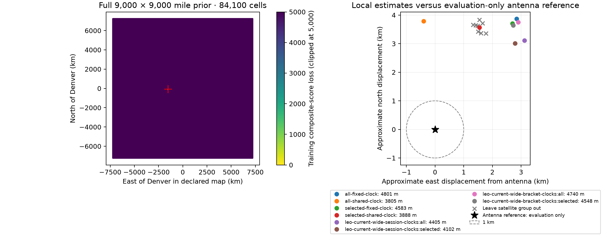

# Recent 48-hour corpus: independent wide-region positioning

The full blind search finds the correct region, but **does not reach sub-kilometre
accuracy on the recent recordings**. The completed fitting variants are
3.80–4.80 km from the user-supplied antenna location. The historical 937–941 m
recording-clock result therefore does not transfer to this corpus.

## What was searched

The input comprises 211 recordings and 684 RF-derived track episodes from the
September 18–20, 2026 48-hour export. The search evaluated 84,100 cells covering
the entire 9,000 × 9,000 statute-mile region centred at Denver. Satellite IDs
were searched afresh at each location; neither the antenna coordinates nor the
previous known-site FoV-assisted identities entered inference. A −1° horizon
threshold was used, without a known-site antenna FoV prior.

The initial grid spacing was approximately 49.945 km. The top three separated
training-score regions were refined at approximately 4.995 km, then 0.499 km.
These are targeted refinements, not an exhaustive global grid at fine spacing.
All three stages processed all 211 recordings. The coarse training winner was
37.741984°, −122.417008°. Its nearest reported separated competitor was 5,308
composite-score units worse. This score separation is not a calibrated
probability or positional confidence bound.

The grid uses at most six fitting and six randomized evaluation observations
per source. Continuous refinement uses the full retained observations. There
is no chronological held-out partition. Satellite selection and fitting use
only the fitting partition, with evaluation kept separate.

## Completed fits

The training-only gate retains 622 episodes and 21,702 observations. The frozen
quality selection retains 190 episodes and 7,156 observations using the existing
≥15 s / training RMS ≤100 Hz / longest-per-satellite-and-recording rule.
All listed fits converged. Models use robust residuals, one fitted constant
frequency offset per segment, and zero receiver altitude.

| Cohort | Clock model | Horizontal error (m) | Random evaluation RMS (Hz) |
|---|---|---:|---:|
| All | Fixed recorded UTC | 4,800.8 | 166.43 |
| All | One shared correction, ±0.5 s | 3,805.0 | 163.51 |
| Selected | Fixed recorded UTC | 4,582.8 | 85.91 |
| Selected | One shared correction, ±0.5 s | 3,887.7 | 85.15 |
| All | Per recording, ±0.5 s | 4,404.8 | 141.13 |
| Selected | Per recording, ±0.5 s | 4,101.8 | 72.59 |
| All | Per recording, within recorded timing bracket | 4,740.0 | 159.14 |
| Selected | Per recording, within recorded timing bracket | 4,547.8 | 80.68 |

The lowest position error in this table is a retrospective comparison, not a
model-selection rule for a device without known coordinates. Lower residual
RMS does not consistently imply lower position error.

## What the timing check establishes

Every evidence UTC reference exactly matches its archived first-sample estimate.
Recorded bracket widths are 199–252 ms, corresponding to about ±100–126 ms
around the midpoint. The wider ±0.5 s fits place 107/211 recording clocks at a
bound for all data and 37/137 for the selected cohort. With the actual brackets,
194/211 and 118/137 respectively reach a bound (within 1 ms).

Thus the model wants timing adjustments beyond the available bracketing evidence.
That could reflect orbit, association, measurement-model, or absolute host-clock
error; it does not establish that the recorded timestamps should be changed.
The bracket-constrained experiment leaves a roughly 4.5–4.7 km error, so the
observed timing intervals alone do not resolve the positioning bias.

The shared-clock result was checked with exact propagation. The independent
recording-clock and bracket-constrained outputs also include exact-propagation
position refits. Sixteen recording-clock deletion checks and eight shared-clock
satellite deletion checks are retained as sensitivity diagnostics; none were
used to choose the published fit or remove data retrospectively.

## Interpretation and next diagnostic

This run removes the known-site FoV/identity dependence from the earlier recent
dataset experiment. The remaining error is therefore not explained solely by
that dependence. Across the completed variants, the estimates retain a roughly
3.0–3.9 km northward displacement. Changing clock flexibility mostly changes
the eastward displacement and residual RMS; it does not eliminate the common
northward component.

The next useful diagnostic is to compare independently selected observations
across sample rate, channel, and satellite/pass geometry while retaining all
results. This can distinguish a measurement-path bias from an orbit or geometry
problem. A subset that happens to approach the known location is not, by itself,
a valid device selection rule. The sub-kilometre goal remains unmet on this corpus.

## Reproducibility

- [Sealed inference, assignments and quality selection](2026_09_20_recent_independent_wide_position/inference.json)
- [Evaluation-only distances and reference digest](2026_09_20_recent_independent_wide_position/evaluation.json)
- [Per-recording clocks and 16 sensitivity checks](2026_09_20_recent_independent_wide_position/leo-current-wide-session-clocks.json)
- [Recorded-bracket-constrained replay](2026_09_20_recent_independent_wide_position/leo-current-wide-bracket-clocks.json)
- [Input provenance](2026_09_20_recent_independent_wide_position/inputs.json)
- [Artifact hashes](2026_09_20_recent_independent_wide_position/sha256.json)

The accompanying directory includes numerical states, full coarse and fine score
maps, histories, and exact-propagation provenance. Distances are spherical
horizontal distances evaluated only after inference against
37.84903264307456°, −122.4856541910174°, radius 6,371,008.8 m. Reference survey
uncertainty and receiver altitude were not supplied. No new RF collection or
production scanner changes were made for this experiment.
