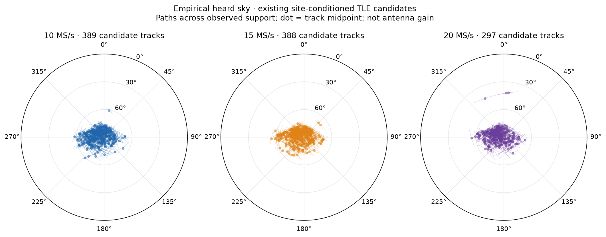
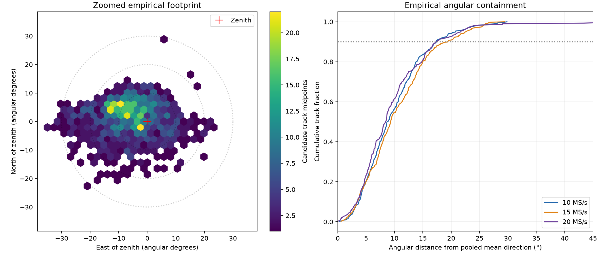
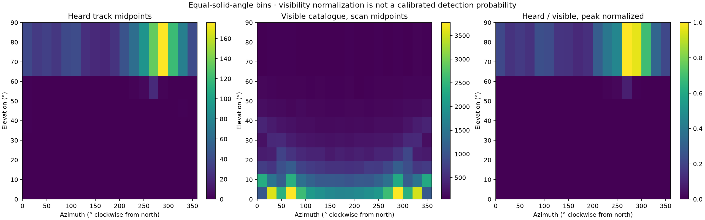
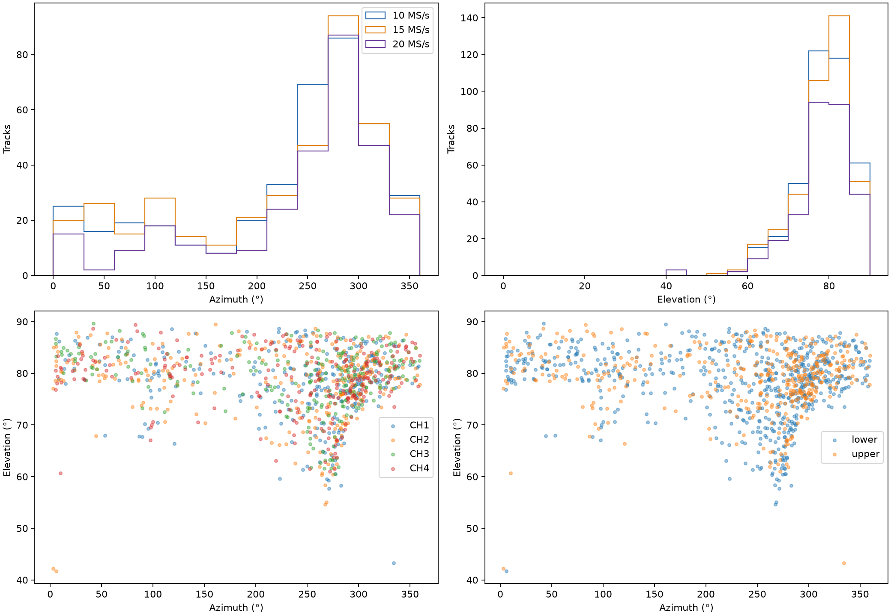
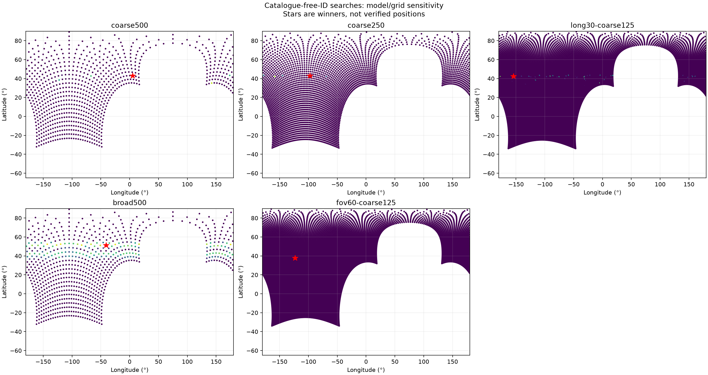
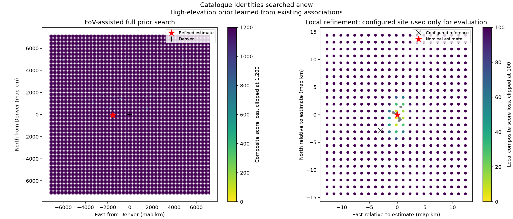
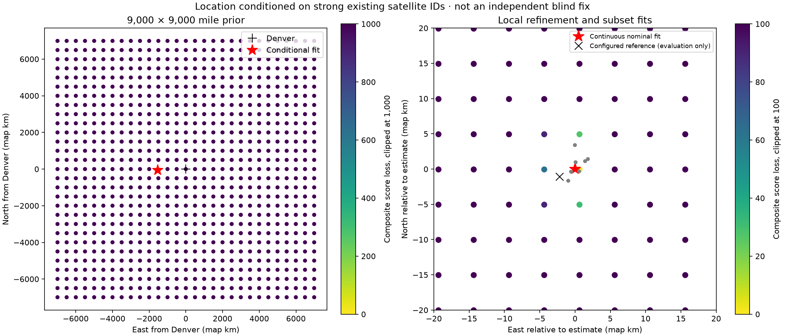
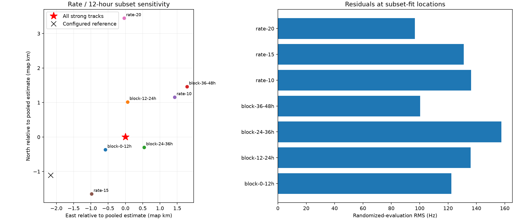

# Sky coverage and location from 48 hours of adaptive scans

**Reference correction (September 20):** the user confirmed the antenna at 37.84903264307456°, −122.4856541910174°. The 4.14 km distance below is to the old configured coordinate; this fit is **5.43 km from the actual antenna**. See the [corrected evaluation](2026_09_20_matched_positioning.md). Historical artifacts are preserved.

Frozen window: **2026-09-18 05:36:00 to 2026-09-20 05:36:00 UTC**, selected by capture publication timestamp. No new RF collection. This is a retrospective research analysis, not a production positioning claim.

## Findings

The heard sky is concentrated near zenith, slightly toward the west-northwest. Across **1,074 quality-selected candidate tracks**, the mean direction is **azimuth 280.5°, elevation 83.9°**: approximately a **6° tilt from zenith**. Half of the track midpoints are within **8.84°** of that direction, 90% within **17.84°**, and 95% within **21.82°**. The approximately **36° diameter containing 90% of midpoints** describes empirical reception support; it is not a measured half-power antenna beamwidth.

Using a conservative high-elevation prior derived from this coverage, a search starting from the requested **9,000 × 9,000 mile square centered on Denver** selects Northern California and refines to:

**37.889544° N, 122.451058° W**, **4.14 km from the configured receiver coordinate**.

That fit uses **599 RF tracks and 20,937 observations**. Satellite identities are searched anew, rather than copied from the known-site matches. Its randomized-evaluation residual RMS is **164.64 Hz**.

The important qualification is that the **field-of-view prior was itself estimated from existing site-conditioned catalogue associations**. This demonstrates FoV-assisted location recovery, not an independently validated blind fix. Without that prior, the tested unrestricted catalogue/location searches select incompatible distant locations. A separate fit that directly fixes strong existing satellite IDs gives **37.872427° N, 122.456310° W**, **2.43 km** from the configured site; that result has an even stronger dependence on the existing site-conditioned analysis.

## What was included

| Stage | Count | Meaning |
|---|---:|---|
| Scans in the frozen publication window | 222 | Complete inventory retained |
| Scans with exportable RF trajectories | 211 | Qualified UTC and at least one track with 14 observations spanning 7 s |
| Representative RF tracks | 684 | Longest track per channel/edge from the RF-leading hypothesis |
| Scans without a qualifying trajectory | 10 | Four with no reconstructed trajectory; six below the export threshold |
| Scan awaiting complete GLRT analysis | 1 | `scan-fw-c02066ba534be2b2`; still partial when checked during report preparation |
| Existing per-track catalogue reviews examined for sky coverage | 1,305 | 811 v10 reviews and 494 v11 reviews, frozen while the v11 backfill was running |
| Quality-selected sky tracks | 1,074 from 208 scans | Fit and evaluation RMS <250 Hz, evaluation runner/top ratio >2, midpoint above horizon |
| Distinct candidate catalogue numbers in that sky set | 689 | Candidate labels, not independently confirmed spacecraft identities |

The sky analysis uses the available per-track reviews, while the location analysis uses a smaller RF-only representative set to avoid counting alternative trajectory hypotheses repeatedly. Both selections and all exclusions are preserved in the attached inventories. Counts of tracks are not counts of independent passes: channels, sidebands, and adjacent scans can observe the same spacecraft.

The v10/v11 review mixture is explicit. It reflects availability during the previously requested backfill; this report does not claim that every association product in the 48-hour window had already been regenerated. The RF export was reconstructed directly from the capture-bound GLRT evidence, without importing those catalogue identities into the unrestricted or FoV-assisted searches.

## Four views of the heard sky



The centre is zenith; the outer circle is the horizon. Dots are track midpoints. Lines are catalogue-predicted paths over the observed support, conditional on the candidate identity, its selected time adjustment, and the configured site. They are not direct angle-of-arrival measurements.



The footprint extends more strongly east-west than north-south. The sample-rate containment curves are similar. Only **11 of 1,074 midpoints fall below 60° elevation**; the 5th, 50th, and 95th elevation percentiles are **65.72°, 79.68°, and 87.00°**.



Bins have equal solid angle: uniform azimuth and sine of elevation. The middle panel counts valid, causal catalogue objects visible at each included scan's midpoint. The final panel divides heard-track counts by that reference visibility and normalizes the peak to one. It helps distinguish sky population from reception concentration, but **it is not detection probability**: the denominator does not establish that a satellite transmitted on the channel being sampled, and a track can be represented in several channels or sidebands.



| Sample rate | Quality-selected sky tracks | Median midpoint elevation |
|---|---:|---:|
| 10 MS/s | 389 | 79.37° |
| 15 MS/s | 388 | 79.96° |
| 20 MS/s | 297 | 79.51° |

These recordings cover different passes and allocations, so the count differences do not measure intrinsic receiver sensitivity. The near-identical elevation medians do not show a major change in angular coverage with sample rate.

The plots estimate **where this installation heard identifiable signals**. They combine antenna gain, pointing, propagation, satellite activity, adaptive channel allocation, detector sensitivity, and association selection. Missing detections cannot establish a hard beam boundary. The small low-elevation tail could include sidelobes, unusual reception, or incorrect associations.

## Location search and the effect of the field-of-view prior

The prior is a **14,484.096 × 14,484.096 km square in a spherical azimuthal-equidistant map**, centred at Denver, **39.7392° N, 104.9903° W**. The square is defined on that map, not as a constant-degree latitude/longitude rectangle. Doppler geometry uses Earth-fixed satellite states and WGS84 receiver coordinates. The receiver altitude is fixed to zero metres above the ellipsoid; surveyed altitude is not an input to the search.

The unrestricted searches expose ambiguity:

| Search | Nominal grid spacing | Residual scale | Winning latitude, longitude |
|---|---:|---:|---|
| All representative tracks | 500 km | 250 Hz | 42.868°, 5.451° |
| All representative tracks | 250 km | 250 Hz | 42.862°, −97.324° |
| Tracks at least 30 s long: 264 tracks, 122 scans | 125 km | 250 Hz | 42.453°, −154.117° |
| All tracks, broader initial residual model | 500 km | 5,000 Hz | 51.121°, −40.842° |
| **FoV-assisted: training support at elevation ≥60°** | **125 km** | **1,500 Hz** | **37.786°, −122.862°** |



Short Doppler curves with a free constant frequency offset can have plausible counterparts among many different satellite/location combinations. Coarse grid resolution, the residual scale, and catalogue geometry change which such combinations win. The unrestricted results therefore do not establish a reliable location, and their sharp score maxima must not be interpreted as calibrated certainty.

The FoV-assisted search requires each candidate to be above **60° elevation at every selected fitting observation**. This is a conservative high-elevation constraint motivated by the observed coverage, rather than a fitted hard antenna edge. It does not provide individual satellite IDs or the configured latitude/longitude to the optimizer. It does carry information learned using the existing site-conditioned associations.

That search evaluated the full prior on a 125 km nominal grid, then refined the three data-selected separated regions at approximately **12.49 km** and **1.25 km** spacing, reducing the residual scale to **500 Hz** and **250 Hz** respectively. The best coarse mode exceeded the next reported separated mode by **808.25 composite score units**. Those units are not posterior odds. Refinement covers selected modes, not every possible narrow maximum inside the original square.



The final continuous fit uses nominal TLEs, with a constant CFO offset fitted per RF segment. It fits neither a free Doppler slope nor a polynomial curvature per segment. The pooled result is:

| Model | Latitude | Longitude | Fit RMS | Randomized-evaluation RMS |
|---|---:|---:|---:|---:|
| Nominal orbits | 37.889544° | −122.451058° | 163.29 Hz | 164.64 Hz |
| Shared bounded orbit-phase alternative | 37.888874° | −122.449828° | See JSON | 151.7 Hz |

The alternative shares an orbit-phase adjustment for each NORAD/TLE-snapshot group, bounded to ±2 s with a 0.5 s prior scale. It is a sensitivity model, not a correction justified by independent orbit information. Both models converge to the same general area.

The nominal fit retained **599 tracks / 20,937 observations** after its fitting-only support gate. **569 of 599 independently reselected candidate IDs agree with the existing site-based leaders**. This is a consistency check, not independent confirmation: the two paths share RF data, TLEs, and information in the learned FoV prior.

## Stability, accuracy, and the systematic floor

For evaluation only, the configured coordinate is **37.858988°, −122.478103°**. The nominal FoV-assisted estimate is **4.145 km away**. That is observed error against the configuration, not an externally surveyed error bound or a confidence radius.

| FoV-assisted subset | Retained tracks | Randomized-evaluation RMS | Distance from configured site |
|---|---:|---:|---:|
| All | 599 | 164.64 Hz | 4.145 km |
| 10 MS/s | 210 | 158.97 Hz | 4.013 km |
| 15 MS/s | 229 | 175.88 Hz | 3.787 km |
| 20 MS/s | 160 | 154.96 Hz | 5.591 km |
| First 12-hour block | 253 | 176.36 Hz | 4.201 km |
| Second 12-hour block | 135 | 160.10 Hz | 3.933 km |
| Third 12-hour block | 125 | 161.52 Hz | 4.071 km |
| Fourth 12-hour block | 83 | 135.92 Hz | 4.042 km |

Time-block membership uses RF reference time; three boundary tracks lie outside those bins although their capture publication is inside the frozen window. These are subset refits, with randomized observation partitions inside each subset—not chronological held-out TLE residual tests.

The four time blocks agree on a location that is consistently displaced from the configured site. This is evidence of a **systematic floor**, not evidence for a small confidence region around the wrong coordinate. The 20 MS/s subset has lower RMS than the 15 MS/s subset but larger position error, illustrating why a lower Doppler residual alone does not establish better absolute position accuracy.

Possible contributors include UTC binding, TLE orbit error, remaining candidate mistakes, correlated channel/sideband observations, the receiver CFO model, and limited observed sky geometry. This study does not isolate one as the root cause. The near-zenith coverage is valuable for rejecting global alternatives, while also limiting the diversity of viewing directions available for the local fit.

## Separate strong-ID conditional fit

An additional experiment froze the existing site-conditioned top candidate for representative tracks satisfying **both fit and evaluation RMS <60 Hz**, with **runner-up evaluation RMS >300 Hz**. It supplied **138 tracks from 97 scans**, of which the local fitting gate retained **134 tracks / 4,602 observations**.

Starting with the same Denver-centred prior, this conditional search gives **37.872427°, −122.456310°**, **2.428 km from the configured site**. Its fit/evaluation RMS is **121.80 / 131.87 Hz**.





The sample-rate and time-block conditional fits have configured-site errors between **1.30 and 4.99 km**. The result demonstrates useful geographic information in the strongly matched tracks, but **does not demonstrate blind satellite identification and location recovery**. Selection already used residuals computed at the configured site, including evaluation residuals. Its evaluation RMS is therefore descriptive after selection, not a fresh independent validation statistic.

It is also not an apples-to-apples improvement over the earlier [eight-hour position-convergence report](2026_09_15_rx0_10msps_position_convergence.md): the prior, observations, partitioning, FoV assumptions, and identity selection differ.

## What would make the result stronger

1. Establish antenna pointing and reception pattern independently of a known-site TLE match. An externally justified high-elevation prior would remove the most important circular dependency of the FoV-assisted result.
2. Improve and independently check device-to-UTC timing and receiver frequency behaviour. More scans alone will not eliminate a common modelling bias.
3. Validate catalogue identities independently where possible and model correlated observations of the same pass rather than treating every lane as independent evidence.
4. Test a frozen FoV/selection policy on a separate collection and an independently checked receiver coordinate. Retain the present nominal-orbit fit and report sensitivity alternatives separately; do not tune nuisance parameters merely to reach the configured site.

## Reproduction and artifacts

The analysis extends the existing research solver, not the production queue or scanner. Published production contracts are unchanged. **24 component-owned numerical/adapter tests pass**, including the large spherical prior, response-independent randomized partitions, rejection of unlabelled fixed-identity inputs, existing regional geometry, and local-fit behaviour. Static checks pass.

Reusable tools:

- [`study_adaptive_sky_position.py`](../tools/study_adaptive_sky_position.py): frozen-window RF export, span sensitivity selection, and parallel search using the existing solver.
- [`prepare_conditional_sky_evidence.py`](../tools/prepare_conditional_sky_evidence.py): explicitly labelled site-conditioned identity and sky-review export.
- [`plot_site_conditioned_sky.py`](../tools/plot_site_conditioned_sky.py): four sky-coverage figures.
- [`position_study_sensitivity.py`](../tools/position_study_sensitivity.py): sample-rate and 12-hour subset refits.
- [`report_sky_location_results.py`](../tools/report_sky_location_results.py): position and sensitivity figures.

The frozen cutoff is `1789882560000000000` UTC nanoseconds. The core FoV-assisted commands, after exporting `evidence`, are:

```bash
python tools/study_adaptive_sky_position.py search --evidence evidence \
  --output fov60-coarse125 --spacing-km 125 --sigma-hz 1500 \
  --minimum-elevation-deg 60 --workers 8
python tools/refine_regional_grid.py --run fov60-coarse125 \
  --output fov12-points.json --modes 3 --divisions 10
python tools/study_adaptive_sky_position.py search --evidence evidence \
  --output fov12 --points fov12-points.json --sigma-hz 500 \
  --minimum-elevation-deg 60 --workers 8
python tools/refine_regional_grid.py --run fov12 \
  --output fov1-points.json --modes 3 --divisions 10
python tools/study_adaptive_sky_position.py search --evidence evidence \
  --output fov1 --points fov1-points.json --sigma-hz 250 \
  --minimum-elevation-deg 60 --workers 8
python tools/polish_regional_doppler.py --run fov1 --evidence evidence \
  --output fov-polish.json
```

Use `PYTHONPATH=src` and one BLAS thread per search worker. Each RF segment is split deterministically by track ID into a randomized 60/40 fitting/evaluation partition. Coarse scoring uses up to three observations per partition; local polishing restores every retained observation. Offsets and position are fitted on the fitting partition; evaluation points are not refitted. Existing source sample rates are preserved; the position solver uses RF-normalized CFO trajectories rather than resampling IQ.

TLE snapshots were selected from the local archive before capture minus 505 s, preserving the causal snapshot convention of the existing analysis. Elements must have epochs before the recording. Failed propagation/nonfinite states and the numerical low-orbit-radius screen are excluded. The complete archive is not duplicated into this report; its snapshot digests and capture/GLRT authority digests are recorded.

Machine-readable evidence:

- [Sky summary](2026_09_20_sky_48h_location/sky-summary.json) and [per-track sky data](2026_09_20_sky_48h_location/sky-tracks.json).
- [Location summary and sensitivity](2026_09_20_sky_48h_location/location-summary.json).
- [Complete scan/exclusion inventory](2026_09_20_sky_48h_location/evidence-v2-inventory.json).
- [RF-only observations](2026_09_20_sky_48h_location/rf-evidence.json.gz) and [frozen site-conditioned reviews](2026_09_20_sky_48h_location/site-conditioned-sky-reviews.json.gz).
- [TLE snapshot digests](2026_09_20_sky_48h_location/tle-snapshot-digests.json), [FoV-assisted fit](2026_09_20_sky_48h_location/fov-polish.json), and [artifact SHA-256 manifest](2026_09_20_sky_48h_location/sha256.json).

Per-stage grid coordinates, accumulated score arrays, configuration, results, and scan histories are stored alongside these artifacts. The full analysis uses archived captures; it neither changes scanner operation nor claims that score-map width is a calibrated location uncertainty.
