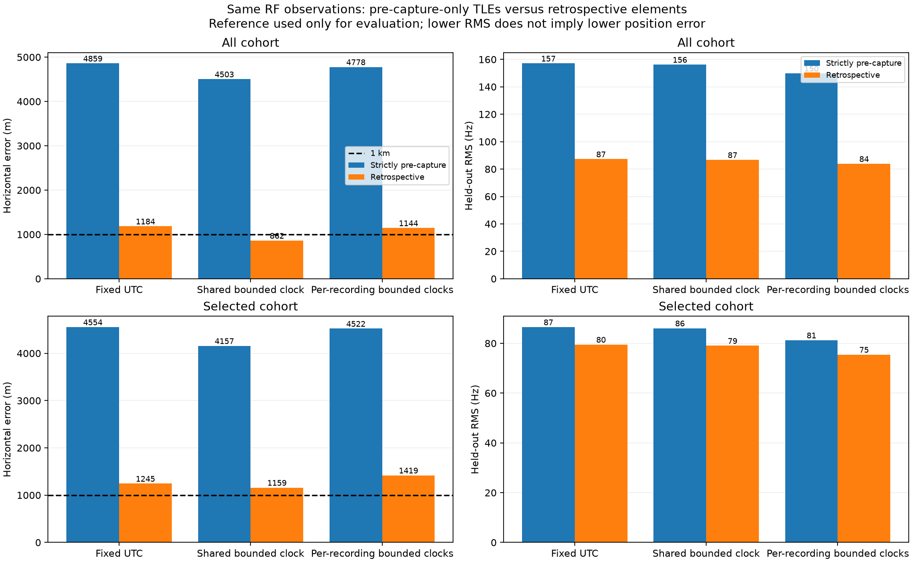

# Strictly pre-capture TLEs versus retrospective positioning

**Using only TLE information already collected before each capture, with element
epochs also strictly before capture start, we obtain 4.50 km all-track position
error—not sub-kilometre accuracy.** The otherwise corresponding retrospective
fit gives 0.862 km. The prior sub-kilometre result does not meet the user's
operational information-availability constraint and must not be presented as
an available-at-capture positioning result.

## Strict information cutoff

For every candidate satellite and every recording, both requirements hold:

1. Archived **collection timestamp < capture start UTC**.
2. TLE **element epoch < capture start UTC**.

Equality is rejected. An earlier epoch downloaded later is rejected. Among
eligible elements, choose the greatest epoch; collection timestamp and digest
break ties deterministically. No residual, inferred position, or known antenna
coordinate chooses the orbital elements. This is the freshest eligible element
per satellite across the archived snapshots, not just the most recently
downloaded catalogue file. We examine 166 snapshots from the seven days before
the earliest recording through the last recording; eligibility is applied
separately to every capture. This uses our actual archived availability, not
an assumption about when an external provider might first have published it.

The strict mode does not use the retrospective position as its initial location:
candidate scoring starts from the original causal all-track fixed-clock wide
fit. Subsequent position fits start from the original wide-search initialization.
The original acquisition covered the 9,000 × 9,000 statute-mile Denver-centred
region, then refined its leading modes. This comparison is a local full-catalogue
reassociation and refit following that acquisition, not a fresh exhaustive
wide-region grid for each orbital policy.

## Matched results

The all-track cohort retains **622 episodes / 21,702 observations** in both
policies. The original quality-selected subset remains **190 episodes / 7,156
observations**. Nothing is removed or weighted by TLE age. Both fits use the
same randomized partitions, robust loss, profiled per-source frequency offsets,
fixed zero-metre altitude, and recorded clock bounds. Known antenna coordinates
are read only by the separate evaluation script.

| Cohort | Clock model | Strict pre-capture error | Retrospective error | Strict held-out RMS | Retrospective held-out RMS |
|---|---|---:|---:|---:|---:|
| All | Fixed UTC | 4,859 m | 1,184 m | 157.09 Hz | 87.25 Hz |
| All | Shared recorded bounds | **4,503 m** | **862 m** | **156.22 Hz** | **86.69 Hz** |
| All | Per-recording recorded bounds | 4,778 m | 1,144 m | 149.81 Hz | 83.86 Hz |
| Original selected subset | Fixed UTC | 4,554 m | 1,245 m | 86.53 Hz | 79.52 Hz |
| Original selected subset | Shared recorded bounds | **4,157 m** | **1,159 m** | **86.07 Hz** | **79.05 Hz** |
| Original selected subset | Per-recording recorded bounds | 4,522 m | 1,419 m | 81.26 Hz | 75.49 Hz |

All six strict fits converge. Exact SGP4 propagation at the shared fitted
clock reproduces **4,503.473 m** for all tracks and **4,157.411 m** for the
selected subset. Distances use the same spherical convention as the preceding
reports (radius 6,371,008.8 m).

The all-track shared clock hits its lower recorded bound, approximately
−99.66 ms, whereas the retrospective fit hits its upper bound, +99.66 ms.
The clock can partly absorb orbit/model error; neither boundary result proves
an independently measured absolute clock correction.

## Associations and element freshness

The strict full-catalogue replay changes **11 of the original 622 identities**;
the retrospective replay changes 26. No strict episode is left unassigned.
These remain best candidate associations conditional on the inferred location,
not independently confirmed satellite identities.

| Strict winning-element statistic | Value |
|---|---:|
| Winners satisfying both strict timestamp rules | 622 / 622 |
| Median element age at capture | 18.94 h |
| Minimum element age | 3.29 h |
| Maximum element age | 96.17 h |
| Median time since collection | 0.997 h |
| Minimum time since collection | 60.85 s |

A catalogue collected about an hour earlier can still contain elements whose
epochs are roughly nineteen hours old. By comparison, the retrospective final
associations have median absolute epoch distance 3.30 h, including 331 epochs
after capture. Their later information is explicitly forbidden in the strict
replay. The prior 794 → 87 Hz figure concerned the intermediate updated-orbit,
frozen-identity fit versus reassociation. The operationally relevant comparison
here is **156 → 87 Hz** for the paired shared-clock full-data fits.

## Stability and interpretation

| Strict shared-clock cohort | Removing satellite groups | Removing recording groups |
|---|---:|---:|
| All tracks | 4,255–4,937 m | 4,199–4,794 m |
| Original selected subset | 3,975–4,297 m | 4,028–4,300 m |

All 32 strict group-removal fits converge. These are the same modulo-eight
sensitivity experiments used previously, not a recipe for identifying bad data.
None makes the strict method sub-kilometre.

The comparison supports orbital-information quality/availability as an important
limitation. It does not prove every remaining metre comes from orbit prediction:
association uncertainty, timing, receiver calibration, geometry and model
assumptions still contribute. In particular, the selected subset has similar
held-out RMS under both policies (86 versus 79 Hz) while position errors differ
by kilometres. Low residual RMS alone is not a positioning accuracy certificate.

**Operational conclusion:** the present archived-data evidence supports roughly
4–5 km accuracy under this strict TLE constraint on this site/dataset. We have
not demonstrated sub-kilometre accuracy with information available before each
capture. The 862 m result remains a retrospective diagnostic only. No future-
element rule was deployed to the production scanner by this comparison.

## Evidence and reproduction

- [Strict candidate associations, winning TLE text, epoch and collection timestamps](2026_09_20_strict_causal_vs_retrospective/strict-reranking.json)
- [Strict fits, exact propagation and sensitivity fits](2026_09_20_strict_causal_vs_retrospective/strict-inference.json)
- [Strict propagated states](2026_09_20_strict_causal_vs_retrospective/strict-states.npz)
- [Paired evaluation, input hashes and cohort checks](2026_09_20_strict_causal_vs_retrospective/evaluation.json)
- [Retrospective comparator](2026_09_20_offline_orbit_sensitivity/reassociated-verified.json)

Run `tools/rerank_offline_orbit_flags.py --all-tracks --strictly-causal` with the
original wide-fit parent and archived evidence. The legacy script name does
not determine policy: outputs explicitly record `strictly_causal: true` and
`offline_noncausal: false`. The retrospective replay argument is ignored as a
position source in strict mode; the residual audit supplies only original
cohort identity metadata, not an age/RMS selection or fit weight.

Then run `tools/refit_offline_reassociations.py --verify-shared`, supplying the
strict reranking and recorded timing audit. The refitter independently rejects
noncausal winning epochs or collection timestamps. Finally run
`tools/report_causal_orbit_comparison.py` with the sealed strict/retrospective
inferences and separate reference coordinate. The report generator rechecks
every winning timestamp and the matched observation/episode counts. No new RF
capture is required.

All 622 winning element texts were independently matched to parsed records in
31 digest-verified archived snapshots, confirming the stored collection-time
authority. Eight focused reassociation tests pass, including rejection when
either epoch or collection time is equal to or later than capture. This is a
batch analysis of the complete RF dataset with causal TLE availability, not a
claim that each position was estimated online before later RF samples arrived.
