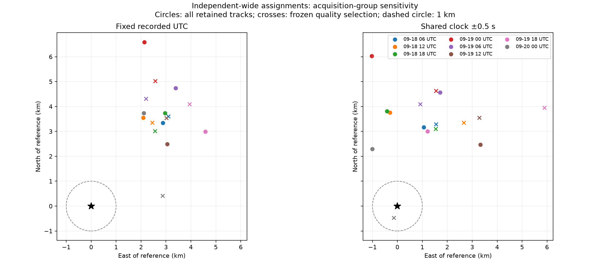

# Six-hour positioning diagnostics and a timing-sensitive near-hit

Most six-hour groups retain a kilometres-scale northward error. The final
group's 11 quality-selected tracks produce a **488 m** fit only when the shared
clock can reach its **−0.5 s bound**. Constraining that same fit to the archived
timing brackets gives **2,267 m** error. This is not a validated sub-kilometre fix.

These are time-group diagnostics, **not chronological held-out evaluation**.
Every fit keeps its randomized observation partition. Satellite identities and
the quality selection are frozen from the completed full 48-hour blind search.
The six-hour boundaries are UTC midnight/06:00/12:00/18:00, chosen independently
of location error. The first partial group (September 18, 00:00–06:00) has fewer
than three distinct retained satellite identities and is explicitly unfit.
The final group ends at the export cutoff, September 20, 05:36 UTC.

| UTC group start | All tracks | All fixed UTC error (m) | All shared-clock error (m) | Selected tracks | Selected fixed error (m) | Selected shared-clock error (m) |
|---|---:|---:|---:|---:|---:|---:|
| Sep 18 06:00 | 149 | 4,411 | 3,340 | 36 | 4,754 | 3,634 |
| Sep 18 12:00 | 125 | 4,118 | 3,772 | 37 | 4,154 | 4,284 |
| Sep 18 18:00 | 66 | 4,767 | 3,830 | 17 | 3,955 | 3,456 |
| Sep 19 00:00 | 70 | 6,925 | 6,112 | 21 | 5,639 | 4,886 |
| Sep 19 06:00 | 63 | 5,823 | 4,877 | 29 | 4,841 | 4,198 |
| Sep 19 12:00 | 62 | 3,932 | 4,138 | 24 | 4,650 | 4,831 |
| Sep 19 18:00 | 47 | 5,471 | 3,239 | 15 | 5,686 | 7,096 |
| Sep 20 00:00 | 37 | 4,290 | 2,507 | 11 | 2,899 | 488 |

Shared-clock fits in this table allow ±0.5 s. The latest selected fit's
randomized evaluation RMS is 51.6 Hz, versus 66.9 Hz with fixed UTC. Lower
residuals and a favourable retrospective position error do not establish that
its saturated clock adjustment is physically correct.

## Check the apparent success against timing evidence

The same 11 tracks and identities were refitted using their actual timing
intervals. One common correction is bounded by the intersection of all recording
intervals; the alternative uses a separate interval per recording.

| Model for the final selected group | Horizontal error (m) |
|---|---:|
| Shared correction allowed to reach −0.5 s | 488 |
| Shared correction within all archived brackets | 2,267 |
| Separate corrections within each archived bracket | 2,976 |

The common physically bracketed fit reaches −0.100996072 s. The wider correction
is therefore unsupported by the measured start bracket, conditional on the
host UTC clock and bracket semantics being correct. It could be absorbing other
model errors. There is no permission here to change recorded timestamps or
ignore their uncertainty.

The temporal variation suggests dependence on the observed satellites, geometry,
or time-varying errors. These factors change together, so this experiment cannot
attribute the variation uniquely. It also cannot validate the latest six-hour
subset as a location-blind selection rule: its identities came from the full
dataset and the near-hit was noticed using the reference coordinate.

## Evidence and reproduction

`tools/diagnose_wide_capture_groups.py --grouping utc_6h` adds this diagnostic to
the existing group replay. The component test now checks the exact UTC boundary
mapping as well as identity-based metadata joins. The renderer is the existing
`tools/report_wide_capture_groups.py`. No production analysis was changed.

- [All time-group fits and assignments](2026_09_20_time_group_positioning/inference.json)
- [Evaluation-only errors](2026_09_20_time_group_positioning/evaluation.json)
- [Latest group with recorded clock bounds](2026_09_20_time_group_positioning/latest-block-bounded.json)
- [Artifact hashes](2026_09_20_time_group_positioning/sha256.json)

The bounded check uses `recorded_clock_bounds` from the tested recording-clock
replay, preserving exact UTC-reference checks. The shared interval is the
maximum of lower bounds and minimum of upper bounds. Both fits use the parent's
initial point and the original selected episodes in the latest UTC bin. Antenna
coordinates enter only post-fit distance evaluation.
