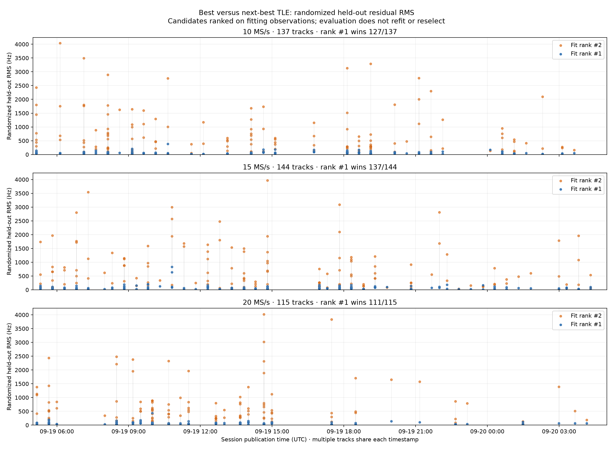
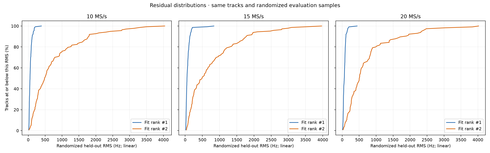

# Best versus runner-up TLE: randomized held-out RMS over 24 hours

Window: **2026-09-19 05:00 through 2026-09-20 05:00 UTC**, selected by session publication timestamp. Snapshot: 110 sessions, 109 complete tracking products, one pending (`scan-fw-3984983fc89cc2bd`). There are **396 paired track reviews** among the completed products. No RF was collected or scientific results recomputed.

Candidates #1 and #2 are selected by **fitting-set RMS**. Both are then evaluated on the same deterministic randomized held-out observations, without refitting or reselecting the winner. This preserves genuine evaluation rank reversals. These are per-track RMS review rankings, which can differ from the uncertainty-aware production association ranking.

| Rate | Paired tracks | Best wins on held-out data | Median best RMS | Median runner RMS | Median paired runner/best ratio |
|---|---:|---:|---:|---:|---:|
| 10 MS/s | 137 | 127 (92.7%) | 52.21 Hz | 483.61 Hz | 9.46× |
| 15 MS/s | 144 | 137 (95.1%) | 52.72 Hz | 492.06 Hz | 7.77× |
| 20 MS/s | 115 | 111 (96.5%) | 62.85 Hz | 505.03 Hz | 8.46× |

Across rates, **375/396 (94.7%)** retain the better RMS against the fit-ranked runner-up; 21 reverse. The median paired ratio is calculated per track and is not the ratio of the two population medians.

## Every paired track, over time

Blue is the fit-ranked best TLE; orange is the fit-ranked runner-up. Vertical segments connect the two RMS values for each track. Multiple tracks share the session publication timestamp. All panels share linear Y limits, and all data points are included.



## Distribution of residuals

At a given horizontal RMS value, the vertical percentage is the fraction of tracks with residuals at or below that value. A curve farther left indicates smaller residuals. The X axes are linear.



These results show substantial typical separation from the runner-up. They do not independently establish satellite identity, quantify false-association probability, or isolate a causal sample-rate effect: the rates observed different passes and RF conditions. Only tracks with at least two review candidates are included; pending results and tracks below review eligibility are not counted as zero-RMS outcomes.

## Data and reproduction

- [Every paired track and both NORADs](tracks.csv)
- [Summary statistics](summary.json)
- [Frozen product snapshot](snapshot.json.gz)

The reusable script is `tools/plot_recent_tle_rms.py`. Tests verify that evaluation rank reversals are preserved and that an absent pair is not fabricated.

```sh
PYTHONPATH=src python tools/plot_recent_tle_rms.py \
  --until 2026-09-20T05:00:00+00:00 \
  --output /tmp/leo-tle-rms-24h
```

The script reads the current products; the compressed snapshot preserves the exact inputs used for these figures.
