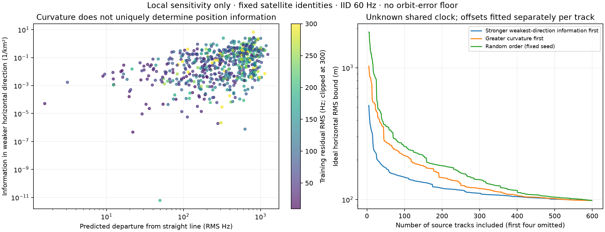

# Which Doppler tracks constrain position?

The 599 source tracks in the current 48-hour positioning cohort do **not** carry
equal geographic information. With the same independent 60 Hz noise assumption,
the 90th-percentile track has **560 times** the weaker-direction information of
the 10th-percentile track. Curvature helps, but is not an adequate ranking by
itself. This study measures sensitivity at the inferred location; it does not
use the actual antenna location to rank tracks or fit position.



## Calculation

Starting from the observation-balanced robust nominal model in the
[matched-cohort replay](2026_09_20_matched_positioning.md), predict Doppler at
receiver displacements of ±10 m east and north. Compute a timing derivative from
orbit states at ±0.5 s. Remove each source track's unknown constant frequency
offset using its randomized fitting observations. Use fitting rows exclusively
for every information calculation and selection criterion.

The two geographic derivative columns give a 2×2 information matrix. Its smaller
eigenvalue measures sensitivity in the less constrained horizontal direction.
The plotted curvature is the RMS departure of predicted Doppler from its best
straight line over those same fitting observations. Their log-scale correlation
is only **0.389** in this cohort: substantial curvature does not guarantee strong
information in both geographic directions.

For cumulative bounds, first add each track's joint position/clock information,
then eliminate **one shared clock parameter**. Eliminating a separate clock per
track would answer a different, more conservative question. Both per-track
fixed-clock and free-track-clock diagnostics are saved in JSON.

## Geometry ranking versus curvature

These are ideal horizontal RMS bounds, conditional on correct identities and
orbits, independent 60 Hz noise, fixed zero altitude, and the local mode.

| Source tracks included | Stronger weaker-direction sensitivity first | Greater curvature first | Fixed-seed random ordering |
|---:|---:|---:|---:|
| 10 | 355.8 m | 842.5 m | 1,322.8 m |
| 30 | 197.1 m | 414.7 m | 486.3 m |
| 60 | 160.3 m | 260.5 m | 337.4 m |
| 100 | 147.9 m | 215.7 m | 253.0 m |
| 200 | 122.0 m | 146.6 m | 180.5 m |
| All 599 | 98.5 m | 98.5 m | 98.5 m |

With a known clock, all-track training information gives **55.5 m** instead of
98.5 m. These numbers describe random-noise sensitivity, **not achieved accuracy**.
The table's geometry ordering uses individual-track fixed-clock information;
the cumulative bounds account for a shared unknown clock. This is a simple
ordering, not an optimal greedy selection algorithm. Correlations between tracks,
TLE biases, identity ambiguity, and timing-model error are excluded from the
bound. The first four cumulative points are omitted from the plot to keep
nearly singular single-pass bounds from compressing the useful scale; all
points remain in JSON.

## Does selecting informative tracks fix the actual error?

We froze four exploratory variants before evaluating their positions: require
training RMS ≤100 Hz and training support ≥15 s, then choose the first 30 or
100 tracks ranked by geographic sensitivity or curvature. 215 tracks qualify.
Refit position and a shared clock bounded to ±0.5 s, retaining the parent
identities and independent source frequency offsets. All variants are reported.

| Selection | Tracks | Training RMS | Random evaluation RMS | Clock correction | Actual horizontal error |
|---|---:|---:|---:|---:|---:|
| Geographic sensitivity | 30 | 72.5 Hz | 81.3 Hz | −0.198 s | **3,465.9 m** |
| Geographic sensitivity | 100 | 70.5 Hz | 79.6 Hz | −0.154 s | 3,920.4 m |
| Curvature | 30 | 72.6 Hz | 79.7 Hz | +0.082 s | 4,646.8 m |
| Curvature | 100 | 70.7 Hz | 83.5 Hz | −0.060 s | 4,685.2 m |

Evaluation uses the user-confirmed antenna coordinate
37.84903264307456°, −122.4856541910174° only after sealing inference. The JSON
evaluation receipt binds the inference digest and reference digest. The
unfiltered observation-balanced shared-clock replay was about 4.20 km from
that reference. Selection helps this conditional experiment, but **does not
reach sub-kilometre accuracy**. None of these variants is an independent blind
result: identities inherit the current study's site-derived field-of-view prior.
The separate fresh 9,000-mile-wide search remains the required blind test.

The much larger measured error than local random-noise bounds shows why merely
collecting more samples or choosing visually curved arcs is insufficient. It
does not, by itself, identify whether orbit, timing, association, or another
model error is responsible. Next refinement should retain shared error terms
and compare independent satellite passes; duplicate channels do not supply
independent orbit-error realizations.

## Reproduction and artifacts

Run from the repository root in the scientific development environment:

```bash
OPENBLAS_NUM_THREADS=1 OMP_NUM_THREADS=1 PYTHONPATH=src \
uv run --no-project --with scipy --with matplotlib --with sgp4 \
  --with pydantic --with pyyaml python tools/study_track_position_information.py \
  --states reports/2026_09_20_doppler_error_budget/states.npz \
  --inference reports/2026_09_20_matched_positioning/inference.json \
  --cohort current_fov_selected --output /tmp/leo-track-information-reproduction \
  --refit-subsets
```

- [Full per-track information and all four inference variants](2026_09_20_track_position_information/information.json)
- [Evaluation against the actual antenna coordinate](2026_09_20_track_position_information/evaluation.json)
- [Artifact digests](2026_09_20_track_position_information/sha256.json)
- [Script](../tools/study_track_position_information.py)
- [Tests](../tests/analysis/test_track_position_information.py)

Tests cover unknown-clock information loss, invariance to corrupted evaluation
observations, agreement between joint-information and nuisance-projection
calculations, and training-only support/RMS selection. The nuisance projection
also has unit-scaling and degenerate-direction tests.
