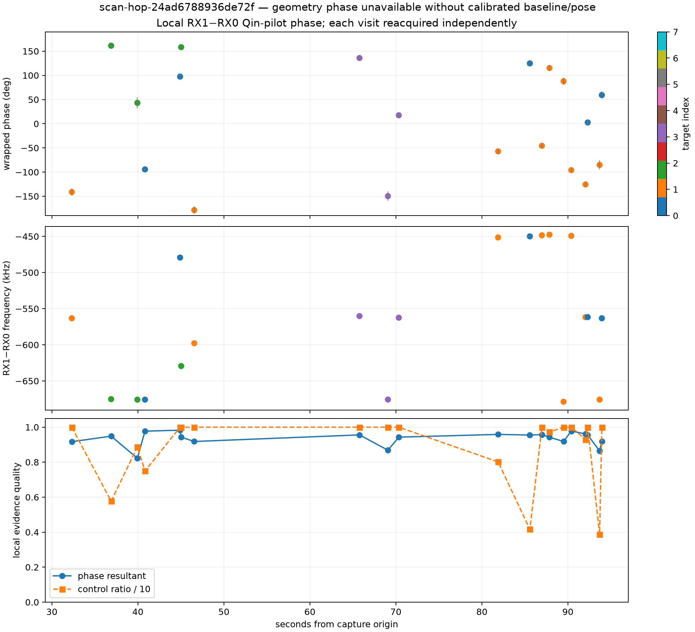

# Bounded adaptive dual-RX local phase extraction

Date: 2026-09-21. Status: measured local receiver phase; geometry phase unavailable.

## Result

The new V2 extractor was run read-only on 20 saved lower-edge visits from
`scan-hop-24ad6788936de72f`. All 20 selected phase-blind RX candidate pairs
produced a local wrapped `RX1 * conjugate(RX0)` pilot phase. Each estimate used
ten Qin-pilot frames at identical sample indices in the two receiver columns.



| Quantity | Bounded result |
| --- | ---: |
| Visits read | 20 |
| Capture-time span | 32.32–93.95 s |
| Shared frames per estimate | 10 |
| Phase resultant, min / median / max | 0.823 / 0.946 / 0.983 |
| Phase standard error, min / median / max | 3.38° / 6.05° / 11.32° |
| Exact/control power-ratio floor, min / median / max | 3.87 / 12.33 / 24.94 |

The points are independent local reacquisitions. The plot intentionally leaves
them wrapped and disconnected. It does not assert cycle continuity, transmitter
identity, or geometry phase.

## Frozen-reference check

Before running the new extractor, the checked-in historical report consumer was
re-run unchanged against its five frozen inputs. It reproduced the 11-point
`scan-hop-bfc60ea18ace593b` reference path exactly: increment concentration
0.98161771545, slope -22.78793893 degrees/s, linear residual RMS 7.73752024
degrees, and median cross-gap rate-prediction error 82.21919068 degrees. No
golden input or historical output was updated.

## Binding and method

The machine-readable [V2 evidence](figures/2026_09_21_adaptive_dual_rx_local_phase/scan-hop-24ad6788936de72f-local-phase-v2.json)
binds the result to:

- input manifest `sha256:6b1fc1bd4cebf6553d6fcd4b4e75b5224563df228e755cfaeebfc58c138fbca0`;
- GLRT binding `sha256:645af560fde803333f4db551e4067623fd39735c1b2c488210aff836e1beeeda`;
- GLRT metrics manifest `sha256:0d620d6270bfa95fb676db8f90125159a0205d2aa135d37d48b1a3f45d34dfcf`.

Candidate pairing uses timing and fractional GLRT margin only. Phase is not a
selection input. For each selected pair, the extractor uses one frame lattice
for RX0 and RX1, correlates the exact Qin pilot and symbol-roll control, refers
the coherent frame phasor to the template energy centroid, fits the local
receiver-product rotation, then restores each acquired-CFO phase origin once at
the common output sample.

## Geometry availability

The deployed LT3D-001A record supplies nominal fixture mount references, not a
surveyed phase-center baseline. Receiver-to-left/right cable mapping, RF phase
centers, fixture-to-ENU pose, and differential receiver-chain phase/group-delay
calibration remain unverified. Absolute geometric phase and a unique path-length
interpretation are therefore unavailable. The calibrated estimator reports
this state explicitly and retains integer-cycle candidates when those inputs
become available.

## Reproduction

The extraction is bounded to at most 20 visits and reads the saved corpus
without modification:

```bash
sudo -u leo env PYTHONPATH=src MPLCONFIGDIR=/tmp/leo-phase-mpl \
  .venv/bin/python tools/report_adaptive_dual_rx_local_phase.py \
  --bulk-root /srv/bulk/leo \
  --binding /srv/bulk/leo/scanner-adaptive-analysis/scan-hop-24ad6788936de72f/645af560fde803333f4db551e4067623fd39735c1b2c488210aff836e1beeeda/binding.v1.json \
  --maximum-visits 20 --edge lower \
  --output-json /tmp/scan-hop-24ad-local-phase-v2.json \
  --output-png /tmp/scan-hop-24ad-local-phase-v2.png
```
