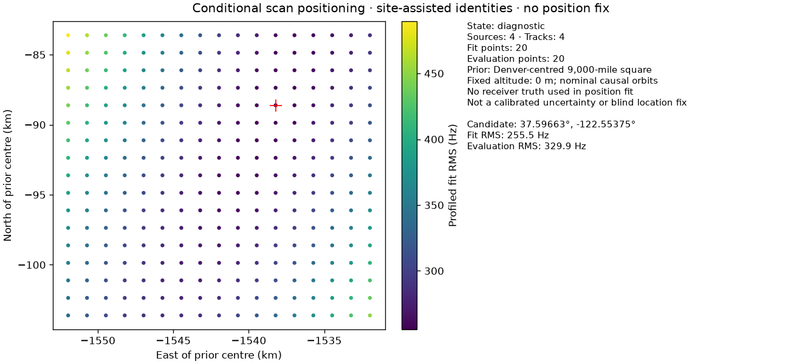
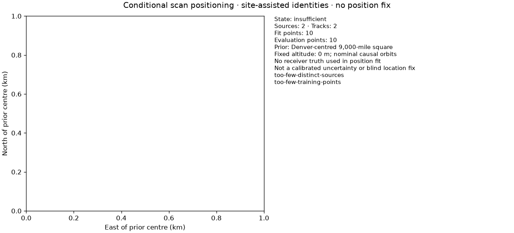

# Bounded positioning within adaptive scan analysis

The tracking V12 pipeline adds a conditional position diagnostic after TLE
matching, using the existing adaptive processing queue. Each terminal analysis
publishes position JSON and an independently served PNG, including an explicit
insufficient-evidence result when a scan cannot support the calculation.

This ports time-separated sparse sampling into individual scans. It does not
port the multi-day sub-kilometre claim. With one short capture, orbit correction,
clock error and location are difficult to separate. The limited model profiles
constant track offsets while holding nominal causal orbits, UTC and altitude
fixed. It fits no additional track slope or orbit correction.

The declared search is a Denver-centred 9,000-mile square at zero altitude.
The position search never receives the configured receiver coordinate. Candidate
identities do depend on the existing site-assisted TLE analysis, so the result
is explicitly conditional, not a blind or calibrated position fix.

## Work and science limits

- At most five time-separated fit and five evaluation observations per track.
- At most 32 tracks; at least three different satellite candidates and 15 fit
  observations are required. Shared observations across hypotheses are deduplicated.
- Bounded coarse and local grids; evaluation is computed only at the selected
  location and never ranks the location search.
- Constant offsets fitted only from fitting observations. Rank, conditioning
  and search-boundary checks can make a result insufficient.
- Catalogue availability and selected element epochs must precede capture start.
- Published tracking versions 1–11 remain readable. New queue bindings and
  publications use V12; existing data is not rewritten in place.

## Archived replay

| Scan | Independent candidates | Fit / evaluation points | Outcome | Fit / evaluation RMS |
|---|---:|---:|---|---:|
| `scan-fw-88eac04f079e5ad0` | 4 | 20 / 20 | Conditional candidate: 37.59663°, −122.55375° | 255.5 / 329.9 Hz |
| `scan-fw-d1147df1da924456` | 2 | 10 / 10 | Insufficient independent sources and fit observations | Not scored |

Both numerical diagnostics took under 0.1 seconds on the replay host, excluding
plot generation and the pre-existing trajectory/TLE analysis. The first result
is much coarser than the multi-day research result. No accuracy guarantee is
inferred from these two scans.





[Replay JSON](2026_09_21_adaptive_position_diagnostic/summary.json) records selected
observation IDs, evidence and configuration digests, counts, outcomes and runtime.

## Verification and reproduction

Focused Python validation passed 39 tests across analyzer, application,
contracts, storage, API and causal input preparation. The existing queue tests
passed seven tests using the deployed PPU dependency. Eight web component tests
and the production web build passed.

```bash
PYTHONPATH=src OPENBLAS_NUM_THREADS=1 .venv/bin/python tools/qualify_scan_position.py \
  --session-id scan-fw-88eac04f079e5ad0 \
  --session-id scan-fw-d1147df1da924456 \
  --output /tmp/scan-position-replay
```

This command only reads archived scanner evidence and writes to its requested
output directory. Runtime rollout and production HTTP verification remain
required before this report can claim the feature is live.

See the [integration plan](../docs/plans/adaptive-scan-position-diagnostic.md)
and [sparse-position research](2026_09_21_sparse_position_exploration.md).
