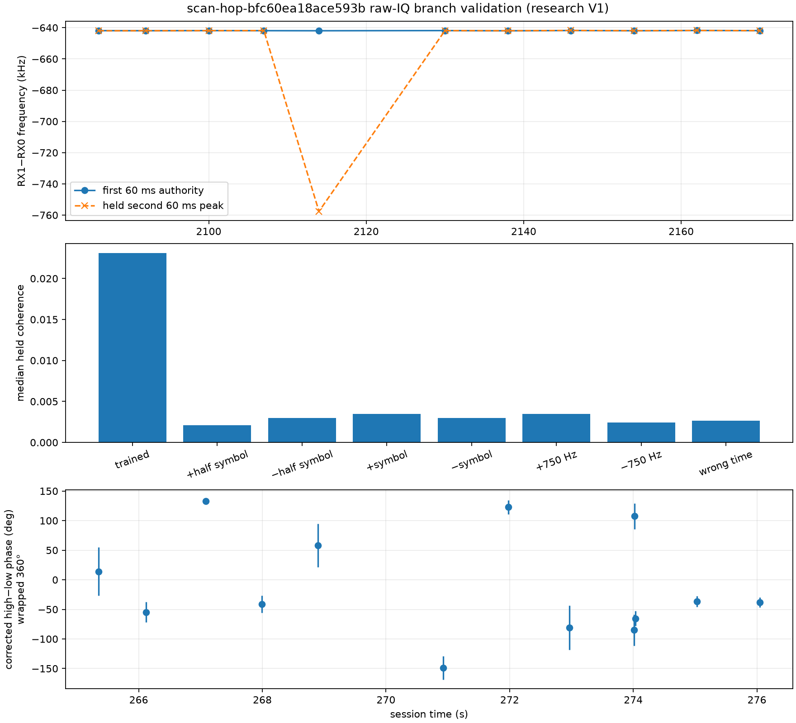

# Corrected raw-authority replay of the `bfc60` phase control

Date: 2026-09-21. Status: bounded negative control; no geometry claim.

## Result

The exact eleven saved-IQ visits previously used as a positive control were
replayed with the corrected receiver-frequency authority and the same
phase-blind two-source selection. The run was limited to visits `2086`, `2092`,
`2100`, `2107`, `2114`, `2130`, `2138`, `2146`, `2154`, `2162`, and `2170` in
`scan-hop-bfc60ea18ace593b`. It read the corpus without modification and did not
search any additional visits.

Every visit again supplied the historical two-source separation near 27-31
kHz. The corrected wrapped high-minus-low phase does **not** reproduce the old
V2 or frozen-reference phase:

| Comparison, modulo pi | RMS error | Maximum absolute error |
| --- | ---: | ---: |
| Corrected raw-authority phase vs old V2 saved-IQ phase | 38.28° | 71.82° |
| Corrected raw-authority phase vs oriented frozen reference | 37.54° | 73.57° |

The old V2-to-frozen comparison was 9.51° RMS and 18.58° maximum. That earlier
agreement remains useful as a historical estimator-reproduction check, but it
is not independent evidence for physical receiver or geometry phase after the
frequency-branch bugs were corrected.



## Held-out control

The first 60 ms broadband RX1-times-conjugate-RX0 peak was used as frequency
authority and the second 60 ms was held out. Ten visits retained the same
receiver-offset neighborhood within 87 Hz. Visit `2114` failed the held-out
control: the trained peak was -641,963 Hz, while the held-out peak was
-757,596 Hz at delay -3 samples, a -115,633 Hz discrepancy. Both coherences
were only about 0.023. Even after excluding that visibly failed visit, several
phase differences remain between 66° and 72°, so the overall disagreement is
not explained by that one row.

| Visit | Train / held coherence | Held - train frequency | Corrected vs frozen error, modulo pi |
| ---: | ---: | ---: | ---: |
| 2086 | 0.100 / 0.105 | -86.18 Hz | -69.14° |
| 2092 | 0.117 / 0.107 | +1.13 Hz | +14.64° |
| 2100 | 0.073 / 0.062 | -35.28 Hz | +12.40° |
| 2107 | 0.038 / 0.033 | +61.58 Hz | -13.42° |
| 2114 | 0.024 / 0.023 | -115,633.04 Hz | +62.22° |
| 2130 | 0.056 / 0.050 | -23.15 Hz | +3.90° |
| 2138 | 0.100 / 0.103 | +33.18 Hz | +73.57° |
| 2146 | 0.068 / 0.096 | +32.89 Hz | +18.69° |
| 2154 | 0.112 / 0.068 | +19.87 Hz | -7.57° |
| 2162 | 0.144 / 0.114 | -2.24 Hz | +20.77° |
| 2170 | 0.126 / 0.141 | -8.41 Hz | -6.17° |

The broadband offset can also be driven by shared sources other than the two
selected pilots because the LNBs do not necessarily see identical source sets.
It is therefore frequency-branch evidence, not proof that every selected pilot
pair is the same waveform. A true phase result still requires a source-overlap
gate and source-specific held-out phase support.

## Binding and scope

The replay input manifest is
`sha256:bf355fb303e423f96866f7ea6be06d047e0677a2c767aba37cda81a5a06804e2`.
The [raw replay JSON](figures/2026_09_21_adaptive_dual_rx_local_phase/scan-hop-bfc60ea18ace593b-raw-authority-negative-control-v1.json)
has file SHA-256
`5fd0af97721ff58490dd08a8852cb9cfe5dec4a3f6f0796edb705cd251071f37`
and canonical evidence digest
`sha256:6976cc526f6b1bebb98a381dac232a7837a042806bdca51645c67d2c8d9e1c58`.
The compared old saved-IQ V2 file has SHA-256
`c12006a7bb00314425ac85eb384b6f604d78c13381463b1c772fed121e79785c`;
the frozen September 16 input has SHA-256
`7d25f6f99ac51079d71dd7cc92081d1dcc5d3a3d732266af8b695987673d1bb6`.

The current LT3D-001A geometry record was not applied. This capture predates
that record, and no capture-bound evidence proves it used the same holder,
phase-center offsets, cable mapping, or ENU pose.

## Reproduction

```bash
sudo -u leo env PYTHONPATH=src MPLCONFIGDIR=/tmp/leo-bfc-mpl \
  .venv/bin/python tools/report_adaptive_dual_rx_raw_coherence.py \
  --bulk-root /srv/bulk/leo \
  --session-id scan-hop-bfc60ea18ace593b \
  --visits 2086,2092,2100,2107,2114,2130,2138,2146,2154,2162,2170 \
  --delay-search-visits 2086,2092,2100,2107,2114,2130,2138,2146,2154,2162,2170 \
  --json /tmp/scan-hop-bfc60ea18ace593b-raw-cross-ambiguity-v1.json \
  --png /tmp/scan-hop-bfc60ea18ace593b-raw-cross-ambiguity-v1.png
```
