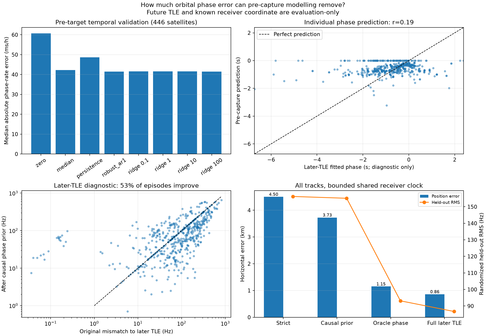
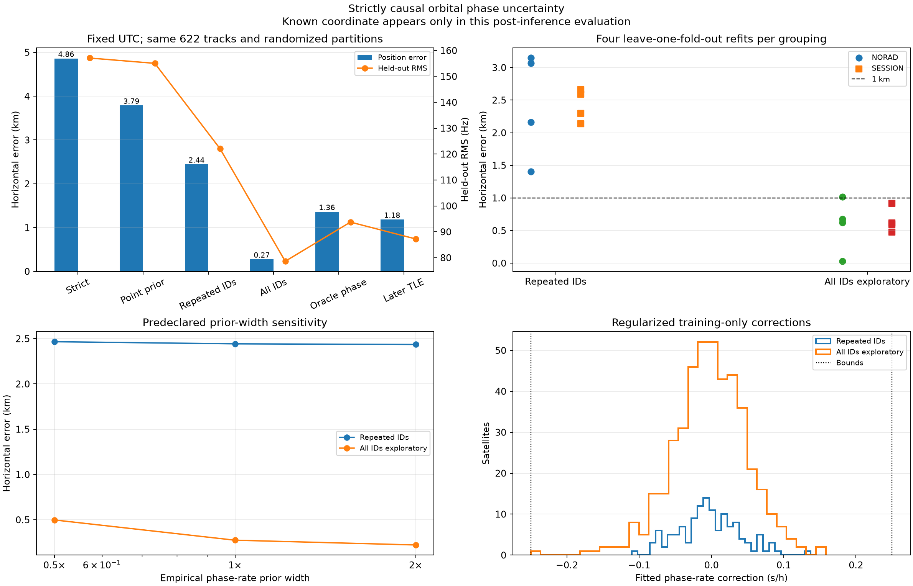

# How much orbital error can be reduced causally by modelling?

## Result

Pre-capture TLE history contains useful information, but a single point correction predicts only a small fraction of the RF error.  A joint model that lets the current RF fitting observations update a tightly regularized orbital phase rate is much more effective.

On the same 622 fixed satellite associations and the same randomized RF partitions, with the receiver clock fixed to recorded UTC:

| Model | Horizontal error | Randomized evaluation RMS | Interpretation |
|---|---:|---:|---|
| Strict causal TLE | 4.859 km | 157.09 Hz | Matched baseline |
| Pre-capture point phase prior | 3.787 km | 155.04 Hz | History only |
| Joint phase rate, repeated satellites | 2.443 km | 122.08 Hz | Conservative causal improvement |
| Joint phase rate, all fixed identities | **0.275 km** | **78.63 Hz** | Exploratory flexibility control |
| Later-TLE phase oracle | 1.361 km | 93.74 Hz | Future information; diagnostic only |
| Full later TLE | 1.184 km | 87.25 Hz | Future information; diagnostic only |

The repeated-satellite model removes **49.7% of the baseline position distance** and **39.6% of squared RF residual energy** on this dataset.  The all-identity control removes **94.3%** and **74.9%**, respectively.  The 275 m result is promising evidence that TLE-state mismatch is important.  It is not yet a blind operational location result: the 446 satellite identities are fixed from the strict-causal association pass, and one phase-rate nuisance per identity can absorb receiver-time, source-frequency, association, or other model errors as well as true orbit error.





Machine-readable evidence is in [analysis.json](2026_09_21_causal_orbit_error_model/analysis.json), [evaluation.json](2026_09_21_causal_orbit_error_model/evaluation.json), [uncertainty-analysis.json](2026_09_21_causal_orbit_error_model/uncertainty-analysis.json), [uncertainty-evaluation.json](2026_09_21_causal_orbit_error_model/uncertainty-evaluation.json), and [provenance.json](2026_09_21_causal_orbit_error_model/provenance.json).

## Sealed causal prior

Both the archive collection timestamp and the TLE epoch must precede the target capture.  The historical population is restricted to the 446 satellite IDs selected by the strict-causal target reranking.  This makes the experiment population-conditioned; it does not use the future target RF residuals to choose a historical satellite population.

The prior class was frozen at the earliest target cutoff.  Its corpus contains 6,871 consecutive historical TLE transitions.  For each of 446 satellites, the final transition was reserved for temporal validation, leaving 5,979 fitting pairs and 446 validation pairs.  The tested models were zero correction, global median, persistence, robust AR(1), and standardized ridge regressions at four prespecified strengths.  Selection used median absolute validation phase-rate error.  Robust AR(1) won at **0.04144 s/h median absolute error** and **0.09177 s/h RMS**:

```text
next phase rate = -0.03288 s/h + 0.03719 × recent phase rate
```

The fitted slope is close to zero.  Recent TLE-to-TLE phase drift therefore has little satellite-specific persistence in this archive.  The richer ridge features slightly reduced validation RMS but did not win the frozen median-error criterion.

For 127 of 622 target episodes there was no usable predecessor under the frozen rules, so their point correction was zero.  Across all targets the predicted phase had median -0.475 s, 5th/95th percentiles -1.117/0.000 s, and range -3.230/0.000 s.

Later elements were used only after inference as a diagnostic.  For 547 comparable episodes, the causal point prior reduced pooled squared mismatch to later TLEs by 28.6%, but improved only 53.0% of individual episodes.  Predicted and later-fitted phase correlated only 0.19.  This explains why the point prior changes the position solution more than it changes aggregate RF RMS.

## Joint uncertainty model

The joint model uses the pre-capture point prediction as a mean and estimates a signed additive phase rate for each eligible satellite:

```text
phase at capture = causal point prediction + fitted rate × causal TLE age
```

The phase rate can be positive or negative, so no positivity constraint is appropriate.  It is bounded to ±0.25 s/h.  Its empirical prior width, 0.09177 s/h, comes from the sealed pre-target temporal validation RMS.  Exact SGP4 states at the point mean and ±1 second form a local quadratic state approximation during optimization.  Recomputing exact SGP4 states at the final rates changes evaluation RMS by less than 0.001 Hz and changes the location by less than a metre.

This is a regularized robust least-squares objective, not a normalized probabilistic likelihood.  RF residuals use a 250 Hz smooth robust scale.  Each rate contributes a penalty `100 Hz × rate / 0.09177 s/h`.  The 100 Hz conversion scale is fixed and its effect is checked by halving and doubling the prior width.  There is no fitted receiver clock.  One additive source-frequency offset per RF segment is estimated from fitting points and profiled out.

The dataset has 21,702 observations in 622 episodes: 12,777 randomized fitting observations and 8,925 randomized evaluation observations.  Evaluation samples never enter the optimizer.  The repeated-satellite model has 130 explicit parameters: two receiver coordinates and 128 phase rates.  The all-identity control has 448: two receiver coordinates and 446 phase rates.  Both also profile 622 per-segment frequency offsets, which are common nuisance parameters already present in the baseline.  Each phase rate adds one prior constraint.  No rate reached its bound in the repeated model; one did in the all-identity control.

Randomized evaluation is appropriate for testing the predicted Doppler curve inside an observed arc, but it is weaker than holding out entire satellites or future sessions.  A test perturbs every evaluation RF value by 1 MHz and verifies that the fitted location and rates do not change.

## Stability

The repeated-satellite estimate is the lower-dimensional, more conservative current model:

| Check | Repeated-satellite error | All-identity control error |
|---|---:|---:|
| Full fit | 2.443 km | 0.275 km |
| NORAD deletion folds | 1.401–3.146 km | 0.028–1.015 km |
| Session deletion folds | 2.139–2.660 km | 0.473–0.917 km |
| Half prior width | 2.466 km | 0.498 km |
| Double prior width | 2.436 km | 0.222 km |

The all-identity solution remains below 1 km in seven of eight deletion fits and reaches 1.015 km in the eighth.  Its deletion-fold medians are 0.648 km by NORAD and 0.606 km by session.  That stability makes the sub-kilometre result worth pursuing, but it does not remove the fixed-identity and within-arc evaluation limitations.

## What firmware timing can and cannot fix

This comparison fixes the receiver clock to recorded UTC in every model, so it introduces no explicit clock-fit parameter.  That does **not** make the gain uniquely orbital: satellite phase corrections can absorb part of a receiver timestamp error because those effects are near-confounded over short arcs.  Independent UTC calibration remains necessary.  Better firmware timing also improves association reliability, but it cannot by itself establish which fitted satellite-specific offsets are physical orbit errors.

The archive-only point predictor recovers only about 21% of the shared-clock position gap between strict and retrospective elements, and about 1.6% of the corresponding RMS gap.  Better causal orbit modelling can plausibly improve that, but the current TLE update sequence has weak single-satellite predictability.  Current evidence supports this decomposition:

- **Observed causal reduction in this dataset:** 49.7% of position distance and 39.6% of squared RF residual energy with repeated-satellite rates.
- **Exploratory same-dataset reduction:** as much as 94% and 75% when every fixed identity gets a regularized rate.
- **Unresolved remainder:** 78.6 Hz evaluation RMS in the flexible model.  It mixes GLRT measurement noise, incorrect identities, source-frequency structure, non-phase orbital errors, and model error.  It is not yet an irreducible floor.

## Required next validation

The next decisive experiment is forward validation on captures that were not available when this model and its scales were chosen.  Freeze the prior and objective, rerun association jointly rather than fixing identities, and hold out complete satellites and complete future sessions.  A credible operational claim should require sub-kilometre median error and a sub-kilometre high-percentile error without using the known coordinate for selection.  A physical along-track/cross-track state prior should then replace independent per-satellite phase-rate flexibility and test whether the gain survives with fewer nuisance degrees of freedom.

## Reproduction

The analysis is implemented by:

- `tools/study_causal_orbit_phase_prior.py`
- `tools/fit_causal_orbit_phase_uncertainty.py`
- `tools/report_causal_orbit_phase_prior.py`
- `tools/report_causal_orbit_phase_uncertainty.py`

Component-owned tests cover model selection with duplicate candidate names, exact quadratic state interpolation, synthetic recovery of a known receiver and phase rate, strict NORAD alignment, and evaluation-sample isolation.
