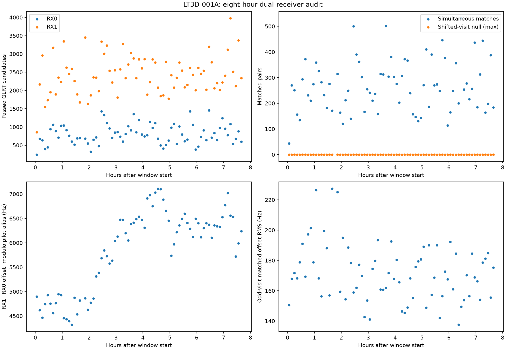
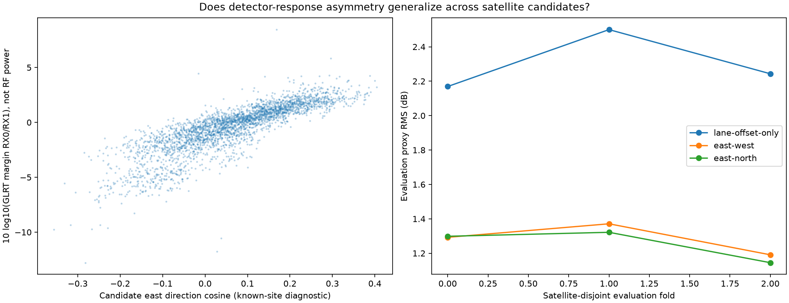
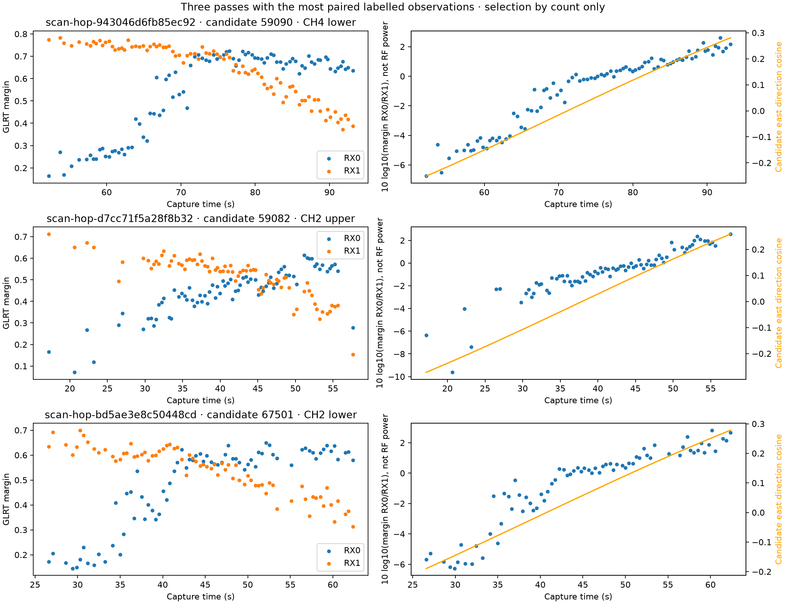
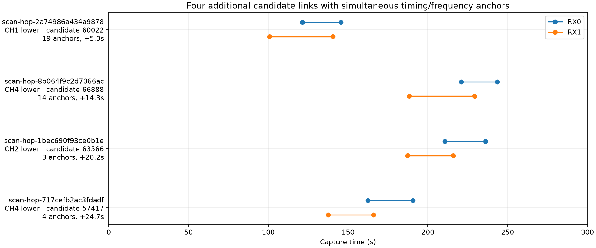
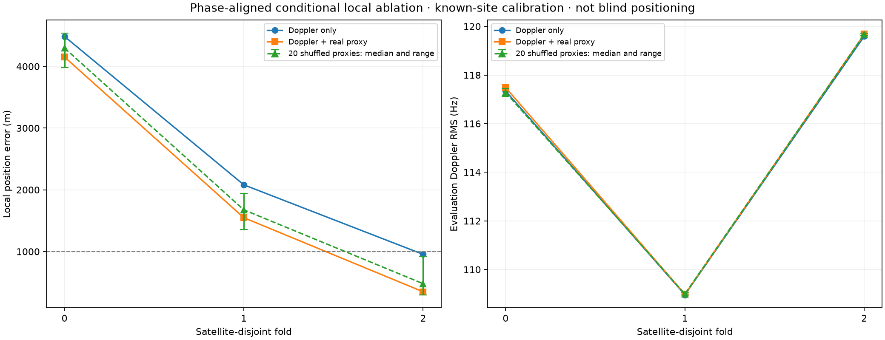
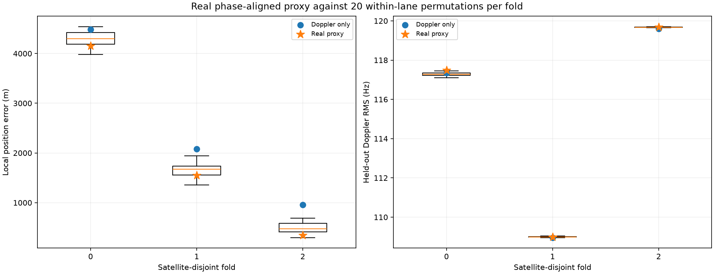

# LT3D-001A dual-LNB geometry: eight-hour archived study

**Corpus distinction.** This report analyzes the newer **2.5 MS/s dual-RX**
LT3D-001A captures. The earlier 10, 15, and 20 MS/s campaigns are single-RX
corpora and are not evidence for the simultaneous-receiver results below.

## Decision

The LT3D-001A dual-receiver fixture contains a repeatable differential signal,
and it is useful now for conservative association. Across the frozen eight-hour
window, 20,354 same-visit timing-and-frequency matches survive ambiguity
rejection. An offset model fitted on even visits predicts matched odd visits
with a median session RMS of 169 Hz. Both same-lane shifted-visit nulls (17 and
53 visits) produce zero matches in every evaluable capture. The safest tracking
update is therefore to use multiple simultaneous dual-receiver matches as
**candidate-link evidence**, while preserving the original paths, pilot-alias
ambiguity, and satellite-identity uncertainty.

The differential detector response also varies with east-west look direction.
On three satellite-disjoint folds, adding east direction cosine reduces proxy
RMS from 2.169/2.500/2.243 dB to 1.292/1.371/1.191 dB. This is evidence that the
fixture has directional information. It is not yet a calibrated beam sensor:
the response is `10 log10(GLRT margin RX0 / GLRT margin RX1)`, not received
power, and the physical RX-to-LNB/cable mapping was not independently measured.

Positioning benefit remains unproven. With Doppler-profiled, phase-aligned
satellite geometry, the real proxy reduces conditional local error from
4,485/2,081/954 m to 4,152/1,548/348 m. Yet the real result ranks only 4th, 6th,
and 3rd among itself and 20 within-lane shuffled controls; held-out Doppler RMS
also worsens slightly in every fold. The real factor beats every shuffled
control in beam likelihood, which supports directional structure, but the
small, correlated, retrospectively calibrated experiment does not show that
the structure improves truthful position. The formal Doppler/orbit model
remains the research baseline, the beam term remains opt-in, and production is
unchanged.

## Frozen scope and data completeness

The read-only export ends at **2026-09-21 13:56:54 UTC**
(`1789999014000000000` ns). The requested eight-hour analysis window begins at
05:56:54 UTC, and the six-hour review cohort begins at 07:56:54 UTC.

| Frozen cohort | Finalized captures | Metrics available | Tracking complete | Tracking running | Tracking pending |
|---|---:|---:|---:|---:|---:|
| Eight hours | 78 | 76 | 75 | 1 | 2 |
| Last six hours | 59 | 57 | 56 | 1 | 2 |

The one running and two pending states are the product states observed at export
time; they were not silently promoted to complete. The finalized eight-hour
inventory also has no 07:42 capture between 07:36 and 07:48. The frozen records
do not establish why, so this report does not infer a cause. The complete
per-capture ledger is in [scan-inventory.md](2026_09_21_dual_lnb_geometry/scan-inventory.md),
and input digests and state are in
[capture-inventory.json](2026_09_21_dual_lnb_geometry/capture-inventory.json).

All captures use the same 2.5 MS/s dual-RX fixture declaration, with nominal
80 mm separation and axes separated by 20 degrees. These are manifest geometry
values, not a measured RF calibration. The installation is described as
roughly east-west; the association between receiver IDs, cables, and physical
LNBs is unknown. No new RF was collected, no IQ was copied into the report, and
no capture, manifest, QNAP path, or persisted contract was changed.



## Receiver association

The analysis first constructs potential RX0/RX1 edges only inside the same
visit, channel, and spectral edge. It requires epoch timing to agree within nine
samples after wrapping by the pilot period. Duplicate alias candidates collapse
to the highest-margin representative before pairing. A robust linear
RX1-minus-RX0 frequency-offset model, including drift, is fitted modulo the
227.27 kHz pilot alias using even-numbered visits only. Odd-numbered visits are
held out for its residual evaluation. A pair is accepted only when the
timing-and-offset gate leaves a mutually unique one-to-one assignment; ambiguous
assignments are rejected instead of forced.

| Association diagnostic | Result |
|---|---:|
| Evaluable captures | 76 |
| Unique simultaneous timing + CFO matches | 20,354 |
| Odd-visit evaluation matches | 9,943 |
| Median odd-visit offset RMS by capture | 169.1 Hz |
| Odd-visit RMS range by capture | 137.5–227.5 Hz |
| 17-visit same-lane shifted-null matches | 0 |
| 53-visit same-lane shifted-null matches | 0 |

The shifted null preserves receiver candidate counts and RF lane but substitutes
a different visit, deliberately breaking simultaneity. Its zero result supports
the timing-plus-offset constraint on this corpus. It does not measure false
association probability under every interference condition, and it does not
resolve the pilot alias by itself.

## Directional detector-response evidence

Only matched pairs for which both independent tracking reviews have a clear
site-assisted leader are admitted to the geometry regression. “Clear” means the
leader has randomized-evaluation RMS at most 150 Hz and the runner-up has at
least three times the leader RMS. Both sides must also match their leader within
500 Hz after pilot-alias lifting. This yields 2,982 paired points over 105
candidate satellites and no cross-receiver leader disagreements.

That zero is selection-conditioned consistency, not a measured zero false-match
rate: ambiguous reviews, missing leaders, and disagreements that fail the
admission criteria do not enter the 2,982-point set. Satellite directions are
computed at the known site from the causal catalogue snapshot already attached
to each tracking product.

The response proxy is

\[
r = 10\log_{10}\left(\frac{\text{RX0 GLRT margin}}
                              {\text{RX1 GLRT margin}}\right).
\]

A weighted least-squares comparison uses three folds defined by `NORAD % 3`.
Each session/satellite/lane group receives equal total weight so a densely
sampled pass cannot dominate. Lane intercepts absorb channel/edge offsets. The
east-west model adds east direction cosine; the east+north model adds both
horizontal direction cosines.

| Fold | Held-out points / satellites | Lane offsets only | + east | + east and north |
|---:|---:|---:|---:|---:|
| 0 | 972 / 35 | 2.169 dB | 1.292 dB | 1.299 dB |
| 1 | 961 / 31 | 2.500 dB | 1.371 dB | 1.322 dB |
| 2 | 1,049 / 39 | 2.243 dB | 1.191 dB | 1.145 dB |

The fitted east coefficients are positive and stable at 14.25–15.22 dB per
direction cosine. When north is also fitted, the implied horizontal headings
are about 96–98 degrees. Conditional on the response definition, this is
consistent with RX0 being favored for eastern look directions. It does not
certify which physical horn or cable is RX0, because an independent cable map
and RF gain/phase calibration are absent.





The scale is also much too coarse for a sub-kilometre claim. A representative
1.3 dB residual divided by a 15 dB-per-cosine slope is about 0.087 in direction
cosine, or roughly 5 degrees near zenith. At an illustrative 550 km slant range,
that angle corresponds to about 48 km. This calculation is only an order-of-
magnitude interpretation of the proxy; it is not a calibrated angular-error
distribution.

## Track continuity and handoff opportunities

The review-link audit enumerates opposite-receiver, same-lane path pairs whose
time intervals overlap or come within four seconds. These 305 rows are
pairwise potential edges. They are not 305 actual merged groups, and a path may
participate in more than one row.

| Pairwise audit result | Opportunities |
|---|---:|
| Total potential edges | 305 |
| Same clear review leader | 195 |
| Pass existing overlap/slope gate | 202 |
| Different clear review leaders yet pass old gate | 22 |
| Same leader missed by old gate | 15 |

The 15 same-leader misses show why slope alone should not decide continuity.
Four of them have at least three directly observed simultaneous
timing-and-frequency anchors. Their observed duration extensions are 24.7,
20.2, 14.3, and 5.0 seconds. They are defensible **candidate links** under the
new rule. The remaining missed pairs lack the required anchor count. Four
same-leader cases do not overlap at all; all have zero anchors and remain
unconfirmed despite review-label agreement.



The recommended link object reports the anchor count, residual RMS, union span,
and duration extension, but explicitly retains `alias_resolved=false` and
`identity_claimed=false`. It abstains on no-overlap paths, different lanes,
empty paths, and fewer than three simultaneous anchors. Downstream grouping
should preserve both source-track IDs and every observed anchor so later
models can account for correlation and provenance. It should not manufacture a
continuous observation stream across a gap.

## Conditional position ablation

This ablation asks a deliberately narrow question: does the observed detector
asymmetry improve a local formal-orbit fit under a known-site calibration? It is
not blind position acquisition.

For each satellite-disjoint fold, other satellites calibrate lane intercepts,
east slope, and residual scale at the known LT3D-001A site. Those calibration
satellites come from the same complete eight-hour window, including later
captures and some of the same sessions as the evaluation fold. This is a
retrospective within-window transfer test, not prospective calibration. The fit
then searches a 200 km by 200 km region centered on the known site, starting at
local coordinates `[20 km, -20 km]`. It uses catalogue element epochs preceding
the capture and the existing learned per-satellite phase-rate correction.
Doppler observations use a deterministic interleaved 80/20 within-track mask;
this is neither a random split nor a chronological future-pass test. The beam
factor uses one training-only midpoint representative per session/satellite
pass: 35, 31, and 39 points by fold. A global cable mapping of +1 or -1 and five
heading offsets over ±10 degrees are marginalized for the installation, rather
than selected independently per track or point.

For every beam-enabled fit, the formal model first profiles satellite phase-rate
nuisances from Doppler, then evaluates the beam direction at that phase-aligned
geometry. Beam evidence does not refit those rates. This is a phase-consistent
conditional profile, not a fully joint nuisance MAP.

| Fold | Satellites / Doppler points | Doppler only | Real aligned proxy | 20 shuffled controls, min / median / max | Real rank |
|---:|---:|---:|---:|---:|---:|
| 0 | 35 / 972 | 4,484.8 m | 4,152.3 m | 3,980.4 / 4,297.4 / 4,537.5 m | 4 / 21 |
| 1 | 31 / 961 | 2,080.7 m | 1,548.1 m | 1,358.4 / 1,675.4 / 1,940.2 m | 6 / 21 |
| 2 | 39 / 1,049 | 954.0 m | 347.7 m | 299.3 / 478.7 / 922.4 m | 3 / 21 |

The boxes in the permutation figure are the within-lane **shuffled controls**,
not uncertainty intervals for the real factor. Three, five, and two of the 20
nulls beat the real coordinate error. One fold-0 null (seed `20260936`) reaches
the optimizer limit although its nuisance solve converges; excluding it leaves
the fold-0 real rank at 4/20. The other ranks remain 6/21 and 3/21. All baseline
and real fits converge. Overall, 65 of 66 fits converge and all 66 pass the exact
quadratic-versus-SGP4 check; fold maxima are 0.037, 0.088, and 0.014 Hz.

Held-out Doppler RMS slightly worsens with the real factor in every fold:
117.343 to 117.484 Hz, 108.962 to 108.981 Hz, and 119.595 to 119.679 Hz. The
real beam likelihood nevertheless beats all 20 nulls in each fold. Thus the
proxy contains direction-related structure without verified truthful position
benefit. The calibration coefficients are plug-in estimates, and their
uncertainty is not propagated into position covariance or coverage.





The earlier nine-row diagnostic evaluated beam directions at nominal frozen
orbit positions. Phase correction changes the real beam predictor by as much as
0.934 dB, or 0.794 fitted residual sigma; across all aligned trials the maxima
are 0.942 dB and 0.802 sigma. The corrected aligned result is the main result.
The old nine-row and 66-row frozen-position outputs are retained only to make
that correction auditable.

These results support neither production deployment nor default activation of
the beam factor. They cannot be combined with earlier single-site sub-kilometre
results to claim calibrated accuracy. The current position baseline remains the
formal Doppler/orbit model; the dual-LNB factor is experimental and opt-in.

## Model and code changes

The isolated research implementation is in
[dual_lnb_tracking.py (research source archive)](2026_09_21_dual_lnb_geometry_followup/reproduction-sources.tar.gz). It
adds:

- same-visit, same-lane timing edges with alias-duplicate collapse;
- robust receiver offset and drift fitting modulo the pilot alias;
- mutually unique CFO-gated matching with explicit ambiguity rejection;
- anchor-based candidate links that abstain without overlap evidence; and
- a calibrated east-west likelihood with a single marginalized cable mapping,
  bounded heading uncertainty, Student-t residuals, and one representative per
  independent pass.

[formal_orbit.py (research source archive)](2026_09_21_dual_lnb_geometry_followup/reproduction-sources.tar.gz) accepts optional
`DualLnbBeamData`, aligns its indexed satellite positions with the
Doppler-profiled phase corrections, and records whether the factor was used and
aligned. Omitting it, or passing `None`, preserves the previous objective and
remains the default. This is the appropriate compatibility boundary: the
analyzer receives explicit research data rather than importing storage or
hardware code.

The component tests cover offset recovery on separate visits, pilot-alias
ambiguity, duplicate and ambiguous candidates, timing/lane constraints,
no-overlap abstention, global rather than pointwise cable mapping, one-point-
per-pass enforcement, finite-value validation, opt-in formal-model behavior,
and held-out isolation. The distinct-visit minimum is checked again after robust
outlier filtering, so many candidate combinations from one visit cannot supply
independent support. **Eighteen targeted tests pass.** Ruff, mypy on the three
changed source/tool files, and diff checks also pass. This validates the
implemented invariants; it does not validate antenna calibration or field
accuracy.

## Limits and next acceptance gates

The central limitation is measurement semantics. GLRT margin is a detector
decision statistic influenced by noise, waveform match, interference, and
candidate competition. Treating its ratio as received-power ratio would be an
unverified physical model. An amplitude-ratio direction model requires path-gain
and detector-response calibration; future coherent interferometry would also
require phase calibration. The JPL array-calibration treatment is a useful
primary reference for that distinction
([JPL Progress Report 42-182, article 182A](https://tmo.jpl.nasa.gov/progress_report/42-182/182A.pdf)).
Published direction-finding analysis likewise shows that gain mismatch,
pointing error, and beamwidth error propagate into position/angle performance,
which is why the nominal 80 mm/20 degree declaration is insufficient
([IET Radar, Sonar & Navigation, DOI 10.1049/iet-rsn.2019.0465](https://ietresearch.onlinelibrary.wiley.com/doi/10.1049/iet-rsn.2019.0465)).

Before enabling a beam factor in a deployed position model:

1. Measure the RX-to-cable-to-LNB mapping and calibrate differential RF power,
   detector response, gain, heading, and uncertainty with a known pilot over
   independent days and passes.
2. Freeze the calibration before evaluation, use global installation heading
   and mapping parameters, and test on later days or an independent site.
3. Extend the completed 20-permutation-per-fold null with pass-level bootstraps
   and independent days, reporting an interval for improvement. The current
   null shows that the three coordinate changes are not exceptional among
   within-lane response permutations.
4. Validate antenna calibration on independent whole passes and separately
   recorded days. The current interleaved within-track Doppler split shares
   pass conditions between fitting and evaluation. This is a calibration
   validation requirement, not a proposal to restore chronological TLE gates.
5. Merge only paths supported by their exact observed anchors. Preserve raw
   track provenance and model the dependence among repeated points from one
   pass.
6. Revisit calibrated carrier phase only after timing, gain, oscillator, and
   inter-channel phase stability are measured. The present result is not phase
   interferometry.

## Reproduction and retained evidence

The export is read-only. A reproducible working directory can be built with the
following sequence; `/var/lib/leo/tle` and `/srv/bulk/leo` are the archived
inputs used by the scripts.

```bash
work_dir=/tmp/lt3d001a-dual-lnb
export PYTHONPATH=src
.venv/bin/python tools/research_dual_lnb_export.py \
  --bulk-root /srv/bulk/leo \
  --end-utc-ns 1789999014000000000 \
  --output "$work_dir/export"

.venv/bin/python tools/research_dual_lnb_geometry.py \
  --input "$work_dir/export" \
  --output "$work_dir/results"

.venv/bin/python tools/benchmark_dual_lnb_position.py \
  --input "$work_dir/results/results.json" \
  --output "$work_dir/results/position-aligned-permutations.json" \
  --permutations 20

.venv/bin/python tools/render_dual_lnb_research.py \
  --input "$work_dir/results" \
  --output "$work_dir/results"
```

The entry points are
`research_dual_lnb_export.py`, `research_dual_lnb_geometry.py`,
`benchmark_dual_lnb_position.py`, and `render_dual_lnb_research.py` are included in
the [frozen research source archive](2026_09_21_dual_lnb_geometry_followup/reproduction-sources.tar.gz).
The report-only publication does not install these experimental modules into the
runtime source tree. Extract the archive into a separate research checkout to
reproduce the completed experiments; file hashes accompany the archive.

The retained report directory contains the complete compressed result rows
([results.json.gz](2026_09_21_dual_lnb_geometry/results.json.gz)), concise
[summary.json](2026_09_21_dual_lnb_geometry/summary.json), the full nine-row
[nominal-position diagnostic](2026_09_21_dual_lnb_geometry/position-ablation.json),
the 66-row [frozen-position permutation diagnostic](2026_09_21_dual_lnb_geometry/position-permutations.json),
the main 66-row [phase-aligned permutation result](2026_09_21_dual_lnb_geometry/position-aligned-permutations.json),
the capture inventory, figures, and an artifact digest manifest. No RF or IQ
payload is duplicated there. The immutable source manifests remain untouched.
