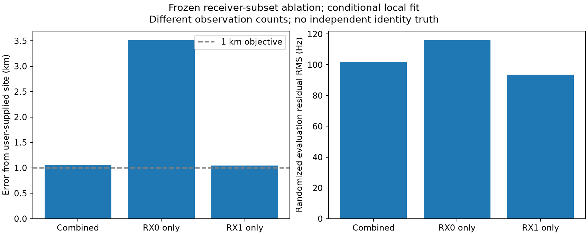
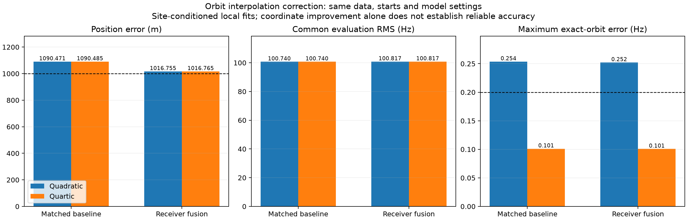
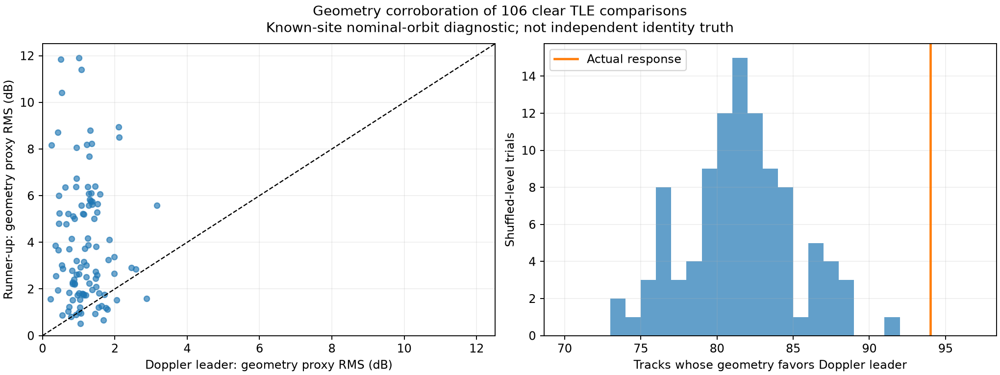

# Improving positioning with LT3D-001A geometry

## Objective and evaluation rules

The objective is a reproducible improvement toward sub-kilometre positioning,
not merely one coordinate estimate below 1 km. The preceding
[eight-hour study](2026_09_21_dual_lnb_geometry.md) found useful receiver matching
and directional response, but did not establish a reliable localization gain.

The next experiments use the same frozen archived captures; no new RF is needed.
They compare geometry-enabled and Doppler-only fits on identical observations,
identities, causal orbit inputs, and optimizer starts. The surveyed coordinate
is an evaluation target and, where explicitly stated, a beam-calibration site;
it must not select model hyperparameters or favourable subsets. These remain
conditional local experiments until initialization and satellite association
are evaluated independently of the known site.

## Three complementary investigations

1. **Measure the information available from geometry.** Calculate response
   sensitivity to receiver displacement and satellite phase uncertainty. Compare
   the observed detector-response scatter with the precision required to improve
   a Doppler solution at the kilometre scale. Determine whether additional
   within-pass points contribute independent information or merely repeat a
   correlated gain error.
2. **Use the full Doppler evidence.** The initial beam benchmark retained only
   simultaneous, confidently matched receiver detections and then divided them
   by satellite identity. Evaluate the existing positioning model on the wider
   accepted track corpus before attributing poor baseline accuracy to geometry.
   Preserve separate receiver offsets and avoid counting simultaneous copies as
   independent observations. Geometry must not require discarding useful
   single-receiver tracks.
3. **Test calibration transfer.** Fit beam-response models on earlier capture
   blocks and evaluate later blocks, comparing linear east response, east/north
   response, and justified robust or nonlinear alternatives. This time split is
   a test of installation calibration stability, not a chronological TLE-residual
   association gate. Report session bias and within-pass correlation, not only
   pooled point RMS.

## Conditions for promotion

Any proposed model must retain default Doppler compatibility, use consistent
orbit corrections for Doppler and beam geometry, and explicitly account for
unknown global cable mapping and heading. Calibration uncertainty and correlated
observations must not create an artificially narrow position confidence region.

Report all predefined evaluation groups, convergence failures, exact orbit
approximation checks, shuffled controls, and observation counts. An improvement
on the surveyed coordinate alone is insufficient if shuffled responses perform
similarly or independent calibration fails. Negative results narrow the next
experiment; they do not justify increasing beam weight until the answer improves.

## Status

Obstructions are unmodeled: nominal beam visibility is not evidence of a clear
radio path. Common or differential blockage can hide detections or change the
receiver ratio, so beam mismatch, handoff timing or missing detections alone must
not penalize a Starlink/NORAD identity or a positioning hypothesis. Beam-based
positioning uncertainty currently omits this systematic effect. The
[identification report](2026_09_21_dual_lnb_identification_eight_hours.md)
now specifies explicit unknown-visibility handling and an obstruction-aware model
extension; no numerical obstruction correction has been assumed.

Calibration transfer, local information sensitivity, the repeated 66-fit
calibration comparison, and full-corpus beam controls are complete below.
The first uncertainty-preserving receiver-extension comparison is also complete:
1,090.47 m becomes 1,016.76 m, without improvement on common evaluation residuals.
Reliable sub-kilometre improvement from geometry remains unproven.

The later [full eight-hour identification study](2026_09_21_dual_lnb_identification_eight_hours.md)
audits 77 scans over 07:33:13–15:33:13 UTC, retains all 2,948 tracks, and replaces
interval-only identity-response joins with exact candidate membership. In its
post-cutoff subset, 195 scoreable tracks yield 135 stable corroborations, 19
response-model mismatches and 41 calibration-uncertain outcomes. The study includes shared-pass
controls, all-track ledgers and counterexamples; it supports an added
geometry diagnostic, not a hard identity override or demonstrated position gain.

## Candidate-identity corroboration diagnostic

### Receiver-subset positioning ablation

After the obstruction clarification, a bounded Doppler-only test reuses the frozen
988-track prepared corpus, orbit states, randomized observation split, initial
position `[20,-20]` km and model settings. Selecting a receiver changes coverage;
it is a diagnostic of receiver/data dependence, not an equal-information comparison
or a reason to choose the receiver with the smaller known-site error.

| Input | Tracks | Observations | Position error, m | Evaluation RMS, Hz | Conditional 95% major axis, km | Exact SGP4 max difference, Hz |
|---|---:|---:|---:|---:|---:|---:|
| Combined baseline | 988 | 45,115 | 1,059.3 | 101.77 | 0.470 | 0.2522 |
| RX0 only | 311 | 12,939 | 3,516.0 | 116.11 | 1.365 | 0.1407 |
| RX1 only | 677 | 32,176 | 1,044.0 | 93.51 | 0.565 | 0.2555 |

Both new fits converged. RX0-only passes the unchanged 0.2 Hz maximum interpolation
check; combined and RX1-only fail it. Their reported conditional position intervals
also do not cover the supplied site. These fits remain research diagnostics, not
validated sub-kilometre locks. Removing RX0 improves measured error by only 15 m;
it does not achieve the objective, and the unequal sky/time/track coverage prevents
attributing the difference solely to receiver hardware or pointing.

[Full results](2026_09_21_dual_lnb_geometry_followup/receiver-ablation.json.gz)
are reproduced with `tools/benchmark_dual_lnb_receiver_ablation.py --prepared
/tmp/dual-full-export.npz --baseline /tmp/dual-full-local-baseline.json --output
/tmp/dual-receiver-ablation.json` under the existing read-only TLE-archive access.
The region is the same known-site-centered 200 km local region as the baseline;
this experiment does not establish a blind search solution. The next comparison
must test whether exact receiver linking extends usable Doppler support, preserving
offset-calibration covariance and withholding its anchors from positioning.

### Matched, uncertainty-aware receiver extension

The first extension benchmark accepts 46 links under the existing fixed matching
and calibration gates. It removes 1,531 RX0 anchor rows from both fit arms and
holds out all 3,062 RX0/RX1 calibration/validation anchor IDs from localization.
It adds 1,019 measured RX1 observations outside RX0 support, corrected to the RX0
reference with the fitted offset/drift covariance. Overlapping samples and
candidate aliases are not duplicated. No beam mismatch or missing-detection gate
is used, so an obstruction does not become a negative identity observation.

| Matched arm | Observations | Error, m | Training / evaluation RMS, Hz | Local 95% major axis, m | Exact-orbit max difference, Hz |
|---|---:|---:|---|---:|---:|
| Anchor-excluded baseline | 43,584 | 1,090.47 | 96.60 / 100.74 | 468.5 | 0.25367 |
| Uncertainty-aware extension | 44,603 | 1,016.76 | 103.68 / 107.26 | 455.1 | 0.25208 |

Both arms converge. The point error improves by **73.72 m (6.76%)**, but remains
above 1 km. Both still fail the unchanged 0.2 Hz exact-orbit maximum-error gate,
and their local uncertainty estimates fail to cover the supplied position. This
is a conditional research improvement, not a verified sub-kilometre lock. The
overall RMS columns use different observation sets because extension adds noisy
measurements; a common-observation comparison is needed before interpreting that
RMS increase as deterioration of the original tracks.

That common-observation check is now complete, without refitting: on the identical
baseline evaluation mask, RMS is **100.7399 Hz** for baseline parameters and
**100.8171 Hz** for fused-fit parameters, a 0.0772 Hz increase. Thus the measured
coordinate moves closer to the supplied site without improving this independent
residual metric. The point-error gain alone does not establish a generalizable
accuracy improvement. The receipt explicitly labels the known-site-centered local
region and site-conditioned candidate selection; the known site was not used only
for evaluation.

The chosen RX0 reference preserves its native frequency drift. Relative receiver
calibration does not establish an absolute oscillator reference. A useful next
controlled comparison is a symmetric or joint receiver-drift treatment, with the
same anchor exclusion and shared covariance, rather than selecting a reference
because it happens to give smaller known-site error.

Reproducible artifacts: [fit receipt](2026_09_21_dual_lnb_geometry_followup/fusion-benchmark.json.gz),
[preparation receipt](2026_09_21_dual_lnb_geometry_followup/fusion-preparation.json.gz),
and [prepared arrays and covariance blocks](2026_09_21_dual_lnb_geometry_followup/fusion-prepared.npz).
The arrays preserve 43,584 baseline observations, 44,603 fused observations and 46
shared calibration covariance blocks. Their hashes are recorded in the artifact manifest.

### Independent checks of identity and phase information

An exact-propagation audit identifies a correctable numerical limitation before
further position comparisons. The current quadratic orbit-state approximation uses
samples at -1, 0 and +1 seconds, but 19,943 baseline and 20,418 fused observations
require shifts outside that interval. The largest is approximately -6.88 seconds
for NORAD 64037, whose causal element epoch is 67.596 hours old. Thus the existing
approximation is extrapolating substantially for these observations.

Without refitting any parameter, a five-state quartic approximation at -2, -1, 0,
+1 and +2 seconds reduces the baseline maximum exact-SGP4 discrepancy from
0.25367 to 0.10180 Hz, and the fused maximum from 0.25208 to 0.10057 Hz. RMS
discrepancies fall to 0.00288 and 0.00290 Hz. Both frozen-parameter quartic audits
pass the unchanged 0.2 Hz numerical gate. This demonstrates a numerical remedy;
it does not retroactively validate the quadratic optimizer results or repair their
position uncertainty. Quartic evaluation still extrapolates at the largest shifts,
so integration must retain exact checks over the resulting optimizer solution.

The reproducible [audit receipt](2026_09_21_dual_lnb_geometry_followup/phase-interpolation-audit.json)
comes from `tools/audit_dual_lnb_phase_interpolation.py` with the prepared fusion
arrays and fit receipt above. A polynomial recovery test covers evaluation outside
the interpolation stencil. No element set, identity, gate or known-site position
was changed to obtain this numerical improvement.

The correction is now integrated as optional outer state arrays in the research
`FormalOrbitData` input. When absent, the original quadratic path remains active.
When supplied, nuisance fitting, final train/evaluation predictions and beam
geometry all use the same quartic state evaluator. Four component tests cover
complete/finite stencils, off-stencil state recovery, linear-orbit compatibility,
and nonlinear train/evaluation scoring. The combined relevant suite passes 33 tests.

The matched two-arm refit has completed with the original observations, model
settings and `[20,-20]` km initialization:

| Quartic refit | Position error, m | Evaluation RMS, Hz | Conditional 95% major axis, m | Maximum exact-orbit difference, Hz |
|---|---:|---:|---:|---:|
| Anchor-excluded baseline | 1,090.485 | 100.740 | 468.510 | 0.10107 |
| Uncertainty-aware extension | 1,016.765 | 107.263 | 455.108 | 0.10069 |

Both converge and pass the unchanged exact-propagation gate. Position changes
relative to the quadratic fits are only centimetres: the numerical defect was
real, but did not explain the kilometre-scale positioning error. The uncertainty
undercoverage and lack of independently demonstrated sub-kilometre improvement
remain. These are research-only changes; no production deployment is implied.

[Quartic fit receipt](2026_09_21_dual_lnb_geometry_followup/quartic-benchmark.json.gz)
and [prepared states](2026_09_21_dual_lnb_geometry_followup/quartic-prepared.npz)
are reproduced with `tools/benchmark_dual_lnb_quartic.py`; the figure is generated
by `tools/render_dual_lnb_quartic_comparison.py` from the two fit receipts.

The [observer-site sensitivity study](2026_09_21_identity_site_sensitivity.md)
reproduces the stored candidate scores before changing the observer coordinate.
For a deterministic 20-track prefix from one session, the 1.29 km discrepancy
between configured and supplied sites changes no leader identities, but changes
one runner and moves three tracks below the existing clear-match rule. Thus site
consistency matters even when the leading satellite remains unchanged. This is a
bounded sensitivity result, not a population estimate or blind identity validation.

The [archived phase feasibility study](2026_09_21_dual_lnb_phase_toa_feasibility.md)
finds good phase precision within individual visits, but the frozen two-signal
replay does not establish stable geometric double differences. Eleven of eighteen
visits qualify; seven miss because the frozen signal pair is absent from the
retained phase-blind pairs. Two groups have three survivors each, with nearest-branch
linear phase residual RMS of 24.9 and 60.5 degrees, versus a median reported
double-difference standard error of 6.11 degrees. All eleven use asynchronous
phase propagation and have no direct common frame. These results do not justify
adding a precise phase-derived geometric constraint to the position model.

### Earlier candidate-response diagnostic

An additional bounded experiment evaluates both retained TLE candidates on
106 RX0 tracks with at least three paired receiver observations. A linear
east-direction calibration excludes the Doppler leader's NORAD fold, as in the
initial study. It uses nominal causal orbital directions at the known site.

| Diagnostic | Result |
|---|---:|
| Geometry response RMS favors Doppler leader | 94 / 106 tracks |
| Leader geometry RMS better by more than 1 dB | 72 / 106 |
| Median runner-up minus leader geometry RMS | 2.105 dB |
| Leader wins after shuffling track response levels, 100 trials | 73 / 81 / 91 minimum / median / maximum |

The level-shuffle control moves whole-track response means within RF lanes and
retains within-track centered residual structure. It tests absolute response
levels, not removal of all directional information. Tracks are correlated and
were selected using clear Doppler leaders; these counts are neither a calibrated
false-association probability nor independent satellite identity truth. The
experiment nevertheless suggests useful corroborating information beyond a
typical shuffled response. It motivates evaluating geometry in candidate
mixtures and receiver path linking before increasing its direct position weight.

It must not become a hard rejection gate. In the 12 disagreements, geometry
can favor a runner-up whose Doppler residual is far worse. For example,
`scan-hop-3ac4256c8bdb2bca` has geometry RMS 1.79 versus 1.14 dB for NORAD
63384 versus 63377, but their Doppler evaluation RMS is 20.3 versus 520.3 Hz.
This is evidence for combining appropriately calibrated uncertainties, not for
overriding the Doppler leader whenever a beam residual happens to be smaller.

[Machine-readable results](2026_09_21_dual_lnb_geometry_followup/candidate-geometry.json)
are generated by `tools/research_dual_lnb_candidate_geometry.py`.

## Measurement audit

The implementation in `pilot_methods.py` normalizes coherent correlation power
by `sum_frames(sum_symbols(abs(correlation))**2)`; the reported margin subtracts
a control score. The archived ratio is therefore a ratio of coherence margins,
not antenna power. It can vary nonlinearly with signal quality and saturate.
An empirical nonlinear response model may transfer better, but a logit or other
transform must not be relabeled as calibrated RF SNR without validation.

There is a second consistency issue to evaluate: the first calibration used
nominal orbital directions, while the corrected positioning experiment uses
Doppler-adjusted orbital directions. Those adjustments can change the predicted
response by a material fraction of the measured scatter. Beam calibration and
position inference must use compatible orbit treatments before interpreting a
remaining response bias as antenna geometry.

## Calibration transfer: completed first comparison

The four chronological capture blocks contain 14, 14, 14, and 13 sessions with
usable paired geometry. Each evaluation block uses only earlier blocks to fit
the detector-response relationship. With Doppler-only phase-adjusted directions
at the known calibration site, out-of-fold group-balanced residual RMS is:

| Response model | RMS | Mean bias |
|---|---:|---:|
| Linear east | 1.291 dB | +0.142 dB |
| Linear east and north | 1.264 dB | +0.111 dB |
| Robust quadratic | 1.403 dB | +0.008 dB |

The simple two-direction model transfers better than the more flexible model
on this window. Its session-bias RMS is 0.560 dB and satellite-bias RMS is
0.895 dB; those groupings are confounded, so these are descriptive decompositions,
not independent physical error sources. Fifty-eight CH4-upper observations in
the first evaluation block lack that lane in the preceding calibration and
remain explicitly unsupported.

The [detailed calibration comparison](2026_09_21_dual_lnb_geometry_followup/calibration/aligned/calibration-report.md)
includes all block results. The [nominal-orbit diagnostic](2026_09_21_dual_lnb_geometry_followup/calibration/nominal/calibration-report.md)
is retained for comparison. These measurements support a stable directional
trend but do not justify treating thousands of correlated observations as
thousands of independent angle measurements.

## Correcting calibration orbit timing: matched position experiment

The previous 66-fit experiment was repeated with calibration directions corrected
using Doppler alone at the known calibration site. Response values do not fit
the orbital correction. The calibration, inference data, and 20 shuffled
controls per fold otherwise follow the same protocol.

| Fold | Doppler only | Original calibration + aligned inference | Corrected calibration + aligned inference | Real rank among real + 20 shuffled |
|---:|---:|---:|---:|---:|
| 0 | 4,484.8 m | 4,152.3 m | 4,161.0 m | 5 / 21 |
| 1 | 2,080.7 m | 1,548.1 m | 1,574.8 m | 6 / 21 |
| 2 | 954.0 m | 347.7 m | 357.0 m | 3 / 21 |

All 66 corrected-calibration fits converged. The consistency correction is
methodologically useful but does not improve coordinate error. The real response
still scores better than shuffled responses under the beam likelihood, without
establishing accurate positioning. These results rule out that calibration
inconsistency as the main explanation for the failed precision claim.

[Full repeated experiment](2026_09_21_dual_lnb_geometry_followup/position-recalibrated-permutations.json).

## Information available from the response

The [local information analysis](2026_09_21_dual_lnb_geometry_followup/information/README.md)
models both correlated response errors and calibration uncertainty. Under its
declared linearized assumptions, the representative combined 95% major-axis
bound improves by only 2.1–2.7% across the three groups. These are local
sensitivity calculations, not measured position errors or calibrated confidence
regions. They must not be compared directly with the historical 328 m point
error as though they were the same quantity or dataset.

Removing an arbitrary offset from each pass preserves a convincing response
shape but removes nearly all of its already weak direct position information.
Correlated temporal samples retain more information than a single midpoint,
but do not turn this detector statistic into a precise angle measurement.
This supports pursuing identity corroboration and longer linked Doppler curves
rather than substantially increasing the response factor's weight.

## Full current-corpus baseline

The wider current dataset is now sealed: **988 tracks, 45,115 observations,
580 catalogue candidates**, from 76 usable scans out of 78 exported scans.
It retains 311 RX0 tracks and 677 RX1 tracks while deduplicating 106
timing-anchored, same-identity opposite-receiver paths. There are 36,494 fitting
and 8,621 evaluation observations. Both position arms will receive these same
observations; the geometry arm has 105 matched pass representatives.

The first conditional local baseline converged at **1,059.3 m horizontal
error**, with fitting/evaluation RMS **98.25/101.77 Hz**. The optimizer and
nuisance solve converged. Its local nominal 95% major semiaxis is only 470 m
and therefore misses the surveyed position: uncertainty remains overconfident.
The completed matched comparison is:

| Arm | Horizontal error |
|---|---:|
| Doppler baseline | 1,059.319 m |
| Actual beam response | 1,054.390 m |
| Shuffled response seed 20260921 | 1,053.730 m |
| Shuffled response seed 20260922 | 1,055.321 m |
| Shuffled response seed 20260923 | 1,054.632 m |
| Shuffled response seed 20260924 | 1,052.627 m |
| Shuffled response seed 20260925 | 1,050.836 m |

All arms converge. The real response improves the baseline by 4.929 m but
ranks fourth among itself and the five shuffled controls. There is no detectable
positioning advantage over these prespecified nulls.

Exact SGP4 verification covers all 45,115 rows. Baseline/real-beam approximation
RMS is 0.01614/0.01617 Hz, but maxima are 0.25223/0.25274 Hz: both fail the
inherited strict 0.2 Hz maximum tolerance. The discrepancy is small relative to
the fitted measurement scale, but the numerical gate is not waived. These are
diagnostic results, not verified operational accuracy claims.

The [baseline](2026_09_21_dual_lnb_geometry_followup/dual-full-local-baseline.json.gz),
[baseline exact check](2026_09_21_dual_lnb_geometry_followup/dual-full-baseline-exact.json.gz),
and [matched geometry/null results](2026_09_21_dual_lnb_geometry_followup/dual-full-local-geometry-nulls.json.gz)
retain the full fit diagnostics.

This dataset is distinct from the
earlier 622-track campaign and includes useful single-receiver tracks omitted
by the first paired-only geometry experiment. Neither additional rows nor a
smaller coordinate error alone can establish an improvement from geometry;
that requires the matched arm and its controls.

## Receiver extension implementation and continuity safeguards

The pure fusion helper preserves original RX0 observations and adds only
measured RX1 points outside RX0 coverage. It requires explicit same-identity,
same-lane support, separate fitting and validation anchors, and supported gaps.
It exports calibration provenance and the common offset/drift covariance rather
than claiming corrected points are independent.

The formal model now accepts optional added track covariance blocks. Its
likelihood whitens the total covariance `sigma² R + K`, including the
normalization determinant and off-diagonal calibration terms. Empty blocks
preserve the existing model. Twenty-eight focused tests, including a direct
dense Gaussian likelihood comparison, pass; type checking also passes.

For the completed matched fusion comparison above, calibration anchor rows are
excluded from the fit. Epoch alignment
must also be enforced. The timing audit of the four original proposed links
found actual RX1-minus-RX0 support-center differences below 0.04 microseconds.
The approximately 10 ms beam-row mapping offset is common to both receivers
(probe start versus support center), not an RX-to-RX delay. Thus it does not
create a 40 Hz calibration bias in those pairs. The generic helper now requires
a 1 microsecond common-epoch tolerance; tests reject a 10 ms lag rather than
silently transporting CFO values. The matched fusion comparison above quantifies
the observed coordinate change without claiming verified sub-kilometre accuracy.

A further reference-choice experiment retains the same frozen links and chooses
RX1 by its larger path coverage (not by position error). It replaces affected
RX0 paths with native RX1 observations and only adds gap-supported RX0 extensions
after covariance-aware calibration. The remaining baseline observations are
unchanged. Common-observation scoring excludes replaced segments because their
fitted frequency offsets now refer to a different receiver; directly applying
an RX1 offset to an RX0 measurement would give an invalid comparison. This run
uses the original quadratic interpolation for direct comparison to its frozen
baseline, and retains the exact-propagation check. Numerical completion and
scientific qualification are reported separately.

The reference-choice run completed with all 46 frozen links, no collision
rejections, and the same 43,584-row anchor-excluded baseline. Replacing 1,056
native RX0 observations with 2,019 native RX1 observations and 198 supported,
calibrated RX0 exterior observations produces 44,745 rows and 37 shared
calibration covariance blocks. RX1 was selected by coverage: 3,550 path points
versus 2,587 for RX0, before evaluating the position error.

| Native RX1-reference result | Value |
|---|---:|
| Position error | 897.853 m |
| Matched baseline error | 1,090.471 m |
| Training / evaluation RMS | 97.126 / 101.245 Hz |
| Unchanged held-out observations | 8,124 |
| Baseline / new RMS on those same observations | 100.5392 / 100.4944 Hz |
| Conditional 95% major axis | 460.731 m |
| Maximum exact-orbit discrepancy | 0.25080 Hz, fails 0.2 Hz gate |

This achieves a sub-kilometre point estimate in the conditional local experiment
and improves common unchanged residuals by 0.04485 Hz. It does **not** establish
a reliable sub-kilometre lock: the numerical check fails and the uncertainty
ellipse cannot cover the actual error. The changed observations also mix coverage
and receiver-reference effects; this is not a clean estimate of the benefit of
beam orientation alone. The next modeling step is a quartic refit of this frozen
variant, followed by uncertainty and independent-pass evaluation. No obstruction,
missing detection or beam-response mismatch was used to reject an identity.

[Native-reference receipt](2026_09_21_dual_lnb_geometry_followup/native-reference.json.gz)
and [prepared observations](2026_09_21_dual_lnb_geometry_followup/native-prepared.npz)
retain the complete results and covariance blocks. The completed experiments'
research source snapshot is archived as
[report reproduction sources](2026_09_21_dual_lnb_geometry_followup/reproduction-sources.tar.gz);
these are frozen research artifacts, not an installation or production deployment.
