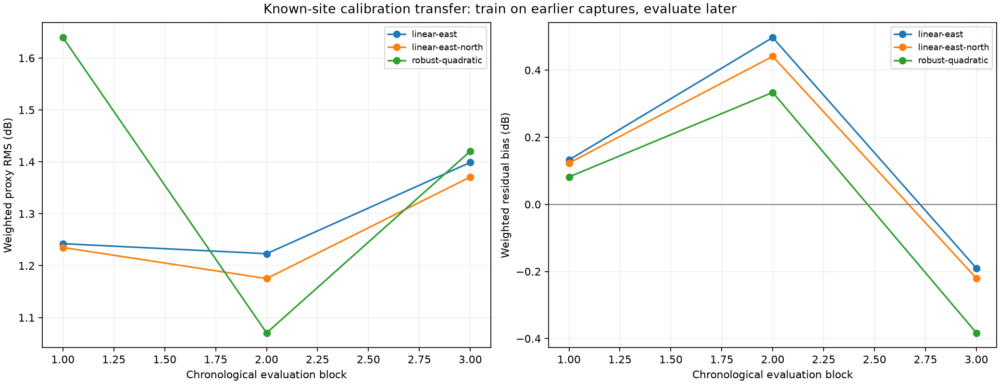

# Prospective dual-LNB calibration transfer

Chronological transfer measures whether an earlier known-site detector-response calibration predicts later captures. Catalogue directions and clear review leaders remain selection-conditioned; no coordinate error is used.

Aligned diagnostic: ENU directions use a response-excluded, fixed-known-site linearized ridge Doppler profile. This lean approximation is research-only, not the validated production nuisance profiler or a deployable calibration.

The forward-transfer east+north model has 1.264 dB weighted RMS. Session means account descriptively for 23.0% of residual variation, versus 45.7% for satellite grouping. The latter is confounded by which satellites occur in which sessions. Session drift is material but does not dominate the residual variance in this diagnostic. The robust quadratic surface does not improve consistently across future blocks.

Calibration is fit only on capture blocks preceding the evaluation block. No receiver coordinate error is read or used for tuning.

| Model | OOF weighted RMS | OOF bias | Session-bias RMS | Satellite-bias RMS | Session residual fraction | Satellite residual fraction |
|---|---:|---:|---:|---:|---:|---:|
| linear-east | 1.291 dB | +0.142 dB | 0.634 dB | 0.934 dB | 23.6% | 47.7% |
| linear-east-north | 1.264 dB | +0.111 dB | 0.560 dB | 0.895 dB | 23.0% | 45.7% |
| robust-quadratic | 1.403 dB | +0.008 dB | 0.566 dB | 1.100 dB | 26.8% | 56.2% |

The session-cluster bootstrap preserves all within-session correlation. Its effective point count describes uncertainty of the mean residual, not independent RF observations or calibrated position accuracy.

## Chronological folds

| Evaluation block | Training sessions | Evaluation sessions | Supported points | Model | RMS | Bias |
|---:|---:|---:|---:|---|---:|---:|
| 1 | 14 | 14 | 712 / 770 | linear-east | 1.242 dB | +0.133 dB |
| 1 | 14 | 14 | 712 / 770 | linear-east-north | 1.235 dB | +0.123 dB |
| 1 | 14 | 14 | 712 / 770 | robust-quadratic | 1.639 dB | +0.082 dB |
| 2 | 28 | 14 | 804 / 804 | linear-east | 1.223 dB | +0.497 dB |
| 2 | 28 | 14 | 804 / 804 | linear-east-north | 1.175 dB | +0.441 dB |
| 2 | 28 | 14 | 804 / 804 | robust-quadratic | 1.070 dB | +0.334 dB |
| 3 | 42 | 13 | 602 / 602 | linear-east | 1.399 dB | -0.190 dB |
| 3 | 42 | 13 | 602 / 602 | linear-east-north | 1.371 dB | -0.220 dB |
| 3 | 42 | 13 | 602 / 602 | robust-quadratic | 1.420 dB | -0.383 dB |

Detailed coefficients, bootstrap intervals, and the largest held-out session and satellite biases are retained in `calibration-results.json`.
