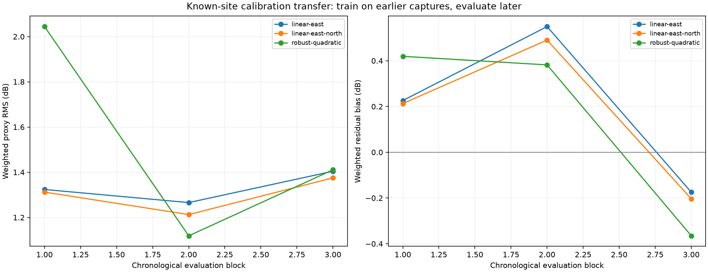

# Prospective dual-LNB calibration transfer

Chronological transfer measures whether an earlier known-site detector-response calibration predicts later captures. Catalogue directions and clear review leaders remain selection-conditioned; no coordinate error is used.

Diagnostic only: ENU directions use nominal SGP4. Prior phase-aligned analysis bounds the resulting response change at 0.9423594747601007 dB / 0.8016891399544641 residual sigma; this is not a deployable phase-consistent calibration.

The forward-transfer east+north model has 1.303 dB weighted RMS. Session means account descriptively for 24.2% of residual variation, versus 48.5% for satellite grouping. The latter is confounded by which satellites occur in which sessions. Session drift is material but does not dominate the residual variance in this diagnostic. The robust quadratic surface does not improve consistently across future blocks.

Calibration is fit only on capture blocks preceding the evaluation block. No receiver coordinate error is read or used for tuning.

| Model | OOF weighted RMS | OOF bias | Session-bias RMS | Satellite-bias RMS | Session residual fraction | Satellite residual fraction |
|---|---:|---:|---:|---:|---:|---:|
| linear-east | 1.333 dB | +0.196 dB | 0.669 dB | 0.990 dB | 24.9% | 50.5% |
| linear-east-north | 1.303 dB | +0.163 dB | 0.595 dB | 0.948 dB | 24.2% | 48.5% |
| robust-quadratic | 1.584 dB | +0.146 dB | 0.740 dB | 1.325 dB | 31.8% | 63.7% |

The session-cluster bootstrap preserves all within-session correlation. Its effective point count describes uncertainty of the mean residual, not independent RF observations or calibrated position accuracy.

## Chronological folds

| Evaluation block | Training sessions | Evaluation sessions | Supported points | Model | RMS | Bias |
|---:|---:|---:|---:|---|---:|---:|
| 1 | 14 | 14 | 712 / 770 | linear-east | 1.324 dB | +0.226 dB |
| 1 | 14 | 14 | 712 / 770 | linear-east-north | 1.312 dB | +0.213 dB |
| 1 | 14 | 14 | 712 / 770 | robust-quadratic | 2.044 dB | +0.419 dB |
| 2 | 28 | 14 | 804 / 804 | linear-east | 1.266 dB | +0.549 dB |
| 2 | 28 | 14 | 804 / 804 | linear-east-north | 1.213 dB | +0.490 dB |
| 2 | 28 | 14 | 804 / 804 | robust-quadratic | 1.119 dB | +0.382 dB |
| 3 | 42 | 13 | 602 / 602 | linear-east | 1.404 dB | -0.175 dB |
| 3 | 42 | 13 | 602 / 602 | linear-east-north | 1.375 dB | -0.203 dB |
| 3 | 42 | 13 | 602 / 602 | robust-quadratic | 1.411 dB | -0.365 dB |

Detailed coefficients, bootstrap intervals, and the largest held-out session and satellite biases are retained in `calibration-results.json`.
