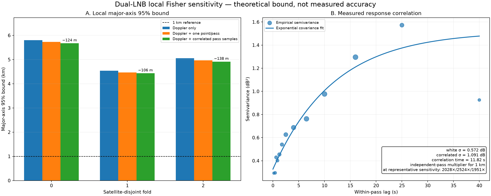

# Dual-LNB local information sensitivity

**This is a theoretical, known-site local Fisher bound, not measured position accuracy or a sub-kilometre result.** It conditions on fixed reviewed candidate identities and linearizes at the calibration site.

The response adds only a small amount of local information to Doppler. Under the representative sensitivity point—5% slope, 3° heading, 0.25 dB lane-intercept, and 0.25 dB pass-level uncertainty—the combined major-axis 95% bound remains 4.44–5.68 km. Those uncertainty values are sensitivity assumptions, not measured calibration truth.

| Fold | Observations / representatives | Slope | Doppler major 95% | Combined major 95% | Reduction | Independent-pass multiplier for 1 km |
|---:|---:|---:|---:|---:|---:|---:|
| 0 | 972 / 35 | 17.19 dB/cosine | 5.800 km | 5.676 km | 124 m (2.1%) | 2028× |
| 1 | 961 / 31 | 17.54 dB/cosine | 4.543 km | 4.436 km | 106 m (2.3%) | 2524× |
| 2 | 1049 / 39 | 16.78 dB/cosine | 5.056 km | 4.917 km | 138 m (2.7%) | 1951× |

## What sets the bound

The empirical response model has white scatter 0.572 dB, correlated scatter 1.091 dB, and an 11.82 s correlation time. Treating all within-pass points as independent would therefore overstate information. Using all correlated samples improves the combined major-axis bound by only 34–54 m beyond one representative per pass at the same calibration assumptions.

Allowing an unknown offset for every pass removes nearly all absolute-angle information: beam-only major-axis bounds become 812–1,244 km. Allowing pass offset and drift expands them to 1,684–2,215 km. Absolute response levels retain some local information, but the current geometry and pass count remain far from a sub-kilometre bound.

The within-pass response cross-validation is demeaned and therefore demonstrates directional shape, not prospective absolute calibration. Baseline RMS values 1.552/1.582/1.601 dB fall to 0.863/0.954/0.838 dB with east direction cosine.

## Limitations

- The calculation uses a known calibration site and fixed, selection-conditioned review leaders; it does not validate identities or blind/global localization.
- Only captures with paired dual detections and clear reviews enter the response model.
- The covariance is estimated from this same short corpus and is not an independent-day noise calibration.
- Phase rates use a response-excluded, fixed-site linearized ridge Doppler profile rather than the production robust IRLS profiler.
- Beam geometry is conditionally Doppler-profiled; beam evidence does not jointly refit phase nuisances.
- Local Fisher bounds describe random-error curvature. They exclude orbit, identity, calibration and selection bias and must not be reported as achieved accuracy.

The complete matrices and sensitivity grid are retained in [information.json.gz](information.json.gz); the readable values above are in [information-summary.json](information-summary.json).
