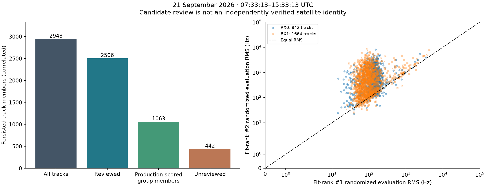
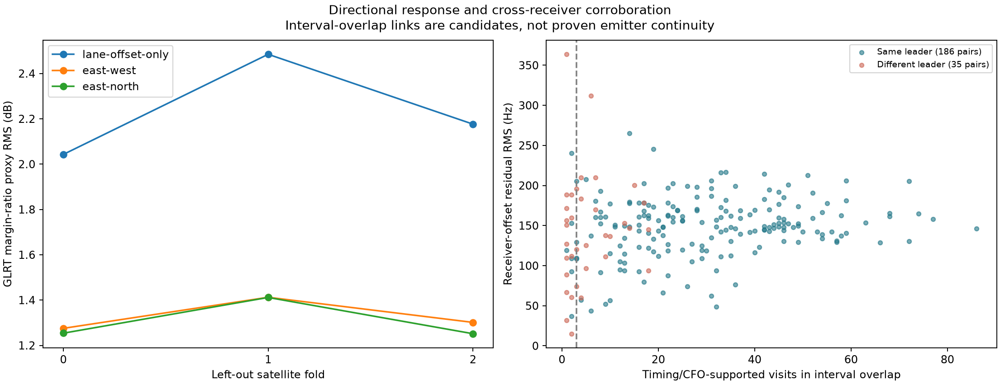
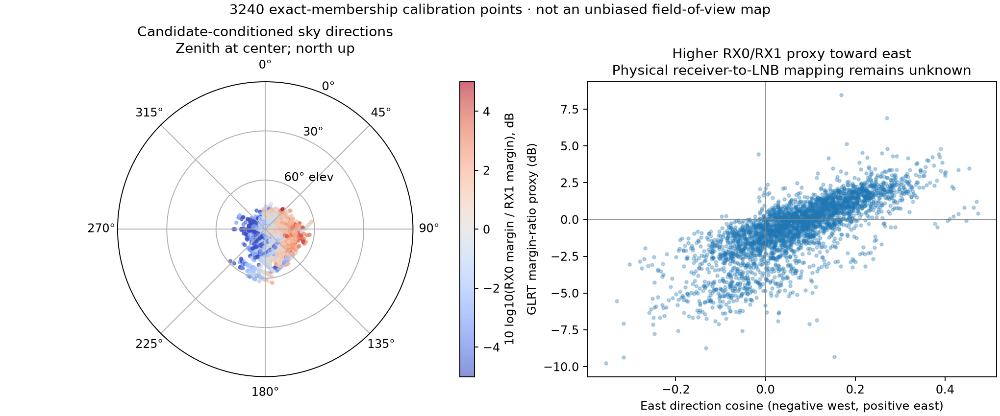
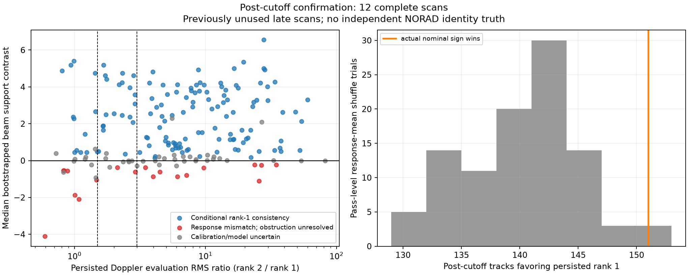
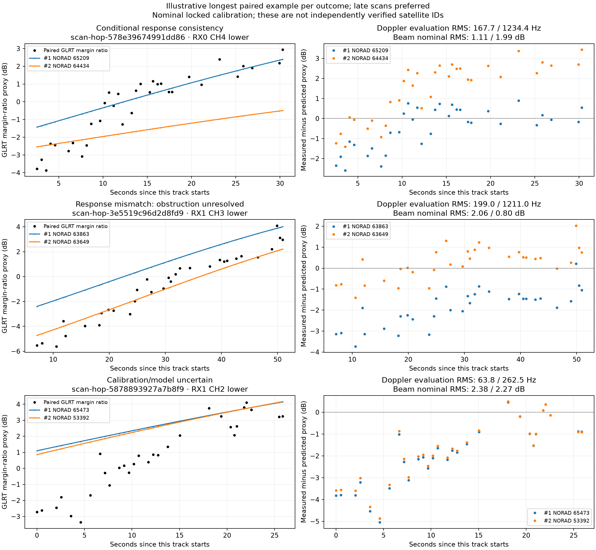

# Eight-hour dual-LNB satellite-identification audit

## Scope and finding

**Obstruction clarification:** geometric visibility does not establish an unobstructed
radio path. All beam comparisons in this report are conditional on an incomplete
response model. The previously named “contradictions” are **response-model mismatches**,
not evidence by themselves against Starlink classification or a satellite identity.
The 19 late-scan mismatches must not be interpreted as 19 incorrect IDs.
The obstruction clarification updates the research policy, plot labels and every
per-track JSON/CSV record; numerical scores and cohort counts are unchanged. It
does not claim that an obstruction map has been estimated from these data.

This report covers scanner documents whose `created_utc_ns` lies in the half-open interval
**2026-09-21 07:33:13 UTC through 15:33:13 UTC**, or
`[1789975993000000000, 1790004793000000000)`. The membership ledger contains 77 scans.
Seventy-five have complete tracking products; two are present but still have
`tracking_state=pending` and `tracking=null`.

All 77 scans declare **2.5 MS/s**, with LT3D-001A geometry; this is not the older
10/15/20 MS/s single-receiver corpus. Window membership is unchanged if acquisition
time replaces document creation: first-sample estimates range from 07:36:16.603957
to 15:18:18.263592 UTC, and the last terminal timestamp is 15:23:19.878885 UTC.
No capture straddles either boundary. The 75 complete source payloads contain
353,828 probes, equally divided between RX0 and RX1, covering channels 1–4 and both
sidebands on each receiver. The two pending documents lack source payloads, so
their probe topology cannot be checked. This is a frozen, sequential export—not
a claim about their current production state.

The complete products contain 2,948 receiver-local tracklets. Retrospective per-track TLE
review covers all 2,506 tracklets that satisfy the persisted 14-observation and seven-second
review rule. Under the study's additional clear-leader rule—leader evaluation RMS at most
150 Hz and runner evaluation RMS at least three times larger—1,180 tracks pass, spanning 629
distinct leading catalogue numbers. These are strong **conditional catalogue
classifications**, not verified satellite identities. Every persisted product says
`candidate_only=true` and `identity_claimed=false`.

Production scoring and retrospective review answer different questions. Production attempted
300 of 7,852 eligible physical groups under the configured bounded work budget: 251 groups
were non-abstaining and 49 abstained. Those groups contain 1,063 tracklets (916 non-abstaining
members and 147 abstaining members). The other 7,552 eligible groups were deferred. Of the
9,363 physical groups in the window, 1,511 did not meet production eligibility. A production
group score therefore must not be counted once per member tracklet.
Group counts include alternative hypotheses, not independent satellite passes.
The 300 attempted session-scoped groups are four per complete scan, all from
hypothesis rank 1. The larger eligible-group total includes alternative hypotheses
that reuse observations and tracklets.

There is also a material site-provenance split. The persisted Doppler products were scored at
their configured observer site, 37.858988° N, 122.478103° W, altitude -29 m. The beam-geometry
audit uses the user-site coordinate, 37.84903264307456° N, 122.4856541910174° W, about 1.290 km
away. This report retains the persisted Doppler classifications; it does not silently
re-associate them at the user site. The directional proxy uses the user-site directions. Until
the Doppler baseline is rerun at that same coordinate, score differences cannot be attributed
to antenna response alone.

## Evidence layers

**Starlink signal classification is separate from identifying a NORAD object.** The
archived GLRT pilot evidence and Doppler paths are the signal evidence used here.
This audit does not add a new independent PSS classification test or decode an
on-air satellite identifier. Matching a Starlink-only catalogue cannot itself prove
that a detection is Starlink. Conversely, strong Starlink waveform evidence does
not choose between two plausible Starlink orbital hypotheses. Dual-LNB geometry
can test relative directional consistency of those hypotheses, conditional on the
signal and catalogue assumptions.

The track reconstruction is TLE-blind and receiver-local. Each track records its lane, receiver,
time support, observation count, local linear residual, and exact persisted ID. The all-track
ledger then joins three distinct evidence layers without changing their meanings:

1. **Production candidate score.** This is a bounded physical-group comparison with held-out,
   radio-null, and wrong-time diagnostics. It may abstain. Its negative-log scores are relative
   diagnostics under the configured candidate set; they are not identity probabilities.
2. **Retrospective top-two review.** This fits catalogue hypotheses to each structurally eligible
   track and reports randomized evaluation RMS. The 150 Hz/three-times rule is a research
   summary added by this audit, not a published identity contract.
3. **Cross-receiver continuity.** Timing and corrected-CFO agreement can support that two
   receiver-local paths follow one signal through an overlap or handoff. Agreement between
   their conditional TLE leaders corroborates a classification, but does not supply independent
   satellite ground truth.

The median reviewed-track leader evaluation RMS is 102.79 Hz and the median runner-to-leader
RMS ratio is 3.83. In total, 1,918 leaders meet the 150 Hz bound, 1,416 reviews meet the
three-times separation bound, and 1,180 meet both. Among the 987 reviewed tracklets that are
members of a production-scored group, the production leading catalogue number equals the
retrospective review leader for 663 and differs for 324. That disagreement is material: neither
selection may be silently substituted for the other.



## Geometry and response semantics

All 75 complete documents carry the same station-geometry revision. The fixture has nominal
mount-reference positions at x = -0.04 m and +0.04 m and nominal mechanical axes tilted by
10 degrees in opposite local-x directions. The contract leaves `rf_phase_center_position_m`
and `rf_boresight_unit` null. The 8 cm mount-reference spacing is therefore not a measured RF
phase-centre baseline, and the mechanical axes are not measured RF boresights. Tilt uncertainty
is not quantified. Receiver-to-slot assignments are explicitly provisional and based on
receiver order because the physical left/right cable trace was not recorded.

The preliminary interval-based geometry audit contains 3,292 paired proxy points and
321 same-lane near-path links. The stricter exact-membership comparison below supersedes
that selection for candidate-confidence conclusions.
Its response is `10 log10(margin0 / margin1)`, formed from GLRT margins. It is neither calibrated
received power nor a calibrated antenna-pattern ratio. A useful conceptual analogue is
amplitude-comparison monopulse, where channel-response differences become angular information
only through a characterized and calibrated response model. The JPL calibration discussion is
context for that principle; it does not calibrate this fixture or these GLRT margins
([JPL, *Ka-Band Monopulse Antenna Pointing Calibration Using Wideband Radio Sources*](https://tmo.jpl.nasa.gov/progress_report/42-182/182A.pdf)).

In that preliminary selection, cross-NORAD three-fold evaluation gives pooled proxy RMS
values of 2.225 dB for lane offsets
alone, 1.326 dB after adding east cosine, and 1.302 dB after adding east and north cosines. This
shows repeatable site-conditioned directional structure in the proxy. It does not determine
the true boresights, phase centres, receiver mapping, or an absolute angle-error scale. The two
receiver margins share the emitter, propagation path, timing, candidate construction, and
parts of the receiver chain, so treating them as independent measurements would understate
uncertainty.

Across the 75 auditable scans, receiver matching produced 20,677 unique paired detections.
The visit-parity split left 10,204 odd-visit evaluation pairs, and the median per-scan held-out
receiver-offset RMS was 168.204 Hz. Summed across scans, the two prespecified shifted-time nulls
produced one and zero pairs, respectively. This supports the timing match as a useful
association diagnostic; it does not validate the later interval-to-track assignment described
below.

Earlier or later detection on one receiver reflects the combined beam visibility, detection
threshold, gain and sensitivity, and adaptive visit schedule. Detection absence is conditional
on those factors and does not mean that the signal was physically outside a hard beam edge.
The nominal 0.08 m mount-reference spacing corresponds to only about 0.267 ns of free-space
delay, far below the 400 ns sample period at 2.5 MS/s. This study contains no measured TDOA
localization. A roughly east-west mechanical baseline also does not establish RF boresight
orientation; the opposite 10-degree tilts are nominal mount axes only. Because the response
calibration uses the known site, it cannot demonstrate blind receiver localization.

TLE catalogue numbers label orbital hypotheses propagated with SGP4. They are not emitter
ground truth; interpreting the fields and propagation model follows the public GP/SGP4 model
described by CelesTrak ([CelesTrak SGP4/GP data model](https://www.celestrak.org/software/tutorials/sgp4.php)).





The sky plot uses clear dual-receiver matches only. It describes the directions of that
selected sample, not an unbiased beam boundary or sky-completeness measurement. Empty regions
can arise from scan scheduling, no suitable satellite illumination, detector thresholds, or
candidate-review selection. A physical beam map requires modeling those exposure conditions.

## Cross-receiver continuity

The continuity inventory starts with all 321 same-lane RX0/RX1 review-path pairs whose review
intervals overlap or are separated by no more than four seconds. It reports 197 pairs with the
same conditional review leader and 124 with different leaders. Timing/CFO checks mark 200 as
continuity-supported diagnostic candidates: 180 same-leader pairs and 20 different-leader
pairs. It also finds 183 supported pairs where RX1 extends beyond the RX0 review interval.

These 200 links remain diagnostic candidates. The current near-pair construction assigns
matched detections to a track by lane and containing review interval; overlapping unrelated
tracks can therefore receive the same detection. Exact reconstructed candidate-ID membership
must close before any link is used as a same-emitter fact. In particular, the 20 supported
different-leader pairs do not establish that two catalogue classifications came from one
emitter.

Geometry coverage is independent of continuity: 132 candidate pairs have geometry proxy
points, while 65 same-leader pairs lack geometry coverage. Geometry never gates the continuity
decision. This separation prevents known-site geometry from manufacturing an identity link.

## Missingness, abstentions, and exclusions

### Obstructions and actual visibility

This dataset has no measured obstruction map for either LNB. A satellite can be above
the geometric horizon and inside a nominal antenna beam while buildings, vegetation,
fixture hardware or another object attenuate or block its path. **Geometric visibility,
unobstructed visibility and successful detection are three different conditions.**
Unknown obstruction status is not equivalent to a clear line of sight.

For calibrated received power, a useful conceptual model is
`P_rx,dB = transmitted/path power + antenna gain + receiver gain - obstruction loss`.
Each receiver's obstruction loss is nonnegative but unknown and varies with sky
direction and possibly time. The RX0-minus-RX1 ratio contains the difference of those
losses, which may have either sign. A common obstruction can hide both receivers
while approximately cancelling in their power ratio; a differential obstruction can
favor either receiver and mimic a different pointing direction or candidate orbit.
Our observable is a nonlinear GLRT-margin ratio, so this power-domain expression
must not be applied as a calibrated numerical correction to the current proxy.

The current empirical calibration does not fit or marginalize those obstruction
losses. Stable local obstructions can be absorbed into its coefficients; changing
obstructions can defeat transfer. Bootstrapping calibration passes and adding an up
component do not bound this missing systematic effect. The published bootstrap
ranges therefore exclude unmodeled obstruction uncertainty and are not full physical
confidence intervals. Even positive response agreement remains conditional because
a local attenuation pattern could help one candidate accidentally match the model.

Consequently, a missing detection or response mismatch alone must **not** reject a
Starlink classification, reject a NORAD candidate, force a receiver handoff, or split
an otherwise supported Doppler trajectory. Absence is censored detection evidence,
not zero received power. The current research output explicitly marks unobstructed
visibility as unknown and disallows identity rejection on these two grounds. Its
legacy `contradicts-rank-1` field is retained as a response-model diagnostic only;
updated plot labels say “Response mismatch; obstruction unresolved.”

Receiver comparisons require particular care: earlier/later visibility may result
from blockage rather than the east-west tilt, and shared blockage correlates both
receivers. Successful time/CFO matches remain useful positive path-link evidence;
failure to obtain a match does not establish different emitters. A beam-derived
direction or velocity must not be inferred solely from detection onset/cessation.

An obstruction-aware extension should separate per-receiver visibility/attenuation
states from the geometric antenna response, allow shared and differential blockage,
and include the scan exposure, gain and detection threshold in any non-detection
likelihood. Fit an obstruction map only from independently supported repeated paths
or surveyed information, reserving whole passes/sessions for validation; do not let
each candidate invent arbitrary attenuation to improve its fit. Where visibility
is unconstrained, marginalize or abstain from directional inference rather than
apply a negative identity penalty. No obstruction map or correction has been
invented for this report, and no measured identity gain is claimed from one.

The exhaustive accounting is:

| Item | Count |
|---|---:|
| Window-member scan documents | 77 |
| Complete tracking products | 75 |
| Pending tracking products | 2 |
| Receiver-local tracklets | 2,948 |
| Structurally review-eligible and reviewed tracklets | 2,506 |
| Unreviewed tracklets | 442 |
| Physical groups | 9,363 |
| Production-eligible physical groups | 7,852 |
| Production-attempted groups | 300 |
| Production-deferred eligible groups | 7,552 |
| Non-abstaining production groups | 251 |
| Abstaining production groups | 49 |
| Clear retrospective review tracks | 1,180 |

The two pending sessions are `scan-hop-2f9cad50172a9d0a` and
`scan-hop-85b4b2d44c326a72`; both report that adaptive metrics are incomplete. No complete scan
reports a catalogue-labelled-debris exclusion or an SGP4 propagation exclusion. This zero is
an observed result for this window, not evidence that such exclusions cannot occur. The ledger
preserves the per-track exclusion counts and all production abstention reasons.

## Confidence model and promotion criteria

Calibration/confirmation separation is anchored at **13:56:54 UTC**, the cutoff
of the earlier geometry investigation. Fourteen scans start after that cutoff;
12 have complete tracking and two are pending. Earlier overlapping data are
descriptive/calibration data, not new validation. Whole scan sessions stay on one
side of this split. This is a check of installation-calibration transfer; the
TLE residuals themselves retain their randomized evaluation split.

The added observable is a conditional direction check. For a paired visit define
`r = 10 log10(margin_RX0 / margin_RX1)`. The primary calibration predicts
`r_hat = lane_offset + b_E * direction_E + b_N * direction_N`.
The direction is supplied by each candidate's causal orbital elements and the
stated receiver location. A three-component response vector is a sensitivity
check, not a measurement of mechanical tilt. The best and runner-up TLEs remain
ranked by their persisted fitting evidence; beam evaluation does not secretly
reselect the Doppler evaluation winner.

Whole `(session, NORAD)` calibration passes are resampled across channels. A
normalized Student-t mean score prevents a long track from accumulating arbitrarily
large apparent evidence merely through repeated correlated response points. A
positive rank-1-minus-rank-2 support contrast favors the persisted Doppler leader;
a negative contrast favors the runner-up. Its magnitude is **not log odds**.
The 5–95% calibration-bootstrap spread is a sensitivity range, not a satellite
identity confidence interval. Sign stability across the horizontal and
three-component model families is the corroboration/contradiction diagnostic.

Response-level controls shuffle whole-pass means within RF lane and one-hour
blocks, retaining centered within-pass structure. They test whether pass response
levels convey information beyond local observing conditions; they do not remove
every possible directional correlation. Track-level and shared-pass counts are
both reported. These late scans were recorded before the protocol was implemented:
the check is post-cutoff confirmation, not a prospective identity-validation study.

There are three useful outcomes: conditional response consistency with the Doppler leader,
response mismatch favoring its runner-up with obstruction unresolved, or an inability to distinguish
the two. Report that outcome alongside Doppler RMS rather than translating it
into an uncalibrated percentage probability. Repeated samples within a pass,
simultaneous receivers, and channels observing the same satellite are correlated.
A normalized pass-level robust residual contrast is a descriptive diagnostic,
not a likelihood ratio to multiply by the existing Doppler score.

For eventual model integration, retain alternate satellite hypotheses when beam
and Doppler evidence disagree. Use one shared geometry factor for the linked
physical path, global installation/calibration nuisance parameters, and explicit
receiver-offset uncertainty. Joining paths should first extend genuine time
support; it must not count overlapping receiver detections twice. Antenna response
must be evaluated using the same orbit correction and site as the Doppler model.
Before promotion, compare the joint model against the same data without geometry,
pass-level shuffled controls, and excluded satellite/session groups. Report
identity rank changes and localization error separately.

**This report does not change production identity gates or claim improved blind
position accuracy.** It extends the research evidence and tests whether such a
change is justified. See the companion
[geometry positioning investigation](2026_09_21_dual_lnb_geometry_followup.md)
for the separate positioning experiments and their limitations.

## Exact-membership results

The final extraction reconstructs each scan and requires its complete track-ID set to equal
the persisted product. Receiver detections join through projected candidate IDs, not merely
through a containing time interval. It retains all 2,948 tracklets. Of 20,677 timing/CFO-matched
receiver pairs, 11,492 lack membership in a reconstructed track on at least one side and three
have ambiguous multiple-track membership. The remaining **9,182 unique pairs** contribute
18,364 track references because each pair appears on both participating receivers; that is
not 18,364 independent measurements. In total, 1,428 tracks have at least one exact pair.

For calibration, both receivers must have clear, agreeing candidate leaders, with a causal
catalogue snapshot and element epoch preceding capture. Each side's fitted leader residual
must be within 500 Hz at the paired observation; five otherwise eligible pairs fail that
check. The final calibration set has 3,240 unique pair IDs. Freezing calibration before
13:56:54 UTC leaves **2,803 points in 137 session/satellite blocks**, covering all eight
channel/sideband lanes. The preliminary 3,292 interval-selected points are not used in this
final scoring model.

Exact pairing finds 731 receiver-track pairs across the broader reviewed/unreviewed corpus:
540 have agreeing review leaders, 47 have different leaders, and 144 have an unreviewed side.
Requiring at least three distinct matched visits gives 520, 42 and 120 respectively. These
are shared-signal continuity candidates with exact detection provenance, not independent
NORAD confirmations. In particular, the 42 repeatedly paired paths with differing leaders
show why linking receivers cannot simply inherit either receiver's top ID. Their full top-two
IDs and RMS values are in [the exact continuity ledger](2026_09_21_dual_lnb_identification_eight_hours/exact_continuity.json).

### Added support versus baseline

| Geometry outcome | Entire window, descriptive | Post-cutoff scans, confirmation |
|---|---:|---:|
| All persisted tracks | 2,948 | 527 |
| Enough exact paired evidence to score | 1,216 | 195 |
| Calibration-stable corroboration of rank 1 | 859 | 135 |
| Calibration-stable response mismatch favoring rank 2; obstruction unresolved | 91 | 19 |
| Calibration/model orientation uncertain | 266 | 41 |
| Unsupported | 1,732 | 332 |

Unsupported tracks comprise 442 without two reviewed candidates and 1,290 with fewer than
three exact paired points. The late subset has 79 and 253 respectively. Unsupported is not a
negative satellite association. No track is removed from the appendix because of its outcome.

At the nominal calibration, rank 1 has better beam support on 1,015/1,216 scoreable tracks
(83.5%) across the whole window, and 151/195 (77.4%) in the late subset. These are agreement
rates with the existing Doppler ranking, **not measured identification accuracy**. The stricter
bootstrap-stable counts above are smaller because calibration/model uncertainty matters.

Collapsing shared `(session, rank-1 NORAD)` keys produces 505 scoreable keys over the full
window and 77 in the late subset. Late stable outcomes are 43 corroborating keys, seven
contradicting, 11 uncertain and 16 with mixed outcomes among their correlated tracks.
There are also 199 wholly unsupported late keys. A key is a grouping proxy—not a proven
physical pass—and unreviewed tracks have separate unsupported keys. Its purpose is to expose
correlation rather than claim an exact count of independent satellites.

All 195 scoreable late tracks have leading NORAD numbers absent from the calibration set.
The late result therefore transfers to previously unseen candidate satellites, conditional on
the existing Doppler labels. It is not merely re-measuring the same satellite labels used to
calibrate the response.

| Late Doppler runner/leader evaluation RMS ratio | Scored tracks | Conditional consistency | Response mismatch | Uncertain |
|---|---:|---:|---:|---:|
| Below 1.5, weak or reversed | 29 | 13 | 7 | 9 |
| 1.5 to below 3 | 30 | 20 | 2 | 8 |
| At least 3 | 136 | 102 | 10 | 24 |

The last row only measures **relative separation**, not a low absolute leader RMS. It must
not be confused with the earlier clear-calibration rule, which also requires RMS ≤150 Hz.
The geometry evidence is sometimes useful in ambiguous cases, but it does not reliably
resolve every ambiguity, and it can contradict even strongly separated Doppler matches.

### Controls and uncertainty

| Nominal support comparison | Actual rank-1-favored tracks | 100 shuffled controls: min / median / max |
|---|---:|---:|
| Entire window | 1,015 / 1,216 | 834 / 873 / 905 |
| Post-cutoff subset | 151 / 195 | 129 / 140.5 / 153 |

In the late subset, two of 100 shuffled trials meet or exceed the observed track-level
count. At the shared-key level, the actual 51 exclusively rank-1-favoring keys compare with
40/46/51 under the shuffles; four of 100 trials meet or exceed 51. Plus-one upper-tail
fractions are 3/101 and 5/101, respectively. These are descriptive permutation diagnostics
under this restricted shuffle—not calibrated false-identification probabilities or a
prospectively specified significance claim. The whole-window result is more dramatic but
includes calibration data and must not be presented as independent confirmation.

The empirical horizontal response heading has a bootstrap 5th/median/95th range of
82.2°/90.1°/94.6° clockwise from north, consistent with an east-west response gradient.
The three-component model's up-component angle spans −46.7°/−26.5°/+12.5°. That broad,
model-dependent range does **not** estimate the nominal ten-degree mechanical tilt.
Unknown receiver gain and beam separation are absorbed into the response coefficients;
swapping physical cable labels changes their interpretation without independently measuring
the mapping. Boresight, gain pattern, actual tilt and phase centers remain uncalibrated.



[Full-window descriptive control plot](2026_09_21_dual_lnb_identification_eight_hours/candidate-controls.png)
and [complete scoring JSON](2026_09_21_dual_lnb_identification_eight_hours/geometry_scores.json.gz)
retain the early data and all outcomes.

### Examples and counterexamples

These illustrations select the longest paired example in each outcome category, preferring
late scans. They are deliberate explanatory examples, not a random sample. The complete
track IDs and selection output are in [examples.json](2026_09_21_dual_lnb_identification_eight_hours/examples.json).

| Session suffix / track lane | Rank 1 / rank 2 NORAD | Doppler evaluation RMS, Hz | Beam proxy RMS, dB | Outcome |
|---|---|---|---|---|
| `578e39674991dd86`, RX0 CH4 lower | 65209 / 64434 | 167.7 / 1,234.4 | 1.11 / 1.99 | Corroboration |
| `3e5519c96d2d8fd9`, RX1 CH3 lower | 63863 / 63649 | 199.0 / 1,211.0 | 2.06 / 0.80 | Response mismatch; obstruction unresolved |
| `5878893927a7b8f9`, RX1 CH2 lower | 65473 / 53392 | 63.8 / 262.5 | 2.38 / 2.27 | Uncertain |



An especially important counterexample is `scan-hop-b89bc4be5e52c033`: the review favors
NORAD 69156 over 57981 with **32.43 versus 830.93 Hz** evaluation RMS, yet nine paired
observations yield a stable beam contradiction. Another track in that scan favors 63510
over 69136 at **54.64 versus 391.70 Hz**, while its three paired observations also contradict
the leader. A beam-only override would therefore discard apparently excellent Doppler fits.
Possible explanations include unmodeled common/differential obstructions,
response calibration bias, beam-pattern mismatch, correlated
fading, orbit/site error or a wrong candidate; these data do not isolate one as the cause.

Conversely, in `scan-hop-6ca90c84541ebe31`, NORAD 66498 versus 56334 has evaluation RMS
600.77 versus 593.12 Hz—rank 1 is slightly worse on evaluation—while four paired observations
strongly favor rank 1 in the response model. This is an investigable alternative hypothesis,
not proof that geometry has corrected the Doppler identity.

## What this supports, and what remains unresolved

The two tilted receivers provide useful **conditional identity corroboration** and exact
cross-receiver links. The late transfer result is better than typical shuffled response
levels and includes satellites absent from calibration. The supported change is an added,
auditable evidence field—not a quantified increase in true identification accuracy.

Alongside explicitly representing unknown obstruction/visibility, the next experiment
is to re-evaluate both candidates using the user-site
coordinate consistently, then compare nominal orbital directions with directions under the
same fitted timing/orbit correction used for Doppler. This report's beam directions use
nominal causal orbits; persisted Doppler reviews have fitted time offsets, so that sensitivity
is not yet isolated. Next, use exact links to fit receiver offsets jointly and extend genuine
observation support while preserving shared calibration covariance. Finally, calibrate beam
response and physical receiver mapping independently, with explicit exposure and detection
probabilities before using non-detections or handoff order as additional evidence.

No independent on-air satellite IDs, measured antenna patterns, or calibrated phase-difference
observations are available in this audit. The known-site calibration is useful for studying
identity consistency but cannot prove improved blind localization or generalization to a new
installation. These limitations, the contradictory examples, the 58.8% full-window unsupported
fraction and mixed shared-pass results prohibit replacing the existing association logic with
a hard geometry gate.

## Reproducible artifacts

The [artifact manifest](2026_09_21_dual_lnb_identification_eight_hours/manifest.json)
records SHA-256 digests and sizes for every figure and data appendix. The following
additional artifacts close the final confidence comparison:

- [Capture inventory](2026_09_21_dual_lnb_identification_eight_hours/capture_inventory.json):
  all 77 session IDs and frozen analysis states.
- [Exact pairs and candidate directions](2026_09_21_dual_lnb_identification_eight_hours/exact_pairs.json.gz):
  all 2,948 track rows, aligned top-two ENU directions, paired responses, shared
  membership IDs, and per-scan exclusion accounting. This input permits scoring
  and plot reproduction without raw IQ or privileged TLE archive access.
- [Per-track geometry scores CSV](2026_09_21_dual_lnb_identification_eight_hours/all_track_geometry_scores.csv):
  all 2,948 track outcomes, candidate IDs, Doppler RMS and beam RMS where available.
  Join to `all_tracks.csv` by **both session ID and tracklet ID**.
- [Complete geometry scoring JSON](2026_09_21_dual_lnb_identification_eight_hours/geometry_scores.json.gz):
  calibration metadata, per-track bootstrap ranges, unsupported reasons, and all
  shuffled-control trials.
- [Exact cross-receiver link ledger](2026_09_21_dual_lnb_identification_eight_hours/exact_continuity.json):
  all 731 pair groups and each receiver's best/runner-up candidate evidence.

The raw read-only export contains 104 MB of archived analysis/source documents and
stays at `/tmp/lt3d-id-20260921T153313`; input digests are retained in the inventory
and continuity artifacts. It is not a new RF collection. A fresh production export
can have different pending/completed states, so use the frozen artifacts when
reproducing the published counts.

- [`identity_inventory.json.gz`](2026_09_21_dual_lnb_identification_eight_hours/identity_inventory.json.gz)
  is the exhaustive JSON ledger, including every reviewed and unreviewed track, top-two review
  candidates, production score state, abstentions, exclusions, and geometry contract.
  SHA-256: `f7f32cad9e46cb86ced5fa60d55f88ca1d59765622815df2a3a87098e4c361db`.
- [`all_tracks.csv`](2026_09_21_dual_lnb_identification_eight_hours/all_tracks.csv) is the flat
  2,948-row appendix. SHA-256:
  `e682a175f08a64a1ad2ebd0ff49ff494681594648ccf922fb9c5ae824c108f8e`.
- [`geometry_results.json.gz`](2026_09_21_dual_lnb_identification_eight_hours/geometry_results.json.gz)
  preserves the fresh paired-response audit. SHA-256:
  `2f2d8a34593863081b351653318a02db2e28c9e4a1530ab5a269224cb151c8ca`.
- [`continuity_results.json.gz`](2026_09_21_dual_lnb_identification_eight_hours/continuity_results.json.gz)
  preserves the full candidate-link ledger. SHA-256:
  `aa1b557c9a16c29dfb1746a9989d0a70be337d7d997b4b4af2b5039c8b75f5fa`.

The inventory and CSV were regenerated with:

```bash
.venv/bin/python tools/research_dual_lnb_identity_inventory.py \
  --input /tmp/lt3d-id-20260921T153313 \
  --inventory /tmp/lt3d-id-20260921T153313/inventory.json \
  --output /tmp/dual-lnb-identity-inventory-8h.json \
  --csv-output reports/2026_09_21_dual_lnb_identification_eight_hours/all_tracks.csv
```

The continuity audit and figures were generated with:

```bash
.venv/bin/python tools/research_dual_lnb_identity_continuity.py \
  --input /tmp/lt3d-id-20260921T153313 \
  --geometry /tmp/lt3d-id-audit/results.json \
  --output /tmp/lt3d-identity-continuity-20260921T153313/results.json \
  --window-start-utc-ns 1789975993000000000 \
  --window-end-utc-ns 1790004793000000000

.venv/bin/python tools/render_dual_lnb_identity_report.py \
  --inventory /tmp/dual-lnb-identity-inventory-8h.json \
  --audit /tmp/lt3d-id-audit/results.json \
  --continuity /tmp/lt3d-identity-continuity-20260921T153313/results.json \
  --exact /tmp/lt3d-identity-pairs-20260921T153313.json \
  --output reports/2026_09_21_dual_lnb_identification_eight_hours
```

Exact extraction requires read access to the captured causal TLE archive. It was
run using the existing read-only `sudo` access pattern. Four disjoint file shards
populated a per-session cache; the full-input aggregation below reused that cache.
The cache is an execution optimization, not a new application queue.

```bash
sudo -n env PYTHONPATH=src OPENBLAS_NUM_THREADS=1 OMP_NUM_THREADS=1 \
  .venv/bin/python tools/research_dual_lnb_identity_pairs.py \
  --input /tmp/lt3d-id-20260921T153313 \
  --geometry /tmp/lt3d-id-audit/results.json \
  --cache-dir /tmp/lt3d-identity-pairs-cache-v1 \
  --window-start-utc-ns 1789975993000000000 \
  --window-end-utc-ns 1790004793000000000 \
  --output /tmp/lt3d-identity-pairs-20260921T153313.json

.venv/bin/python tools/research_dual_lnb_identity_controls.py \
  --input /tmp/lt3d-identity-pairs-20260921T153313.json \
  --output-dir /tmp/lt3d-id-controls \
  --old-freeze-utc-ns 1789999014000000000 \
  --bootstrap-trials 100 --null-trials 100

.venv/bin/python tools/summarize_dual_lnb_identity_results.py \
  --pairs /tmp/lt3d-identity-pairs-20260921T153313.json \
  --scores /tmp/lt3d-id-controls/scoring.json \
  --output reports/2026_09_21_dual_lnb_identification_eight_hours

.venv/bin/python tools/render_dual_lnb_identity_examples.py \
  --input /tmp/lt3d-identity-pairs-20260921T153313.json \
  --results /tmp/lt3d-id-controls/scoring.json \
  --output reports/2026_09_21_dual_lnb_identification_eight_hours/examples.png
```

For a portable replay, decompress `exact_pairs.json.gz` into the path supplied to
`--input`; the controls tool needs only that file. Plot regeneration uses the
scoring output from the same replay. Tests cover calibration freeze and deterministic
bootstrap behavior, retention of unsupported tracks, normalized scoring, duplicate
pair exclusion and causal element-epoch rejection. Runtime checks verify reconstructed
track inventories, membership uniqueness, calibration admission and aligned candidate
directions. The combined focused geometry, fusion, covariance and identity test suite
passed **34 tests**; Ruff checks passed. No production scanner configuration or
association gate was changed for this report.
The subsequent obstruction-policy update passes all **five identity-controls tests**,
including a synthetic response mismatch and a missing-detection case that both
explicitly prohibit identity rejection. All 2,948 refreshed track records carry
the unknown-visibility policy; artifact hashes, PNGs, CSV counts and links were rechecked.
