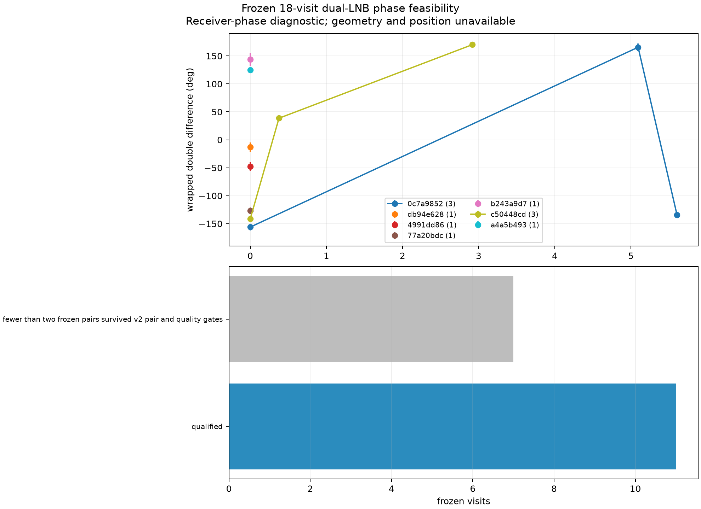

# Dual-LNB phase and timing feasibility for positioning

Date: 2026-09-21. Scope: read-only audit of the frozen 2.5 MS/s LT3D
recordings and existing phase and PSS implementations. No RF was collected and
no production product was written.

## Decision

The archive supports a **local, wrapped cross-receiver pilot phase** inside one
saved visit. It does not currently support a calibrated carrier phase, path
difference, differential time of arrival, or pseudorange that can be added to
the positioning fit. The missing information is calibration authority rather
than another phase estimator.

| Observable | Present evidence | Position use now |
| --- | --- | --- |
| Simultaneous RX1 times conjugate RX0 pilot phase | Measurable within a visit | No; wrapped, chain-contaminated, and not tied to surveyed RF phase centers |
| Cross-visit phase continuity | One historical 10-visit path reached 7.42 degrees RMS, but one-step rate propagation had 95.45 degrees median error | No reliable integer-cycle propagation through revisit gaps |
| Two-signal receiver-phase double difference | Existing implementation; sparse availability | Research diagnostic only; signal identity, phase centers, pose, group delay, and half-cycle branch remain unresolved |
| Differential TOA across the two LNBs | No calibrated product | Infeasible with this bandwidth and baseline |
| PSS frame phase | Candidate-only timing exists in wider-band archives | No absolute frame number, transmit epoch, group-delay calibration, or verified PSS identity |

The phase result should therefore remain separate from the GLRT margin and
Doppler likelihood. Treating it as another independent observation today would
count an uncalibrated quantity and could tighten the position estimate without
adding truthful position information.

## What is actually saved

The fresh eight-hour export contains 75 complete 2.5 MS/s scans. Their sealed
recordings retain raw `ci16_le` IQ in `sample_receiver_iq` order and bind the
analysis back to the raw recording digest. A representative complete session,
`scan-hop-01b11a5d776e7369`, contains 2,358 simultaneous dual-receiver visits,
5,659,200,000 uncompressed bytes, and one Pluto
(`radio_pluto_19f2`, serial `10400056f695001322002d0010ad1719f2`). Its 120 ms
visits can be replayed from the read-only archive.

The same capture record also states the present geometry limit:

* nominal fixture mount references are at -40 mm and +40 mm in fixture x;
* both RF phase-center positions and RF boresights are null;
* receiver-to-physical-LNB assignments are provisional and explicitly lack a
  cable trace;
* the fixture-to-ENU pose and differential RF-chain phase/group delay have no
  calibration authority.

The fresh first-sample UTC brackets are 0.904, 1.334, and 1.735 ms at the
minimum, median, and maximum. These are a major improvement over the older
roughly 0.2 s host brackets, but they remain timing metadata, not a calibrated
signal arrival time.

## Fresh local-phase canary

The checked-in V2 local extractor was run unchanged on the first 20 saved
lower-edge visits of `scan-hop-01b11a5d776e7369`. Pair selection used timing and
fractional GLRT margin, not phase. All 20 visits produced a wrapped local
`RX1 * conjugate(RX0)` pilot phase from ten shared frame indices.

| Diagnostic | Minimum | Median | Maximum |
| --- | ---: | ---: | ---: |
| Phase resultant | 0.883 | 0.971 | 0.987 |
| Approximate phase standard error | 2.89 degrees | 4.36 degrees | 9.04 degrees |
| Exact/control power-ratio floor | 9.49 | 22.53 | 56.59 |
| RX1-minus-RX0 relative frequency | -675.553 kHz | -675.437 kHz | -560.677 kHz |

The wrapped phases range broadly around the circle from visit to visit. One
relative-frequency result is also separated from the other 19 by about 115 kHz,
which is a warning about association or an alias branch. This canary establishes
local observability only. It selected the best phase-blind pair in each visit;
it did not establish a common emitter, carrier-cycle continuity, or geometry.

Scratch evidence:

* `/tmp/lt3d-current-local-phase.json`, SHA-256
  `8782de145580d097582dc3becafeb9ac3ad6aa66df92d37e23cbc5e263027a7c`;
* `/tmp/lt3d-current-local-phase.png`, SHA-256
  `5962cd333eb9ddfc461b91c88017db7a75d3db67b307660ad95889ca4ee4441e`.

The earlier saved-IQ positive control remains stronger evidence about the
implementation itself: all eleven frozen visits were recovered, with 9.51
degrees RMS agreement after accounting for orientation and the Qin pilot's
half-cycle ambiguity. The best historical progression had about 7 degrees
within-path residual RMS, but it could not propagate cycles reliably through
roughly one-second gaps. Synthetic tests already constrain the estimator's own
phase-reference error below a fraction of a degree. The dominant problem is
therefore observability and calibration, not the local correlation arithmetic.

## Why one Pluto does not provide geometric phase

The recording format preserves a common sample index for RX0 and RX1, which is
necessary and valuable. The two channels are also captured by the same Pluto.
The capture contract does not, however, attest a deterministic inter-channel
phase after tuning or a calibrated receiver-chain delay.

More decisively, the two consumer LNBs have separate 9.75 GHz local
oscillators. The approximately -675 kHz receiver-relative frequency in the
fresh canary means the raw cross-receiver phase rotates rapidly. An older
sequential dual-tone bench measurement found the two LNB LO estimates 612.777
kHz apart with roughly 96 Hz residual scatter. That bench result is compatible
with a large independent-LNB offset, but it is not a simultaneous calibration
of this fixture.

For two signals observed at the same instant, subtracting their receiver-phase
differences can cancel a phase nuisance common to both LNB paths. It does not
cancel frequency-dependent chain group delay, asynchronous frame support,
multipath, pair mistakes, or a transmitter/pilot phase that is not common under
the model. The existing V2 service already implements phase-blind pairing,
alias-distinct two-signal hypotheses, asynchronous propagation to a common
epoch, direct-common-frame accounting, uncertainty, and fail-closed geometry
availability. A new local phase estimator would duplicate that work without
closing the calibration gap.

## Numerical scale

At 11.2 GHz the wavelength is approximately 26.8 mm. The nominal 80 mm mount
separation is about 2.99 wavelengths, so its geometric phase can span about
1,076 degrees per unit direction cosine. It spans approximately three cycles
from broadside to either end of the projected-baseline axis and approximately
six cycles from one end of that axis to the other.

Even in a hypothetical perfectly calibrated instrument, the fresh canary's
4.36-degree median local standard error corresponds to direction-cosine noise
of about 0.0041. A single such angular constraint maps to roughly 2.2 km at a
550 km slant scale. A two-signal difference combines at least two local phase
errors and is worse before systematics. Multiple independent measurements could
average random noise, but the current phase-center, group-delay, cycle, and
identity uncertainties do not average away.

A one-degree geometric-phase calibration at this frequency requires projected
baseline knowledge of about 74 micrometres. The nominal printed mount references
are not surveyed RF phase centers. Jointly estimating baseline, pose, and
position is not inherently circular, but this dataset still needs an
identifiable model, physical priors, and held-out checks. Using the known site
to calibrate those terms and then claiming blind localization on the same site
would be circular.

The 80 mm differential propagation delay is at most 0.267 ns. Current samples
are 400 ns apart. Sub-sample delay estimates can in principle be much finer
than one sample when bandwidth, signal-to-noise ratio, integration, waveform,
and calibration permit it; sample spacing alone is not a hard precision bound.
These recordings have no demonstrated sub-nanosecond estimator or differential
group-delay calibration. Wider 10/15/20 MS/s archive studies found only
0.9--1.0 microsecond conditional held-out PSS frame-phase repeatability, and
pilot-only controls also formed stable tracks. Those studies did not recover an
absolute frame number, transmit epoch, calibrated receiver delay, verified PSS
detection, or pseudorange. PSS timing therefore has no supported range role for
these frozen LT3D scans.

## Bounded same-capture feasibility test

The exact cross-RX identity ledger contains 9,182 unique track-associated pairs
over 9,164 visits. Only **18 visits in eight sessions** contain two distinct
pairs. This is an upper bound on usable two-signal phase opportunities: the two
pairs can still collapse to one signal alias or fail pilot-phase quality.

The following visit set was selected from track membership before looking at
phase and should be frozen for a bounded replay:

| Session | Visit indices |
| --- | --- |
| `scan-hop-3f353f6f0c7a9852` | 122, 162, 166 |
| `scan-hop-42d1a88adb94e628` | 625, 665 |
| `scan-hop-4a3627c48d2dfd35` | 1533 |
| `scan-hop-578e39674991dd86` | 207 |
| `scan-hop-a9af4e4b77a20bdc` | 1757, 1783 |
| `scan-hop-b85ead33b243a9d7` | 833, 883 |
| `scan-hop-bd5ae3e8c50448cd` | 1202, 2127, 2167, 2170, 2177, 2190 |
| `scan-hop-e62070d6a4a5b493` | 1741 |

A useful test would read only these 18 saved visits and call the existing
`extract_phase_visit_v2` path. It should:

1. keep association phase-blind and cross-reference the resulting hypotheses
   to the two frozen track-associated pairs;
2. retain the existing fixed gates: two signals at least 5 kHz apart, phase
   resultant at least 0.5, and exact/control power ratio at least 2.0;
3. report every exclusion, qualified count, common-frame count, asynchronous
   correction uncertainty, wrapped double difference, and half-cycle branch;
4. treat receiver swap and high/low signal reversal as algebraic sign checks,
   and retain the symbol-roll control as the negative-template check;
5. group repeated visits only by a frozen unordered pair of candidate
   identities, without selecting a branch or path for low phase residual;
6. stop after these 18 visits. If fewer than three observations survive for any
   repeated pair, report availability only and do not fit a phase trajectory.

The primary endpoints are the predeclared qualification rate and repeatability
of a wrapped receiver-phase double difference. After extraction is frozen, a
nominal ENU direction-difference curve may be overlaid as a diagnostic for both
candidate identities and both receiver mappings. It cannot be used to choose
the mapping, half-cycle branch, baseline pose, identities, or a position. A
visit-level phase shuffle can show whether any repeated-pair agreement exceeds
chance, but it cannot turn candidate identities into truth.

This test is small enough to finish from the existing corpus and can falsify the
idea that the current scans even contain repeatable two-signal phase. A positive
result would justify a separate calibrated-fixture experiment. It would not by
itself justify adding phase to the position likelihood.

## Frozen replay result

The proposed test was then executed exactly once on the frozen 18 visits. The
existing V2 phase-blind pairing and extractor were used unchanged. No additional
visits were searched.

| Result | Count |
| --- | ---: |
| Frozen visits attempted | 18 |
| Exact two-pair V2 hypotheses qualified | 11 |
| Missed because fewer than two frozen pairs survived V2 pairing and gates | 7 |
| Repeated frozen pair groups with at least three qualified visits | 2 |
| Qualified hypotheses with any direct common frame | 0 / 11 |

Every frozen pair retained by V2 passed the 0.5 resultant and 2.0 exact/control
gates. The seven misses occurred because V2's phase-blind
one-to-one selection did not retain one or both pairs from the broader identity
ledger. They were not removed for an unfavorable phase result.

Across the eleven qualified double differences, reported standard errors were
3.59--11.49 degrees, with a 6.11-degree median. Exact/control floors were
14.10--33.77 and phase-resultant floors were 0.841--0.988. None of the two
signals in a hypothesis shared a direct accepted frame epoch. Their center-time
separations were 0.047--0.477 ms, and all double differences therefore depend
on the existing asynchronous frequency correction.

The two repeated groups do not demonstrate phase repeatability at the reported
local uncertainty scale:

* `scan-hop-3f353f6f0c7a9852`, visits 122, 162, and 166, measured -156.0,
  +165.5, and -134.1 degrees. Its descriptive nearest-branch linear residual
  RMS is 24.9 degrees.
* `scan-hop-bd5ae3e8c50448cd`, visits 2167, 2170, and 2190, measured -141.4,
  +38.6, and +170.1 degrees. Its corresponding residual RMS is 60.5 degrees.

Each fit has only three points, and nearest-branch unwrapping does not establish
integer cycles or the correct geometric model. These values are diagnostics,
not calibrated goodness-of-fit probabilities. They show that common-chain
cancellation did not expose an immediately reusable smooth phase observable in
this frozen subset. The result supplies no additional geometry for the current
position fit.

The complete row ledger, including every miss and all V2 quality fields, is in
the [compressed replay artifact](2026_09_21_dual_lnb_phase_toa_feasibility/frozen-18-phase-replay-v1.json.gz).
Artifact hashes are recorded in
[SHA256SUMS](2026_09_21_dual_lnb_phase_toa_feasibility/SHA256SUMS).

## Required gap closure before position use

Phase becomes a position input only after an external calibration binds all of
the following to the capture interval: surveyed RF phase-center vectors,
fixture-to-ENU pose, physical receiver/cable mapping, inter-channel phase and
frequency-dependent group delay, retune repeatability, the Qin half-cycle rule,
and independently verified source identity/direction. Position validation must
then use a held-out site or calibration geometry so the same surveyed receiver
position is not used both to learn and to validate the phase model.

TOA additionally requires a verified waveform, absolute frame/transmit epoch,
far wider effective bandwidth, and calibrated channel delays. The frozen 2.5
MS/s LT3D recordings cannot supply those missing authorities retrospectively.

## Related evidence

* [Adaptive dual-RX phase recovery](2026_09_16_adaptive_dual_rx_phase_recovery.md)
* [Adaptive dual-RX phase validation](2026_09_16_adaptive_dual_rx_phase_validation.md)
* [Bounded adaptive dual-RX local phase extraction](2026_09_21_adaptive_dual_rx_local_phase.md)
* [PSS and frame-timing replay](2026_09_18_multirate_scanner_pss_timing.md)
* [Dual-LNB drift reference](2026_08_22_dual_lnb_drift_reference.md)
