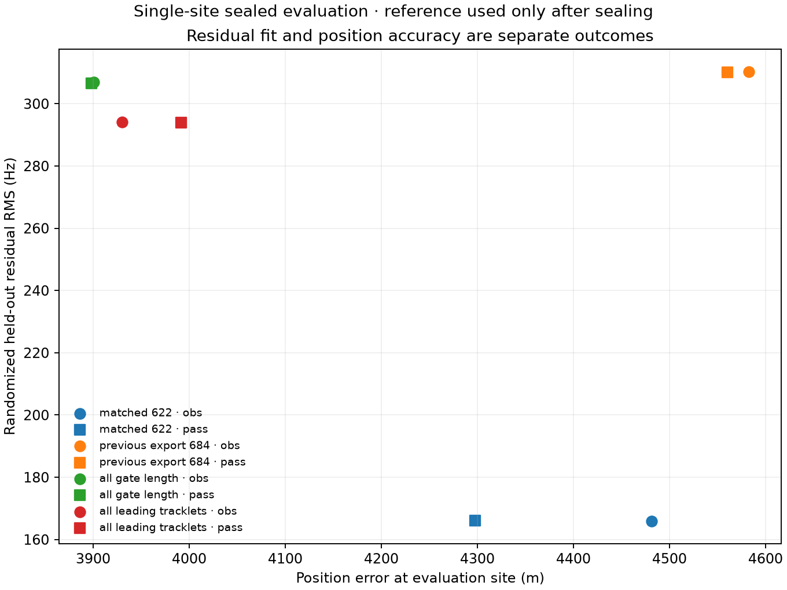

# Conditional positioning with all recovered leading tracklets

**Recovering additional gate-length tracklets improves the conditional position
by about 0.4–0.6 km, but adding 553 shorter fragments provides no further
position gain.**  Under the same operational-catalogue association policy, the
observation-weighted error moves from 4,481 m on the matched 622 episodes to
3,901 m on 1,221 gate-length episodes, then worsens slightly to 3,930 m on all
1,774 tracklets.  Pass-weighted errors are 4,298 m, 3,899 m, and 3,991 m,
respectively.

## Frozen comparison

The recovered export contains every non-overlapping tracklet in the leading RF
hypothesis from the same 211 scans: 1,774 tracklets / 43,831 observations.  It
retains every observation from the earlier 684-tracklet / 24,149-observation
export.  The comparison was fitted and sealed before the reference coordinate
was supplied to the evaluator.

Each tracklet receives a fresh candidate search using randomized training
observations.  The catalogue file digest is verified, its collection timestamp
must be strictly before capture, and only elements with epochs strictly before
capture are eligible.  A −10° elevation prefilter at the frozen causal
wide-search seed reduces roughly 11,127 Starlink elements per session to a
median 1,320 candidates.  This is a generous computational prefilter, not an
identity label or quality gate.  Held-out RF never selects an identity or fits a
position.

| Cohort | Episodes / observations | Observation-weighted error / held-out RMS | Pass-weighted error / held-out RMS |
|---|---:|---:|---:|
| Matched main cohort | 622 / 21,702 | 4,481 m / 165.93 Hz | 4,298 m / 166.04 Hz |
| Previous complete export | 684 / 24,149 | 4,582 m / 310.26 Hz | 4,560 m / 310.01 Hz |
| All previous-length-gate tracks | 1,221 / 38,057 | **3,901 m** / 307.02 Hz | **3,899 m** / 306.57 Hz |
| All leading tracklets | 1,774 / 43,831 | 3,930 m / **294.20 Hz** | 3,991 m / **293.90 Hz** |

All shared-clock fits reach the same −99.66 ms lower recorded bound.  Every
cohort and both predeclared weighting policies are reported.  The reference
position selects none of them.

The 62 episodes present in the previous export but absent from the matched 622
are a poor extension: their median best-candidate training RMS is 733 Hz and
only 45% have candidate signal weight above 0.9.  That explains why merely
expanding from 622 to the old 684 degrades both residual fit and position.

By contrast, the 537 newly recovered gate-length tracks have median
best-candidate training/held-out RMS of 91/104 Hz; 97.6% have signal weight above
0.9.  Adding them improves the conditional single-site position despite the
combined cohort's much larger unweighted residual RMS.  The 553 shorter tracks
have 5,774 observations, median training/held-out RMS of 58/76 Hz, and 99.1%
signal weight above 0.9.  They lower aggregate held-out RMS but move position 29
m in the wrong direction under observation weighting and 93 m in the wrong
direction under pass weighting relative to the gate-length cohort.  This is a
negative positioning result for short-fragment inclusion, not a reason to lower
production gates.

## Interpretation limits

This extension uses each session's actual operational catalogue.  It satisfies
the strict pre-capture collection and element-epoch cutoffs, but it is not the
freshest-per-satellite composite assembled from the full archive for the main
strict replay.  On the matched 622 episodes, 614 candidate identities agree
with that archived-composite replay.  Its 4,481 m matched result is therefore a
policy control, not a replacement for the published 4,503 m strict baseline.

The associations remain hard best candidates conditional on one frozen causal
position seed.  Signal weight measures catalogue-signal evidence versus the
unassigned alternative, not confidence that the best satellite beats its
runner-up.  A high value can coexist with several ambiguous satellite
identities; it does not independently validate a NORAD identity.  The replay
did not preserve a top-two posterior gap or entropy, so it cannot quantify that
identity ambiguity after the fact.  The single reference site is used only
after sealing, so the apparent 580 m gain from additional long tracks is
promising evidence for support recovery, not a calibrated cross-site accuracy
claim.  The result still remains roughly four kilometres from the reference
position.

## Artifacts and reproduction

- [Truth-blind associations and fits](2026_09_21_extended_tracklet_positioning/analysis.json)
- [Sealed reference evaluation](2026_09_21_extended_tracklet_positioning/evaluation.json)
- [Propagated winning-candidate states](2026_09_21_extended_tracklet_positioning/states.npz)
- `tools/benchmark_extended_tracklets.py` reproduces the association and fit
  using `/tmp/leo-position-all-tracklets/evidence` and the frozen causal parent.

The benchmark takes about 75 seconds on the audit host with one BLAS thread and
requires no new RF collection.  The focused extended-tracklet and evaluator
tests pass.
