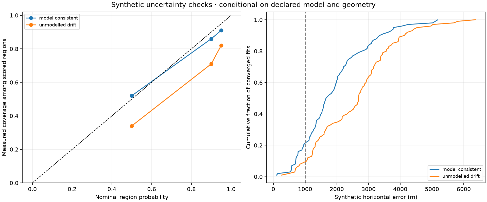

# Formal position model: synthetic uncertainty checks

The model's local uncertainty is not yet calibrated for operational use. In 100
model-consistent simulated trials, its nominal 95% regions covered the reference
position 91 times. Adding an unmodelled per-track frequency drift reduced coverage
to 82 of 100. These trials test uncertainty behavior, not real-world positioning
accuracy at new receiver sites.

| Scenario | Trials / converged | Median horizontal error | 95th percentile error | Nominal 95% coverage | Wilson 95% interval for coverage |
|---|---:|---:|---:|---:|---:|
| Model-consistent | 100 / 100 | 1,681 m | 3,793 m | 91% | 83.8–95.2% |
| Unmodelled frequency drift | 100 / 100 | 2,687 m | 4,549 m | 82% | 73.3–88.3% |

The smaller synthetic problem has only 288 observations and six satellite
identities, unlike the 21,702-observation archived replay. Its errors cannot be
used as an estimate of the archived campaign's accuracy. The two scenarios share
seeds and geometry; their difference is a paired stress test. Trials within each
scenario have independent random draws.



## Frozen experiment

`tools/characterize_formal_position.py` generates 12 tracks, each with 24
observations, and two tracks per satellite identity. Synthetic receiver
coordinates are sampled within ±3 km of a fixed reference in an 80 km square.
Every fit starts at the square centre, not at its generated truth.

Synthetic trajectories use the same quadratic phase-state model as the fitter.
One phase-rate correction per identity is drawn from the bounded Gaussian prior
with width 0.09176615913 seconds/hour. Independent source offsets are added per
track. Student-t innovations have scale 250 Hz and four degrees of freedom;
within-track noise follows the declared irregular-time AR(1) recursion. The
fitter estimates its own noise scale under the frozen prior. Synthetic trials
use all observations for fitting: they assess position-region coverage, not
held-out residual performance.

The stress scenario additionally draws a zero-mean per-track frequency slope
with standard deviation 3 Hz/s, which the fitted model does not contain. This
choice was made before evaluating either scenario. No parameters were changed
to improve the coverage scores.

These trials used the original frozen optimizer. The subsequent noise-bound
restart fix does not activate for any of them: all fitted scales lie between
206.80 and 276.52 Hz, well inside the declared 5–2000 Hz bounds. The likelihood,
priors, and pre-restart optimization path are unchanged.

## Interpretation

At nominal 50%, 90%, and 95% probabilities, model-consistent coverage was 52%,
86%, and 91%. The 100-trial sample is too small to assert exact calibration; the
95% coverage interval still includes 95%. Under the drift stress, coverage was
34%, 71%, and 82%, with a clear shortfall at nominal 95%.

This demonstrates a material limitation: converged fits and small local curvature
regions do not protect against an omitted systematic effect. Orbit-model errors,
receiver drift, and identity mistakes need separate real-data stress tests.
Do not multiply the reported region by a factor selected to cover the known
receiver on this archive and call that general calibration.

Failure accounting is explicit. All 200 fits converged and supplied finite
regions. The evaluator also retains failed fixes and missing regions in total
denominators. For overlapping real-data subsets, it suppresses independent-trial
binomial intervals rather than treating those subsets as new receiver trials.

## Artifacts and reproduction

- [Frozen configuration, seeds, and source hashes](2026_09_21_formal_position_characterization/protocol.json)
- [All trial outputs and summaries](2026_09_21_formal_position_characterization/results.json)
- Generator: `tools/characterize_formal_position.py`
- Evaluation component: `src/leo/analysis/research/position_performance.py`
- Component tests: `tests/analysis/test_position_performance.py`

```bash
OPENBLAS_NUM_THREADS=1 OMP_NUM_THREADS=1 PYTHONPATH=src:tools \
uv run --no-project --with scipy --with matplotlib --with sgp4 \
  --with pydantic --with pyyaml python tools/characterize_formal_position.py \
  --output /tmp/leo-formal-coverage-reproduction --trials 100 --workers 4
```
