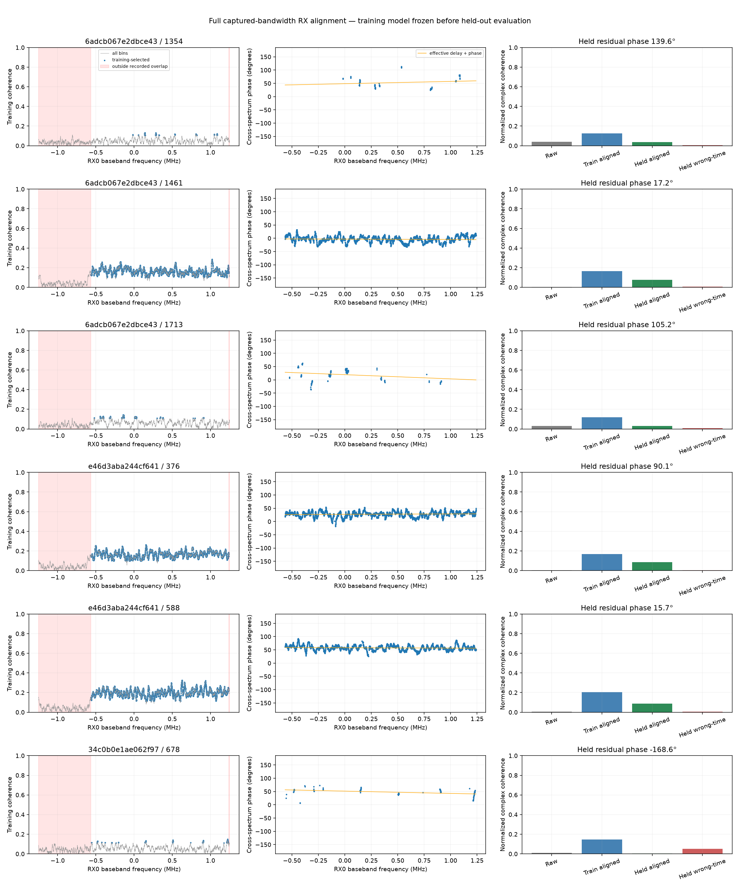
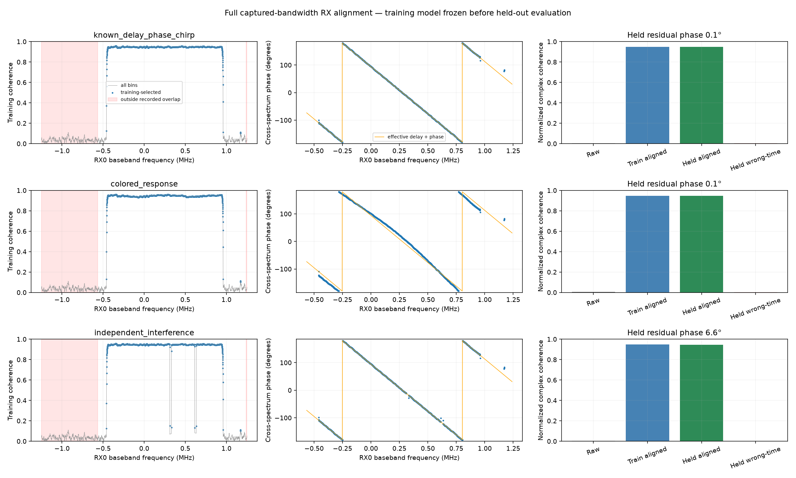
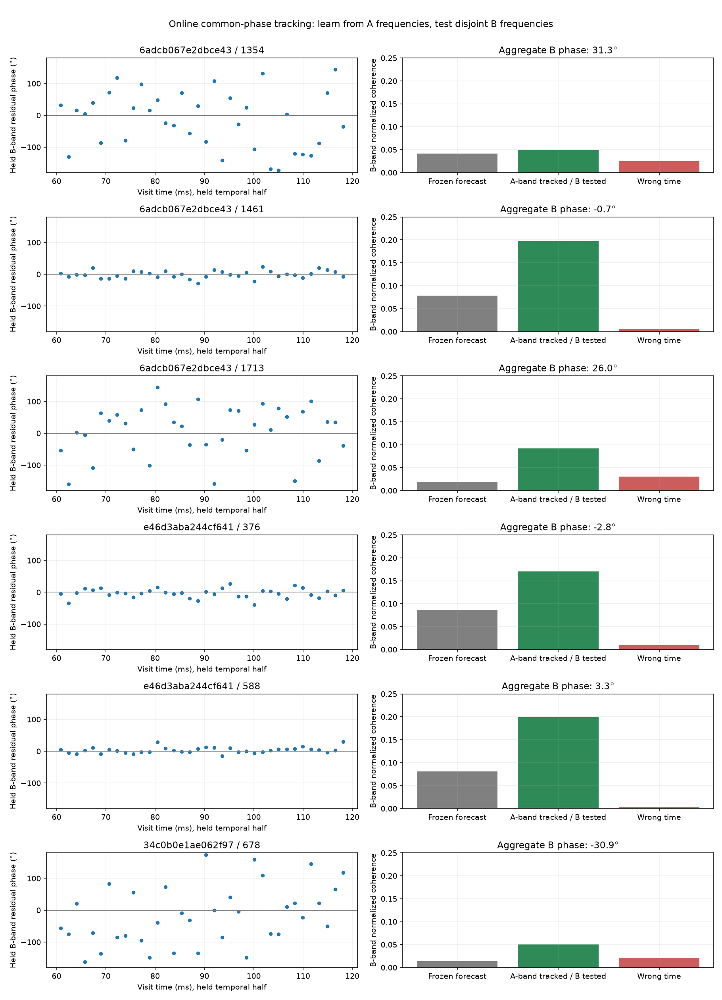

# Full captured-bandwidth RX0/RX1 alignment

This research estimates the measurable relationship between two simultaneously recorded receiver signals. It does not require electrical calibration to estimate that relationship, and does not interpret the result as satellite geometric phase. Only recorded common bandwidth is used; no unrecorded part of the Starlink channel is assumed available.

**Result:** the implemented model recovers the injected 2.375-sample delay to within 0.005 sample and achieves approximately 0.95 coherence on unseen synthetic IQ. On saved recordings, three of six selected dwells support common-phase tracking over approximately 1.75 MHz of common recorded bandwidth, with residual phase on disjoint validation frequencies between -2.85 and +3.28 degrees. Their broadband coherence is only 0.17–0.20: a weak common component aligns, while substantial noise/unshared signal remains. The other three cases do not support a precise broadband phase result. All cases are retained.



## Model and coordinate conventions

In RX0 frequency coordinates, after correcting relative receiver frequency and drift, model the training cross spectrum as

`Y_aligned(f,t) = H(f) X(f,t) + residual(f,t)`.

The temporal correction is `exp(-i 2π [nu*(t-t_ref) + nu_dot*(t-t_ref)^2/2])`. The constant phase at t_ref remains in H. Decompose the phase of H into an effective linear slope and an intercept at a declared reference frequency:

`arg H(f) = phi_ref - 2π*(f-f_ref)*tau + residual_channel_phase(f)`.

Positive tau means the RX1 envelope is delayed relative to RX0 before receiver-frequency modulation. A complex channel response accounts for relative gain and nonlinear phase. When that response is unrestricted, a physical delay and a channel's own linear phase are not separately identifiable. The reported delay is therefore an **effective transfer delay under the fitted phase-slope convention**, not a measured geometric path difference. Multiple common sources can also produce a composite transfer rather than a single satellite's phase.

The cross-spectrum convention is `conj(X)*Y`, with normalized spectral coherence based on `|Pxy|/sqrt(Pxx*Pyy)`. This is the amplitude coherence; its square is magnitude-squared coherence. See the official [SciPy CSD convention](https://docs.scipy.org/doc/scipy/reference/generated/scipy.signal.csd.html).

## Recorded support and validation design

Each recording has 2.5 MS/s complex samples. A frequency f in RX0 coordinates is eligible only if both f and f+nu lie inside their respective recorded Nyquist intervals. A roughly -675-kHz receiver offset leaves approximately 1.825 MHz of common captured support before guard bands and data-derived rejection. Mixing RX1 digitally does not make wrapped frequencies into valid additional RF observations.

Six 120-ms dwells were selected before examining broadband alignment outcomes:

- `scan-hop-6adcb067e2dbce43`, visits 1354, 1461, 1713: early, difficult, and late portions of the longest shared track.
- `scan-hop-e46d3aba244cf641`, visits 376 and 588: upper-edge examples.
- `scan-hop-34c0b0e1ae062f97`, visit 678: the earlier candidate with two detected source pairs.

The first half supplies frequency acquisition, temporal fitting, spectral selection, and channel estimation. The second half evaluates the frozen training model. Held-out data must not choose the channel response, frequency mask, delay, or drift. The saved earlier first-half broadband frequency estimate supplies a search seed, not a held-out fit. Wrong-time alignment and independent-noise cases test chance coherence. Strong coherence magnitude alone is insufficient: residual complex phase, signed coherence, and prediction error must also be examined.

Implementation details that determine these results:

1. Search integer lags within ±8 samples and differential frequency within ±2 kHz of the frozen training seed. A zero-delay-only frequency acquisition is insufficient for a broadband delayed signal.
2. Estimate block cross-product phase and compare linear versus quadratic phase models using an internal chronological split of the training half. Quadratic phase (linear frequency drift) is selected only if its circular prediction RMS improves by more than 20%; refit the chosen degree on the full training half.
3. Form 4096-sample Hann-window cross spectra. Smooth cross/power estimates across 31 bins, erode physical overlap by 15 bins at its boundaries, and select support above a training-only block-permutation null: amplitude coherence must exceed both 0.05 and three times the median null coherence. This is a heuristic screen, not a calibrated false-discovery guarantee. Clip the highest spectral weights at the 90th percentile so a few bins cannot dominate the delay/phase fit.
4. Profile the weighted complex phase over a bounded ±8-sample delay grid with 0.01-sample spacing. This avoids unwrapping phase through gaps in weak spectral support. Estimate the intercept at the weighted mean frequency. Estimate the smooth complex forward response H from training cross/power spectra; predict `H*X` rather than amplifying noise by inverting weak H.
5. Evaluate the frozen response on separate second-half FFT blocks. There is no full-record FFT filter crossing the train/held boundary. The temporal-only apply helper does not interpolate a sparse channel response across masked gaps.

The smooth H still absorbs a mixture of receiver response, propagation, source mixture, and estimation effects. A few shared interference tones can satisfy coherence tests; support width, incorrect-time controls, and disjoint-band results must be examined together. This estimator does not establish Starlink identity solely from broadband coherence.

## Synthetic truth

The independent generator `tools/broadband_alignment_synthetic_cases.py` creates a band-limited random complex signal on RX0 frequencies -450 to +950 kHz. RX1 receives a 2.375-sample fractional delay, phase 0.73 rad at the visit start, CFO -675123.4 Hz, and drift +480 Hz/s, with independent receiver noise. Separate cases add a nonlinear complex response, strong unrelated receiver tones, or replace both signals with independent noise. Generation uses a long padded realization and crops away the boundaries; it does not use the estimator to inject its truth.

Under nonlinear response, the injected envelope delay remains known, but the effective fitted slope may include the response's own phase slope. Synthetic phase comparisons must transport truth to the estimator's reported time and frequency reference. Comparing phases at different sample times is invalid at these large receiver frequency offsets.

| Synthetic case | Delay error (samples) | CFO error at reference (Hz) | Drift error (Hz/s) | Reference phase error | Held coherence | Held residual phase |
|---|---:|---:|---:|---:|---:|---:|
| Known delay/phase/chirp + noise | -0.005 | +0.017 | -0.885 | +0.153° | 0.948 | +0.112° |
| Nonlinear complex channel | -0.005 | +0.023 | -1.003 | +0.121° | 0.948 | +0.052° |
| Strong independent receiver tones | -0.005 | -0.040 | -8.983 | +0.578° | 0.945 | +6.588° |
| Independent noise only | — | — | — | — | Abstains | Insufficient coherent overlap |

These four fixed-seed cases demonstrate recovery and specific failure controls, not universal uncertainty coverage. The interference case retains a larger held phase error despite high coherence, illustrating why coherence magnitude alone is inadequate. The source-band effective selected widths are 1.385–1.423 MHz; smoothing near its boundaries means this is not an exact occupied-bandwidth measurement.



## Recorded results: forecasting versus tracking

A frozen 60-ms fit does **not** reliably forecast the next 60 ms. Held coherence is 0.005–0.088, and residual phase can be over 100 degrees. This is evidence against using a single fitted phase polynomial as a sufficient alignment model across the full dwell.

The second experiment explicitly allows an online phase correction. It retains H and the support mask learned on the first half, then uses alternating groups of 64 frequency bins (A bands) in each second-half block to estimate a residual common phase. It applies that correction to predictions in the other groups (B bands). Four bins at each group edge are discarded to reduce Hann leakage. **B-band measurements do not train their own correction.** This is frequency-held-out tracking, not a claim that the temporal forecast suddenly improved without new observations. Window sidelobes and colored noise mean the bands are not perfectly statistically independent.

| Scan suffix / visit | Selected common bandwidth | Frozen held coherence | Tracked B coherence | Different-time B control | B residual phase | Conditional 95% phase-error interval |
|---|---:|---:|---:|---:|---:|---:|
| 6ad / 1354 | 0.046 MHz | 0.038 | 0.049 | 0.025 | +31.30° | [-44.92°, +135.01°] |
| 6ad / 1461 | 1.746 MHz | 0.076 | 0.197 | 0.005 | -0.69° | [-3.72°, +3.29°] |
| 6ad / 1713 | 0.087 MHz | 0.031 | 0.092 | 0.030 | +26.01° | [-29.55°, +31.92°] |
| e46 / 376 | 1.764 MHz | 0.086 | 0.170 | 0.009 | -2.85° | [-4.38°, +4.31°] |
| e46 / 588 | 1.772 MHz | 0.088 | 0.199 | 0.004 | +3.28° | [-2.96°, +3.53°] |
| 34c0 / 678 | 0.060 MHz | 0.005 | 0.050 | 0.020 | -30.87° | [-61.70°, +64.05°] |

Full scan IDs are preserved in the JSON and selection above. The selected common bandwidth includes A and B support before their guard exclusions; actual B validation bandwidth is approximately 0.77–0.78 MHz in the three broad-support cases. The three weak cases retain only tens of kHz after common-support screening despite searching the complete physical overlap. They are not successful full-band alignments.

The displayed intervals are **bootstrap errors around the measured residual**, not endpoints centered at zero or a geometric phase confidence interval. They use 256 fixed-seed resamples of adjacent pairs of B-band time blocks, conditional on the frozen channel, mask, and A-band phase tracker. They exclude source association, absolute receiver calibration, long-timescale response changes, and model-selection uncertainty. They are reported even when too broad to support precise alignment.

The three stronger cases have normalized complex prediction errors of approximately 0.98–0.985: the frozen predictions leave roughly 96–97% of observed B-band energy as squared prediction error. This is not a decomposition into signal and noise power. Alignment of the common component does not remove independent noise or prove that all recorded energy comes from the same source. The different-time control uses another contiguous RX1 interval from the held temporal half, rather than cyclically shifting samples within a block. The core frozen-forecast JSON also retains its separately labelled cyclic wrong-time diagnostic.



The JSON additionally retains a local 20-ms experiment: each window fits its first 10 ms and tests the next 10 ms using 1024-sample FFTs. These windows use new training observations, so they are a separate tracking experiment, not independent evidence for the global forecast. All 36 windows and their failures are retained. They do not remove the need for the disjoint-frequency validation above.

## Delay, phase and edge-pilot comparison

| Visit | Effective delay (samples) | Conditional delay scatter (samples) | Conditional phase scatter | Broadband minus edge CFO at the same sample |
|---|---:|---:|---:|---:|
| 1354 | -0.06 | 0.249 | 13.67° | -30.15 Hz |
| 1461 | +0.01 | 0.0166 | 1.20° | +0.82 Hz |
| 1713 | +0.11 | 0.223 | 9.96° | -10.13 Hz |
| 376 | -0.01 | 0.0140 | 1.03° | -4.87 Hz |
| 588 | +0.01 | 0.0131 | 0.96° | +1.57 Hz |
| 678 | +0.06 | 0.0805 | 6.88° | -0.98 / +43.72 Hz for its two pairs |

One sample is 400 ns. These fitted slopes are consistent with small effective relative delay in the three broad-support examples, but do not resolve geometric path delay from the receiving paths. The core uncertainty fields are conditional fit-scatter estimates: temporal scatter includes deletion of contiguous training chunks; spectral scatter accounts approximately for the 31-bin smoothing and weight concentration, with a delay-grid precision floor. They are not calibrated total confidence intervals.

The earlier edge-pilot measurement is source-specific and coherently accumulates a known waveform. Its resultant is not directly comparable to broadband waveform coherence. This report therefore compares differential frequency at exactly the edge fit's sample center, and retains the original pilot phase, resultant and uncertainty in JSON. It does **not** equate a source-specific edge phase with a broadband composite channel intercept at a different reference frequency. The broadband result adds an independently tested wide-frequency alignment observable; it does not invalidate or replace the edge-pilot estimator automatically.

## Limits and next use

This implementation establishes a workable relative alignment model, including fractional delay, a declared phase reference, CFO/drift selection, frequency-dependent forward response, interference/noise screening, and held-out checks. The geometric-phase goal remains separate: H and the tracked common phase still contain receiver/LNB/channel terms. No absolute calibration was needed to develop and demonstrate this model.

The next useful application is source-conditioned broadband tracking on the broad-support dwells, with repeatability across frequency groups and contiguous blocks retained. Phase across retunes must not be connected merely by forcing an unwrap. The three weak cases should remain unavailable for precise phase interpretation; their plots and controls are part of the result, not discarded outliers.

## Reproduction and artifacts

Run from the research worktree using the existing recordings:

```bash
sudo -u leo env OPENBLAS_NUM_THREADS=1 MPLCONFIGDIR=/tmp/leo-broadband/mpl \
  PYTHONPATH=src .venv/bin/python tools/report_broadband_alignment.py \
  --bulk-root /srv/bulk/leo --output /tmp/leo-broadband/results
```

The runner verifies the frozen edge-evidence digests, records the raw manifest digests, retains failed cases, and writes canonical JSON plus plots. No RF collection or production artifact replacement is performed.

- Pure estimator: `src/leo/analysis/starlink/broadband_alignment.py`.
- Disjoint-frequency tracker: `src/leo/analysis/starlink/broadband_phase_tracking.py`.
- [Recorded results](figures/2026_09_21_broadband_alignment/recorded-alignment.json).
- [Synthetic truth and recovery](figures/2026_09_21_broadband_alignment/synthetic-alignment.json).
- Each JSON includes canonical evidence digest and hashes of estimator, tracker, runner and generator source files.
- Seven focused tests cover known fractional delay/CFO/drift/phase recovery, physical frequency overlap, noise abstention, frozen training results under held-only perturbation, and a disjoint-band leakage check that changes B phase without changing the A-derived correction.
