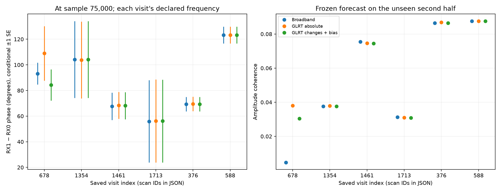
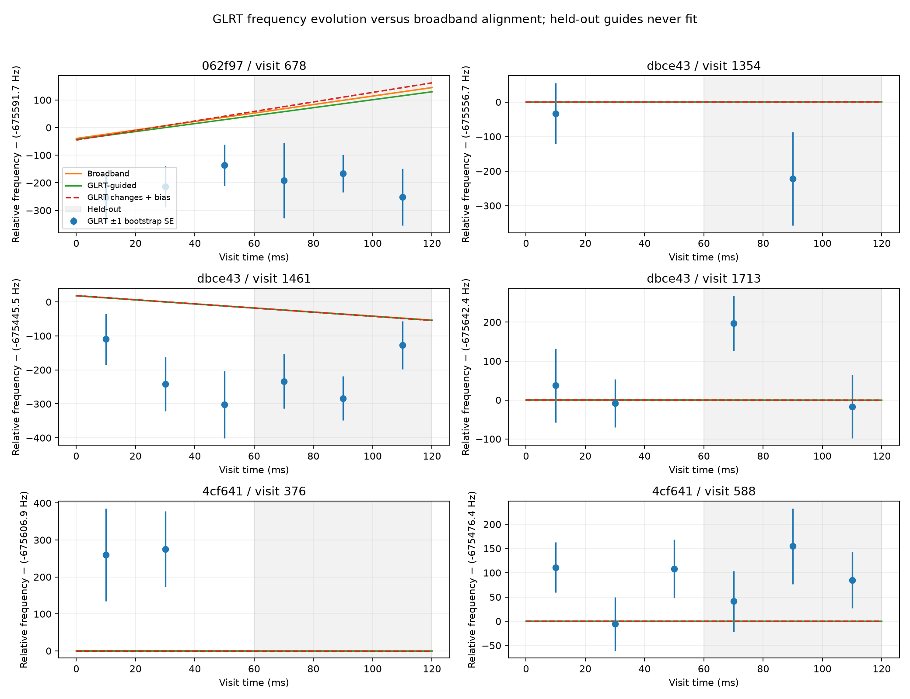

# GLRT-guided observed RX1-minus-RX0 phase

This extends the [full-bandwidth implementation and validation report](2026_09_21_full_bandwidth_rx_alignment.md). Both reports, their JSON, and their figures form the deliverable. The target is an observed relative phase of the coherent common component, using every recorded frequency that passes physical-overlap and training-coherence screening. An external calibration reference is not required for this measurement. Attribution to geometric satellite phase remains a separate question.

## Estimand and conventions

Use `conj(X_RX0)*Y_RX1`. Positive phase means RX1 leads RX0 in complex phase; positive envelope delay means RX1 arrives later. The reported phase is modulo 360 degrees, at **sample 75,000, exactly 30 ms from the start of the saved valid dwell**, and at the explicitly tabulated RX0-baseband reference frequency. It is not phase at the RF carrier or an absolute path-length measurement.

The model is

`Y(f,t) ≈ A(f) X(f,t) exp{i[phi_ref − 2π(f−f_ref) tau + 2π nu dt + π nu_dot dt² + psi(f)]}`.

The smooth response includes receiver, LNB, propagation, and possibly multiple-source contributions. The intercept and linear spectral slope define the phase/delay convention; the remaining response is a nuisance. Without that convention, an arbitrary response could absorb any constant phase and delay. Frequency and frequency drift are removed **before** accumulating complex cross spectra, avoiding cancellation from a rotating phase.

At approximately −675 kHz differential frequency, moving the time reference by one 400-ns sample changes phase by about −97 degrees. Reporting a precise phase without its exact sample reference would be misleading. The frequency reference is also essential: delay induces phase slope, whereas a constant phase offset affects all shared frequencies equally.

## GLRT evidence and conditional fit

The runner recomputes GLRT64 candidates from the saved IQ using nonoverlapping 20-ms probes. Within each probe it uses the strongest phase-blind timing/frequency-consistent receiver pair. This is a source-association assumption, not proof that every probe follows the same satellite. Whole pilot frames are resampled 128 times to estimate frequency scatter; symbols within a frame are retained together. A 16,384-point frequency grid supplies a quantization floor. RX0/RX1 variances are added as an approximation, without an estimated cross-receiver covariance. These uncertainties are conditional on the selected acquisition/timing basin; they do not cover misassociation or systematic template bias.

Only probes whose **entire support** lies in the first 60 ms can influence the fit. Later guides appear in the plot solely for validation. The approximately 227,273-Hz symbol ambiguity is lifted to the branch identified by training broadband correlation. GLRT is therefore not presented as independent evidence selecting that branch.

The broadband frequency/drift fit supplies a local Gaussian approximation to its training evidence. The guide penalty weights each GLRT frequency by its measured uncertainty. After this temporal fit, the estimator profiles fractional delay and phase using the complete frozen usable spectral support, with clipped spectral weights and a smooth forward channel response. It evaluates that response on the untouched second 60 ms. This is a staged, local, approximate likelihood fit; it is **not** a proof of the global maximum of an arbitrary multipath/source-mixture likelihood.

Two guide models are retained. The first constrains absolute relative GLRT frequency, with a four-sigma conflict screen. The second fits `GLRT_i = nu + nu_dot*dt_i + bias`, with a broad 10-kHz Gaussian scale on the constant nuisance bias. Broadband anchors nu, while GLRT changes can constrain drift. This second model is the preferred interpretation when the guide has a systematic offset; one guide alone provides no useful drift information. Per-probe source switching could still imitate frequency evolution, so this is not a proven single-satellite trajectory.

GLRT and broadband statistics come from the same IQ. Their combined score is explicitly a **conditional composite objective**, not an independent-prior Bayesian posterior. Its inverse curvature is not a calibrated total covariance. Phase scatter includes spectral weight concentration and contiguous time-block variation. The effective spectral-group count accounts approximately for 31-bin smoothing; neither it nor the time groups establish exact independence.

## Findings

The six saved 120-ms dwells each contain 300,000 complex samples per receiver. The roughly −675-kHz relative offset leaves about 1.825 MHz of physical common support. Three cases retain approximately 1.75 MHz after screening; three retain only tens of kHz. High sample count cannot create a shared signal where receivers hear different sources or independent noise.

The GLRT guide uncertainties are roughly 50–135 Hz per probe. Several show systematic offsets of hundreds of Hz from the much more precise broadband fit. They should not be forced onto the broadband phase trajectory with artificial precision. The comparisons below retain failures as well as successes.

These are the conditional most-likely observed phases from the **GLRT-changes-plus-bias** model at sample 75,000. The ± column is one conditional standard-error estimate, **not a calibrated 68% or 95% coverage statement**. It is the larger of spectral scatter and a four-contiguous-group deletion jackknife, with response, support and fitted delay held fixed. There are 36 nonoverlapping training FFT blocks, not 150,000 independent training observations. Weak cases are displayed for audit, not accepted as precise measurements.

| Scan suffix / visit | f_ref, RX0 kHz | Observed phase | Conditional ± SE | Effective spectral groups | GLRT bias | Shared-support assessment |
|---|---:|---:|---:|---:|---:|---|
| 6ad / 1354 | 512.615 | +104.15° | 30.03° | 2.4 | −33.3 Hz | Weak; reject precise interpretation |
| 6ad / 1461 | 311.207 | +68.17° | 10.59° | 88.2 | −204.9 Hz | Broad shared support |
| 6ad / 1713 | −66.446 | +56.16° | 32.25° | 4.6 | +5.2 Hz | Weak; reject precise interpretation |
| e46 / 376 | 354.061 | +69.35° | 5.67° | 89.3 | +269.5 Hz | Broad shared support |
| e46 / 588 | 348.073 | +123.26° | 6.50° | 89.7 | +71.5 Hz | Broad shared support |
| 34c0 / 678 | 453.658 | +84.25° | 12.13° | 3.0 | −204.9 Hz | Weak; reject precise interpretation |

The complete scan IDs are `scan-hop-6adcb067e2dbce43`, `scan-hop-e46d3aba244cf641`, and `scan-hop-34c0b0e1ae062f97`. Different rows use different dwells and declared frequency references; their scalar phases must not be directly subtracted as a satellite trajectory across retunes.

| Visit | Unguided held coherence | Absolute-GLRT-guided | GLRT changes + bias |
|---|---:|---:|---:|
| 1354 | 0.0376 | 0.0379 | 0.0376 |
| 1461 | 0.0755 | 0.0746 | 0.0744 |
| 1713 | 0.0313 | 0.0310 | 0.0308 |
| 376 | 0.0864 | 0.0868 | 0.0864 |
| 588 | 0.0875 | 0.0876 | 0.0876 |
| 678 | 0.0047 | 0.0380 | 0.0304 |

There is **no material improvement in the three broad-support dwells**. The numerical increase in weak visit 678 does not qualify it: it has only three effective spectral groups, and its evolution-guided held residual phase is about +129°. For broad-support visits 1461/376/588, evolution-guided held residual phases are +24.4°/+90.1°/+15.8°. A frozen polynomial has not aligned the later data well even when its coherence magnitude is above the wrong-time floor.





The earlier disjoint-frequency experiment remains the stronger demonstration of useful alignment: learn the response on the first half, estimate each later block's residual phase from A frequency groups, and test it on separate B groups. The three broad-support cases achieved B-band amplitude coherence 0.170–0.199, compared with different-time controls 0.004–0.009. Their mean B residual phases were −0.69°, −2.85°, and +3.28°, with conditional bootstrap phase-error widths of a few degrees. Those are **alignment residuals**, not the actual observed receiver phase reported above, and not geometric phase. See the full report for every weak case and the interval definitions.


## Comparison with edge pilots

The original source-specific edge-pilot estimates, their reference samples, phase uncertainties, resultants, and control diagnostics are retained verbatim in each new recorded JSON. Broadband minus edge differential-frequency differences in the three broad-support cases were approximately +0.82, −4.87, and +1.57 Hz at matching sample centers. This is much closer than their GLRT64 frequency guides, which are a different estimator with much larger uncertainty.

The pilot estimator coherently matches a known waveform; its resultant is not broadband waveform coherence. Its phase has a waveform/timing reference and source selection different from the broadband response intercept. Subtracting these two native phase numbers would conflate those definitions with a physical discrepancy. A single scalar phase equality is therefore not claimed. This limitation is about source and frequency-response comparability, not an inability to measure observed relative broadband phase without calibration.

## Validation, failure cases, and reproduction

The independent synthetic generator injects 2.375 samples of delay, a known phase, −675123.4 Hz frequency offset and +480 Hz/s drift into a band-limited random complex waveform. Separate cases add colored complex response, independent interference, deliberately biased guides, or independent receiver noise. Truth is transported to exactly the estimator's declared time and frequency before comparison. The synthetic cases exercise phase, fractional delay, differential frequency, and held-out alignment; they are not an ensemble calibration of confidence-interval coverage.

| Synthetic case | Phase error at declared reference | Delay error | CFO error | Held amplitude coherence |
|---|---:|---:|---:|---:|
| Known offsets + independent noise | +0.156° | −0.005 sample | +0.016 Hz | 0.948 |
| Colored complex response | +0.125° | −0.005 sample | +0.022 Hz | 0.948 |
| Strong independent tones | +0.568° | −0.005 sample | −0.045 Hz | 0.945 |
| Guides deliberately biased +1000 Hz | +0.156° | −0.005 sample | +0.017 Hz | 0.948 |
| Independent receiver noise | Abstains | — | — | Insufficient coherent common support |

The deliberately biased guides are all rejected in the absolute-guidance mode, which falls back to the broadband fit. A separate test verifies that the optional bias model absorbs a constant guide offset while retaining the known frequency drift. The interference case still has a larger held residual phase despite high coherence; the full-band report quantifies this failure. A highly coherent synthetic waveform is substantially easier than these weak real common signals.

Tests additionally perturb only held-out IQ and require both trained models to remain identical; the held residual must change. The GLRT bootstrap test recovers a known frequency and detects increased frame-to-frame variation. Earlier tests cover physical common-band support, fractional-delay recovery, noise abstention, and absence of B-band feedback into the A-band phase tracker.

Run from the research worktree:

```bash
sudo -u leo env OPENBLAS_NUM_THREADS=1 MPLCONFIGDIR=/tmp/leo-guided/mpl \
  PYTHONPATH=src .venv/bin/python tools/report_glrt_guided_broadband_phase.py \
  --bulk-root /srv/bulk/leo --output /tmp/leo-guided/results
# Repeat that command with --synthetic-only, then --render-only.
```

The runner records source manifest and implementation hashes, preserves all selected visits, and uses read-only saved-IQ adapters. Recorded and synthetic JSON are in [the artifact directory](figures/2026_09_21_glrt_guided_phase/). The pure estimator is `src/leo/analysis/starlink/glrt_guided_broadband_phase.py`; the original broadband estimator and frequency-held-out tracker remain the basis for support selection and alignment validation. Coherence here is amplitude coherence; [SciPy's coherence function](https://docs.scipy.org/doc/scipy/reference/generated/scipy.signal.coherence.html) reports its square.

The supported conclusion is measurable relative alignment of a weak common component in three saved dwells. A frozen polynomial is insufficient to track all later phase evolution, and GLRT guidance does not make weak shared support precise. A time-resolved observed phase with frequency-held-out checks is the useful output; satellite geometric attribution must not be inferred from the fitted channel intercept alone.
