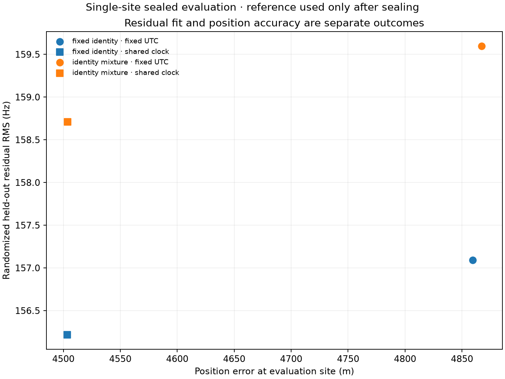

# Strict-causal position refinement with uncertain satellite identity

Preserving candidate satellite identity uncertainty does **not** improve this
matched 622-episode position result. The fixed-clock identity mixture has
4,867 m horizontal error and 159.60 Hz randomized held-out RMS, compared with
4,859 m and 157.09 Hz for the existing fixed-identity fit. With one bounded
shared clock, the mixture has 4,504 m error and 158.71 Hz RMS, compared with
4,503 m and 156.22 Hz. All identities remain unverified.

## Matched result

| Strictly causal all-track model | Horizontal error | Held-out RMS |
|---|---:|---:|
| Fixed identity, fixed UTC | 4,859.302 m | 157.09 Hz |
| Identity mixture, fixed UTC | 4,867.235 m | 159.60 Hz |
| Fixed identity, bounded shared clock | 4,503.240 m | 156.22 Hz |
| Identity mixture, bounded shared clock | 4,503.731 m | 158.71 Hz |

The mixture position was sealed before the reference coordinate was read. The
known coordinate and held-out RF values select neither candidates, likelihood
settings, starts, nor the reported mode. Held-out prediction uses the identity
weights conditioned on fitting samples; it does not choose a fresh winner or
refit source offsets. The RMS is a fitting-posterior-weighted residual summary,
so it is comparable in scale but not algebraically identical to the residual of
one hard assignment.

## Candidate support and likelihood

For every recording, the prototype reconstructs the same 11,135-object
Starlink catalogue used by the committed strict-causal reranking. Both the
archive collection timestamp and element epoch are strictly before capture.
The reconstruction is checked against the committed per-recording catalogue
digest and count. Each RF episode is also checked sample for sample against the
sealed strict state product: observation time, frequency, randomized fitting
mask, and winning NORAD must agree.

Candidates are screened at 19 positions: the original wide-search start, all
existing truth-blind local modes, and deterministic 100 km and 300 km offsets
around the strict fixed-clock mode. Every candidate within 25 log-likelihood
units of the best at any probe is retained, as is the committed strict winner.
This leaves 5–44 candidates per episode, with a median of 10. Candidate prior
mass remains `0.5 / 11135`; it is never renormalized over the shortlist. The
other 0.5 prior mass belongs to a broad unassigned component.

An exact full-catalogue replay at each final mode finds maximum omitted signal
fractions of 7.1e-12 for fixed UTC and 4.5e-12 for the shared clock. The largest
omitted fraction at a screening probe is 2.4e-11. These checks establish local
shortlist fidelity at the declared probes and fitted modes. They are not a
global search certificate.

The candidate likelihood uses a 250 Hz scale, the unassigned component uses a
30 kHz scale, and both use the same pseudo-Huber family as the fixed-identity
fit. One constant frequency offset per source segment is the arithmetic mean
profiled on fitting samples and frozen for held-out evaluation. This is a
profiled approximation with a simple IID observation scale, not a marginalized
frequency prior or a correlated-noise model. The uniform catalogue prior,
horizon rule, likelihood scales, and unassigned prior are modelling assumptions;
the resulting posterior weights are not calibrated identity probabilities.

## Modes and clock result

All four fixed-clock starts converge to the same leading mode. Three shared-clock
starts converge to its leading basin; the start displaced 300 km south remains
in a much worse local basin. The output retains every optimizer result and
selects the reported mode using fitting evidence only. It does not average
locations. The leading shared fit reaches the lower recorded clock bound,
approximately -99.65 ms, consistent with the existing strict fit's boundary
result.

The median maximum candidate posterior is numerically 1.0 and no episode gives
the unassigned component more than half its fitting posterior. On this cohort
and likelihood, carrying identity uncertainty mostly reproduces hard selection
and does not address the dominant position bias.

## What remains separate

This experiment changes identity treatment while retaining the strict causal
TLE predictions. The separate causal orbital-uncertainty experiment keeps
identities fixed and is not combined here. Applying an orbital correction only
to the old winning identity would privilege that candidate and invalidate the
mixture comparison, especially its fitted-mode tail check. That asymmetric
shortcut was rejected. A valid combined model must apply the same causal orbital
uncertainty construction to every competing identity and repeat full-catalogue
checks after fitting.

This is a local refinement of truth-blind wide-search modes over archived RF,
not an independent global acquisition or a production change. No new RF was
collected, and no scanner association or recording configuration changed.

## Evidence and reproduction

- [Sealed inference, source hashes, modes, and tail checks](2026_09_21_identity_mixture_positioning/inference.json)
- [Truth-only evaluation](2026_09_21_identity_mixture_positioning/evaluation.json)
- Prototype: `tools/prototype_mixture_position.py`
- Component numerics: `src/leo/analysis/research/identity_mixture.py`

The sealed inference includes hashes for the parent inference, strict reranking,
strict state array, and every consumed evidence document. Its SHA-256 is
`502e60e8f4b7663be360b98b337c1d1659efdb838a127f50ba5fbd4442cc2a99`.
The archive run requires read access to `/var/lib/leo/tle`; it performs no writes
beneath that path.
