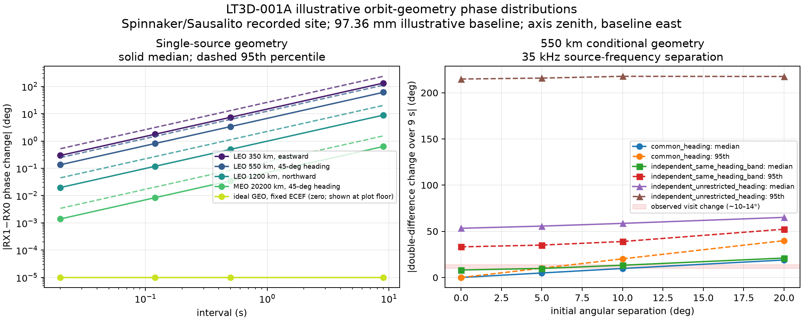

# Conditional orbit-geometry distributions for LT3D-001A phase change

## Result

The matched-pilot change of roughly 10–14 degrees between visits 1065 and
1136 over approximately 9 seconds is physically plausible for many circular
orbit geometries. It is not distinctive evidence for a particular altitude,
orbit, or satellite. In the illustrative 550 km ensemble, the median absolute
two-source double-difference change over 9 seconds is 4.9, 9.8, and 19.0
degrees for initial source separations of 5, 10, and 20 degrees when their
projected headings are correlated. Independent heading choices broaden the
same distributions, sometimes greatly.

The subsecond interpretation differs. Conservative orientation envelopes for
the largest illustrative 114.7 mm baseline and fastest 350 km case allow at
most 1.48 degrees of two-source geometric change in 20 ms and 8.86 degrees in
120 ms. Differences between parity or half-block subsets within the same 20 ms
block that exceed this bound cannot all be orbital change under these
scenarios. They instead expose estimator scatter or possible channel effects.
This bound does not constrain the absolute DD value, and changes between block
starts must use their actual elapsed time rather than the 20 ms window length.
The preferred full-waveform trend of 2.25 degrees/s was not detected, so these
calculations establish scale and plausibility rather than a detection.

## Explicit geometry and conditional prior

The phase model is

`phi = (360 f / c) b dot s` degrees,

with exact line-of-sight evolution under spherical circular two-body motion.
The observer uses the recorded `Spinnaker, Sausalito` metadata: latitude
37.858988 degrees, longitude -122.478103 degrees, and altitude -29 m, rotating
at the sidereal rate in the spherical-Earth model. The metadata comes from the
`scanner-shared-tracking-v14` product for session
`scan-hop-6adcb067e2dbce43`, input manifest
`sha256:a55febbbd6848e82cdf067a374b30e3f7ead0a09a953362052c9fea3a6517071`.
The arbitrary initial sidereal angle is rotationally invariant in this model.
The holder midpoint axis is still illustratively placed at local zenith and its
x axis points east. This fixes the equal-offset RF baseline perpendicular to
the midpoint axis rather than randomizing it independently of the two
mechanical axes. The recorded site is authoritative; the installed holder pose
remains unknown and is not inferred from it.

The verified mount centers are at +/-40 mm and the neck axes diverge by +/-10
degrees. Unknown equal axial electrical phase-center offsets `d` give
`b = 80 + 2 d sin(10 degrees)` mm. The three baseline sensitivities are 80.0,
97.36, and 114.73 mm for `d = 0, 50, 100 mm`. The latter two are illustrative;
none is a measurement of the LNB phase centers, and there is no measured upper
bound on their offset.

The Monte Carlo seed is 20260921 with 30,000 samples. Initial direction is
uniform in solid angle over elevation 20–90 degrees and azimuth 0–360 degrees.
Projected local heading is uniform within +/-15 degrees of the named eastward,
45-degree, or northward scenario. “Northward” is a local projected heading,
not proof of a polar orbital plane. The 350, 550, and 1200 km LEO, 20,200 km
MEO, and ideal stationary-ECEF GEO cases are physical sensitivity scenarios.
ESA describes LEO as below 2,000 km, MEO as between LEO and GEO, and GEO as
matching Earth rotation at 35,786 km [in its orbit overview](https://www.esa.int/Enabling_Support/Space_Transportation/Types_of_orbits).
The ensemble is conditional on these deliberately simple priors; its quantiles
are not actual-sky probabilities. Because each named LEO row changes altitude
and heading together, their Monte Carlo rows are scenarios rather than a pure
altitude comparison; the analytic orientation envelopes isolate altitude. The
ideal fixed-ECEF row is a zero-motion control at arbitrary local directions,
not a physically allowed distribution of GEO positions.

## Single-source RX1-minus-RX0 distributions

These are unwrapped phase changes for the 97.36 mm baseline at the nominal
11,459,687,500 Hz scan-center frequency. Median and 95th percentile are for
absolute change.

| Circular scenario | 20 ms median / p95 | 120 ms median / p95 | 0.5 s median / p95 | 9 s median / p95 |
| --- | ---: | ---: | ---: | ---: |
| 350 km, eastward | 0.30 / 0.52 deg | 1.77 / 3.14 deg | 7.39 / 13.07 deg | 132.45 / 234.31 deg |
| 550 km, 45-degree heading | 0.14 / 0.25 deg | 0.81 / 1.48 deg | 3.38 / 6.18 deg | 60.77 / 111.00 deg |
| 1200 km, northward | 0.02 / 0.05 deg | 0.12 / 0.27 deg | 0.49 / 1.12 deg | 8.87 / 20.14 deg |
| 20,200 km MEO, 45-degree heading | 0.001 / 0.003 deg | 0.008 / 0.021 deg | 0.035 / 0.086 deg | 0.63 / 1.54 deg |
| ideal GEO, fixed ECEF | 0 / 0 deg | 0 / 0 deg | 0 / 0 deg | 0 / 0 deg |

The broad LEO values show why a single RX1-minus-RX0 phase can move rapidly.
They cannot be compared to wrapped measured phases by choosing an integer
cycle. No temporal unwrap is inferred here.

An orientation-independent conservative rate envelope uses

`(sqrt(mu/(R+h)) + Omega R) / h + Omega`

as the maximum angular-rate bound, including observer translation and baseline
rotation. For 350 km it gives single-source bounds of 25.75 and 36.93
degrees/s at 80.0 and 114.7 mm. Summing two such rates bounds an unconstrained
two-source double difference at 51.51 and 73.87 degrees/s. These are bounds,
not distribution quantiles and not claims about the actual orbit.

## Two-source double differences

For two sources the observable change is the temporal change in
`phi_B - phi_A`, not either absolute phase. At 550 km, using a fixed
illustrative 35 kHz frequency separation, the 9-second distributions are:

| Initial separation | Correlated headings median / p95 | Independent within same +/-15-degree band median / p95 | Independent unrestricted heading median / p95 |
| ---: | ---: | ---: | ---: |
| 0 degrees | 0.0002 / 0.0003 deg | 8.14 / 33.16 deg | 53.28 / 214.86 deg |
| 5 degrees | 4.90 / 10.10 deg | 9.80 / 35.08 deg | 55.63 / 215.85 deg |
| 10 degrees | 9.78 / 20.21 deg | 13.28 / 38.97 deg | 58.59 / 217.78 deg |
| 20 degrees | 18.96 / 39.89 deg | 21.07 / 52.28 deg | 65.08 / 217.61 deg |

At zero initial separation, “independent” means two trajectories that cross at
the initial direction and then diverge; it is not a same-satellite model. For
the same line of sight and trajectory, equal-frequency DD is exactly zero.
A finite frequency separation leaves only a `delta_f/f` residual: for 35 kHz
the suppression factor is 3.05e-6 and the absolute same-LOS DD envelope is
0.00336–0.00482 degrees over the three baseline examples. The actual stored
source separation changes from about 35.8 to 33.1 kHz across the visits, so the
constant 35 kHz calculation is a scale illustration. Degree-scale changes
cannot come from the pure same-LOS finite-frequency geometric term alone;
different angular evolution or non-geometric channel response is required.
This does not establish whether the recorded tracklets share a source identity.

## Linear-detrended curvature over nine seconds

The latest matched-pilot cohort finds a near-zero fitted net slope but rejects
the linear model: residual RMS is 5.53 degrees and the largest residual is
11.24 degrees, while its noise-only RMS 95% range is 0.65–1.67 degrees. To test
whether ordinary circular-orbit curvature supplies that structure, each
correlated-heading simulation was sampled at 13 evenly spaced points over nine
seconds and independently fit with an intercept and slope. The residual RMS
distributions are:

| Altitude | Separation | Median residual RMS | 95th percentile | Maximum in ensemble |
| ---: | ---: | ---: | ---: | ---: |
| 350 km | 5 degrees | 0.09 deg | 0.25 deg | 0.44 deg |
| 350 km | 10 degrees | 0.18 deg | 0.50 deg | 0.86 deg |
| 350 km | 20 degrees | 0.36 deg | 0.99 deg | 1.64 deg |
| 550 km | 5 degrees | 0.03 deg | 0.10 deg | 0.17 deg |
| 550 km | 10 degrees | 0.07 deg | 0.19 deg | 0.33 deg |
| 550 km | 20 degrees | 0.14 deg | 0.38 deg | 0.63 deg |

Thus a 5.53-degree detrended RMS is not expected from curvature in these
specific correlated-heading circular scenarios. This comparison does not rule
out other trajectories, changing association, phase wrapping, or channel and
estimator effects, and it is not a fit of geometry to the observed phase.

## Mechanical-axis overlap sensitivity

The +/-10-degree neck axes are treated as boresights only for this sensitivity;
that correspondence has not been measured. Assumed beam half-angles are not
measurements of beamwidth. Requiring both sources to lie inside both receiver
cones gives these prior acceptance fractions:

| Source separation | 15-degree half-angle | 30-degree half-angle | 60-degree half-angle |
| ---: | ---: | ---: | ---: |
| 0 degrees | 1.16% | 11.73% | 60.64% |
| 5 degrees | 0.54% | 10.06% | 57.42% |
| 10 degrees | 0.15% | 8.47% | 53.98% |
| 20 degrees | 0.00% | 5.39% | 47.27% |

These fractions describe the stated direction prior and assumed cones. They do
not estimate the chance that the recorded sources entered the real antenna
patterns. The JSON also contains DD quantiles after each cone condition at 120
ms and 9 s. For example, with an assumed 30-degree half-angle, correlated-track
9-second median / p95 changes are 2.18 / 6.66, 3.87 / 11.76, and 5.91 / 17.99
degrees at 5, 10, and 20 degrees separation. Conditioning changes the
distribution materially, so the unconditioned table must not be relabeled as a
beam-overlap probability.

## Comparison limits and reproducibility

The matched-pilot blocks put visit 1065 near 1–5 degrees, visit 1109 near -1
degree, and visit 1136 near 14–16 degrees. A shortest-arc descriptive change
of about 10–14 degrees from 1065 to 1136 is compatible with the 9-second
conditional distributions above, especially for separated angular tracks.
Unknown installed pose, electrical phase centers, source directions and
identities, channel phase, and phase continuity prevent a likelihood or orbit
classification. Geometry was not fit to the measured phases, and no wrapping
integer was selected.

Artifacts:

- JSON: `reports/figures/2026_09_21_phase_geometry_scenarios/phase-geometry-scenarios-v1.json`
- PNG: `reports/figures/2026_09_21_phase_geometry_scenarios/phase-geometry-scenarios-v1.png`
- Tool: `tools/report_phase_geometry_scenarios.py`
- Tests: `tests/analysis/test_phase_geometry_scenarios_tool.py`

No RF was collected, no QNAP path was written, and no satellite identity was
asserted.
