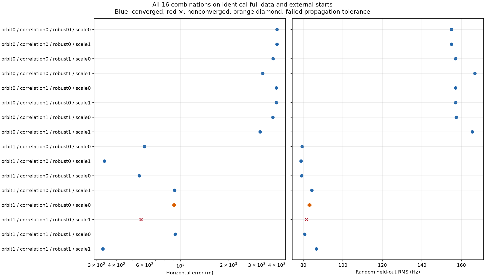
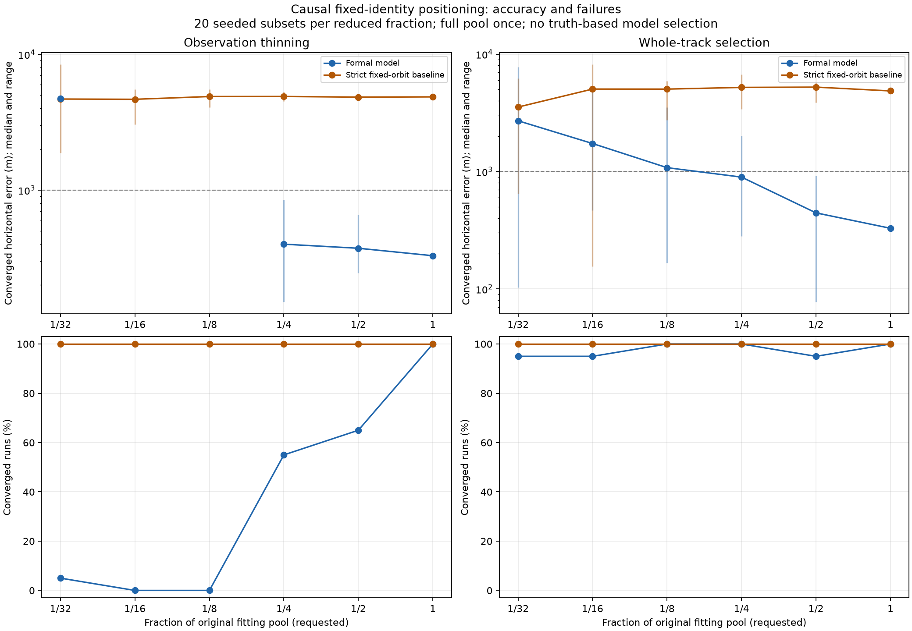

# Strict-causal positioning: four-factor ablation and data down to 1/32

This report separates model components on one fixed archived dataset and
extends the earlier sample-size experiment. It uses no new RF acquisition.
The [breakthrough summary](2026_09_21_positioning_breakthroughs.md) distinguishes
the earlier exploratory 275 m result from the formal 328 m model.

**The main gain survives a clean ablation:** with everything else unchanged,
removing RF orbital refinement increases error from **328.4 m to 3,137.1 m**.
However, useful performance is not unique to the complete statistical model:
the Gaussian, independent-noise variant with learned scale reaches **335.7 m**
and has lower held-out RMS, 78.77 versus 86.59 Hz.

The small-data result is less encouraging. Whole-track selection has median
converged errors of **1.079 km at 1/8, 1.731 km at 1/16, and 2.705 km at 1/32**.
Density thinning has **zero converged fits at 1/8 and 1/16**, and only one at
1/32, with 4.720 km error. These failures must not be interpreted as an
information-theoretic limit: the current statistical model and solver also
break down under sparse within-track support.

## What the component ablations demonstrate

| Change from the complete formal model | Error | Held-out RMS | Interpretation |
|---|---:|---:|---|
| None | 328.4 m | 86.59 Hz | Full reference configuration |
| Disable RF orbit refinement | 3,137.1 m | 165.52 Hz | Largest isolated accuracy loss |
| Remove correlation | 920.6 m | 84.25 Hz | Worse location despite slightly lower RMS |
| Fix sigma at 250 Hz | 927.9 m | 80.63 Hz | Worse location despite lower RMS |
| Replace Student-t with Gaussian | nonconverged | diagnostic only | No valid single-factor accuracy claim |
| Remove correlation AND use Gaussian | 335.7 m | 78.77 Hz | Strong interaction; robust loss is not universally better |

Without RF refinement, all eight variants remain between 3.137 and 3.997 km.
The seven converged variants with refinement lie between 328 and 928 m, though
one fails the numerical qualification below. Orbit correction is therefore the
most consistent explanatory change. Correlation, scale learning, and robust
loss interact; their benefits cannot be added as independent error reductions.
The 7 m difference between the two best configurations is not enough to establish
superiority from one receiver location. We have not selected a new default.

In particular, **lower held-out Doppler RMS does not necessarily mean a more
accurate location**. Orbit adjustments and frequency offsets can explain
residuals at a biased location, and different retained tracks can be easier to
fit. The paired coordinate error and failure rates are essential outcomes.

## Experimental design

The cohort contains 622 fixed satellite-track episodes and 21,702 observations
from 211 recordings, with 12,777 original fitting observations and 8,925 original
randomized held-out observations. Satellite identities are inherited from the
full archived analysis. Both the catalogue availability and TLE epochs precede
capture. The nominal phase correction and prior were learned from pre-target
catalogue history.

Every new fit uses the same independent external starts: (0, 0), (-3,000, 0),
and (3,000, 0) km in the 9,000-mile-square Denver-centred search region. It does
not inherit a full-data receiver location, frequency offset, orbit correction,
noise estimate, or optimizer state. The training objective selects the start.
Receiver truth is used only to score sealed inference results. Held-out rows
never select models, identities, starts, or corrections.

### Full factorial model experiment

We run all **16 combinations** of four binary factors on the same full dataset:

1. RF orbital refinement: bounded per-satellite phase-rate correction on/off.
2. Within-track correlation: declared AR(1) correlation 0.65 versus zero.
3. Robust innovations: normalized Student-t, four degrees of freedom, versus
   normalized Gaussian.
4. Measurement scale: infer sigma with its existing prior versus fix sigma at
   the previously declared 250 Hz.

This includes single-component removals from the formal model and interactions
between the four switches. Orbit refinement off retains the frozen, causal
predicted phase correction. The historical strict baseline additionally has
different nominal states and estimator; it is a separate comparison, not a
single-factor ablation. Across distinct likelihoods the numerical posterior
objective is not used as an accuracy ranking.

### Data-size experiment

Fractions are 1, 1/2, 1/4, **1/8, 1/16, and 1/32**. Reduced fractions have 20
deterministic seeds, paired between the formal and historical strict models.
The new experiment reruns the full pool and adds 240 reduced-data fits; the
previous 160 half/quarter fits are reused, with their original result IDs.
The new factorial adds 16 fits, for **258 new fits** and **418 reported runs**.
Full-pool runs are displayed for both selection methods but counted once.

* **Density:** nested temporal-stratified thinning, retaining exactly the floor
  of the requested fraction of fitting observations. The new sizes are 1,597,
  798, and 399. There is no hidden minimum number per track.
* **Whole track:** nested selection of complete RF episode groups, preserving
  their fitting observations. Requested fractions apply to group count, so
  actual observation counts vary. These are the existing sampler's `pass`
  groups: they are recording/episode groups, not guaranteed independent physical
  satellite passes.

Discarded fitting points remain discarded. Evaluation uses only original
held-out points whose frequency-offset segment is supported by the retained
fitting data. Consequently evaluation populations differ across seeds and
selection methods; lower RMS alone is not proof of better location.

## Sparse-data interpretation

A segment with one fitting observation has a free frequency offset that can
absorb that observation. It supplies no Doppler-shape constraint on position.
For density seed 0, the 399-point 1/32 subset contains 320 segments: 248 have
only one point, 72 have at least two, and just seven have at least three.
At 1/16 there are 496 segments, 257 singletons, and 59 with at least three
points. At 1/8 there are 613 segments, 77 singletons, and 334 with at least three.
Whole-track seed 0 instead retains 19, 38, and 77 complete segments, respectively.

All 59 nonconverged new density fits report failed nuisance convergence. At
1/32 the fitted noise scale is 5.00–5.08 Hz, and at 1/16 it is 5.00–5.34 Hz,
close to the declared 5 Hz floor. At 1/8 it is 14.63–18.44 Hz; all 20 fits still
fail nuisance convergence. Thus noise-bound collapse is not the sole failure.
The free offsets and orbital corrections can fit sparse training data too
flexibly while the iterative nuisance solver fails to settle. This is a
plausible mechanism supported by the diagnostics, not yet isolated by a
sparse-data noise-model ablation.

The lone converged 1/32 density result has a nominal 96 m 95% major semiaxis
but 4,720 m actual error. A convergence flag and small covariance are therefore
insufficient acceptance criteria. For whole tracks, sub-km success across all
20 attempts is 9/20 at 1/8, 3/20 at 1/16, and 2/20 at 1/32.

This explains why the two sampling experiments ask different questions.
Density thinning preserves more identities and sky/time coverage but can
destroy the within-track slope and curvature. Whole-track selection preserves
shape but sacrifices coverage. Neither represents a newly acquired device
identifying satellites from scratch with only those samples.

## Scope and remaining uncertainty

The reference coordinate is 37.84903264307456 N, 122.4856541910174 W.
It is not an inference input. This is one known-site archive, with overlapping
seeded subsets; their spread is not a population confidence interval.
Nonconverged results remain failures even if their coordinate looks accurate.
The formal local covariance was already shown to be overconfident and is not
used to declare a trustworthy position lock here.

This is a complete factorial over the four declared switches, not an exhaustive
study of every conceivable model. Nominal orbit-mean prediction, prior width,
clock uncertainty, shared versus independent orbital corrections, frequency
offset structure, and identity inference remain separate modelling choices.
No new default is selected using this archive's reference coordinate.

### Numerical qualification

Exact SGP4 checks were run for all 15 converged factorial variants and all 60
converged formal small-data/full-pool fits. All 60 latter fits pass the frozen
0.2 Hz maximum-error tolerance; their largest discrepancy is 0.1357 Hz.
Fourteen factorial variants pass. The correlated Gaussian variant with fixed
250 Hz scale fails: 0.7423 Hz maximum discrepancy, 0.0203 Hz RMS. Its 912 m
coordinate is retained as a numerically unqualified diagnostic, not promoted
by relaxing the tolerance. The nonconverged factorial variant is not certified.

These checks compare all 21,702 cached observations at each fitted receiver
position. Unfitted satellite rates use zero, exactly as in the numerical core.
They verify propagation approximation, not association identity or uncertainty
calibration. Baseline nominal states are unchanged from the archived strict
causal replay.

### Next experiments suggested by these results

1. Address sparse offset/noise estimation: compare profiled offsets with a
   marginalized or suitably regularized formulation and a noise prior learned
   independently of sparse target-track residuals. Keep the current failures
   as regression cases rather than increasing iteration limits until they pass.
2. Preserve usable within-track time separation when budgeting observations;
   compare fewer complete tracks against thinning that explicitly retains
   slope/curvature support. This would be a different sampler, not a retrofit
   that changes the meaning of this benchmark's fractions.
3. Compare the 328 m robust-correlated model and 336 m Gaussian-independent
   model on independent sessions/sites, with receiver truth reserved for
   evaluation and explicit uncertainty coverage tests.

## Reproduction and artifacts

The planner is `tools/benchmark_position_ablations.py`; execution uses the
existing `tools/benchmark_position_subsets.py` process-pool runner. Rendering
uses `tools/report_position_ablations.py`. Inference plans preserve config,
source, state-cache, manifest, and membership hashes. Individual sealed result
files retain all three start diagnostics and fitted nuisance parameters.

Committed artifacts:

* [Factorial evaluation](artifacts/2026_09_21_position_ablations/factorial-evaluation.json)
  and [new sample-size evaluation](artifacts/2026_09_21_position_ablations/small-data-evaluation.json).
* [Grouped statistics](artifacts/2026_09_21_position_ablations/grouped-results.json)
  and [all sealed results and exact checks](artifacts/2026_09_21_position_ablations/raw-results.tar.gz).
* [Factorial propagation summary](artifacts/2026_09_21_position_ablations/factorial-exact-summary.json)
  and [small-data propagation summary](artifacts/2026_09_21_position_ablations/small-data-exact-summary.json).
* Compact [factorial plan](artifacts/2026_09_21_position_ablations/factorial-compact-plan.json)
  and [sample-size plan](artifacts/2026_09_21_position_ablations/small-data-compact-plan.json),
  with membership hashes and reconstruction settings.
* [Artifact checksums](artifacts/2026_09_21_position_ablations/checksums.json)
  and [source transition receipt](artifacts/2026_09_21_position_ablations/source-transition.json).
  The exact executed numerical source is archived; the final formatting pass
  preserved its numerical AST.

The prior half/quarter runs and their frozen source are in the
[earlier benchmark](2026_09_21_position_subset_benchmark.md). The two historical
formal model names in that archive refer to the same recorded numerical source
hash; the renderer normalizes their display name only.

The Gaussian branch is tested against an independently calculated normalized
Gaussian likelihood with orbit refinement disabled. Sampler tests check exact
floor counts through 1/32, nested membership, deterministic ordering, invalid
fractions, and exclusion of discarded fitting data from holdout. A report test
ensures even a very accurate nonconverged estimate cannot enter successful-fit
statistics. Existing held-out isolation and optimizer regression tests remain
in place.

Two interactive batch runners terminated with SIGTERM partway through. Their
completed atomic results were retained, and unfinished work resumed under
temporary user services at lower CPU priority. Interrupted jobs were rerun;
completed nonconverged numerical fits were not retried until successful.

### Re-run from the committed inputs

From the repository root, create a new writable output directory. The following
reconstructs configuration without depending on the original `/tmp` paths.
It requires the repository's scientific Python environment.

```python
import gzip, json
from pathlib import Path

artifacts = Path("reports/artifacts").resolve()
out = Path("/tmp/position-ablation-reproduction")
out.mkdir(exist_ok=True)
manifest = out / "manifest.json"
manifest.write_bytes(gzip.decompress(
    (artifacts / "2026_09_21_position_subset_benchmark/manifest-v1.json.gz").read_bytes()))
cfg = json.loads((artifacts / "2026_09_21_position_ablations/small-data-config.json").read_text())
cfg["manifest_path"] = str(manifest)
cfg["prepared_states_npz"] = str(artifacts / "2026_09_21_formal_orbit_model/phase-states.npz")
cfg["legacy_states_npz"] = str(artifacts / "2026_09_21_position_ablations/strict-states.npz")
(out / "config.json").write_text(json.dumps(cfg, indent=2))
```

```bash
export PYTHONPATH=src:tools OPENBLAS_NUM_THREADS=1 OMP_NUM_THREADS=1
python tools/benchmark_position_ablations.py \
  --config /tmp/position-ablation-reproduction/config.json \
  --output /tmp/position-ablation-reproduction
for name in factorial small-data; do
  python tools/benchmark_position_subsets.py run \
    --plan /tmp/position-ablation-reproduction/$name-plan.json \
    --adapter benchmark_position_subsets:formal_fixed_identity_adapter \
    --result-dir /tmp/position-ablation-reproduction/$name-results --workers 8
  python tools/verify_position_ablation_plan.py \
    --plan /tmp/position-ablation-reproduction/$name-plan.json \
    --results /tmp/position-ablation-reproduction/$name-results \
    --output /tmp/position-ablation-reproduction/$name-exact \
    --prior reports/artifacts/2026_09_21_formal_orbit_model/prior-analysis.json \
    --reranking reports/2026_09_20_strict_causal_vs_retrospective/strict-reranking.json
  python tools/benchmark_position_subsets.py summarize \
    --plan /tmp/position-ablation-reproduction/$name-plan.json \
    --result-dir /tmp/position-ablation-reproduction/$name-results \
    --output /tmp/position-ablation-reproduction/$name-evaluation.json \
    --figure /tmp/position-ablation-reproduction/$name-diagnostic.png \
    --truth-latitude-deg 37.84903264307456 --truth-longitude-deg -122.4856541910174
done
python tools/report_position_ablations.py \
  --factorial /tmp/position-ablation-reproduction/factorial-evaluation.json \
  --sparse /tmp/position-ablation-reproduction/small-data-evaluation.json \
  --factorial-exact /tmp/position-ablation-reproduction/factorial-exact/summary.json \
  --previous reports/artifacts/2026_09_21_position_subset_benchmark/evaluation-final.json \
  --output /tmp/position-ablation-reproduction/figures
```

These commands regenerate plots and Markdown tables; interpretation is reviewed
separately. Relocated input paths change job hashes, not the numerical data.

<!-- GENERATED RESULTS -->

## All 16 full-data model combinations

1 enables a factor; 0 removes it. Orbit0 freezes the pre-capture predicted correction; it does not remove that causal prior mean. Scale0 fixes measurement sigma at the predeclared 250 Hz. Robust0 uses the normalized Gaussian likelihood. Correlation0 treats innovations as independent.

| Orbit / correlation / robust / learned scale | Status | Error, m | Held-out RMS, Hz | Fitted sigma, Hz | Exact propagation max error, Hz |
|---|---|---:|---:|---:|---|
| orbit0-correlation0-robust0-scale0 | converged | 3,997.0 | 154.97 | 250.00 | 0.0000 (pass) |
| orbit0-correlation0-robust0-scale1 | converged | 3,997.0 | 154.97 | 150.17 | 0.0000 (pass) |
| orbit0-correlation0-robust1-scale0 | converged | 3,789.9 | 157.00 | 250.00 | 0.0000 (pass) |
| orbit0-correlation0-robust1-scale1 | converged | 3,257.2 | 166.83 | 86.25 | 0.0000 (pass) |
| orbit0-correlation1-robust0-scale0 | converged | 3,962.3 | 157.11 | 250.00 | 0.0000 (pass) |
| orbit0-correlation1-robust0-scale1 | converged | 3,962.3 | 157.11 | 140.44 | 0.0000 (pass) |
| orbit0-correlation1-robust1-scale0 | converged | 3,772.7 | 157.43 | 250.00 | 0.0000 (pass) |
| orbit0-correlation1-robust1-scale1 | converged | 3,137.1 | 165.52 | 68.59 | 0.0000 (pass) |
| orbit1-correlation0-robust0-scale0 | converged | 596.4 | 79.34 | 250.00 | 0.0662 (pass) |
| orbit1-correlation0-robust0-scale1 | converged | 335.7 | 78.77 | 73.67 | 0.0784 (pass) |
| orbit1-correlation0-robust1-scale0 | converged | 554.5 | 79.11 | 250.00 | 0.0669 (pass) |
| orbit1-correlation0-robust1-scale1 | converged | 920.6 | 84.25 | 34.53 | 0.0810 (pass) |
| orbit1-correlation1-robust0-scale0 | converged | 912.3 | 83.04 | 250.00 | 0.7423 (FAIL) |
| orbit1-correlation1-robust0-scale1 | nonconverged | 567.3 | 81.56 | 114.90 | not checked |
| orbit1-correlation1-robust1-scale0 | converged | 927.9 | 80.63 | 250.00 | 0.0685 (pass) |
| orbit1-correlation1-robust1-scale1 | converged | 328.4 | 86.59 | 45.32 | 0.1043 (pass) |



## Sample-size results

Medians and ranges below include converged fits only. The convergence and sub-km columns retain every attempted seed in their denominator. A reported converged fit is an optimizer outcome, not independently verified acquisition or calibrated uncertainty.

| Model | Selection | Fraction | Fitting observations | Converged | Sub-km / all attempts | Error median (range), m | Held-out RMS median (range), Hz |
|---|---|---:|---:|---:|---:|---:|---:|
| Formal | density | 1/32 | 399–399 | 1/20 | 0/20 | 4,719.9 (4,719.9–4,719.9) | 196.3 (196.3–196.3) |
| Formal | density | 1/16 | 798–798 | 0/20 | 0/20 | unavailable | unavailable |
| Formal | density | 1/8 | 1597–1597 | 0/20 | 0/20 | unavailable | unavailable |
| Formal | density | 1/4 | 3194–3194 | 11/20 | 11/20 | 399.4 (150.1–848.7) | 94.4 (90.8–103.6) |
| Formal | density | 1/2 | 6388–6388 | 13/20 | 13/20 | 372.7 (245.1–659.4) | 87.4 (84.9–91.7) |
| Formal | density | 1/1 | 12777–12777 | 1/1 | 1/1 | 328.4 (328.4–328.4) | 86.6 (86.6–86.6) |
| Formal | pass | 1/32 | 328–436 | 19/20 | 2/20 | 2,704.9 (102.8–7,772.7) | 60.1 (44.5–116.7) |
| Formal | pass | 1/16 | 737–902 | 19/20 | 3/20 | 1,731.4 (466.6–5,197.9) | 77.2 (62.0–140.2) |
| Formal | pass | 1/8 | 1453–1738 | 20/20 | 9/20 | 1,078.6 (166.0–3,515.2) | 76.9 (64.8–113.2) |
| Formal | pass | 1/4 | 2967–3360 | 20/20 | 13/20 | 896.2 (280.7–2,008.5) | 74.0 (66.9–90.7) |
| Formal | pass | 1/2 | 6130–6667 | 19/20 | 19/20 | 444.4 (77.6–919.0) | 78.5 (69.0–89.2) |
| Formal | pass | 1/1 | 12777–12777 | 1/1 | 1/1 | 328.4 (328.4–328.4) | 86.6 (86.6–86.6) |
| Baseline | density | 1/32 | 399–399 | 20/20 | 0/20 | 4,684.4 (1,879.5–8,432.3) | 212.6 (197.7–233.8) |
| Baseline | density | 1/16 | 798–798 | 20/20 | 0/20 | 4,664.5 (3,054.6–5,521.4) | 199.5 (192.5–206.2) |
| Baseline | density | 1/8 | 1597–1597 | 20/20 | 0/20 | 4,888.1 (4,058.4–5,517.2) | 177.2 (173.0–184.8) |
| Baseline | density | 1/4 | 3194–3194 | 20/20 | 0/20 | 4,892.7 (4,498.9–5,273.4) | 161.6 (160.4–163.6) |
| Baseline | density | 1/2 | 6388–6388 | 20/20 | 0/20 | 4,837.8 (4,566.4–5,095.6) | 158.8 (158.0–159.4) |
| Baseline | density | 1/1 | 12777–12777 | 1/1 | 0/1 | 4,859.5 (4,859.5–4,859.5) | 157.1 (157.1–157.1) |
| Baseline | pass | 1/32 | 328–436 | 20/20 | 1/20 | 3,540.5 (647.9–6,215.0) | 135.7 (96.1–184.3) |
| Baseline | pass | 1/16 | 737–902 | 20/20 | 1/20 | 5,039.5 (155.3–8,176.9) | 149.6 (117.5–198.9) |
| Baseline | pass | 1/8 | 1453–1738 | 20/20 | 0/20 | 5,035.5 (2,733.8–5,899.3) | 148.6 (126.7–173.4) |
| Baseline | pass | 1/4 | 2967–3360 | 20/20 | 0/20 | 5,205.0 (3,405.5–6,727.4) | 148.0 (133.6–158.6) |
| Baseline | pass | 1/2 | 6130–6667 | 20/20 | 0/20 | 5,233.8 (3,882.9–6,824.0) | 148.3 (142.5–153.3) |
| Baseline | pass | 1/1 | 12777–12777 | 1/1 | 0/1 | 4,859.5 (4,859.5–4,859.5) | 157.1 (157.1–157.1) |


