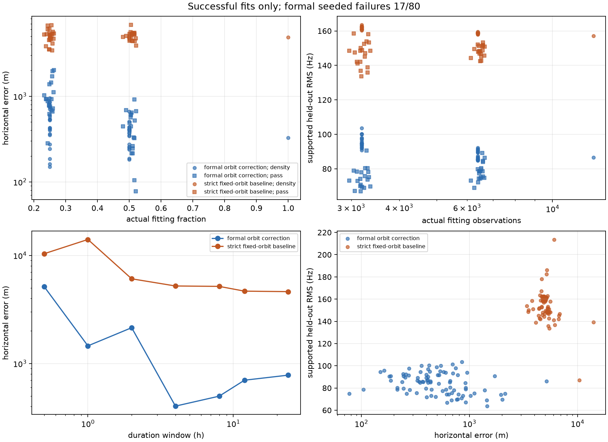

# Fixed-identity position subset benchmark

This is a conditional fixed-identity local replay, not an end-to-end acquisition
benchmark. The 622 identities were inherited from the archived full-RF analysis.
Every reduced fit nevertheless used three common external starts, `[0, 0]`,
`[-3000, 0]`, and `[3000, 0]` km; no reduced fit inherited a full-fit position,
offset, orbital correction, or optimizer state. The coordinate
`37.84903264307456, -122.4856541910174` was applied only after all 176 inference
jobs had been sealed.

The final matrix used 21,702 observations: 12,777 fitting and 8,925 original
held-out observations. It contains seeds 0–19 for density and whole-pass 25/50%
subsets, one shared full membership, primary duration quarters/halves, and
30-minute, 1-, 2-, 4-, and 8-hour prefixes. It accounts for all 176 paired jobs.
Formal fitting succeeded on 63/80 seeded subsets: 11/20 density quarters, 13/20
density halves, 20/20 pass quarters, and 19/20 pass halves. All baseline fits,
the full fit, and all seven duration fits converged. Errors below are conditional
on a successful formal fix; failure denominators remain primary results.

On the complete fitting pool, formal error was 328.4 m with 86.59 Hz supported
held-out RMS; the strict baseline was 4,859.5 m and 157.09 Hz. All three external
starts reached the formal basin without a parent-fit initializer. This is close
to, but methodologically distinct from, the archived approximately 275 m local
replay, which used a full-data-derived local mode and different nuisance
treatment.

| Selection | Actual fitting count | Formal error median (range), m | Baseline error median (range), m | Formal held-out RMS median, Hz |
|---|---:|---:|---:|---:|
| Density, 25% | 3,194 | 399.4 (150.1–848.7), 11/20 | 4,892.7 (4,498.9–5,273.4), 20/20 | 94.41 |
| Density, 50% | 6,388 | 372.7 (245.1–659.4), 13/20 | 4,837.8 (4,566.4–5,095.6), 20/20 | 87.41 |
| Whole pass, requested 25% | 2,967–3,360 | 896.2 (280.7–2,008.5), 20/20 | 5,205.0 (3,405.5–6,727.4), 20/20 | 74.04 |
| Whole pass, requested 50% | 6,130–6,667 | 444.4 (77.6–919.0), 19/20 | 5,233.8 (3,882.9–6,824.0), 20/20 | 78.49 |
| Full fitting pool | 12,777 | 328.4, 1/1 | 4,859.5, 1/1 | 86.59 |

Density uses a global deterministic floor after round-robin temporal
stratification. It retained 3,194 (24.998%) and 6,388 (49.996%) observations;
no minimum was silently forced. The earlier per-bin-floor design retained only
16.97% for its nominal quarter and is archived as a superseded diagnostic.
Whole-pass actual fractions ranged from 23.22–26.30% and 47.98–52.18%. Seed
spread is subset sensitivity, not a confidence interval for new sites.

Duration was not monotone. Formal error was 5,148.7 m at 30 minutes, 1,455.2 m
at one hour, 2,142.6 m at two hours, 402.8 m at four hours, and 498.0 m at eight
hours. The 25% and 50% campaign prefixes retained 5,086 and 8,258 fitting
observations and produced 699.8 m and 779.5 m errors. Their evaluation
denominators were respectively 3,570 and 5,775 supported original held-out
observations. Excluded-track evaluation was marked unavailable; discarded
training observations were never reclassified as held-out.

The first frozen optimizer allowed the fitted measurement scale to stick at its
2,000 Hz upper bound and produced a misleading 3.35 km full result. Those v5
outputs are retained as an optimizer-failure diagnostic. A truth-blind restart
at the same position and the midpoint of the declared log-scale bounds recovered
the 45.32 Hz, 328 m basin. A separate copied-core diagnostic increased nuisance
iterations from 60 to 240 for one failed quarter; it still ended with both outer
and nuisance convergence false, so failed jobs were not promoted by relaxed
tolerances.

The compact evaluation is
[`evaluation-final.json`](artifacts/2026_09_21_position_subset_benchmark/evaluation-final.json).
The immutable manifest and compact reconstruction plan are stored beside it. Raw
per-job results, including exact evaluation IDs and all-start diagnostics, are
retained in `raw-results-final.tar.gz`; v5 failures are separate. The final formal
numerical source hash was
`sha256:5d8e3deb114f76ed80acf20c1073ccfdbe12fcde7ac26e64de6a01c9d0100283`;
the prepared strict-causal orbit-phase cache hash was
`sha256:96128825f740a7d4054f85c513f5aea41c450cfaf8524608f4f239a232f60069`.
