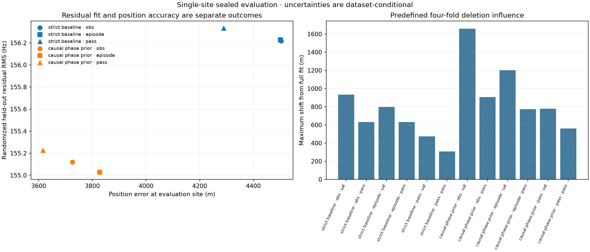

# Cluster weighting and local uncertainty in causal positioning

**Equal candidate-pass weighting improves the archived strictly causal position
from 4,503 m to 4,289 m, and combines with the independently frozen causal
orbital-phase prior to reach 3,616 m.**  This is an 888 m (19.7%) reduction from
the archived observation-weighted baseline, but it is not a sub-kilometre
result.  The phase-prior pass-weighted fit has 155.23 Hz randomized held-out RMS,
versus 156.22 Hz for the archived baseline.

## Sealed comparison

The fitting benchmark was written before the reference coordinate was supplied
to the evaluator.  It fixes the complete 622-episode / 21,702-observation
cohort, strict pre-capture identities and elements, randomized RF partitions,
robust 250 Hz loss scale, and shared clock inside the recorded bound.  It reports
all three predeclared weighting policies; the known coordinate selected none of
them.

| Causal orbit model | Fitting weight | Position error | Held-out RMS | Shared clock |
|---|---|---:|---:|---:|
| Archived strict baseline | Observation | 4,503 m | 156.218 Hz | −99.66 ms, at bound |
| Archived strict baseline | Episode | 4,501 m | 156.229 Hz | −99.66 ms, at bound |
| Archived strict baseline | Candidate pass | **4,289 m** | 156.332 Hz | −99.66 ms, at bound |
| Frozen causal phase prior | Observation | 3,726 m | 155.120 Hz | +67.44 ms |
| Frozen causal phase prior | Episode | 3,827 m | **155.027 Hz** | −29.95 ms |
| Frozen causal phase prior | Candidate pass | **3,616 m** | 155.227 Hz | −74.81 ms |

An episode is one exported track.  A candidate pass is a unique recording and
NORAD pair, reducing 622 episodes to 468 fitting units.  Episode weighting gives
every exported track equal total squared weight.  Pass weighting also prevents
repeated tracks for one recording/satellite pair from multiplying its evidence.
All unweighted held-out RMS values retain every held-out observation, so changing
the fitting weight cannot improve that metric merely by redefining its average.

The pass-balanced baseline gains 214 m while its held-out RMS worsens by 0.11 Hz.
The pass-balanced phase prior gains another 674 m relative to the pass-balanced
baseline.  These paired outcomes reinforce that held-out frequency residual and
position accuracy measure different things.

## Correlated information and deletion influence

Local covariance is computed from training observations using the numerical
Jacobian of the same robust, profiled objective.  Sandwich estimates cluster
scores by episode, candidate pass, satellite, or recording.  They are wider than
an IID model-based calculation, as expected for repeated Doppler samples.

| Model and weight | IID local horizontal RMS | Pass-cluster RMS | Maximum satellite-fold shift | Maximum pass-fold shift |
|---|---:|---:|---:|---:|
| Baseline, observation | 134 m | 635 m | 934 m | 633 m |
| Baseline, episode | 138 m | 692 m | 798 m | 632 m |
| Baseline, pass | 138 m | **565 m** | **474 m** | **308 m** |
| Phase prior, observation | 222 m | 909 m | 1,659 m | 906 m |
| Phase prior, episode | 218 m | 915 m | 1,201 m | 772 m |
| Phase prior, pass | 205 m | **806 m** | **777 m** | **560 m** |

The deletion design was frozen as four deterministic SHA-256 folds for each of
two groupings.  Every row above therefore summarizes the same four satellite
deletions or four candidate-pass deletions, rather than a subset chosen after
seeing the reference position.  Pass weighting materially reduces the worst
deletion shift in both orbit models.  The phase prior improves the full-data
position but is less deletion-stable than the strict baseline under the same
pass weighting.

The baseline clock is at its lower bound, where an unconstrained clock covariance
would be invalid.  Its covariance therefore conditions on the active bound.  The
phase-prior clocks are interior and their estimates jointly include the shared
clock.  This explains part of their wider local covariance.

The local horizontal RMS scales remain much smaller than the actual
multi-kilometre errors.  That discrepancy is descriptive rather than a formal
ellipse-containment test.  Even the pass-cluster estimate describes local
variation conditional on the frozen orbit model and identities.  It does not
include common orbital bias, association error, an uncertain active clock
constraint, or site-to-site variation.  The single known site cannot calibrate
a universal position-error probability or coverage claim.

## Cohort limitation

The comparison intentionally retains the published matched cohort.  Its source
export has 684 episodes / 24,149 unique observations, of which 62 episodes /
2,447 observations are outside this cohort.  A subsequent read-only upstream
recovery found [1,774 leading tracklets / 43,831 observations, including 553
shorter fragments](2026_09_21_extended_tracklet_positioning.md).  That separate
conditional replay finds useful support in additional gate-length tracks but no
further position gain from the shorter fragments.  It does not alter this
matched primary weighting comparison or lower any production gate.

## Artifacts and reproduction

- [Sealed fits and covariance diagnostics](2026_09_21_position_weighting_uncertainty/analysis.json)
- [Reference-only evaluation](2026_09_21_position_weighting_uncertainty/evaluation.json)
- `tools/benchmark_position_weighting.py` performs the truth-blind fitting and
  predefined deletion ablations.
- `tools/evaluate_uncertain_position.py` scores sealed benchmark or agent result
  JSON files and renders the comparison figure.

Run the benchmark with the strict causal inference/states and frozen causal
phase-prior inference/states, then give only its completed JSON to the evaluator
with `37.84903264307456, -122.4856541910174`.  The evaluator uses the same
6,371,008.8 m spherical distance convention as the archived report.  Seven
focused positioning and evaluation tests pass.
