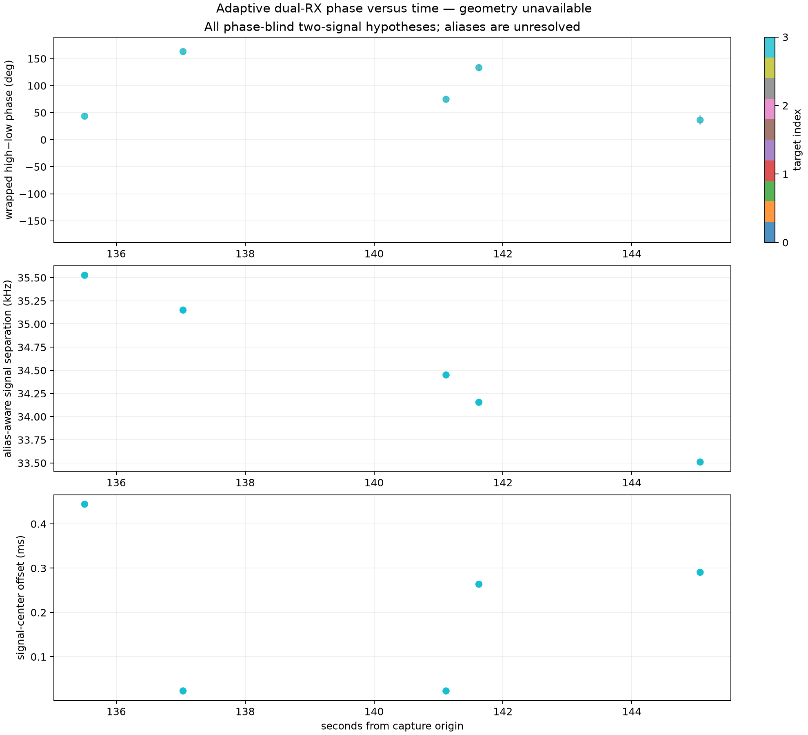
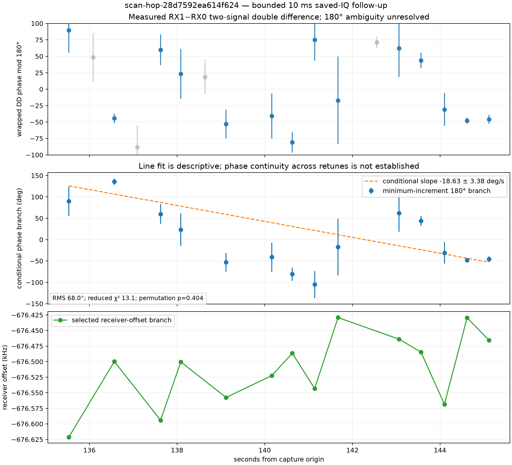

# `scan-hop-28d7592ea614f624` dual-RX phase difference

Date: 2026-09-21. Scope: saved-IQ analysis of one existing simultaneous dual-RX
adaptive scan. No RF was collected. Status: measured receiver-phase double
differences recovered; a coherent cross-retune slope is not established.

## Result

The complete production phase V2 pass processed all 2,360 visits using the
sealed 120 ms GLRT policy. Five visits contain one qualified phase-blind
two-signal hypothesis. The manifest and PNG are published as `ready`:

- capture input manifest
  `sha256:f76cea9410b79073527bb0b615e017bff4460c09169613f8a43b8e3baac6c96f`;
- GLRT binding
  `sha256:e70d23f43351de8caf32bcf3e47efe9e035d3970873edf92b1a9edb3656b9ba4`;
- GLRT metrics manifest
  `sha256:8fa368cac0e1808a926ec776462c27236dd4ccbffa8e25d93d6d105969c3bbca`;
- phase PNG
  `sha256:8a14bc0d29e81c425318be4f37375fab0ed925b0791cb5078ac72e35c9dfaf04`,
  144,859 bytes.



The sparse points alone do not form a four-point track under the frozen
September 16 gates. Visit 1065 is on a receiver-offset branch near -563 kHz in
the 120 ms product, while visits 1077, 1109, 1113, and 1140 are near -676.5 kHz.
The 1077-to-1109 gap is 4.08 seconds, beyond the predeclared 3.5-second limit.
It is therefore incorrect to fit one line through all five sparse points.

## Bounded dense follow-up

A 10 ms saved-IQ follow-up examined 20 target-3 visits from 1065 through 1140.
The selection was fixed before reading phase. Eighteen visits yielded a
qualified two-signal double difference. Association used target, elapsed time,
visit distance, both alias-aware signal-frequency trajectories, signal
separation, pilot quality, and an explicit receiver-offset branch gate. Phase
and phase rate were not association inputs.

One 14-point branch passes those gates. It spans 9.588 seconds and has receiver
offsets from -676.621 to -676.429 kHz. The remaining four qualified visits are
shown in gray because they lie on a different unresolved receiver-offset alias
branch or do not form a four-point path.



| Quantity | Result |
| --- | ---: |
| selected saved-IQ visits | 20 |
| qualified double-difference visits | 18 |
| phase-blind associated branch | 14 points |
| associated time span | 9.588 s |
| conditional minimum-increment slope | -18.63 +/- 3.38 degrees/s |
| leave-one-out slope range | -19.51 to -6.62 degrees/s |
| median per-point phase standard error | 24.19 degrees |
| unweighted line residual RMS | 68.00 degrees |
| uncertainty-weighted residual RMS | 38.35 degrees |
| normalized residual RMS | 3.35 |
| reduced chi-square | 13.08 |
| modulo-pi increment concentration | 0.260 |
| phase-permutation p-value | 0.404 |

The numeric slope is conditional on choosing the minimum-increment 180-degree
branch after the phase-blind association is frozen. The Qin/BPSK half-cycle is
unresolved, aliases are unresolved, and the capture does not assert phase
continuity across retunes. The large residuals, high reduced chi-square, weak
increment concentration, and non-small permutation result show that this line
does not describe a coherent phase progression. It is a descriptive sensitivity
value, not a recovered physical slope.

The dense and 120 ms products select different probe support within a visit.
Dense qualification therefore does not mean the 18 points are precise or direct
duplicates of the sparse measurements. Several dense uncertainties are tens of
degrees, including 66.6 degrees at visit 1113 and 43.7 degrees at visit 1124.
The fit uses the predeclared per-point uncertainties and does not choose points
or a phase branch to improve agreement with the line.

## Observable and limits

For each signal, the extractor measures the local simultaneous receiver product
`RX1 * conjugate(RX0)`. For two phase-blind associated signals it reports the
high-minus-low difference at a common session time. Each acquired CFO phase
origin is restored exactly once. This is the same corrected phase-reference
rule used by the successful September 16 analysis.

The measurement is a receiver-phase double difference. It is not an absolute
geometric phase, satellite identity, baseline projection, or path length.
Unequal LNB phase, differential group delay, alias choice, asynchronous frame
support, multipath, and retune behavior remain possible contributions.

## Reproduction

The bounded dense IQ result is frozen in
[the canary evidence](figures/2026_09_21_adaptive_dual_rx_local_phase/scan-hop-28d7592ea614f624-dense-phase-canary-v1.json).
The phase-blind association, uncertainty-weighted conditional fit, diagnostics,
and figure can be regenerated without reading IQ:

```bash
.venv/bin/python tools/report_adaptive_dense_phase_progression.py \
  --input reports/figures/2026_09_21_adaptive_dual_rx_local_phase/scan-hop-28d7592ea614f624-dense-phase-canary-v1.json \
  --summary reports/figures/2026_09_21_adaptive_dual_rx_local_phase/scan-hop-28d7592ea614f624-dense-phase-summary-v1.json \
  --png reports/figures/2026_09_21_adaptive_dual_rx_local_phase/scan-hop-28d7592ea614f624-dense-phase-progression-v1.png
```

The [machine-readable summary](figures/2026_09_21_adaptive_dual_rx_local_phase/scan-hop-28d7592ea614f624-dense-phase-summary-v1.json)
records every retained state, gate, fit statistic, source digest, and ambiguity
label.
