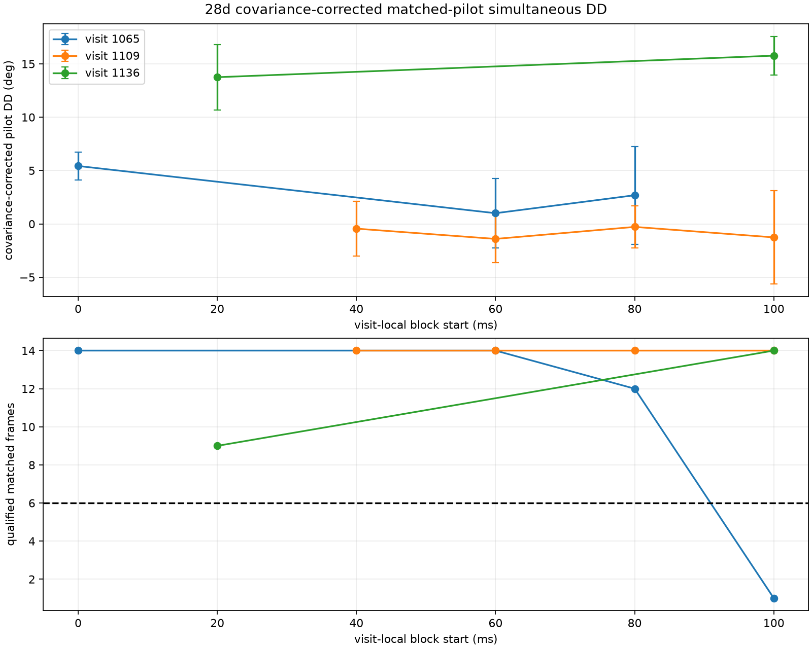

# Matched-pilot simultaneous phase on three `28d` visits

## Result

A bounded saved-IQ replay tested whether full known-pilot frames can estimate
the simultaneous high-source minus low-source difference of RX1-minus-RX0
phase more precisely than the earlier 12 kHz narrowband estimator.  On the
three preselected visits, the answer is yes, conditionally: nine of ten frozen
20 ms overlap blocks have at least six qualified frames, with adjacent-frame
bootstrap standard errors of 1.3 to 4.6 degrees.  The earlier narrowband replay
had visit-level standard errors of 16 to 34 degrees.

| Visit | Block start (ms) | Qualified frames | Effective weighted frames | DD (deg) | Conditional adjacent-pair SE (deg) | Resultant |
|---:|---:|---:|---:|---:|---:|---:|
| 1065 | 0 | 14 | 11.91 | +5.43 | 1.32 | 0.991 |
| 1065 | 60 | 14 | 11.34 | +1.00 | 3.23 | 0.963 |
| 1065 | 80 | 12 | 8.53 | +2.69 | 4.59 | 0.973 |
| 1109 | 40 | 14 | 11.37 | -0.44 | 2.57 | 0.984 |
| 1109 | 60 | 14 | 12.39 | -1.40 | 2.24 | 0.988 |
| 1109 | 80 | 14 | 13.06 | -0.28 | 1.97 | 0.984 |
| 1109 | 100 | 14 | 12.75 | -1.26 | 4.38 | 0.963 |
| 1136 | 20 | 9 | 6.97 | +13.75 | 3.06 | 0.976 |
| 1136 | 100 | 14 | 13.23 | +15.77 | 1.80 | 0.989 |

Visit 1065's 100 ms block had only one qualifying frame and is retained as
`insufficient_qualified_frames`, rather than promoted to a phase estimate.
The result shows a stable within-visit observable in these three visits.  It
does not by itself establish an absolute geometric phase or a source catalogue
identity.

## Estimator and noise-bias control

The estimator uses one global receiver-frequency reference for both sources.
For each paired frame lattice it takes the exact sample intersection of known
Qin pilot symbols 2 through 301, then jointly fits the two complex source
templates in each receiver.  This gives 278 to 283 overlapping known symbols
per frame despite the source epoch offsets.

For receiver `r`, the fit is

`beta_r = (X_r^H X_r)^-1 X_r^H y_r`.

The within-receiver source cross-product is corrected by its fitted white-noise
covariance before the two receivers are differenced:

`C_r = beta_r,high conjugate(beta_r,low) - Cov_r[high,low]`

`DD = C_1 conjugate(C_0)`.

This correction is necessary because the naive product is positively biased
toward zero phase when source templates overlap in noise.  Deterministic
component controls cover independent noise only, one source only, two sources
with a known nonzero DD and unequal amplitudes, and correlated receiver noise.
The corrected independent-noise mean falls below 10 percent of the naive bias;
the one-source case does not qualify; and the injected two-source phase is
recovered within one degree.  Correlated receiver residuals are deliberately
not claimed to be corrected.  They remain a measured qualification diagnostic.

In the real replay, the joint designs are well conditioned: normalized template
coherence is 0.001 to 0.018, Gram condition is 1.003 to 1.036, and the actual
covariance correction changes block phase by less than 0.004 degrees.  The
qualified-frame exact-to-symbol-roll explained-power ratios are at least 28.7,
apart from no frame used solely because of phase.  Residual cross-receiver
coherence is 0.026 to 0.180 against the predeclared 0.20 ceiling.

The finite 3-by-3 symbol-alias search selected `(0, 0)` for all three visits;
winner-to-runner score ratios are 1.44, 1.44, and 1.89.  Magnitude-only alias
selection is phase blind, but this finite search is not proof of absolute alias
uniqueness.

## Independent-support diagnostics

The adjacent-pair bootstrap resamples neighboring frame pairs within a frozen
20 ms block.  Its 1.3-to-4.6-degree errors are conditional on the selected
source pair, alias branch, exact/control gates, and frontend response.  They do
not include every systematic error.  The simpler IID-frame bootstrap gives
similar 2.0-to-4.7-degree errors.

The following diagnostics were computed after the block selection and are
reported rather than used as post-hoc phase gates:

- Aggregate first-half versus second-half sample phases differ by 0.46 to 8.42
  degrees.
- Aggregate sample-parity phases differ by 0.70 to 8.92 degrees.  Sample parity
  is not an independence claim because the frontend filter has memory.
- Odd versus even frame phases differ by 0.8 to 13.0 degrees in eight blocks;
  visit 1136 at 20 ms differs by 20.06 degrees.

Those 8-to-20-degree subset shifts are evidence of systematic uncertainty
beyond the few-degree conditional bootstrap error.  In particular, the 1136
20 ms block is less repeatable than its resultant and bootstrap error alone
suggest.  No block was removed after seeing these phase comparisons.

The recovered quantity remains a double difference between two RF tracklets.
The tracklets are not proved to be different satellites or even different sky
directions, and stable source-dependent channel phase remains as a constant
offset.  Under a stable-channel and stable-association assumption, changes in
this DD can be tested as conditional geometric changes; absolute geometric DD
still needs source direction and channel-delay authority.

## Reproducibility

- Session: `scan-hop-28d7592ea614f624`
- Input manifest: `sha256:f76cea9410b79073527bb0b615e017bff4460c09169613f8a43b8e3baac6c96f`
- Frozen raw-frequency authority: `sha256:07d0cb03e66a99f715fab86af745a8443641250da1645c1022aacf60dcccf30f`
- Frozen overlap evidence: `sha256:4ed65a1ffee89602e4b2988e5c37cc441f9bc0b771332ad683dae7af787bb8fd`
- New canonical evidence: `sha256:5ff54ebf259f18da6cd66d9736c727b64e67ad9350df54c5dafda04665975531`
- Evidence JSON file SHA-256: `306979396913ff2844af91f26c340d3d07dd4de7f1bdb23574b9350a00987316`
- Figure file SHA-256: `49a3b6d1ec0caf892b0926bbc4c95c393e7f16562760a62a93bdb5adf37e3499`
- Tool: `tools/report_adaptive_dual_rx_matched_pilot_dd.py`
- Component test: `tests/analysis/test_adaptive_dual_rx_matched_pilot_dd_tool.py`

Only visits 1065, 1109, and 1136 were read.  No RF was collected and no
published product was changed.
