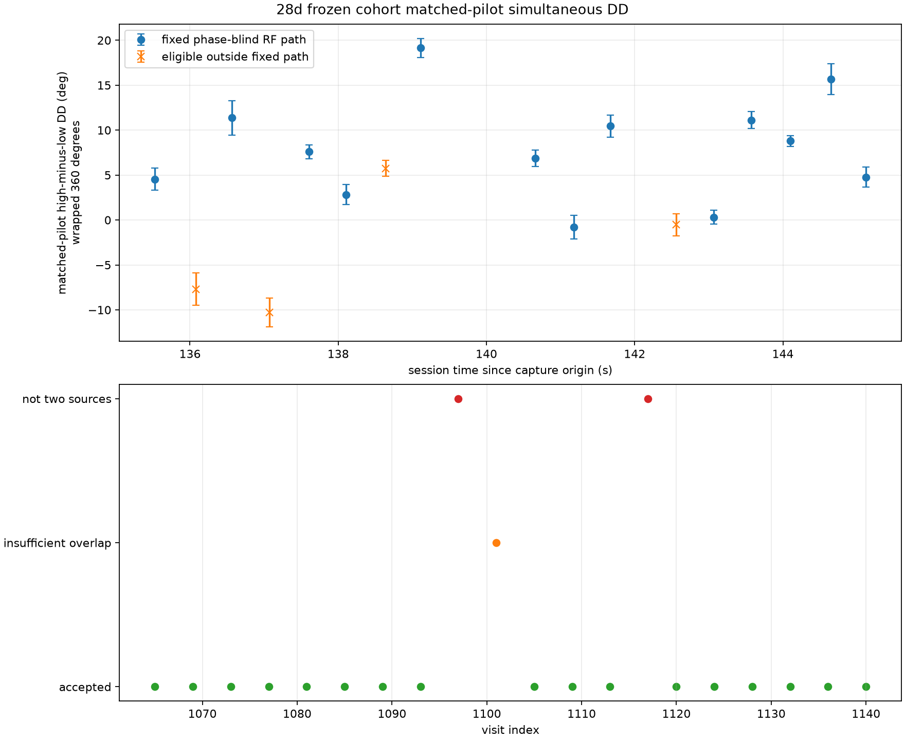

# Matched-pilot phase on the frozen `28d` cohort

## Result

The covariance-corrected, full-frame matched-pilot estimator was extended from
the three validation visits to the frozen 20-visit cohort for
`scan-hop-28d7592ea614f624`.  Seventeen visits produce a simultaneous
high-source minus low-source difference of RX1-minus-RX0 phase.  Visit 1101 has
only one qualifying 20 ms block and remains insufficient; visits 1097 and 1117
remain explicitly unmatched because the phase-blind input has fewer than two
sources.

| Visit | Fixed RF path | Qualified blocks | Frames | DD (deg) | Conditional adjacent-pair SE (deg) |
|---:|:---:|---:|---:|---:|---:|
| 1065 | yes | 3 | 40 | +4.54 | 1.23 |
| 1069 | no | 3 | 42 | -7.70 | 1.80 |
| 1073 | yes | 2 | 28 | +11.36 | 1.93 |
| 1077 | no | 2 | 28 | -10.29 | 1.61 |
| 1081 | yes | 5 | 70 | +7.59 | 0.76 |
| 1085 | yes | 5 | 63 | +2.82 | 1.13 |
| 1089 | no | 5 | 70 | +5.74 | 0.89 |
| 1093 | yes | 4 | 54 | +19.14 | 1.03 |
| 1105 | yes | 4 | 56 | +6.86 | 0.91 |
| 1109 | yes | 4 | 56 | -0.77 | 1.31 |
| 1113 | yes | 4 | 52 | +10.45 | 1.21 |
| 1120 | no | 5 | 70 | -0.52 | 1.23 |
| 1124 | yes | 3 | 42 | +0.32 | 0.78 |
| 1128 | yes | 4 | 53 | +11.12 | 0.96 |
| 1132 | yes | 4 | 56 | +8.80 | 0.60 |
| 1136 | yes | 2 | 23 | +15.69 | 1.71 |
| 1140 | yes | 3 | 42 | +4.78 | 1.09 |

The fixed phase-blind RF path contains 14 visits.  Thirteen have sufficient
matched-pilot support; 1101 is the only insufficient path visit.  All fixed-path
transitions still pass the pre-existing RF and timing gates.  The full-circle
profile over the 9.59-second accepted path has its unique best *net linear-rate*
mode at `0.00 deg/s`; perturbing each visit by its within-visit bootstrap gives
a global-best 95% interval of `-0.25 to +0.25 deg/s`, at the profile's 0.25
deg/s grid resolution.  The next profile mode is `+49 deg/s` with resultant
0.331, far below the primary mode's 0.995.

The linear model nevertheless fails its lack-of-fit check.  Its residual RMS is
5.53 degrees and its maximum absolute residual is 11.24 degrees.  A conditional
null constructed from the measured within-visit bootstrap errors has a residual
RMS 95% range of 0.65 to 1.67 degrees; none of 2,000 null draws reaches the
observed RMS.  The narrow slope interval therefore describes zero *net linear
trend* through nonlinear visit-to-visit fluctuations.  It does not establish a
constant phase trajectory or an adequate linear physical model.

The visit-to-visit variability is resolved relative to the conditional
within-visit noise.  This replay cannot attribute it uniquely to nonlinear
geometry, source-dependent channel variation, association error, or another
estimator systematic.

## Independent-support checks

The profile uses one matched-pilot DD per visit, formed only from blocks that
already pass the six-qualified-frame gate.  Rejected frames split contiguous
bootstrap runs; adjacent pairs never wrap across a rejected frame or a 20 ms
block boundary.  The per-visit bootstrap errors of 0.60 to 1.93 degrees remain
conditional on the source association, alias choice, common receiver-frequency
authority, template model, and residual-noise gates.

The original frozen overlap document contains visits 1065, 1109, and 1136.
For the other eligible visits, the identical phase-blind source-overlap gate was
recomputed from the immutable saved IQ and its derivation is recorded explicitly
in the cohort evidence.

The independent-support profiles agree on the net linear-rate mode at the
resolution relevant here:

| Support | Best rate (deg/s) |
|---|---:|
| Full common support | 0.00 |
| First contiguous sample half | 0.00 |
| Second contiguous sample half | +0.25 |
| Sample parity 0 | 0.00 |
| Sample parity 1 | +0.25 |
| Frame parity 0 | 0.00 |
| Frame parity 1 | +0.25 |

Across individual visits, aggregate first-half versus second-half phases differ
by 0.2 to 4.7 degrees, sample parities by 0.4 to 4.3 degrees, and frame parities
by 0.0 to 5.0 degrees.  Those shifts exceed some bootstrap errors and remain a
systematic uncertainty.  The circular profile therefore floors per-visit fit
uncertainty at five degrees.  Even with that floor, the observed nonlinear
residual structure is not explained by the within-visit bootstrap.  Sample
parity is a repeatability check, not an independence claim, because the frontend
filter has memory.

The finite 3-by-3 symbol-alias search selected `(0, 0)` on every fixed-path
visit.  Two accepted visits outside that path, 1069 and 1077, selected `(1, 0)`;
they are plotted but excluded from the trend.  No measured phase was used to
choose an alias, source pair, block, or RF path.

## Interpretation

Full known-pilot frames materially improve conditional precision over the 12
kHz quartic waveform estimator.  The matched-pilot design fits both source
templates jointly over the exact common samples, subtracts the fitted
within-receiver white-noise source covariance, rejects a symbol-roll control,
and gates cross-receiver residual coherence.  The component tests include
noise-only, one-source-only, known nonzero two-source DD, unequal amplitudes,
receiver frequency offset, epoch offset, and correlated-receiver-noise stress.

The recovered phase is still a double difference between two RF tracklets.  It
does not recover either source's individual absolute path phase.  A changing
common receiver phase cancels only to the extent that both sources have exact
common support; a stable source-dependent response remains as an additive DD
offset.  The two tracklets are not proved to be different satellites or sky
directions.  The result must therefore remain conditional until independent
source direction and channel-delay authority are available.

## Reproducibility

- Input manifest: `sha256:f76cea9410b79073527bb0b615e017bff4460c09169613f8a43b8e3baac6c96f`
- Frozen raw-frequency authority: `sha256:07d0cb03e66a99f715fab86af745a8443641250da1645c1022aacf60dcccf30f`
- Frozen overlap evidence for the original three visits: `sha256:4ed65a1ffee89602e4b2988e5c37cc441f9bc0b771332ad683dae7af787bb8fd`
- Frozen phase-blind association: `sha256:6e4c4cf31791bf73b219bf95306c45b34773d2706cbc82ed98c706c24f83d21e`
- New canonical evidence: `sha256:000e77ba1419de0bd55b45a71cb44584d8954584bd8e1b3ba1b3ae871173821c`
- Evidence JSON file SHA-256: `449735c4c6936217f44a605308cdf034e492f883ff0bd751a719e78ff937239b`
- Figure file SHA-256: `5ca9866bde61f44b22834f0e449eeb3900168a1b73e0931b364b683861c796a0`
- Estimator tool: `tools/report_adaptive_dual_rx_matched_pilot_dd.py`
- Cohort tool: `tools/report_adaptive_dual_rx_matched_pilot_dd_cohort.py`
- Component tests: `tests/analysis/test_adaptive_dual_rx_matched_pilot_dd_tool.py` and `tests/analysis/test_adaptive_dual_rx_matched_pilot_dd_cohort_tool.py`

Only the frozen 20-visit saved-IQ cohort was considered.  Eighteen visits with
two phase-blind pairs were read; no new RF was collected and no published
product was changed.
