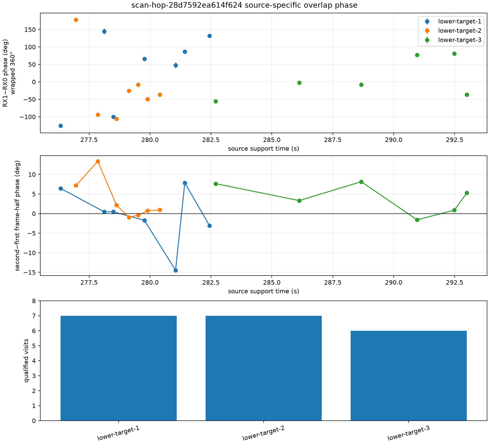

# Source-specific dual-RX phase for `scan-hop-28d7592ea614f624`

## Result

The bounded replay recovered a qualified RX1-minus-RX0 complex phase for all 20
preselected source overlaps.  The phases are full-circle measurements modulo
360 degrees.  They are source-specific, instrument-inclusive observables: each
contains geometric path phase together with receiver, feed, cable, and channel
phase.  No satellite catalogue identity or absolute geometric-phase calibration
is claimed.

Across the 20 observations:

- exact-pilot/control power ratio: 21.72 minimum, 42.55 median, 96.82 maximum;
- circular resultant after the authoritative raw-IQ frequency correction:
  0.933 minimum, 0.966 median, 0.992 maximum;
- conditional moving-block bootstrap standard error: 1.38 degrees minimum,
  2.87 degrees median, 7.95 degrees maximum;
- absolute first-half versus second-half phase disagreement: 0.41 degrees
  minimum, 2.63 degrees median, 14.46 degrees maximum; and
- absolute train-versus-held raw receiver-offset difference: 1.28 Hz minimum,
  18.26 Hz median, 118.53 Hz maximum.

The bootstrap uncertainty is conditional on the selected raw-frequency branch
and the phase-blind source association.  It uses 2,000 moving-block replicates
with three adjacent frames per block.  It does not include uncertainty from
hardware phase, phase-center position, receiver mapping, source direction,
catalogue identity, or the phase gauge between retunes.

## Phase-blind selection and IQ method

The selection inspected the sealed 120 ms GLRT product
`sha256:e70d23f43351de8caf32bcf3e47efe9e035d3970873edf92b1a9edb3656b9ba4`.
It formed 263 timing-consistent cross-RX candidates in 258 visits, then ranked
them by the lower of the two receivers' pilot/control margins inside three
fixed lower-channel target windows.  Phase was not used in candidate selection.
Only the top 20 visits were read from IQ: seven each for target 1 and target 2,
and six for target 3.

For each selected visit the replay:

1. estimated the broadband RX1-to-RX0 frequency offset on the first 60 ms and
   checked it on the held 60 ms;
2. re-correlated both receivers against the same pilot seed at a common sample
   reference, using the raw frequency authority rather than the aliased frame
   cadence estimate;
3. placed the phase at the correlation-energy centroid of that source's own
   support; and
4. compared it with a 997-sample wrong-time control and with independently
   estimated first and second frame halves.

Qualification required resultant at least 0.5, exact/control at least 2, and
nominal exact/control at least twice the wrong-time value.  All 20 passed.  A
50 kHz seed shift remains in the evidence as sensitivity data only: the
periodic pilot can remain coherent after such a shift, so it is not an
independent wrong-source control.  Broadband cross-ambiguity establishes the
receiver frequency branch but, because the two LNBs point differently, does
not by itself establish every source pairing.  The source-specific exact-pilot
timing and wrong-time tests provide that narrower evidence.

## Recovered observations

| Track | Visit | Source support time (s) | Wrapped RX1-RX0 phase (deg) | Conditional SE (deg) | Half disagreement (deg) | Exact/control |
|---|---:|---:|---:|---:|---:|---:|
| lower-target-1 | 2173 | 276.328272 | -125.44 | 5.41 | +6.43 | 58.12 |
| lower-target-1 | 2187 | 278.114754 | +144.92 | 7.89 | +0.46 | 84.02 |
| lower-target-1 | 2190 | 278.497725 | -100.03 | 5.64 | +0.44 | 41.10 |
| lower-target-1 | 2200 | 279.769475 | +65.93 | 2.82 | -1.72 | 96.82 |
| lower-target-1 | 2210 | 281.048188 | +47.75 | 7.95 | -14.46 | 83.86 |
| lower-target-1 | 2213 | 281.427956 | +86.54 | 2.89 | +7.84 | 64.49 |
| lower-target-1 | 2221 | 282.441284 | +132.06 | 2.22 | -3.08 | 81.10 |
| lower-target-2 | 2178 | 276.962358 | +178.33 | 2.85 | +7.16 | 21.72 |
| lower-target-2 | 2185 | 277.857329 | -93.54 | 3.61 | +13.35 | 27.32 |
| lower-target-2 | 2191 | 278.624763 | -106.09 | 3.29 | +2.19 | 32.12 |
| lower-target-2 | 2195 | 279.130358 | -25.82 | 1.73 | -0.92 | 25.67 |
| lower-target-2 | 2198 | 279.516868 | -8.27 | 2.30 | -0.41 | 43.42 |
| lower-target-2 | 2201 | 279.896888 | -49.43 | 1.74 | +0.72 | 66.70 |
| lower-target-2 | 2205 | 280.406082 | -36.68 | 1.38 | +0.93 | 41.17 |
| lower-target-3 | 2223 | 282.696172 | -55.30 | 3.59 | +7.64 | 36.35 |
| lower-target-3 | 2250 | 286.121578 | -2.09 | 2.49 | +3.31 | 42.22 |
| lower-target-3 | 2270 | 288.668155 | -8.12 | 2.95 | +8.13 | 26.89 |
| lower-target-3 | 2288 | 290.961511 | +76.88 | 2.26 | -1.60 | 66.90 |
| lower-target-3 | 2300 | 292.486991 | +81.15 | 2.61 | +0.88 | 42.89 |
| lower-target-3 | 2304 | 293.000185 | -36.76 | 5.49 | +5.25 | 40.16 |

These are single-source phases from different dwells.  The three target tracks
are not simultaneous observations, so subtracting target 1 from target 2 in
this table would not remove common receiver phase.  Continuity across retunes
has not been established; downstream fitting must allow a fresh phase
intercept for each dwell.  A simultaneous two-source double difference remains
a separate observable and must be formed only where both qualified sources
share an epoch.

## Geometry interpretation

For a calibrated receiver pair, the geometric contribution for one source is

`phi_geometry = (2*pi/lambda) * dot(b, s)` modulo `2*pi`,

where `b = position_RX1 - position_RX0` and `s` points toward the source.  The
LT3D-001A mesh places the nominal ring centers 80 mm apart.  If both feeds have
the same unknown axial phase-center offset `d`, the effective separation along
the ring-center direction is `80 + 2*d*sin(10 degrees)` mm.  Converting the
reported phases into geometric path phase still requires verified RX0/RX1 slot
mapping, installed pose, source direction at the exact support time, phase
centers or an offset model, differential group delay, and a hardware/channel
phase reference.  Without those inputs, fitting the expected geometry back to
these measurements would be circular.

## Reproducibility

- Input manifest: `sha256:f76cea9410b79073527bb0b615e017bff4460c09169613f8a43b8e3baac6c96f`
- Evidence content digest: `sha256:ee9aadeb3251f1d40ff53cb8d877e289c99cba8c6914e42f4475d05078922e84`
- Evidence JSON file SHA-256: `dd43d52b9c5bd18a11c744f7216167aae9ffcbada63da50491cdf5fc000fa373`
- Figure file SHA-256: `a323f9a4be7ea6410cba5eb2262e2440158437a2b47fc3ca53e12838611cf4ec`
- Tool: `tools/report_adaptive_dual_rx_overlap_tracklets.py`
- Component test: `tests/analysis/test_adaptive_dual_rx_overlap_tracklets_tool.py`

The replay is bounded to 20 IQ visits and reads the stored corpus without
modifying it.
