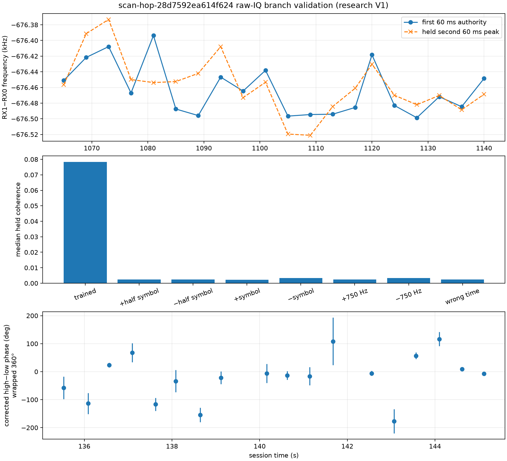
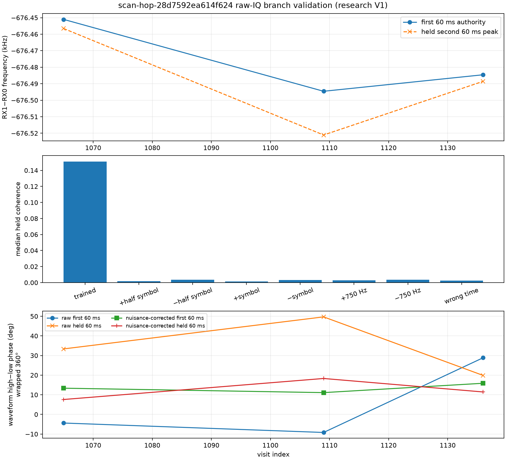

# `scan-hop-28d7592ea614f624` raw-IQ frequency and phase audit

Date: 2026-09-21. Scope: a bounded, read-only replay of 20 selected visits from
the existing simultaneous dual-RX recording. No RF was collected and no
published phase V2 artifact was changed.

## Conclusion

The raw IQ establishes one broadband receiver-frequency branch: RX1 is about
676.5 kHz below RX0, with zero integer-sample delay in all three delay-search
visits. This rejects the -563 kHz and -449 kHz receiver-offset branches
previously admitted by the pilot-only extractor. Because the two LNBs point in
different directions, that broadband result does not prove that every pilot
candidate is the same source in both receivers.

Signal-specific checks at visits 1065, 1109, and 1136 do validate two shared
subbands, but only in 4/6, 4/6, and 2/6 phase-blind 20 ms overlap blocks. Their
within-dwell high-minus-low receiver-phase double differences are
instrument-inclusive observables in those blocks. They do not establish phase
continuity between retuned dwells or a unique geometric phase. Unmatched
candidates remain allowed.

The earlier phase V2 and dense-progression slope are therefore superseded as
physical phase interpretations. Their immutable artifacts remain useful as a
record of the pilot-only estimator, but their CFO branches were aliased.

## Broadband branch result

For every selected visit, the first 60 ms was used to estimate the peak of
`RX1 * conjugate(RX0)`. The second 60 ms was held out. The normalized
cross-coherence uses both receiver powers in the denominator.

| Quantity | Result |
| --- | ---: |
| selected visits | 20 |
| raw RX1-RX0 branch | -676.499 to -676.394 kHz |
| median first/held frequency difference | 18.62 Hz |
| maximum first/held frequency difference | 60.01 Hz |
| integer delay at visits 1065, 1109, 1136 | 0 samples |
| median held coherence at trained frequency | 0.0784 |
| median held coherence at wrong time | 0.0024 |
| median held coherence at +/-750 Hz | 0.0024 / 0.0034 |
| median held coherence at +/-one symbol alias | 0.0022 / 0.0033 |

Re-correlating both receivers on the raw branch produced 38 locally qualified
pilot pairs and 18 candidate two-signal double differences. Their median receiver-product
resultant was 0.937 and median exact/control ratio was 28.0. The resulting
frequency differed from the raw authority by a median 20.0 Hz and at most
77.8 Hz. Shifting the shared phase-reference sample changed the restored phase
by less than 0.000001 degrees, confirming that reference restoration itself is
consistent. These pilot gates alone do not prove source identity.



## Phase controls

The original even/odd-symbol diagnostic was invalid because the legacy
within-frame FFT assumes adjacent 4.4 microsecond symbol spacing. The final
audit instead compares contiguous symbols 2-33 with 34-65, preserving that
spacing. Both halves remain well qualified: median resultants are 0.923 and
0.926, and median exact/control ratios are 12.5 and 14.1. Even so, their
two-signal phase differences disagree by a median 32.3 degrees and as much as
171.9 degrees.

A separate waveform test avoids the pilot template. After applying the raw
receiver offset, it compares narrow RX0 and RX1 spectral subbands for visits
1065, 1109, and 1136. Correct same-frequency coherence is 0.077-0.210, while
wrong-source controls are 0.017-0.091. The correct pair is strongest in every
tested 60 ms subband.

| Visit | Same-waveform coherence, first/held | Wrong-source coherence | Raw high-low phase, first/held | Change |
| ---: | ---: | ---: | ---: | ---: |
| 1065 | 0.130-0.162 / 0.172-0.174 | 0.018-0.028 | -4.39 / +33.37 deg | 37.76 deg |
| 1109 | 0.137-0.145 / 0.077-0.083 | 0.017-0.021 | -9.20 / +49.68 deg | 58.88 deg |
| 1136 | 0.163-0.177 / 0.147-0.210 | 0.036-0.091 | +28.86 / +19.87 deg | 8.99 deg |

Cross-spectral phase-slope resultants range from 0.152 to 0.772. The inferred
fractional delay is aliased with a 208.3-sample period for the 12 kHz analysis
band, so the data do not support choosing one group-delay branch. Those delay
values are retained in the machine evidence but are not interpreted as a
physical receiver delay.

The receiver product also contains a shared phase nuisance that changes within
a visit. A 2 ms track estimated from frequency bins outside +/-10 kHz of both
target subbands has median block coherence 0.185, 0.155, and 0.182 for visits
1065, 1109, and 1136. The target bands never enter this estimate. Removing only
the tracked variation, while retaining an arbitrary first-block phase
intercept, changes the first/held 60 ms waveform results as follows:

| Visit | Raw high-low change | After off-target nuisance correction |
| ---: | ---: | ---: |
| 1065 | 37.76 deg | 5.76 deg |
| 1109 | 58.88 deg | 7.20 deg |
| 1136 | 8.99 deg | 4.43 deg |

This supports a time-varying receiver/channel contribution. It does not prove
that one scalar nuisance applies to all directions. An independent pilot check
with wider +/-20 kHz exclusions improved individual local products but gave
mixed double-difference results: contiguous-half disagreement changed from
24.0 to 121.7 degrees at 1065, 6.92 to 5.38 degrees at 1109, and 11.22 to
12.94 degrees at 1136.

The final source-overlap gate uses 20 ms blocks, a 12 kHz subband, minimum
coherence 0.10, and a matched/wrong-source ratio of at least 2. The gate is
phase-blind and has an approximate time-bandwidth product of 240 per source.
That nominal product is an upper bound on independent support because windowed
FFT bins and waveform samples are correlated. A simple independent-sample
coherence approximation gives roughly 13-26 degrees of phase uncertainty over
the gate's 0.10-0.20 coherence range; the actual uncertainty can be larger.
The phases below are therefore exploratory double differences rather than
precision estimates. The gate retains these within-dwell observations:

| Visit | Qualified overlap blocks | Start ms and wrapped high-low phase |
| ---: | ---: | --- |
| 1065 | 4/6 | 0: +32.5 deg; 60: -13.7 deg; 80: +12.5 deg; 100: +20.2 deg |
| 1109 | 4/6 | 40: +19.3 deg; 60: +36.4 deg; 80: -14.2 deg; 100: +18.7 deg |
| 1136 | 2/6 | 20: +4.2 deg; 100: +1.9 deg |

These are recovered high-minus-low double differences: the RX1-minus-RX0 phase
of the higher-frequency source minus the RX1-minus-RX0 phase of the
lower-frequency source. Phase may vary within a dwell because geometric path
phase and channel phase vary. Continuity across a retune is unverified, so the
analysis must allow a fresh phase intercept for each dwell. A line through
different dwells is not a physical continuity result without independent
evidence that those intercepts are shared.

For a verified receiver baseline `b = rx1 - rx0` and a unit direction `s`
toward one source, the geometric convention is
`phi_geom = 2*pi/lambda * dot(b, s)` for RX1 minus RX0. The geometric prediction
for the measured double difference is the higher-source term minus the
lower-source term, using each source direction and wavelength. Converting the
within-dwell observable to those terms still requires verified LNB slot
mapping, baseline orientation, both source directions, and differential
hardware/group-delay calibration. The nominal holder spacing alone cannot
choose a phase or delay alias.

## Frequency tracklet scope

A rolling-origin check on the 14-state frequency tracklet used the preceding
six to eight points to predict each next point. Both tracks are sources on RX0.
The first comparison incorrectly tagged both CFOs with the double-difference
phase midpoint; that gave linear source-A/source-B RMSE of 189/193 Hz. The
actual GLRT64 correlation-energy centroids differ from that midpoint by -43.73
to +56.77 ms. Using each source's own measurement time gives:

| CFO estimate | Model | Source A RMSE | Source B RMSE |
| --- | --- | ---: | ---: |
| Frozen 443.9 Hz-grid estimate | Linear | 63.09 Hz | 175.16 Hz |
| Frozen 443.9 Hz-grid estimate | Quadratic | 31.48 Hz | 281.14 Hz |
| Frozen 443.9 Hz-grid estimate | Cubic | 58.65 Hz | 316.89 Hz |
| Continuous exact-DTFT refinement | Linear | 71.34 Hz | 113.76 Hz |
| Continuous exact-DTFT refinement | Quadratic | 52.03 Hz | 146.88 Hz |
| Continuous exact-DTFT refinement | Cubic | 84.32 Hz | 191.85 Hz |

Correct timestamps remove most of source A's apparent residual and materially
help source B. Continuous sub-bin refinement helps source B but slightly hurts
source A, so detector-grid quantization is not the single limiting error.
Quadratic prediction improves source A in this tracklet, while linear prediction
is better for source B; cubic improves neither. Linear is therefore the safe
default branch prior, with a per-tracklet escalation to quadratic only after a
repeatable held-out benefit. None of these models supplies phase continuity;
each dwell must allow a fresh phase intercept.



## Reproduction and evidence

The replay is implemented in
`tools/report_adaptive_dual_rx_raw_coherence.py` and is bounded to at most 20
saved visits. Component tests cover frequency and delay recovery, wrong-time
and wrong-frequency rejection, same-subband phase recovery, and wrong-source
rejection.

The full evidence JSON has file SHA-256
`8ed23be07a132e8ff7737da81184f43659ae826bf968716a6ff709f44416ed90`.
Its canonical evidence digest is
`sha256:07d0cb03e66a99f715fab86af745a8443641250da1645c1022aacf60dcccf30f`.
The three-visit subband JSON has file SHA-256
`a690e1cb264039edfc242b384acb2a08bbff2f6ff9f65b0f85182d3bb63b1038`
and canonical evidence digest
`sha256:4ed65a1ffee89602e4b2988e5c37cc441f9bc0b771332ad683dae7af787bb8fd`.
The source-timestamp and continuous-frequency-refinement JSON has file SHA-256
`4781c434bf7f0e19a138912935e360e9942e8e98d74ad9a6cc049c3c6c85fca8`
and canonical evidence digest
`sha256:936306a11c4ed60a556f8f0e0dab4d8b374c01c6e1915163d967e6dae054d1e1`.

```bash
sudo -u leo env PYTHONPATH=src MPLCONFIGDIR=/tmp/leo-mpl \
  .venv/bin/python tools/report_adaptive_dual_rx_raw_coherence.py \
  --bulk-root /srv/bulk/leo \
  --session-id scan-hop-28d7592ea614f624 \
  --json /tmp/scan-hop-28d-raw-cross-ambiguity-v1.json \
  --png /tmp/scan-hop-28d-raw-cross-ambiguity-v1.png

sudo -u leo env PYTHONPATH=src MPLCONFIGDIR=/tmp/leo-mpl \
  .venv/bin/python tools/report_adaptive_dual_rx_raw_coherence.py \
  --bulk-root /srv/bulk/leo \
  --session-id scan-hop-28d7592ea614f624 \
  --visits 1065,1109,1136 \
  --delay-search-visits 1065,1109,1136 \
  --subband-visits 1065,1109,1136 \
  --json /tmp/scan-hop-28d-signal-subband-v1.json \
  --png /tmp/scan-hop-28d-signal-subband-v1.png

sudo -u leo env PYTHONPATH=src \
  .venv/bin/python tools/report_adaptive_dual_rx_frequency_refinement.py \
  --bulk-root /srv/bulk/leo \
  --summary reports/figures/2026_09_21_adaptive_dual_rx_local_phase/scan-hop-28d7592ea614f624-dense-phase-summary-v1.json \
  --output /tmp/scan-hop-28d7592ea614f624-continuous-frequency-refinement-v1.json
```
