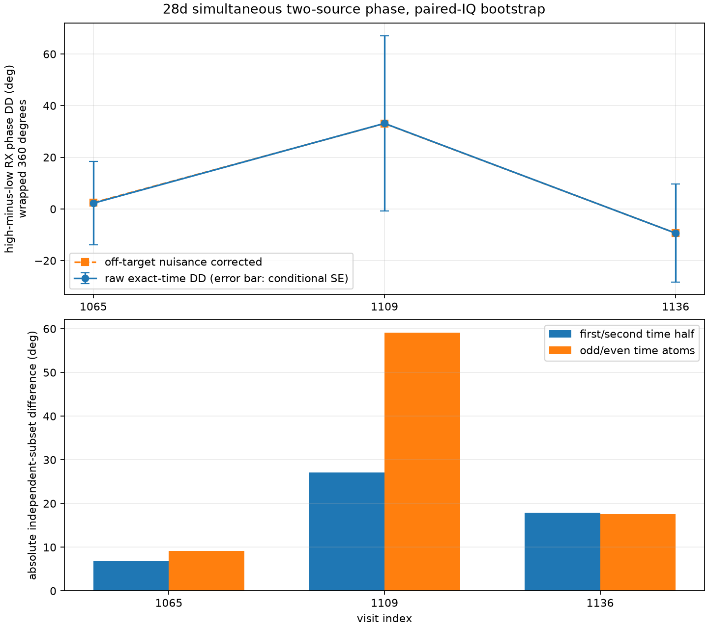

# Simultaneous dual-source phase uncertainty for `scan-hop-28d7592ea614f624`

## Result

Under the user's warmed-up, stable-LNB assumption, simultaneous source
differences remove a shared RX1-minus-RX0 phase term.  A bounded saved-IQ replay
formed the high-source transfer times the conjugate of the low-source transfer
at the same samples, before averaging.  The three recovered conditional double
differences are measurable, but none of their changes is statistically resolved
in these three tested visits.

| Visit | Qualified 20 ms blocks | Matched 3.277 ms atoms | DD (deg) | Conditional bootstrap SE (deg) | Conditional 95% error interval (deg) | Joint resultant |
|---:|---:|---:|---:|---:|---:|---:|
| 1065 | 4 | 24 | +2.24 | 16.20 | -25.21 to +38.42 | 0.151 |
| 1109 | 4 | 24 | +33.14 | 33.99 | -84.14 to +59.25 | 0.103 |
| 1136 | 2 | 12 | -9.37 | 18.98 | -50.54 to +20.46 | 0.286 |

The intervals are bootstrap phase errors relative to the reported wrapped
estimate, not absolute phase endpoints.  The low joint resultants and broad,
asymmetric errors show why the 1.1-degree scatter between the two old 20 ms
blocks at visit 1136 was not a precision estimate.

The temporal comparisons also remain unresolved:

| Comparison | Wrapped change (deg) | Conditional bootstrap SE (deg) | Conditional 95% interval (deg) | Resolved from zero? |
|---|---:|---:|---:|---|
| 1065 to 1109 | +30.90 | 37.82 | -63.44 to +94.16 | no |
| 1065 to 1136 | -11.61 | 24.76 | -73.32 to +20.96 | no |
| 1109 to 1136 | -42.50 | 38.96 | -120.45 to +47.75 | no |

The result supports a conditional, within-dwell double-difference observable.
It does not support a detected temporal geometric-phase change across these
three visits.

## Exact-time estimator

The replay kept the phase-blind source association and the ten qualified 20 ms
overlap blocks frozen from the earlier raw-IQ audit.  It did not use measured
phase to select a visit or block.  Each qualified block was divided into six
non-overlapping 8,192-sample atoms.  Within every atom, both receivers were
placed on the validated raw-IQ frequency branch and filtered into the two fixed
12 kHz source bands.  The estimator formed

`(RX1_high * conjugate(RX0_high)) * conjugate(RX1_low * conjugate(RX0_low))`

sample by sample, then averaged.  This ordering cancels a scalar common
receiver phase at each sample.  Filtering makes cancellation only approximate
when that phase varies inside the filter kernel; a synthetic chirped common
phase with unequal source envelopes bounds the implementation error below 0.5
degrees in the component test.

As a real-IQ check, applying the independently estimated off-target common
phase nuisance changed the final results by only +0.205, -0.064, and +0.015
degrees for visits 1065, 1109, and 1136.  The source-band effective-time
mismatch was at most 0.251 ms across all atoms.  Those observations support
common-phase cancellation for this replay; they do not prove a universal LNB
stability bound.

## Covariance and independent subsets

The paired moving-block bootstrap resamples adjacent atoms without crossing a
20 ms qualification gap.  Each resampling unit already contains both source
transfer products, so their shared receiver covariance is retained.  Temporal
comparison intervals directly difference independent bootstrap draws from the
two visits; they do not use a Gaussian approximation.

| Visit | First-to-second time-half difference (deg) | Odd-to-even atom difference (deg) | Raw-to-nuisance-corrected difference (deg) |
|---:|---:|---:|---:|
| 1065 | +6.94 | -9.08 | +0.205 |
| 1109 | +27.13 | +59.14 | -0.064 |
| 1136 | +17.86 | -17.59 | +0.015 |

The visit-1109 independent subsets are especially inconsistent.  The ten
qualified 20 ms blocks contain only 60 non-overlapping time atoms in total,
with 12 to 24 per visit.  Hann-windowed neighboring atoms and the fixed overlap
gate further limit effective independent support.  The bootstrap is therefore
conditional on the source association, raw-frequency authority, qualified
blocks, band definition, and stable-channel model.  It cannot account for an
incorrect physical source association or a changing source-dependent antenna
response.

The individual 20 ms phases, atom complex numerators, amplitude denominators,
source effective times, and both raw and nuisance-corrected paths are retained
in the machine-readable evidence for audit.

## Physical interpretation

The recovered quantity is the high-source minus low-source difference of
RX1-minus-RX0 phase.  It cancels a phase term common to both sources.  Given
stable source-dependent channel phase and the same physical source pair across
visits, its *change* is a conditional geometric double-difference change; the
stable, unknown `H_high-H_low` remains as a constant offset.  Interpreting the
absolute DD geometrically requires that offset to be equal, negligible, or
calibrated.  Satellite catalogue identity is not established by this analysis,
and neither source's absolute geometric phase is recovered.

The source separations are 33.1 to 35.8 kHz.  As quantified in the stable-LNB
assessment, a 100 ns differential delay contributes only about 1.2 to 1.3
degrees of DD bias, and its change across the three source separations is below
0.1 degrees.  This is a 100 ns sensitivity scenario rather than a measured
delay bound.  At that scenario the delay term is much smaller than the measured
conditional uncertainty.

## Reproducibility

- Input manifest: `sha256:f76cea9410b79073527bb0b615e017bff4460c09169613f8a43b8e3baac6c96f`
- Prior frozen overlap evidence: `sha256:4ed65a1ffee89602e4b2988e5c37cc441f9bc0b771332ad683dae7af787bb8fd`
- New canonical evidence: `sha256:240e36cde606c6a2cf9f2a7ac24a47dd7a421177e79a02930d9d043fcc3383eb`
- Evidence JSON file SHA-256: `ca65c391063d45c019a402273ac2f508dc5c71f50965d1f8c23849ad1bcad2a4`
- Figure file SHA-256: `2c40565567e20f54fdfb698f10c5ce012fde55d8032ffdffe7dac88a992ef3df`
- Tool: `tools/report_adaptive_dual_rx_simultaneous_dd.py`
- Component test: `tests/analysis/test_adaptive_dual_rx_simultaneous_dd_tool.py`

Only visits 1065, 1109, and 1136 were read.  No RF was collected, and no
published product was changed.
