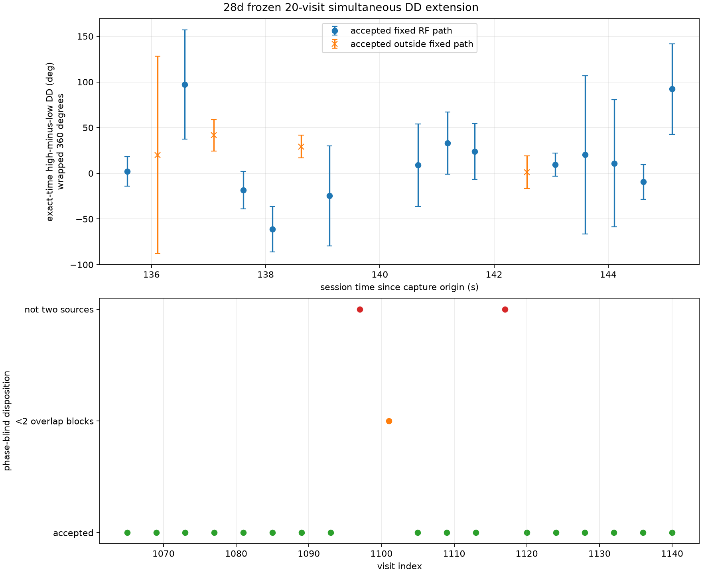

# Frozen-cohort simultaneous phase difference for `scan-hop-28d7592ea614f624`

## Result

The exact-time, simultaneous two-source estimator was extended to the original
20-visit cohort without collecting RF or changing the frozen three-visit
product.  Seventeen visits had at least two qualified 20 ms overlap blocks, one
had insufficient shared support, and two had only one phase-blind source pair.

The predeclared RF association survives the corrected raw frequency and exact
joint-support timing audit: all 13 transitions in its 14-visit path pass the
fixed signal-step, separation, receiver-offset, visit-gap, and time-gap gates.
Visit 1101 then fails the independent overlap requirement, leaving 13 visits
for the circular phase-rate assessment.

The full-circle circular profile prefers a shallow **+2.25 degrees/second**
mode, but this is not a detected phase change:

- the preferred profile resultant is 0.9049 while the zero-slope resultant is
  0.8980;
- global-best bootstrap slope quantiles are -49.75, +2.25, and +6.50
  degrees/second at 2.5%, 50%, and 97.5%;
- 21.6% of bootstrap global maxima are nonpositive;
- the primary +2.25-degree/second basin contains 89.75% of bootstrap maxima,
  below the predeclared 95% uniqueness requirement; and
- a -48.0-degree/second cadence-alias basin contains 8.75%.

First-half, second-half, even-atom, and odd-atom fits independently choose
primary modes from +2.0 to +2.75 degrees/second.  That agreement is useful, but
it does not remove the zero-slope support or the secondary cadence alias.
Accordingly, the result is a non-detection of temporal geometric
double-difference change under the stable-channel assumption.

## Phase-blind cohort disposition

| Visit | Fixed RF path | Qualified 20 ms blocks | State | Wrapped DD (deg) | Conditional SE (deg) |
|---:|---|---:|---|---:|---:|
| 1065 | yes | 4 | accepted | +2.24 | 16.20 |
| 1069 | no | 3 | accepted | +20.14 | 107.98 |
| 1073 | yes | 2 | accepted | +97.12 | 59.69 |
| 1077 | no | 2 | accepted | +41.59 | 17.45 |
| 1081 | yes | 5 | accepted | -18.49 | 20.57 |
| 1085 | yes | 5 | accepted | -61.28 | 24.85 |
| 1089 | no | 5 | accepted | +29.18 | 12.45 |
| 1093 | yes | 4 | accepted | -24.71 | 54.64 |
| 1097 | no | - | unmatched: one source pair | - | - |
| 1101 | yes | 1 | insufficient overlap | - | - |
| 1105 | yes | 4 | accepted | +8.99 | 45.09 |
| 1109 | yes | 4 | accepted | +33.14 | 33.99 |
| 1113 | yes | 4 | accepted | +23.77 | 30.59 |
| 1117 | no | - | unmatched: one source pair | - | - |
| 1120 | no | 5 | accepted | +1.13 | 17.97 |
| 1124 | yes | 3 | accepted | +9.50 | 12.57 |
| 1128 | yes | 4 | accepted | +20.21 | 86.41 |
| 1132 | yes | 4 | accepted | +11.03 | 69.68 |
| 1136 | yes | 2 | accepted | -9.37 | 18.98 |
| 1140 | yes | 3 | accepted | +92.27 | 49.39 |

The very broad errors at several visits and low within-visit joint resultants
are retained rather than censored by phase.  Only the predeclared path enters
the trend profile; accepted visits outside it are shown for accounting and do
not strengthen the fit.

## Estimator and timing

The source pair and RF path were fixed without phase.  Every eligible visit
used the stored raw cross-ambiguity receiver-frequency authority.  Each 20 ms
block was admitted only when both source bands passed the existing matched
coherence and wrong-source ratio gates.  At least two admitted blocks were
required for a phase estimate.

Within each 8,192-sample atom, the estimator forms the two source transfer
products at identical samples and differences them before averaging.  The
visit epoch is the joint-support-weighted sample time.  First/second and
odd/even controls use their own joint-support epochs rather than inheriting the
full-visit epoch.  Complex atom numerators, amplitude denominators, and joint
effective times are retained in the evidence.

The paired adjacent-atom bootstrap preserves cross-source covariance and does
not cross a 20 ms qualification gap.  Its errors remain conditional on the raw
frequency branch, fixed source association, overlap gates, filter definition,
and stable source-dependent channel model.

## Circular profile and ambiguity

The fit uses new full-circle exact-time double differences.  It does not reuse
the earlier modulo-pi phase or force an unwrap.  The slope domain was fixed at
-360 to +360 degrees/second with a 0.25-degree/second grid.  For each slope, the
intercept is profiled as a circular mean.  The best point is not at a search
boundary.

The leading alternate profile maxima are -48.0, -195.25, +197.5, -281.75,
-243.5, +239.75, and +150.0 degrees/second.  They are reported because the
irregular dwell cadence still permits cycle-count aliases.  A component test
with regular cadence explicitly verifies that full-cycle slope aliases appear
as equal circular maxima rather than being hidden by a preferred unwrap.

The detection rule requires a non-boundary unique primary basin containing at
least 95% of bootstrap maxima, bootstrap support away from zero, and agreement
among the four independent time subsets.  The real data satisfy only the last
condition.

## Physical scope

Under stable source-dependent channel phase and the same physical source pair,
a temporal change in this simultaneous high-minus-low phase is a conditional
geometric double-difference change.  A stable unknown channel difference
remains as a constant offset, so the absolute DD is not an absolute geometric
phase.  The RF association is a consistent phase-blind track; satellite
catalogue identity is not established.  The two RF tracklets are not proven to
be two different satellites or sky directions; they could be components of the
same transmitter.  A near-zero DD would therefore prove neither zero
per-satellite geometric path phase nor angular separation on the sky.

The preferred shallow mode is therefore a candidate description of these data,
not recovered satellite motion.  The statistically supported conclusion is
that the present cohort does not resolve a temporal phase change.

## Reproducibility

- Input manifest: `sha256:f76cea9410b79073527bb0b615e017bff4460c09169613f8a43b8e3baac6c96f`
- Raw authority evidence: `sha256:07d0cb03e66a99f715fab86af745a8443641250da1645c1022aacf60dcccf30f`
- Phase-blind association digest: `sha256:6e4c4cf31791bf73b219bf95306c45b34773d2706cbc82ed98c706c24f83d21e`
- New canonical evidence: `sha256:b50365308b32e1bea9bfca73e79fb1d3d88d34d46c14e67b6e2919ec1890727a`
- Evidence JSON file SHA-256: `f8b7826dc5a2fd6d454f7f549aac17eab282fd83cb68ad97c66cd156125f4c11`
- Figure file SHA-256: `d77336605adf810a8927a20e28ca7033512ebb9c335657a11c93ce2141edfbe7`
- Tool: `tools/report_adaptive_dual_rx_simultaneous_dd_cohort.py`
- Component test: `tests/analysis/test_adaptive_dual_rx_simultaneous_dd_cohort_tool.py`

The run read 18 eligible saved-IQ visits from the fixed 20-visit cohort.  It did
not search additional visits, collect RF, change production, or overwrite the
three-visit result.
