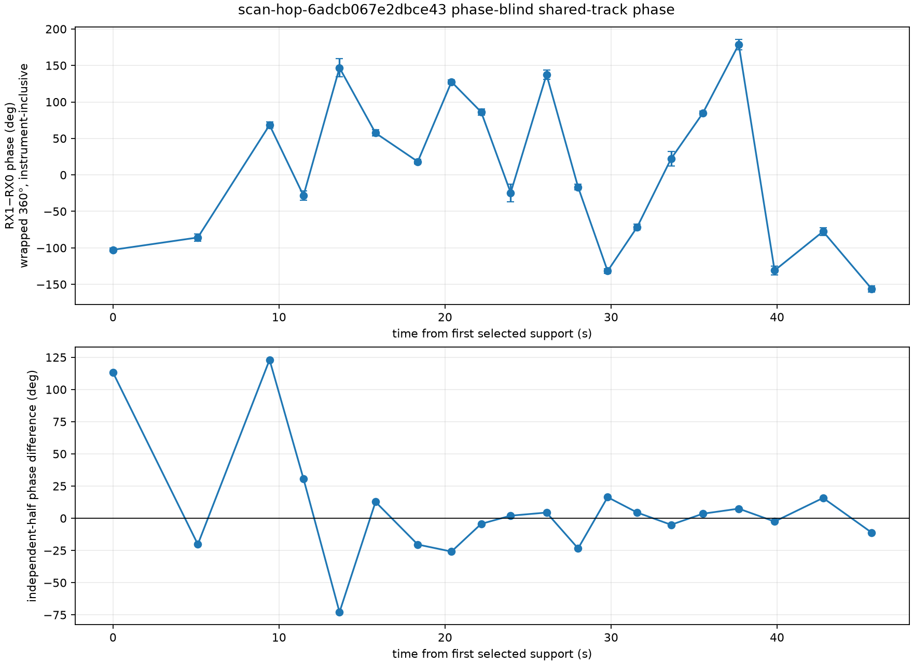

# Saved-IQ phase on the longest recent dual-RX track

## Result

Twenty deterministic, evenly spaced visits from the longest dual-receiver track in the frozen recent-eight-hour inventory were replayed from saved IQ. All 20 phase estimates bind back to the exact persisted RX0/RX1 track pair using phase-blind, symbol-alias-aware frequency matching. The selected support spans 45.694 s.

The replay measures a useful quantity: the wrapped, instrument-inclusive RX1-minus-RX0 transfer phase for this one RF track within each dwell. Conditional per-dwell standard errors are 2.45–12.47 degrees (median 4.41 degrees), and the complex resultants are 0.653–0.991. The values cover the full circle, with circular resultant 0.041 and circular standard deviation 144.7 degrees.

This is **not yet a continuous geometric-phase trajectory**. Only one source was qualified in these selected visits, so a simultaneous second source is unavailable to cancel the common receiver/LNB phase. The gaps between visits are 1.77–5.11 s, and no independent evidence identifies the missing integer cycles. The contiguous pilot-symbol halves also disagree by a median absolute 14.25 degrees and as much as 123.08 degrees, showing that the conditional standard errors do not include all within-dwell systematic variation. A warmed-up/stable LNB model may be tested as an explicit hypothesis, but the present one-source evidence does not establish it.

## Frozen selection and authority

- Session: `scan-hop-6adcb067e2dbce43`, channel 3 lower.
- RX0 track: `sha256:dad96c3afcf9b500c0423a9829dd442a6cf8215fd89cd4083ab0533e7b400c32`.
- RX1 track: `sha256:d118aba06b8fdacf35a464cafbcc12e69c4affe1d6f931cd0d15cf8a016433ec`.
- Input manifest: `sha256:a55febbbd6848e82cdf067a374b30e3f7ead0a09a953362052c9fea3a6517071`.
- Raw-recording authority: `sha256:d552d6c8fdc43446ca538a3d68837d5dcfc5606b9db837bbc13e829ed6a74544`.
- The inventory contains 101 shared visits over 45.713 s. The replay used deterministic `linspace(0, 100, 20)` positions: visits 1354, 1394, 1428, 1444, 1461, 1478, 1498, 1514, 1528, 1542, 1559, 1574, 1588, 1602, 1618, 1633, 1650, 1667, 1690, and 1713.
- Track association uses only persisted candidate frequency and timing evidence. It does not consume phase. All 20 rows bind within the 1 kHz predeclared alias-aware gate; the maximum observed error is 372.5 Hz.
- Catalogue identity is not claimed. The result is an RF-track measurement conditional on the phase-blind cross-receiver association.

## Per-dwell observations

`SE` is the conditional phase standard error from the coherent pilot fit. `Half Δ` is the wrapped disagreement between the two contiguous pilot-symbol halves and is a systematic-repeatability diagnostic, not an uncertainty correction. `Control` is the minimum exact-to-control power ratio. Frequencies were selected independently of phase.

| Visit | Time (s) | RX1−RX0 phase (°) | SE (°) | Resultant | Half Δ (°) | Control | Bind error (Hz) |
|---:|---:|---:|---:|---:|---:|---:|---:|
| 1354 | 0.000 | -102.68 | 2.45 | 0.991 | 113.2 | 18.4 | 242.9 |
| 1394 | 5.111 | -85.77 | 5.01 | 0.930 | -20.3 | 10.5 | 289.1 |
| 1428 | 9.431 | 68.37 | 4.21 | 0.950 | 123.1 | 22.7 | 372.5 |
| 1444 | 11.475 | -28.35 | 6.27 | 0.893 | 30.7 | 27.9 | 341.4 |
| 1461 | 13.644 | 146.81 | 12.47 | 0.653 | -72.9 | 20.3 | 30.6 |
| 1478 | 15.813 | 57.42 | 4.32 | 0.948 | 12.7 | 70.0 | 272.1 |
| 1498 | 18.359 | 18.22 | 3.25 | 0.970 | -20.4 | 45.6 | 169.8 |
| 1514 | 20.389 | 127.55 | 2.97 | 0.975 | -25.9 | 58.3 | 327.9 |
| 1528 | 22.179 | 86.13 | 4.51 | 0.943 | -4.3 | 41.5 | 206.2 |
| 1542 | 23.953 | -24.44 | 12.06 | 0.656 | 2.0 | 85.2 | 126.9 |
| 1559 | 26.113 | 137.43 | 6.60 | 0.881 | 4.4 | 80.2 | 69.6 |
| 1574 | 28.016 | -16.76 | 3.79 | 0.959 | -23.4 | 28.2 | 185.9 |
| 1588 | 29.793 | -131.76 | 2.88 | 0.976 | 16.4 | 45.0 | 324.7 |
| 1602 | 31.575 | -71.47 | 3.89 | 0.957 | 4.4 | 81.7 | 150.1 |
| 1618 | 33.616 | 22.17 | 10.11 | 0.744 | -5.1 | 66.1 | 170.8 |
| 1633 | 35.525 | 84.56 | 2.82 | 0.977 | 3.5 | 37.3 | 247.7 |
| 1650 | 37.691 | 178.70 | 6.89 | 0.871 | 7.5 | 47.8 | 101.4 |
| 1667 | 39.850 | -130.97 | 6.12 | 0.897 | -2.6 | 47.1 | 245.5 |
| 1690 | 42.772 | -77.55 | 5.18 | 0.925 | 15.8 | 35.5 | 292.6 |
| 1713 | 45.694 | -156.03 | 4.23 | 0.950 | -11.1 | 27.1 | 209.2 |

The adjacent wrapped changes range from 16.9 to 175.2 degrees in magnitude. Those wrapped changes are persisted for audit, but the analysis deliberately does not unwrap them or fit a geometric slope. Long duration alone cannot distinguish geometric evolution from the common receiver/LNB phase gauge or recover skipped cycles.

## Reproduction and evidence

The raw replay uses `tools/report_adaptive_dual_rx_raw_coherence.py`. `tools/report_recent_dual_rx_single_track_phase.py` then reconstructs the published trajectory from its immutable inputs and performs the phase-blind binding. No RF was collected and no production contract was changed.

- Raw replay JSON: `reports/figures/2026_09_21_recent6ad_dual_rx_phase/scan-hop-6adcb067e2dbce43-raw-phase20-v1.json`; canonical evidence digest `sha256:f0c60f5ac5ef041818d2716663bbe3ab1fcbac6fe566dabb67ff429ef0694a63`; file SHA-256 `be520a9d002abde86972ead7740737ea157ea99a6e1b4254cc4cb55da13cf97b`.
- Track-bound JSON: `reports/figures/2026_09_21_recent6ad_dual_rx_phase/scan-hop-6adcb067e2dbce43-track-bound-phase20-v1.json`; canonical evidence digest `sha256:8f38142c1037d5b585d701949e99b1a12b70633cff81c81b2a921d76758fbf81`; file SHA-256 `e88c5e7d9a86310eaddf5a8b53b21093956bc726720f74bcfd1db4f9dc7fc326`.
- Raw figure file SHA-256: `5f638302f0be7f288aad732580bb9feaa5b7206b3aef9dded7dd583ec0693cf4`.
- Track-bound figure file SHA-256: `5f15b184a155e9dd494247b64212c574bfca56db62c434d8aae1191592049840`.

The next scientifically useful step is a simultaneous two-source measurement in one dwell, such as the independently found recent candidate in `scan-hop-34c0b0e1ae062f97`. That permits a double difference which cancels a stable common receiver phase without forcing an unwrap of this one-source trajectory.
