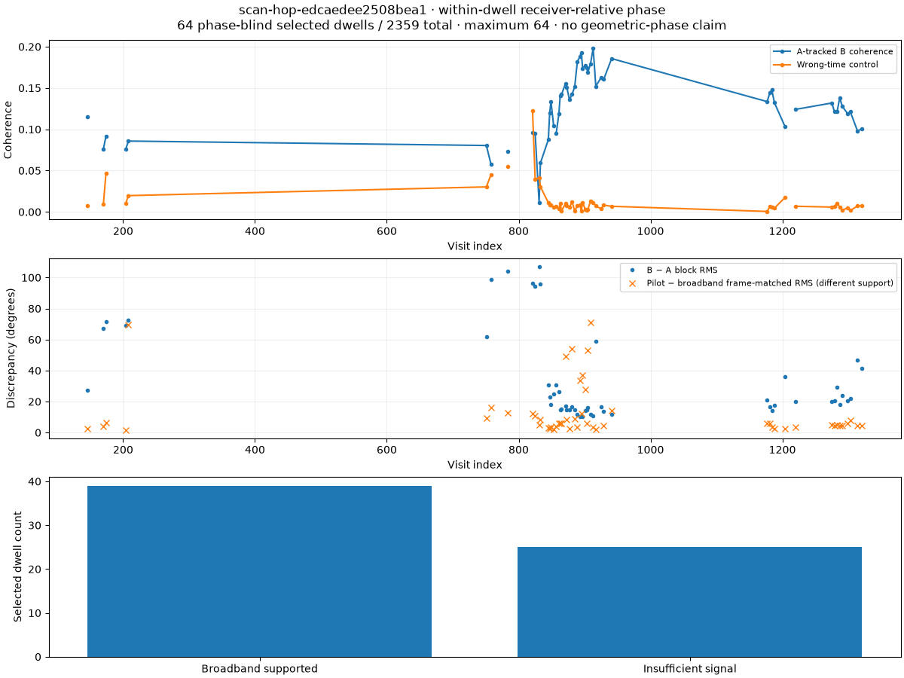
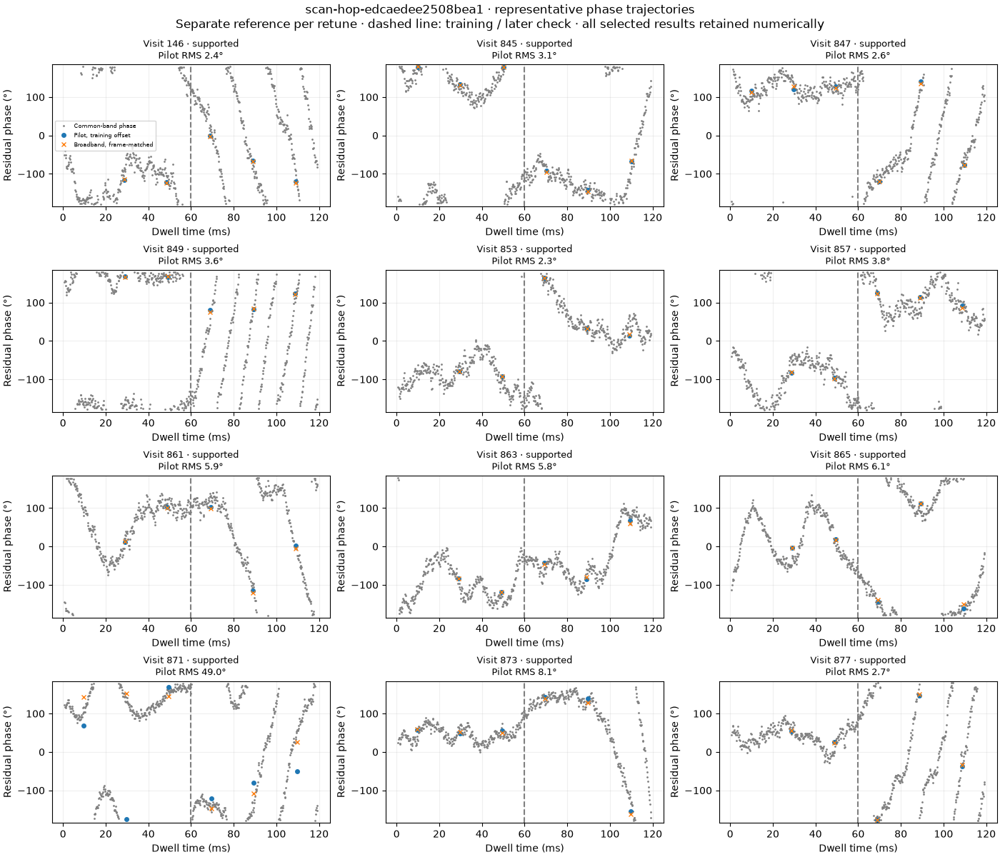

# Automatic adaptive receiver-relative phase

The adaptive queue now runs broadband alignment and matched-pilot phase analysis
after GLRT metrics and overview publication. Completion requires the sealed phase
manifest and its two PNGs. The web UI displays them under **Scanner → adaptive
capture → Broadband and pilot relative phase**.

The default product selects at most 64 strongest phase-blind paired GLRT dwells,
uses six 20 ms pilot probes per 120 ms dwell, and displays up to 12 representative
trajectories. All selected numerical results remain in sealed checkpoints.
Each queue slice gives phase processing 120 seconds, checked between dwells.
Partial work resumes without recomputing finished dwells. Recent ready scans
missing phase are reconciled within the two-hour live window; this is not a
bulk backfill of all historical scans.

The PNGs are `relative-phase-overview` (coherence, wrong-time control, disjoint
band and pilot agreement) and `relative-phase-dwells` (within-dwell wrapped
phase and frame-matched pilot/broadband points). Single-RX or insufficient-signal
scans receive explicit explanatory figures. The captured receiver-geometry
digest is preserved where present.

## Saved-data and live-queue verification

| Scan | Invocation | Selected | Broadband supported | Pilot comparisons available |
|---|---|---:|---:|---:|
| `scan-hop-e46d3aba244cf641` | Saved-IQ phase canary | 64 | 63 | 64 |
| `scan-hop-f6f9037314e87e27` | Saved-IQ phase canary | 64 | 59 | 64 |
| `scan-hop-edcaedee2508bea1` | Normal analysis CLI, default phase stage | 64 | 39 | 52 |
| `scan-fw-8e9807db44d066ea` | Automatic production queue, job 42914 | 64 | 62 | 61 |
| `scan-fw-d87e70540439b064` | Automatic production queue, job 42916 | 64 | 15 | 47 |
| `scan-fw-d6eb69d2ebcd3ea5` | Saved 10 MS/s replay; queue job 42917 also completed | 0 | 0 | 0 |

All six scans published both PNGs. The production jobs finished with
`state=succeeded`, `outcome=complete`; the queue evidence and HTTP-returned
manifests are saved in [the evidence directory](figures/2026_09_22_adaptive_phase_default).
The table distinguishes a pilot comparison being available from passing any
accuracy threshold. Broadband support is a heuristic shared-signal check, not
proof of geometric phase.

The real browser check selects a capture through adaptive history, scrolls to
the phase section, decodes both displayed images, and independently downloads
and hashes their HTTP responses against the manifest. The existing example's
PNGs are 1200×900 and 1400×1200 pixels. Browser verification found no JavaScript
errors. Images use the existing responsive figure styling.
The final browser proof uses the automatically processed
`scan-fw-8e9807db44d066ea`: both images display at 996 px inside the 1028 px
panel, with HTTP 200 and matching SHA-256 digests.





## Compatibility issue found during verification

Recent feature-103 dual-RX captures were reaching the old 2.5/5 MS/s history
validator. A 10 MS/s capture therefore caused the entire history page to return
409. Analysis source/binding selection also lacked this newer receipt type.

New V6 history/analysis products and a V5 mixed history page admit the native
2.5/10 MS/s feature-103 format while preserving the published older contracts.
Zero-gap consecutive visits keep their exact counters. Cancelled receipts expose
only complete retained visits. A regression exercises a synthetic zero-gap
10 MS/s capture through source reading, checkpoint/resume, GLRT overview,
relative-phase PNG publication, and API retrieval. The frontend verifies the
new source/configuration bindings and routes them through the current API.

## Validation and releases

The focused initial phase suite passed 63 tests; subsequent compatibility
regression coverage passed 86 tests. All 185 web tests passed. The exact revision
gates passed mypy, Ruff, changed-component tests and the production web build.
Release qualification also passed the saved scientific corpus, native-science,
PostgreSQL operational vertical, and 16 Chromium end-to-end cases.

The adaptive queue and all 16 worker services run immutable release
`02ae16e8233b6de9b01aacb6b21709840e58536b`. The UI sizing follow-up is
live on the API at `a3a90d9e7b75dd9179fd37455cc41a90418fd392`, also with passing
release qualification. The worker cutover evidence records
the exact qualification receipt and installed unit hashes. Concurrent workers
already on the same release were preserved without another restart. This task
did not change acquisition configuration or request new RF recordings.

The first five completed scans in the table are 2.5 MS/s. The saved 10 MS/s
feature-103 scan (`scan-fw-d6eb69d2ebcd3ea5`) completed all 2,232 GLRT visits,
overview and default phase stages after bounded resumable slices. No paired
GLRT detections qualified for phase selection, so it correctly published two
`insufficient_signal` explanatory PNGs, both retrieved and hash-verified over
HTTP. This validates the real 10 MS/s pipeline and its absence-of-evidence
behavior, not phase accuracy on a strong shared 10 MS/s signal. Known-template
phase recovery at that rate remains covered by the synthetic tests.

## Reproduction

For an existing recording, use the deployed release environment:

```bash
python -m leo.cli.adaptive_hop_analysis --bulk-root /srv/bulk/leo \
  --session-id scan-hop-edcaedee2508bea1 --probe-stride-ms 120 \
  --maximum-seconds 120
```

The normal command includes phase by default. Repeat only while partial; finished
products are idempotently validated. For a phase-only saved-IQ replay use
`python -m leo.cli.adaptive_relative_phase` with the same root/session and
`--maximum-seconds 120`.

Read the source-bound status at
`GET /api/v1/scanner/adaptive-sessions/{session_id}/analysis/relative-phase`.
Each listed artifact is available under that route at `/{name}.png`, with the
returned `binding_sha256` and artifact `sha256` supplied as query parameters
`binding_sha256` and `artifact_sha256`. Reads never start analysis.

With the web Playwright dependency and Chromium installed, rerun the browser
check using `node reports/figures/2026_09_22_adaptive_phase_default/verify_web.mjs
scan-fw-8e9807db44d066ea`. `LEO_UI_URL` overrides its localhost base URL. The
script writes its screenshot and JSON proof under `/tmp/adaptive-phase-browser-proof.*`.

These estimates describe RX1 relative to RX0 within each dwell. Delay,
differential frequency, and nuisance channel response are handled by the
estimator; a fitted reference offset is not an external phase calibration.
The product makes no phase-continuity claim across retunes and no calibrated
satellite geometric-phase claim.
