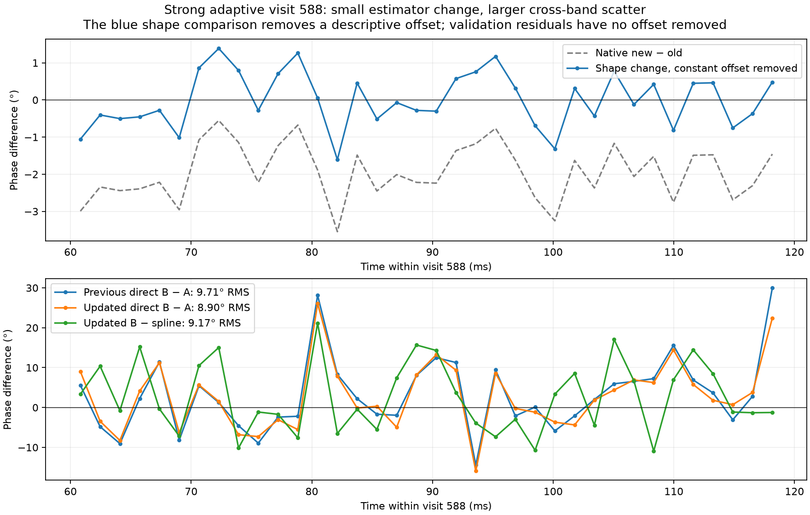
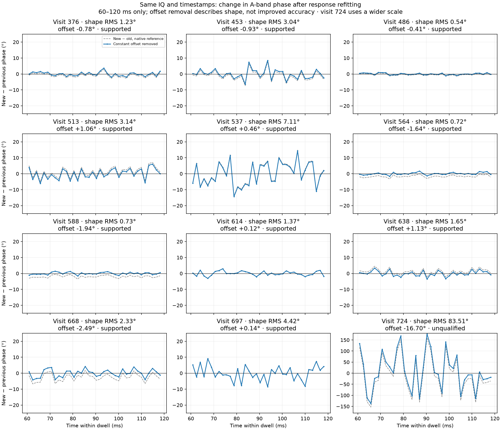

# Difference between previous and updated adaptive phase estimates

The strong adaptive result mostly preserves the previous measured trajectory. For visit 588, the updated A-band phase changes by a constant −1.94° plus only 0.73° RMS variation about that offset. The remaining direct B-versus-A disagreement is 8.90° RMS. The discrepancy between frequency bands, rather than the difference between these two estimator versions, is the larger unresolved quantity.

Top: updated minus previous A-phase at exactly the same block centers. Gray retains the native reference; blue subtracts the circular mean difference for a descriptive comparison of shape. This subtraction is not calibration or a validation improvement. Bottom: previous and updated B-minus-A differences, and updated B-minus-spline differences. None of the bottom-panel differences has an offset fitted away.

## Matched comparison

Input is the same twelve visits of `scan-hop-e46d3aba244cf641`. The script asserts identical source manifest, reference sample/frequency, carrier/drift, phase intercept, and all 36 later-half block centers per dwell. It uses only the 60–120 ms portion where the previous A/B estimates exist. Phase differences are circular, RX1 relative to RX0; plotted version differences are **new minus previous**. The channel response and selected frequency masks differ, so this is a matched-time comparison, not an equal-mask ablation.

| Visit | Shape change after constant removal | Previous direct B−A RMS | Updated direct B−A RMS | Updated B−spline RMS |
|---|---:|---:|---:|---:|
| 376 | 1.23° | 14.75° | 14.48° | 13.79° |
| 453 | 3.04° | 15.50° | 15.18° | 13.72° |
| 486 | 0.54° | 8.98° | 9.43° | 8.84° |
| 513 | 3.14° | 12.07° | 9.88° | 9.69° |
| 537 | 7.11° | 15.22° | 11.22° | 9.03° |
| 564 | 0.72° | 11.02° | 12.01° | 8.55° |
| 588 | 0.73° | 9.71° | 8.90° | 9.17° |
| 614 | 1.37° | 11.44° | 11.14° | 10.25° |
| 638 | 1.65° | 12.96° | 12.83° | 15.70° |
| 668 | 2.33° | 18.70° | 17.86° | 14.82° |
| 697 | 4.42° | 14.28° | 14.08° | 16.58° |
| 724 | 83.51° | 100.30° | 68.41° | 73.90° |

Visit 724 is unqualified in both investigations. Its large version dependence is another reason to abstain. Several other visits improve little or worsen slightly. The spline is a trajectory representation, not a uniformly more accurate measurement. The earlier 71° versus 9° comparison was linear versus spline fitting, not old versus new estimation accuracy.

## Bottleneck and improvements

For visit 588, changing the response estimator hardly changes the trajectory or tracked coherence (0.199 to 0.198). The direct B-minus-A residual traces are also very similar. The persistent ~9° disagreement is consistent with limited coherent common information, differences in spectral response/weighting, and finite-window time variation. This comparison does **not** identify which of these dominates, establish a thermal-noise floor, or exclude residual estimator bias. Strong GLRT detection in both receivers is not equivalent to high coherence of their complete recorded waveforms.

At 2.5 MS/s, each 120 ms dwell contains 300,000 paired samples. The tracker uses 4096-sample Hann blocks, approximately 1.6384 ms each, with 36 validation blocks in the later half. Raw sample count is not independent phase information: bandwidth, windowing, signal/noise mixture and temporal dependence matter. Longer averaging without compensating the moving phase can cancel the very cross-spectrum we need.

Recommended next experiments, using existing IQ:

1. **Transfer the refined pilot cross-check to these exact dwells.** Use common differential-frequency authority, second-pass pilot correlation, and exact frame-support matching. Keep one reference offset fitted only on training time. This is the most useful next discriminator between source-specific phase evolution and broadband mixture/response effects.
2. **Control time support before changing the curve.** The current spline is sampled on the full-dwell block grid and interpolated onto a shifted later-half grid. Fit/evaluate on matched centers and compare raw A phase, interpolated spline, and a local phase/frequency model. Visit 588's spline discrepancy of 9.17° already exceeds its direct 8.90° disagreement slightly; visits 638 and 697 show larger penalties. Selecting a more complicated curve is not automatically an improvement.
3. **Separate response error from information limits.** Repeat an equal-frequency-mask ablation, then vary block duration with local frequency compensation. Compare several frequency partitions and wrong-time controls. Learn coherence/noise weighting on training data, and use additional withheld data to select settings so B does not become a tuning target.
4. **Quantify uncertainty and reject failures.** Use block-aware resampling and known-offset IQ injections at the measured coherence, including response-fit uncertainty. Preserve an explicit abstention for visit 724. Longer-window precision gains must be shown alongside retained temporal resolution and bias, not assumed from sample count.

These are proposed follow-up measurements, not claimed completed improvements. For geometric interpretation, receiver/LNB drift and phase-reference calibration remain separate issues. The current results measure relative received phase; they do not identify its physical cause.

## Comparison with the continuous dwell

Here “the dwell” means the previously analyzed post-fix continuous recording `cap-20260825T010019-89c2889553e0`, stream-1, 31.8–32.8 s.

| Property | Adaptive example | Continuous example |
|---|---|---|
| Analyzed duration | 120 ms per independently retuned dwell | 1 s inside a counter-verified continuous dwell |
| Rate / paired samples | 2.5 MS/s / 300,000 per dwell | 2.5 MS/s / 2,500,000 in the slice |
| Response training / later check | 60 / 60 ms | 500 / 500 ms |
| Response-repair effect | Small for visit 588; stronger for some other visits | Large expansion of qualified spectral support |
| Direct B−A RMS | Visit 588: 9.71° → 8.90° | 21.32° → 11.08° |
| Refined pilot versus matched broadband | Not yet replayed on these adaptive dwells | 4.75° RMS on 17 later paired probes |
| Continuity claim | Independent intercept per retune | Continuity inside the verified recording |

The 4.75° continuous result is a **different statistic and time support** from the adaptive ~9° per-block A/B disagreement. It compares refined pilot and broadband estimates aggregated over the same frame times, roughly 20 ms of support. It does not demonstrate that continuous acquisition is twice as accurate. Indeed, the more comparable post-repair direct B−A scatter is 11.08° continuous versus 8.90° adaptive visit 588, still from different recordings and masks.

In the continuous example, phase normalization expanded the selected response support from 0.414 to 1.800 MHz. In adaptive visit 588, the A+B bins actually used after partition guards total 1.552 MHz before and 1.514 MHz after refitting: there is no analogous large bandwidth gain left to obtain from this repair. These A+B totals exclude guard bins and should not be confused with the full selected response-mask bandwidth (1.727 MHz updated for visit 588). More continuous data helps fit a response and validate frame trajectories; it does not justify averaging phase across retunes or across uncompensated rapid motion. This comparison does not independently audit adaptive capture duty/counter continuity.

## Reproduction

Run [compare.py](figures/2026_09_22_adaptive_phase_difference/compare.py) with NumPy and Matplotlib, using the saved artifacts already committed in this repository. No raw-IQ or hardware access is required. It asserts identical source/reference/timestamps and generates both plots plus [comparison.json](figures/2026_09_22_adaptive_phase_difference/comparison.json), including per-window differences, offsets, metrics, controls and bandwidths. The replay completed successfully and the focused plot was visually checked. No runtime components changed.

Source reports: [previous adaptive measurements](2026_09_22_multi_dwell_shared_track_phase.md), [updated adaptive fits](2026_09_22_adaptive_phase_fit.md), [continuous response repair](2026_09_22_dynamic_channel_phase_fixes.md), and [continuous matched-pilot closure](2026_09_22_phase_estimation_resolution.md).
