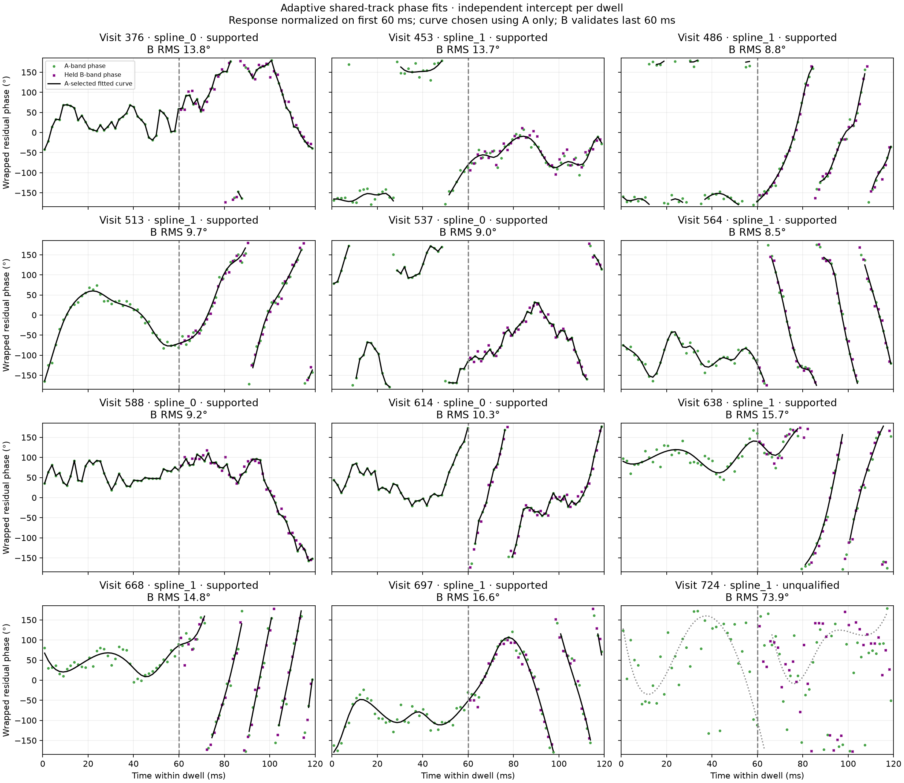
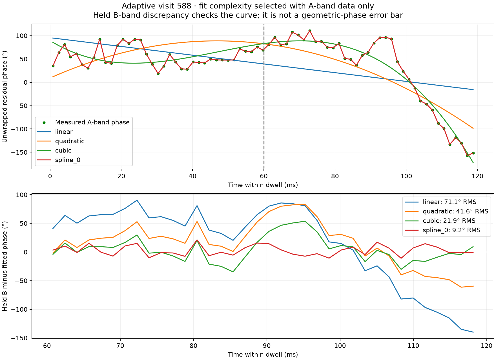

# Within-dwell phase fits for the strong adaptive example

Replayed all twelve previously selected dwells from `scan-hop-e46d3aba244cf641`, including the visits in the user's comparison figure. Eleven support a measured relative-phase trajectory under the checks below. Visit 724 remains unqualified. No new RF collection or production changes were made.



## What to fit

Fit each 120 ms dwell independently. The observed receiver phase contains receiver/channel effects as well as any geometric contribution. Removing the fitted differential carrier and drift does not make the remaining phase constant. A flexible within-dwell curve describes these recordings better than a single low-order polynomial.

The alignment convention is RX1 relative to RX0: positive phase rotates the predicted RX0 signal toward RX1. In frequency/time blocks, the model is

`X1(f,t) ≈ H(f) X0(f,t) exp(i [2π Δf τ + π Δfdot τ² + s(t)])`,

where `τ = (sample − reference_sample) / sample_rate`. `H` includes relative delay and frequency-dependent receiver/channel response. The fitted curve `s(t)` is the residual common phase after this transfer and carrier compensation. Plots add the original model's `phase_rad` to retain its display convention. Each dwell's exact `reference_sample`, `frequency_reference_hz`, carrier parameters, original model, updated complex transfer, and selected curve samples are saved in the results. The intercept is a chosen receiver-response convention, not independently calibrated geometric phase. Constant phase can be redistributed between `H` and `s`; delay and phase should not be independently reinterpreted after changing that convention.

Do not join the unwrapped curves across adaptive retunes. Each dwell has its own intercept and unknown cycle count. The results establish within-dwell alignment, not phase continuity across the 44-second visit sequence or satellite identity from phase alone.

## Method and validation boundaries

Each dwell contains 300,000 simultaneous sample pairs at 2.5 MS/s. The estimator uses 4096-sample Hann-windowed blocks, approximately 1.6384 ms each; it does not claim 300,000 independent phase measurements.

1. Initialize relative carrier/drift and broadband response using the first 60 ms and the existing frozen frequency evidence.
2. Apply the phase-normalized response refit from the [continuous-capture investigation](2026_09_22_dynamic_channel_phase_fixes.md). Three iterations remove A-band block phase before averaging the training cross-spectrum. Reject noise-dominated bins and retain only physical common captured bandwidth, with a 40 kHz edge guard.
3. Infer block phase from interleaved A frequency groups. Compare linear, quadratic, cubic and four cubic-spline smoothing strengths. Choose the curve using three-fold interleaved A-time-point cross-validation, with endpoints retained. No B-phase residual is used to select the curve.
4. Evaluate the chosen curve on the later 60 ms using disjoint B frequency groups. Training response and mask remain frozen. Compare aligned coherence against deliberately wrong-time RX1 data.

This is an **offline descriptive fit**, using A observations throughout the dwell. It is not a forecast of the second half from the first half. The A cross-validation is conditional on the already fitted response and phase unwrapping; it is not a complete independent retraining experiment. The first half shown in the figure is in-sample. Later B data were excluded from response fitting and A curve selection, but spectral leakage and shared source structure mean frequency groups are not perfectly statistically independent.

`spline_0` denotes an interpolating cubic spline; `spline_1` uses a smoothing budget of `N × sigma²`, with sigma estimated from phase second differences. An interpolating spline is not evidence of zero measurement error. Its qualification here comes from withheld A-point prediction and later B-band agreement. Plots connect the saved fitted sample values; validation interpolates the unwrapped sampled curve to the B timestamps. No claim is made about unresolved fluctuations between block centers. Simple phase unwrapping can fail if successive blocks change by more than π.

The predeclared operational gate is tracked B coherence greater than both 0.05 and three times wrong-time coherence, B phase resultant above 0.8, and A cross-validation RMS below 30°. These are heuristic quality checks, not a calibrated false-positive probability.

## Results

| Visit | Selected curve | Later B phase RMS discrepancy | B phase resultant | Qualification |
|---|---|---:|---:|---|
| 376 | spline_0 | 13.8° | 0.972 | Supported |
| 453 | spline_1 | 13.7° | 0.974 | Supported |
| 486 | spline_1 | 8.8° | 0.988 | Supported |
| 513 | spline_1 | 9.7° | 0.986 | Supported |
| 537 | spline_0 | 9.0° | 0.988 | Supported |
| 564 | spline_1 | 8.5° | 0.989 | Supported |
| 588 | spline_0 | 9.2° | 0.988 | Supported |
| 614 | spline_0 | 10.3° | 0.984 | Supported |
| 638 | spline_1 | 15.7° | 0.963 | Supported |
| 668 | spline_1 | 14.8° | 0.968 | Supported |
| 697 | spline_1 | 16.6° | 0.962 | Supported |
| 724 | spline_1 | 73.9° | 0.430 | Unqualified |

These RMS values measure disagreement between the A-derived fitted curve and B observations. They include error in both measurements, response error, and differences in block support. They are not per-point confidence intervals or absolute geometric-phase uncertainties. Resultant describes consistency of the B-minus-fit phase; it is distinct from broadband amplitude coherence.

### Strong example: visit 588



| Curve | A withheld-point RMS | Later B phase RMS |
|---|---:|---:|
| Linear | 52.7° | 71.1° |
| Quadratic | 38.7° | 41.6° |
| Cubic | 23.7° | 21.9° |
| Selected interpolating spline | 13.2° | 9.2° |

The fitted trajectory follows the bends visible in both frequency groups. Selected B-minus-fit mean phase is +2.7°. Broadband tracked coherence is 0.198 versus 0.0051 for wrong-time pairing. The response mask contains 2829 bins, a summed retained bandwidth of 1.727 MHz; these are selected bins, not a claim that an entire unrecorded Starlink channel was available.

Visit 724 shows why common-signal detection alone is insufficient: tracked coherence is 0.093 versus 0.0077 wrong-time, but A cross-validation RMS is 69.1°, and B phase RMS is 73.9°. A curve can be drawn, but it should not be accepted as a precise phase estimate.

This experiment transfers the corrected broadband-response method to the adaptive example. It does not rerun the refined edge-pilot estimator or establish new pilot/broadband closure for these twelve dwells. The screenshot's native pilot offsets must not be treated as equivalent phase references without that separate support/reference alignment.

## Reproduction and saved artifacts

- [Runner](figures/2026_09_22_adaptive_phase_fit/fit_visits.py)
- [Curve-selection tests](figures/2026_09_22_adaptive_phase_fit/test_curve.py)
- [Compressed full numerical results](figures/2026_09_22_adaptive_phase_fit/results.json.gz): manifest SHA, response arrays, all block observations, candidate curves, selection scores, controls, and qualification.

Analysis dependency: research revision `660bd85a2ccb4622868f1136443c99587a216db6` on `origin/codex/adaptive-geometry-phase`. The runner also imports the published sibling `2026_09_22_dynamic_channel_phase/experiment.py` helper. Run from the report checkout with access to the existing read-only corpus:

```bash
sudo -u leo env OPENBLAS_NUM_THREADS=1 MPLCONFIGDIR=/tmp/adaptive-fit-leo-mpl \
  PYTHONPATH=/home/mouse9911/gits/leo-tracker-adaptive-geometry-phase/src:/home/mouse9911/gits/leo-tracker-adaptive-geometry-phase/tools \
  /home/mouse9911/gits/leo-tracker-adaptive-geometry-phase/.venv/bin/python \
  reports/figures/2026_09_22_adaptive_phase_fit/fit_visits.py
```

Outputs go to `/tmp/adaptive-phase-fit/`. The source manifest is asserted against the frozen cohort evidence before fitting. The corpus requires the existing `leo` account's read access; no corpus permissions or recordings were changed.

```bash
env OPENBLAS_NUM_THREADS=1 \
  PYTHONPATH=/home/mouse9911/gits/leo-tracker-adaptive-geometry-phase/src:/home/mouse9911/gits/leo-tracker-adaptive-geometry-phase/tools \
  /home/mouse9911/gits/leo-tracker-adaptive-geometry-phase/.venv/bin/python -m pytest \
  reports/figures/2026_09_22_adaptive_phase_fit/test_curve.py -q
```

Validation: all twelve real dwells replayed; two report-owned tests passed (known noisy multi-turn nonlinear trajectory and exact constant differential frequency). These tests validate curve selection, not the entire IQ alignment pipeline's calibration. No production implementation was published with this report.
