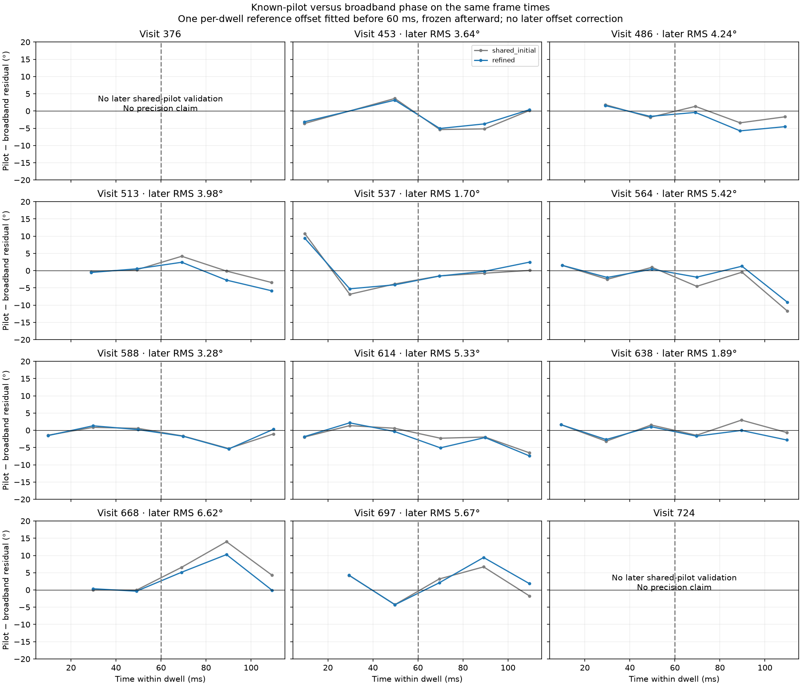
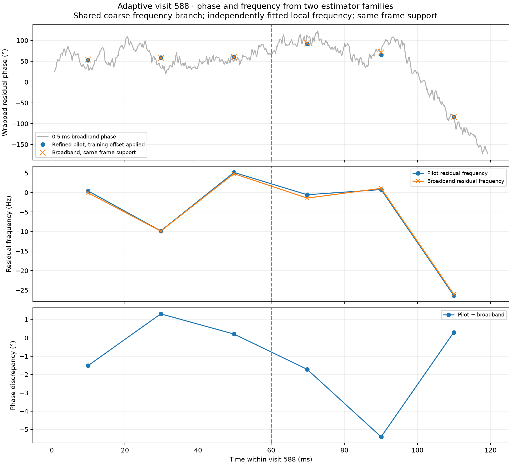

# Extracting phase information from adaptive dual-RX scans

**The adaptive recordings contain recoverable within-dwell relative phase.** The dense broadband trajectory is now cross-checked against the known pilot waveform on the same frame times. Ten of the twelve previously frozen dwells provide later-time comparisons: refined pilot and broadband phase agree to **4.45° pooled circular RMS across 30 later probes**, with individual dwell RMS values of **1.70–6.62°**. These are discrepancies between estimators, not absolute physical-phase errors or calibrated confidence intervals.

This closes the missing pilot check identified in the [previous comparison](2026_09_22_adaptive_phase_difference.md). It does not establish geometric phase, absolute phase continuity across adaptive retunes, or the physical source of receiver phase evolution. No new collection, production deployment, or capture-duty claim is made.



## Practical extraction method

1. Select simultaneous RX0/RX1 candidates by shared timing and frequency evidence, without using their phase agreement. This replay reanalyzes six nonoverlapping 20 ms probes per 120 ms dwell and chooses the strongest phase-blind paired candidate within each probe.
2. Establish one differential-frequency branch using the first-half broadband model. Retain its reference sample, sign and carrier/drift parameters. Do not let independently acquired pilot aliases set unrelated receiver references.
3. Extract dense broadband phase from physically common recorded bandwidth, compensating relative frequency/drift and fractional delay. Use the previously qualified A/B-band tracker to assess broadband support; a spline is only a representation of the measured trajectory.
4. Extract known-pilot frame phasors using a common frequency authority and frame reference. Estimate the local differential frequency, then re-correlate the IQ using that refined difference to remove the within-symbol phase-reference bias. Reject a refinement leaving the ±375 Hz frame-frequency branch.
5. Compare equal time support: evaluate broadband phase at the pilot's actual frame starts, then independently fit its local phase and frequency using the same frame weights. Do not compare a roughly 20 ms pilot estimate to a single instantaneous broadband point.
6. Fit one constant pilot/broadband reference offset on probes wholly within the first 60 ms. Freeze it for probes starting at or after 60 ms. Keep phase and frequency residuals, exclusions, and the per-dwell reference offset as output. Retain explicit unavailable states when the pilot association or broadband quality fails.

The implementation is [replay.py](figures/2026_09_22_adaptive_pilot_closure/replay.py). It reads saved adaptive IQ through the existing source port. The output retains measured pilot phase, broadband phase on matched frame support, independently fitted local frequencies, frame times, source candidates, frame phasors and estimator diagnostics. It reuses the tested [refined pilot extractor](figures/2026_09_22_pilot_support_closure/refined_pilot.py), not a phase fit chosen to agree with broadband.

This experiment's dense scalar comparison uses the established delay-compensated common-band filter from the original adaptive report, with 0.5 ms windows advanced by 0.2 ms. It is distinct from the response-equalized A-band curve used in the prior spline report. The previous disjoint A/B-band checks and the present known-pilot check are complementary. The scalar filter and overlapping windows have local temporal support; this is not a fully independent random-sample test or a forecast from training IQ alone.

## Phase convention and what is observable

Phase is RX1 minus RX0. The saved broadband carrier is `C(t)=2π[Δf(t−t_ref)+Δfdot(t−t_ref)²/2]`. Plotted pilot phase is the measured phase at its center minus `C(center)`, with a single training-only reference offset subtracted for comparison. Broadband frame fitting restores the carrier evolution across frame times before estimating local frequency and transporting phase to the same center. Thus both methods use the same time and coarse frequency branch while fitting local frequency separately.

The frequency-dependent response, receiver/LNB terms and geometric contribution are not separated by this experiment. Each retuned dwell retains an independent intercept. The fitted offsets vary by dwell; averaging them into a cross-retune geometric phase would be unjustified. Absolute calibration is unnecessary for this within-dwell relative-phase extraction, but physical attribution requires additional evidence.

## Real-data results

Input remains `scan-hop-e46d3aba244cf641`, the same twelve visits previously chosen without phase-based reselection. The source manifest is verified against the saved broadband analysis before reading. All ten reported dwells have three later probes; training has two or three valid probes. Small counts are a material limitation.

| Visit | Training probes | Later pilot/broadband phase RMS | Later local-frequency RMS difference |
|---|---:|---:|---:|
| 453 | 2 | 3.64° | 1.74 Hz |
| 486 | 2 | 4.24° | 1.70 Hz |
| 513 | 2 | 3.98° | 0.56 Hz |
| 537 | 3 | 1.70° | 1.23 Hz |
| 564 | 3 | 5.42° | 1.60 Hz |
| 588 | 3 | 3.28° | 0.56 Hz |
| 614 | 3 | 5.33° | 1.48 Hz |
| 638 | 3 | 1.89° | 1.67 Hz |
| 668 | 2 | 6.62° | 0.51 Hz |
| 697 | 2 | 5.67° | 0.63 Hz |

Visit 376 has no qualifying paired pilot candidates in its later half under the phase-blind selection. Its broadband result remains supported by A/B checks, but this replay cannot add later pilot validation. Visit 724 lacks a training set for comparison and was already unqualified for precise broadband interpretation. Neither is silently dropped from the output or counted among the ten validated examples.

Other exclusions are logged individually: some first probes contain frame starts preceding valid filtered broadband window centers, and visit 453 has one probe without a paired candidate. No out-of-range extrapolation or clamping is used. The full twelve-dwell attempt, failures and initial/refined variants are in the saved results.

### Visit 588



After only a −0.211° reference offset learned in the first half, refined pilot and matched-support broadband phase differ by **3.28° RMS**, with a maximum **5.41°** in later probes. Local differential frequency agrees to **0.56 Hz RMS**. The final downward phase excursion is reproduced by both estimator families; it is not created by the spline. The uniform-frame-weight control gives **2.99° RMS**.

The two-pass refinement is retained for its known-reference correctness, not because it always lowers real-data discrepancy. For this visit the initial common-reference method gives 3.26° RMS versus refined 3.28°; several other dwells also worsen slightly. Shared frequency reference and matched temporal support are the decisive prerequisites. Results for both variants and both weighting schemes are retained rather than choosing a winner after seeing validation errors.

## Bottleneck and comparison with the continuous example

The approximately 9° adaptive A/B block scatter and 3.28° pilot/broadband discrepancy measure different support: 1.6384 ms spectral blocks versus frame-matched local estimates spanning roughly 20 ms. Their difference is not a claimed threefold improvement of an identical estimator. The previous post-fix continuous example reached 4.75° with the same style of matched-pilot comparison; these adaptive results are of comparable scale, but use different IQ and only three later probes per dwell.

We now have a working extraction and validation route. Remaining precision limits include noise/common-signal support, different spectral weighting, response uncertainty and unresolved motion within windows. This experiment does not rank those contributions. The next scientific question is the physical origin of the common measured phase trajectory, rather than whether a flexible polynomial can make it flat. A separate untouched corpus would be needed to calibrate general accuracy and operational acceptance thresholds. Additional post-fix continuous recordings were not needed to establish the extraction on this adaptive cohort, and this report does not assert that the adaptive corpus has independently passed the continuous recording's counter-duty audit.

## Verification and reproducibility

- Twelve adaptive dwells attempted; ten yield held-time matched-pilot comparisons, two explicitly unavailable.
- Injected **+0.7 rad** into RX1 of the real visit-588 IQ and repeated extraction. Both unreferenced pilot and broadband phase move by the injected amount, with maximum numerical discrepancy **7.3×10⁻⁸ degrees**. The training-offset comparison is not the injection test: the assertion checks the phase outputs before their offset is removed. This is a sign/reference equivariance check, not proof of absolute accuracy or a new noise/delay test.
- Six report-owned tests passed: four existing refined-pilot known-truth cases (upper/lower waveform, differential-frequency authority errors) and two adaptive curve-selection cases. Existing earlier broadband tests supply delay/frequency recovery coverage; this report does not relabel them as a new full-pipeline validation.
- The renderer checks injection recovery and matching probe/method identities. The focused figure was inspected.

Use the research environment at revision `660bd85a2ccb4622868f1136443c99587a216db6`, with its `src:tools` on `PYTHONPATH` and existing `leo` read access to the corpus:

```bash
sudo -u leo env OPENBLAS_NUM_THREADS=1 MPLCONFIGDIR=/tmp/adaptive-pilot-mpl \
  PYTHONPATH=/home/mouse9911/gits/leo-tracker-adaptive-geometry-phase/src:/home/mouse9911/gits/leo-tracker-adaptive-geometry-phase/tools \
  /home/mouse9911/gits/leo-tracker-adaptive-geometry-phase/.venv/bin/python \
  reports/figures/2026_09_22_adaptive_pilot_closure/replay.py \
  --output /tmp/adaptive-pilot-closure
```

For the known-phase replay, use `--output /tmp/adaptive-pilot-injection --visits 588 --inject-phase 0.7`. The runner imports the existing report-local compensation and refined-pilot helpers via paths relative to itself. The dependency on the research revision is explicit; no runtime code is deployed.

Artifacts: [full replay](figures/2026_09_22_adaptive_pilot_closure/results.json.gz), [injected replay](figures/2026_09_22_adaptive_pilot_closure/injected-588.json.gz), [numerical audit](figures/2026_09_22_adaptive_pilot_closure/audit.json), [plot/audit generator](figures/2026_09_22_adaptive_pilot_closure/render.py). The generator runs directly from these committed compressed results without raw-IQ access. `pytest` targets are `reports/figures/2026_09_22_pilot_support_closure/test_refinement.py` and `reports/figures/2026_09_22_adaptive_phase_fit/test_curve.py`, using the same research environment.
