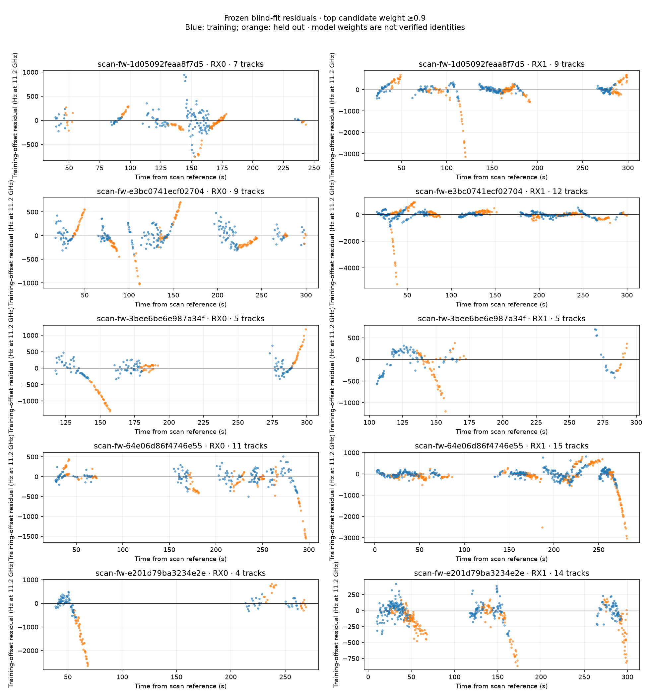
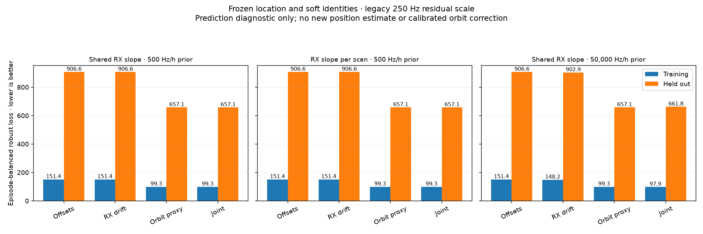

# Frozen blind-fit residual diagnostics

Status: frozen-position diagnostic complete; uncertainty-aware joint refit pending.

## Question

The five-scan blind fit in
[the completed baseline](2026_09_22_joint_blind_geometry/README.md) has stable
regional-search results but still misses the evaluation position by about 5 km.
Before adding flexible nuisance parameters to a new position fit, test whether
its residual evolution transfers between tracks on a receiver or between tracks
assigned probabilistically to the same satellite.

This diagnostic freezes the baseline-inferred receiver position and candidate
weights. It does not read the evaluation coordinate, update identities, or claim
to estimate a new position. The top-eight candidate export is incomplete support
for diagnostic work, not authority for a future blind inference model.

## Inputs and comparison

Reconstruct exact nominal Doppler for the saved RF observations and causal TLEs
bound to the Sacramento five-scan V2 refinement. Retain all chronological training
and held-out observations. Profile each trajectory's constant offset from training
only, as in the baseline, and retain explicit receiver/source provenance.

Compare residual evolution shared by receiver paths against evolution shared by
candidate satellites. Candidate weights are alternative explanations for the
same observations; never count them as independent measurements. Retain null and
omitted identity mass. Balance trajectories so dense sampling cannot determine
the conclusion through raw sample count alone.

A common receiver-frequency slope is a nuisance model, not a receiver UTC clock
correction. A satellite-specific frequency slope is a diagnostic proxy, not a
physical orbit correction. Do not equate either with a causal explanation merely
because it reduces training residuals. Report rank deficiency and confounding:
if each receiver observes disjoint satellites or tracks cover disjoint times,
the two explanations may be indistinguishable.

## Decision gates

1. Synthetic tests must recover injected transferable effects and expose
   confounded designs. Poisoning held-out values must leave fitted coefficients
   unchanged.
2. Evaluate later chronological samples using frozen training coefficients.
   Compare on exactly the same observations and support. These retrospectively
   extracted trajectories are not a prospective detector evaluation.
3. Whole-track or whole-scan transfer is stronger evidence than interpolation
   within a fitted trajectory. Report how many independent groups support any
   claimed transfer; numerical fit quality is not a calibrated probability.
4. A useful residual diagnostic may motivate a controlled joint-fit comparison.
   That new fit must refresh uncertain satellite identities, retain full-catalogue
   and null authority, and validate fitted orbit changes by exact propagation.
5. Do not select nuisance complexity or tune priors by geographic error at the
   revealed evaluation coordinate. Publish failed or inconclusive arms too.

No production changes, new RF collection, calibrated beam-angle observation, or
absolute geometric-phase claim is part of this diagnostic.

## Identity reuse audit

The frozen Sacramento five-scan result contains the following retained candidate
support. Thresholds describe uncalibrated model weights, not verified identities.

| Minimum candidate weight | Supported tracks | Distinct NORAD candidates | Repeated across tracks | Repeated across receivers | Repeated across scans |
| --- | ---: | ---: | ---: | ---: | ---: |
| 0.1 | 159 | 131 | 65 | 45 | 0 |
| 0.5 | 137 | 62 | 35 | 27 | 0 |
| 0.9 | 91 | 47 | 24 | 19 | 0 |

This cohort supports within-scan cross-track/receiver tests. At these thresholds,
it supplies no cross-scan repeat observations of a candidate satellite. Therefore
a correction's performance on a later scan cannot demonstrate transfer of a
learned correction for the same satellite. The benefit of accumulating these five
scans comes from a shared receiver location across different observed passes;
it must not be described as validation of repeated satellite orbit corrections.

All 165 tracks remain accounted for. Their summed null weight is 4.204 and summed
omitted candidate weight is 0.895; neither represents an integer count of known
failed tracks. The top-eight truncation means the audit does not rule out weaker
cross-scan support outside the retained lists.

[Machine-readable audit](2026_09_22_blind_residual_diagnostics/identity-reuse.json)
binds the refinement, RF evidence, and audit source digests. Reproduce using
`tools/research/audit_blind_identity_reuse.py --refinement <sealed-result.json>
--evidence <recent-regional-evidence-v1> --output <new-file.json>`.

## Frozen residual inspection



The figure selects all 91 tracks whose highest retained candidate weight is at
least 0.9, without filtering on residual quality. Blue points trained the
per-track constant offset and identity weights; orange points did not. Each
panel combines different tracks, whose offsets were removed separately. The
vertical scales differ to retain visible outliers; do not compare apparent
point-cloud widths without reading the axes.

Several high-weight candidates predict their later observations poorly. For
example, scan `scan-fw-e3bc0741ecf02704`, episode `4d4750cf…`, gives candidate
59695 weight 0.997, but its residual RMS rises from 415.6 Hz in training to
3,161.4 Hz held out. This is strong evidence against interpreting the frozen
model weight as a calibrated probability of correct association. It does not
by itself identify whether the cause is a wrong identity, trajectory error,
receiver behavior, or orbit-model mismatch.

A subsequent source audit found that the two worst cited trajectories retain
direct fractional-GLRT CFO measurements, not trajectory predictions. Their source
standard uncertainties are approximately **2,752 Hz**, whereas the regional
scorer uses a fixed **250 Hz** signal scale. The adapter retained measured CFOs
but did not carry their individual uncertainty into that scorer. Thus a large
held-out residual is not automatically evidence of precise physical drift:
measurement uncertainty and changing selected candidate ranks must be accounted
for first. The recorded uncertainty is itself a model estimate, not yet a
calibrated empirical error bound.

The [corpus-wide uncertainty audit](2026_09_22_blind_residual_diagnostics/cfo-uncertainty-audit.json)
covers all 5,432 observations. At the canonical 11.2 GHz reference, the uncertainty
median is 2,771 Hz (range 2,636–2,901 Hz). Crucially, this is **not solely frequency
measurement noise**: its native-frequency construction is
`hypot(400 Hz, 15000 Hz/s × UTC bracket half-width)`, followed by RF normalization.
Approximately 0.363-second start-time brackets dominate this allowance. That
timing contribution is shared within a scan and must not be treated as thousands
of independent row errors.

The regional adapter also drops fractional candidate rank. The two cited worst
tracks change rank 20 and 15 times respectively across 35 adjacent observations.
This records selection changes, not proven frequency-bin or alias switching:
the exact GLRT frequency-bin index and acquired CFO are absent from these shards.

The next joint-position comparison should preserve the independent frequency
noise floor and explicitly fit a common receive-time offset per scan, bounded by
its recorded timing authority. Receive-time adjustment must change both orbit
propagation time and Earth rotation; it is not an orbit-only phase correction.
The bounds and reference-time convention are verified below. Association weights
must refresh jointly with position and time.
This is a better-motivated next test than interpreting every large residual as a
small orbit correction. Neither the current audit nor the timing bounds prove
that timing error explains the observed positioning bias.

The [timing-authority audit](2026_09_22_blind_residual_diagnostics/clock-bracket-audit.json)
verifies all five public timing-contract digests. Exported reference time equals
the recorded midpoint estimate exactly. True receive UTC is exported UTC plus a
single scan offset within these bounds:

| Scan suffix | Minimum offset (s) | Maximum offset (s) |
| --- | ---: | ---: |
| `1d05092feaa8f7d5` | -0.181684970 | +0.181684970 |
| `e3bc0741ecf02704` | -0.181676186 | +0.181676187 |
| `3bee6be6e987a34f` | -0.182702226 | +0.182702227 |
| `64e06d86f4746e55` | -0.182989241 | +0.182989241 |
| `e201d79ba3234e2e` | -0.181485643 | +0.181485644 |

The contract bounds the first device sample/sample-clock origin. It supplies no
distribution inside the interval, so a Gaussian prior derived from the half-width
would be unjustified. Subsequent sample times inherit this common origin offset
under the recorded sample rate. TLE causality remains valid over every interval;
the smallest margin beyond the five-second guard is 2,902.996 seconds.

The residual export preserves all 165 episodes and 5,432 distinct observation
rows through their candidate alternatives. There are 1,245 candidate trajectories
and 39,130 candidate-residual rows; these are not 39,130 independent measurements.
The exact symmetric ±1-second orbital-phase derivative is available for the
controlled correction diagnostic, with receive-time Earth rotation held fixed.

## Frozen correction comparison

All 165 episodes participate with frozen candidate probabilities, training-only
coefficients and six effective observations per episode. Candidate alternatives
divide that episode's retained probability mass rather than multiplying the
sample count. The diagnostic keeps the baseline's 250 Hz robust residual scale
for comparison; it is not a validated measurement-noise model.

| Residual model | Training loss | Held-out loss |
| --- | ---: | ---: |
| Training offsets only | 151.365 | 906.598 |
| Shared receiver frequency slope | 151.358 | 906.575 |
| Satellite-specific phase-rate proxy | 99.280 | 657.074 |
| Both corrections | 99.277 | 657.066 |

Loss is an episode-balanced expected pseudo-Huber loss; lower is better. It is
neither RMS in Hz nor a calibrated likelihood or accuracy interval. The proxy
reduces held-out loss by approximately 27.5%, but its coefficients are linearized
descriptive corrections. They are not exact-replayed physical orbit estimates.
The position and identity weights never change in this diagnostic.

The default receiver slope prior is 500 normalized Hz/hour. This is restrictive:
it allows only about 5.6 Hz change over 40 seconds at one prior standard deviation.
A declared 50,000 Hz/hour sensitivity gives receiver-only held-out loss 902.887
and joint loss 661.779; adding that broader receiver drift to the satellite proxy
does not improve prediction. Separating receiver slopes by scan with the original
prior also yields negligible improvement. These comparisons do not rule out
other receiver behavior or establish that the improvement has an orbital cause.

The prior-scaled combined design has rank 307 of 355. Conditional identities,
weak candidate support and the absence of dominant cross-scan recurrence limit
identifiability. Source timing uncertainty supplies a concrete alternative to
the orbit interpretation. The next fit should model that timing authority while
jointly updating position and associations, then validate on held-out evidence.



The [sealed numerical result](2026_09_22_blind_residual_diagnostics/model-diagnostic/result.json)
retains every coefficient, mass, configuration, sensitivity arm and convergence
flag. Exact executed sources and the receipt sit alongside it. All twelve fits
converged; the comparison took approximately six seconds on one CPU. No new
position estimate or improvement in geographic error is claimed here.

## Reproduction and verification

The [residual input archive](2026_09_22_blind_residual_diagnostics/residual-inputs.tar.gz)
contains the five complete candidate-residual shards and their content-bound
manifest. Original RF/TLE inputs remain in the preceding baseline report. Extract
this archive into a fresh directory, then run:

```bash
PYTHONPATH=src .venv/bin/python tools/research/run_receiver_orbit_residual.py \
  --input <extracted-residual-directory> --output <new-result.json>
```

The runner verifies the manifest and shard digests, truth-free flags, aligned
candidate rows and explicit receiver provenance. It fixes numerical threads to
one and binds source hashes to the result. Thirteen focused tests passed across
the numerical diagnostic, runner, residual exporter and identity-reuse audit.
They include held-out poisoning, known synthetic effects, confounding, zero-weight
candidates, digest verification and JSON numeric-key round trips. Both PNGs were
visually inspected. These checks validate the implementation and this diagnostic;
they do not qualify the positioning accuracy or satellite identities.
