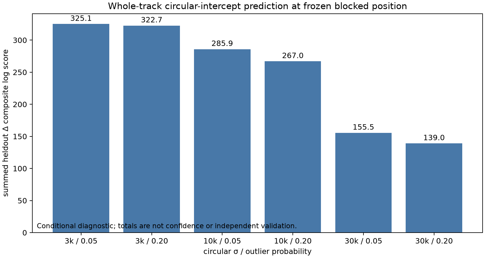

# Circular-offset conditional prediction diagnostic

This research diagnostic asks whether a circular frequency intercept learned only
from other whole RF tracks predicts a held-out track better than a uniform
intercept. It uses all 165 RF tracks, the full causal regional candidate support,
the full-population prior divisor, and the explicit regional null. Candidate
identity is marginalized for every held-out track. No saved identity or truth
position enters the calculation.

The receiver position is frozen at the independently sealed **blocked-partition
Sacramento** refinement. That position was itself fitted from all track shapes,
so this is a conditional frequency-offset diagnostic rather than independent
position or association validation. The sealed refinement digest is
`sha256:f61eb25...f246`; its seal matched, all three source refinements converged,
and it declares `position_truth_used=false`. The checks are recorded in
`input-verification.json`.

For alias period \(P=227272.727\) Hz, candidate mean residual \(m_{tj}\), and
group intercept \(b\), the dimensionless factor is

\[
R_{tj}(b)=P[(1-\epsilon)WN(m_{tj}-b;\sigma,P)+\epsilon/P].
\]

The wrapped normal is evaluated as an explicit integer-image sum. The regional
null remains unchanged. Therefore integrating a candidate factor against a
uniform intercept gives one, and the uniform-intercept arm exactly recovers the
shape-only mixture, including null-dominated tracks. Groups are receiver ID plus
the source-declared pilot edge. Five folds are assigned deterministically from
the session and whole-track IDs; a held-out fold cannot fit the group intercept.



## Results

All six exploratory sensitivity arms have positive aggregate conditional score.
The threshold counts below use `1e-6`: `positive / negative / near-zero`. This
separates exact or nearly exact no-effect rows from meaningful signs.

| σ (kHz) | outlier | receiver | edge | tracks | summed Δ | + / − / ≈0 |
|---:|---:|:---:|:---:|---:|---:|:---:|
| 3 | 0.05 | RX0 | lower | 56 | 114.501 | 48 / 7 / 1 |
| 3 | 0.05 | RX0 | upper | 11 | 10.931 | 7 / 4 / 0 |
| 3 | 0.05 | RX1 | lower | 77 | 154.464 | 66 / 7 / 4 |
| 3 | 0.05 | RX1 | upper | 21 | 45.196 | 17 / 4 / 0 |
| 3 | 0.20 | RX0 | lower | 56 | 113.019 | 48 / 7 / 1 |
| 3 | 0.20 | RX0 | upper | 11 | 12.599 | 7 / 4 / 0 |
| 3 | 0.20 | RX1 | lower | 77 | 152.536 | 66 / 7 / 4 |
| 3 | 0.20 | RX1 | upper | 21 | 44.516 | 17 / 4 / 0 |
| 10 | 0.05 | RX0 | lower | 56 | 99.367 | 53 / 2 / 1 |
| 10 | 0.05 | RX0 | upper | 11 | 17.163 | 11 / 0 / 0 |
| 10 | 0.05 | RX1 | lower | 77 | 134.790 | 71 / 2 / 4 |
| 10 | 0.05 | RX1 | upper | 21 | 34.617 | 20 / 1 / 0 |
| 10 | 0.20 | RX0 | lower | 56 | 93.159 | 53 / 2 / 1 |
| 10 | 0.20 | RX0 | upper | 11 | 15.710 | 11 / 0 / 0 |
| 10 | 0.20 | RX1 | lower | 77 | 125.058 | 71 / 2 / 4 |
| 10 | 0.20 | RX1 | upper | 21 | 33.075 | 20 / 1 / 0 |
| 30 | 0.05 | RX0 | lower | 56 | 53.213 | 53 / 2 / 1 |
| 30 | 0.05 | RX0 | upper | 11 | 9.055 | 11 / 0 / 0 |
| 30 | 0.05 | RX1 | lower | 77 | 73.526 | 73 / 0 / 4 |
| 30 | 0.05 | RX1 | upper | 21 | 19.717 | 21 / 0 / 0 |
| 30 | 0.20 | RX0 | lower | 56 | 47.643 | 53 / 2 / 1 |
| 30 | 0.20 | RX0 | upper | 11 | 8.010 | 11 / 0 / 0 |
| 30 | 0.20 | RX1 | lower | 77 | 65.807 | 73 / 0 / 4 |
| 30 | 0.20 | RX1 | upper | 21 | 17.579 | 21 / 0 / 0 |

The overall summed scores are 325.092, 322.670, 285.938, 267.002,
155.511, and 139.040 in table order by arm. Every receiver/edge group is net
positive in every arm. These sums are composite-likelihood diagnostics and are
not confidence measures; RF tracks and dual-receiver observations can share
sources and are correlated.

The one-intercept model assumes a constant value for each receiver/edge group
across roughly 3.2 hours. It does not estimate receiver drift or a distribution
of offsets. The pilot-edge label is acquisition metadata and does not establish
an LNB-side or physical hardware interpretation. Hyperparameter arms are
exploratory because their scale was informed by the earlier all-data audit.

## Numerical and execution record

The real-data run used a 1024-point circular grid. Repeating full propagation was
not needed for a format check. A fixed arbitrary multimodal synthetic likelihood
gave Δ values `0.7959977692726712`, `0.7959977692726734`, and
`0.7959977692726703` at 512, 1024, and 2048 points; the 1024/2048 difference was
`3.11e-15`. A sharper stress case used 77 identical training tracks, the
narrowest 3 kHz arm, a mode halfway between adjacent 1024-grid points, and a
heldout offset displaced by 900 Hz. Its scores were `3.308249101609343`,
`3.3082521480509586`, and `3.3082521480509417`; the 1024/2048 difference was
`1.69e-14`. These check the quadrature implementation, including the largest
real group concentration, but real-data grid convergence was not rerun.

The executed source is `executed-ablation-source.py`, digest
`sha256:48f621...2ac`. It requires offsets in the principal alias interval, and
the executed loader explicitly wrapped every offset before calling it. The
repository helper was subsequently generalized to accept arbitrary
integer-period-shifted offsets, digest `sha256:aa909a...ee5`; that convenience
change did not alter executed inputs and did not require rerunning the result.
The run took 145.87 seconds on one BLAS thread and used 287,380 KiB peak RSS.

Reproduce with the current helper, whose generalized wrapping preserves these
principal-interval inputs, into a fresh output path. The flat archived sources
record the executed bytes; the runnable helper locates the bound replay source
in the repository's `tools` directory.

```bash
sudo -n env OPENBLAS_NUM_THREADS=1 OMP_NUM_THREADS=1 nice -n 10 \
  .venv/bin/python tools/research/ablate_blind_circular_offset.py \
  --refinement /tmp/recent-five-block-regional-v1/sacramento-set-refinement-v2/result.json \
  --evidence /tmp/recent-regional-evidence-v1 \
  --rf-shards /tmp/recent-position-rf-shards-v1 \
  --output /tmp/circular-offset-reproduction.json --grid-size 1024
```

The reproduction requires the exact sealed refinement, RF shards, evidence,
causal TLE files, and replay source bound in `result.json` and
`execution-receipt.json`. The tool rejects unsafe TLE basenames, a violated
five-second causal guard, support drift, truth-used inputs, and disagreement in
receiver, channel, actual RF, or canonical RF lane metadata.
