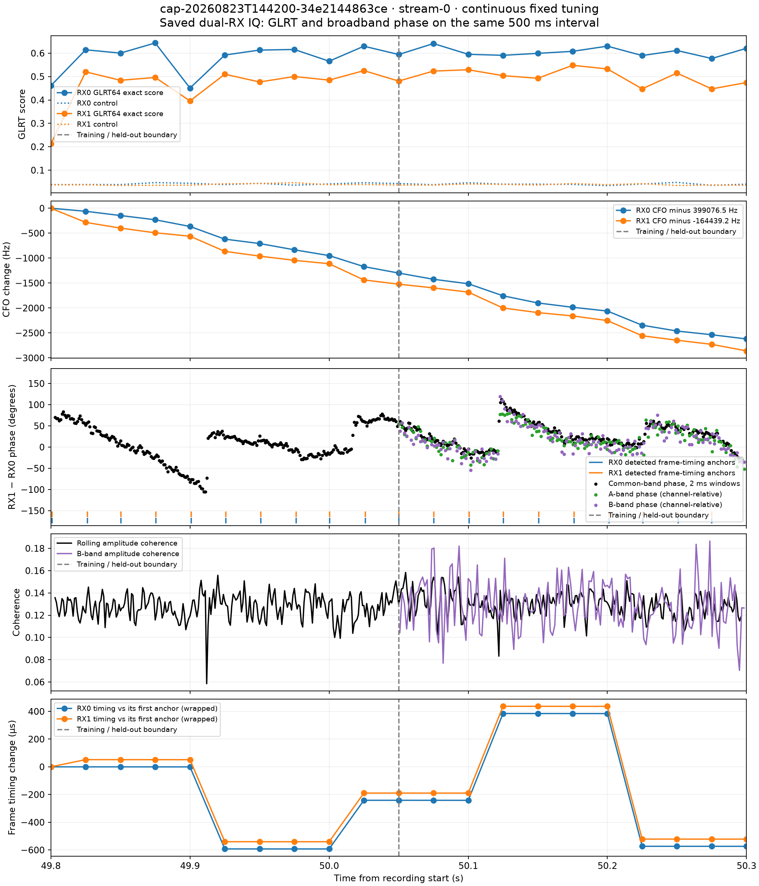
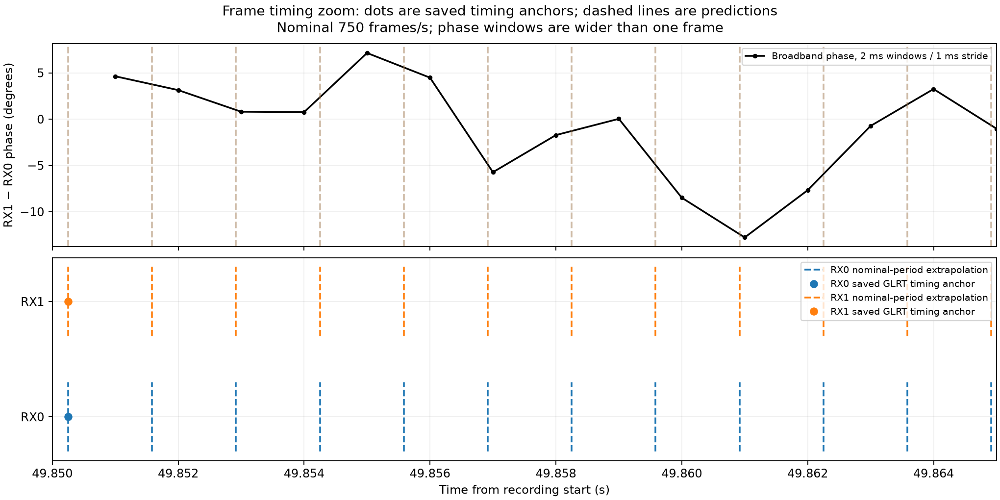

# Continuous dual-RX IQ: broadband phase, GLRT and frame timing

Replayed the saved fixed-tuning recording `cap-20260823T144200-34e2144863ce`, stream-0, at **49.800–50.300 s**: 500 ms and **1,250,000 complex samples per receiver**, at 2.5 MS/s. This is a section of a continuous 60-second recording, not an adaptive scan. No new RF was collected.

The section was selected from the strongest shared 500 ms example in the [earlier GLRT/phase report](2026_08_23_glrt_phase_segment_comparison.md), before inspecting this replay's phase shape. Sealed analysis run: `capture-da59c914adfe41278262fe4b5d297de0`. Both receiver tracks have strong known-pilot evidence; this supports a shared signal hypothesis but does not establish a unique satellite identity.



The panels show GLRT64 exact/control scores, each receiver's frequency change, broadband phase, amplitude coherence, and frame-timing evolution. The dashed vertical line separates model training from later validation. GLRT times are probe **start** times, not instantaneous phase measurement times. There are 21 archived probes per receiver at 25 ms spacing; the last starts at the displayed interval's endpoint and supplies context.

| Quantity | Result |
|---|---:|
| RX0 GLRT64 exact score | 0.451–0.644 |
| RX1 GLRT64 exact score | 0.212–0.548 |
| Fitted RX1−RX0 frequency offset | −563,729.647 Hz |
| Common filter support, RX0 baseband | −656,270 to +1,220,000 Hz |
| Frozen-model held-out amplitude coherence | 0.1131 |
| Phase-tracked, held-out B-band coherence | 0.1236 |
| Corresponding wrong-time control | 0.00080 |
| Tracked held-out B-band mean residual phase | −1.16° |

Strong GLRT detections coexist with modest common-waveform coherence. The sample count does not imply a million independent phase measurements. Rolling 2 ms estimates overlap at a 1 ms stride; adjacent values are correlated. The B-band check withholds frequency groups from the A-band phase tracker, though leakage and colored noise prevent a claim of exact statistical independence.

## Frame boundaries: what we actually have

The archived GLRT candidate contains an integer `local_epoch_sample`. Its frame-timing anchor is `probe_sample_start + local_epoch_sample`, divided by sample rate. The detector constructs subsequent template starts using its nominal **750 frames/s**, or **1.333333 ms per frame** (3333.333 samples at this sample rate).

The full plot marks those saved timing anchors as short blue/orange ticks. The zoom below additionally shows a **locally extrapolated** frame grid, anchored independently for each receiver. Dots are archived timing estimates; dashed lines are predictions, not fresh independent detections of every frame. We have no absolute frame numbers here. Integer-sample timing has 0.4 µs granularity, which is not a calibrated error bound. Fractional timing refinement is not used in these markers.



RX0/RX1 anchors nearly coincide in this zoom. Across the full interval, however, the selected timing hypotheses jump together by hundreds of microseconds. A global frame comb anchored only at the start would therefore misrepresent the archived evidence. The bottom panel wraps each receiver's timing against **its own first anchor**; its two vertical offsets are not an inter-receiver delay measurement. Lines connect sparse probes and do not locate the jumps precisely.

The phase transitions near 49.91, 50.015, 50.12 and 50.225 s occur near changes in these timing hypotheses, within the 25 ms timing-probe resolution. This is an association, not proof that a frame boundary causes a phase reset. Ordinary frames occur every 1.333 ms, far more often than these transitions. Candidate/timing-basin changes, signal structure and source mixtures need investigation before assigning a physical cause. These transitions occur within a fixed-tuning recording, so scanner retuning is not a sufficient explanation for them.

The current phase window is **2 ms**, wider than a frame. This figure cannot resolve a sub-frame phase step. A next diagnostic should evaluate frame-synchronous, shorter windows and compare the selected timing basin with competing basins around each transition.

## Estimator and phase reference

Sign is `arg(RX1 * conj(RX0))`. The broadband fit uses the first half of the selected IQ, seeded by the difference of the frozen GLRT trajectory frequencies, with a ±200 kHz search. It jointly models frequency, drift, delay and complex channel response using common recorded spectral support. This run chooses zero differential drift and zero fractional delay; that is a model result, not a physical claim that all hardware delays vanish.

The fitted channel intercept is **+10.47°**, at recording time **49.9245182 s** and RX0 baseband frequency **+298,213.704 Hz**. Its conditional fit-scatter standard error is about **1.02°**, not a calibrated physical confidence interval. The corresponding frequency fit-scatter standard error is 0.93 Hz. The intercept includes receiver/channel response and is not satellite geometric phase.

Black phase points use the common-band cross product after frequency/drift and delay correction. They retain the aggregate complex channel response. Green/purple points use A/B spectral groups relative to the frozen fitted channel, so their intercept gauge differs from black. Their consistent time evolution is useful; equality of their absolute intercepts is not assumed. The −1.16° B-band residual above measures alignment error after tracking, not the underlying observed phase.

## Reproduction and provenance

The [runner](figures/2026_09_22_continuous_dual_phase/replay.py) rereads verified saved IQ through `RecordingStore`, resolves GLRT candidates through the sealed trajectory's source-observation IDs, and writes [all numerical results](figures/2026_09_22_continuous_dual_phase/results.json). Candidate selection uses archived track association and frequency proximity, never the resulting phase. JSON includes source-product digests, raw-slice digest, model references, each GLRT score and frame anchor, phase windows and held-out diagnostics.

Estimator and reader implementation is preserved on the remote research branch at commit [`660bd85a2ccb4622868f1136443c99587a216db6`](https://github.com/misko/leo-tracker-reduxredux/tree/660bd85a2ccb4622868f1136443c99587a216db6). Use that checkout with its Python environment and access to the existing `/srv/bulk/leo` corpus:

```bash
sudo -u leo env OPENBLAS_NUM_THREADS=1 MPLCONFIGDIR=/tmp/continuous-phase-mpl \
  PYTHONPATH=/home/mouse9911/gits/leo-tracker-adaptive-geometry-phase/src:/home/mouse9911/gits/leo-tracker-adaptive-geometry-phase/tools \
  /home/mouse9911/gits/leo-tracker-adaptive-geometry-phase/.venv/bin/python \
  /home/mouse9911/gits/leo-tracker-phase-reports-main/reports/figures/2026_09_22_continuous_dual_phase/replay.py \
  --output /tmp/continuous-dual-phase-results
```

Validation: the broadband alignment and phase-tracking component tests passed (5 tests); the saved-IQ replay completed with 1,250,000 samples per RX and 42 associated GLRT entries. Both generated plots were inspected. Only reports and supporting report artifacts are published; no production deployment or collection changes are included.
