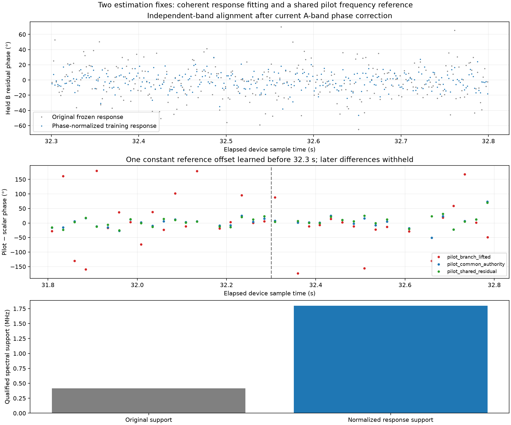

# Two concrete phase-estimation fixes on the post-fix example

This bounded experiment uses the same counter-contiguous `.21` RX0/RX1 slice, `cap-20260825T010019-89c2889553e0`, stream-1, 31.800–32.800 s. The original phase motion remains in the measured phase trajectory. The improvements below concern estimating and compensating that motion; they do not force the physical phase to be constant.

## Problem 1: fitting the channel while phase is rotating

The original channel estimator averages the cross-spectrum after removing only a global polynomial carrier. Residual phase rotation within the training half cancels legitimate cross-spectrum contributions, weakens the inferred transfer amplitude and rejects valid common spectral support. The mask retained only 679 bins, or 0.414 MHz summed bandwidth.

The report prototype now alternates three times: estimate each training block's phase using only A frequency groups and the current transfer; remove that block phase; refit the smoothed transfer and empirical null-gated common-band mask. All of this uses only the first 500 ms. The original phase gauge, frequency and drift remain fixed. After training, current A bands estimate the phase and separate B bands validate it using the existing tracker.

| Measurement | Original response | Updated response, original support | Updated response, expanded support |
|---|---:|---:|---:|
| Qualified bins | 679 | 679 | 2949 |
| Qualified support | 0.414 MHz | 0.414 MHz | 1.800 MHz |
| Held B amplitude coherence | 0.2027 | 0.2103 | 0.1962 |
| Held B normalized complex error | 0.9901 | 0.9777 | 0.9806 |
| Held B residual phase RMS | 21.32° | 21.07° | 11.08° |
| Wrong-time coherence | 0.0067 | 0.0049 | 0.0026 |

The equal-support comparison isolates response fitting: prediction improves without selecting different frequencies. Most of the phase-scatter reduction comes from admitting more qualified bandwidth, not a large reduction per original bin. The slightly lower expanded-support coherence includes weaker bins and is not a like-for-like regression. The expanded held-band mean residual is −1.52°; conditional adjacent-block-pair bootstrap errors for its aggregate phase are approximately [−1.22°, +1.19°], not a per-block interval or a calibrated physical phase uncertainty.

## Problem 2: incompatible pilot frequency references

The previous comparison omitted existing pilot variants that bind both receivers to the independently measured broadband differential frequency. That was an incomplete method comparison. Independently acquired GLRT/pilot frequency branches can leave incompatible phase references even after frame-rate branch lifting.

This replay applies `extract_dual_receiver_phase_with_offset_authority` and its shared-within-frame-residual variant. RX1's seed is RX0's seed plus the frozen broadband frequency difference evaluated at the probe center. Both receivers use the same reference sample. The authority comes from training-only broadband fitting, not a phase chosen to match the pilot output.

For comparison to the scalar broadband phase, each method is allowed one constant reference offset fitted on the first half and then frozen. The validation half is not used to select that offset.

| Pilot method | Later circular RMS difference from scalar phase |
|---|---:|
| Prior independently seeded branch-lifted method | 82.33° |
| Shared broadband frequency authority | 25.16° |
| Shared authority and common within-frame residual | 22.97° |

These are discrepancies between methods on held-out time, not errors against physical phase truth. Pilot estimates integrate roughly 20 ms whereas the scalar curve uses 2 ms windows, and channel-response weighting differs. Remaining late outliers reach tens of degrees and need further diagnosis; strong local resultant alone is not enough. Broadband and pilot estimates also share the recording and frequency authority, so they are not wholly independent measurements.

## Validation and remaining work

Four deterministic report-owned tests cover recovery of a known smooth response under rotating phase, rejection of independent receiver noise, and recovery of known time-varying phase with held-band validation at high and approximately 0.2 coherence. They pass. The previously exercised 24 component tests cover the reused estimators, including band separation and pilot reference behavior. The new phase-normalization routine only receives training spectra; its fit cannot use later IQ.

The example now has better broadband support, better matched-support prediction and substantially better agreement with correctly referenced pilot estimators. Remaining work is to diagnose the late pilot outliers, match temporal support in comparisons, and validate reported time-dependent uncertainty more broadly. This report does not identify the physical origin of the LNB/receiver differential phase or claim satellite geometric phase recovery. The prototype remains report-local; no production deployment or runtime contract change is made.

## Reproduction and artifacts

- [Response-fitting implementation](figures/2026_09_22_dynamic_channel_phase/experiment.py)
- [Synthetic and null tests](figures/2026_09_22_dynamic_channel_phase/test_experiment.py)
- [Pilot replay including the missing variants](figures/2026_09_22_dynamic_channel_phase/replay_pilot_authority.py)
- [Plot and comparison runner](figures/2026_09_22_dynamic_channel_phase/render.py)
- [Response and held-band results](figures/2026_09_22_dynamic_channel_phase/results.json)
- [Full pilot replay results](figures/2026_09_22_dynamic_channel_phase/pilot-authority-results.json)
- [Pilot comparison metrics](figures/2026_09_22_dynamic_channel_phase/pilot-comparison.json)

Use the Python environment and `src:tools` imports from research commit `660bd85a2ccb4622868f1136443c99587a216db6`, with the existing saved corpus. Run `experiment.py` (writes `/tmp/dynamic-channel-phase`), then `replay_pilot_authority.py --output /tmp/postfix-phase-methods-authority`, then `render.py`. Run `pytest test_experiment.py` with the same source imports. No RF is collected.
