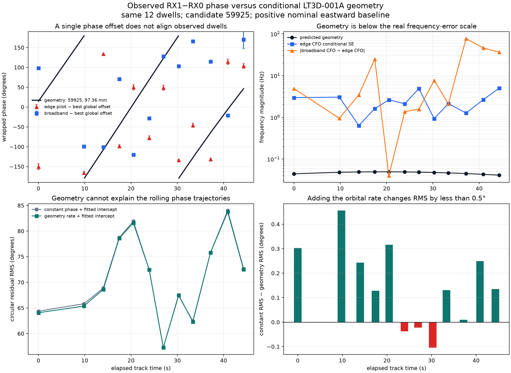

# Why the observed e46 phase does not follow the geometry curve

## Finding

The conditional orbit/holder calculation is internally consistent, but the
measured quantity was not yet accurate or phase-continuous enough to expose it.
The central mistake was treating common satellite Doppler as if it left only a
constant RX1-minus-RX0 phase. It cancels the satellite's common radial Doppler;
it does **not** cancel the differential phase and frequency of the two independent
LNB downconversion paths, the retune phase reset, or frequency-dependent channel
phase.

For candidate 59925 and the illustrative 97.36 mm eastward baseline, geometry
predicts only 14.9–17.8 degrees/s. That is **0.041–0.050 Hz** of differential
phase rate and 1.78–2.14 degrees over a 120 ms dwell. The real edge-pilot
frequency standard errors are 0.64–4.99 Hz, with a median of 2.38 Hz—about
49 times the geometric rate. Broadband and edge frequency estimates disagree
by a median 4.15 Hz and as much as 77.10 Hz. The target geometric effect is
therefore below both the conditional uncertainty and the observed estimator
systematics.



## Direct comparison

The upper-left panel gives both observed phase methods their most favorable
single nuisance parameter: each is rotated by the best global constant offset
before comparison with geometry. They still do not follow the wrapped curve.

| Observable | Dwells | Best global offset | Circular residual RMS | Residual resultant |
| --- | ---: | ---: | ---: | ---: |
| Edge-pilot phase | 12 | −66.5° | 93.1° | 0.131 |
| Broadband intercept | 12 | −70.7° | 96.4° | 0.090 |
| Broadband, held-out-valid dwells | 11 | −97.6° | 90.5° | 0.167 |

A resultant near one would mean the geometry plus one constant offset describes
the observations. These resultants are weak. Removing failed visit 724 does not
repair the relationship, so that late failure is not the main cause.

Inside each dwell, fitting an independent phase intercept and adding the exact
predicted orbital rate changes the rolling-phase circular RMS by only −0.10 to
+0.46 degrees, with a median improvement of 0.13 degrees. The remaining RMS is
57–84 degrees. The orbital term is present in the model, but it is too small to
explain or materially improve the observed trajectories.

The delay view reaches the same conclusion. Across these 12 times, the nominal
geometric delay spans only −0.086 to +0.101 ns, a total motion of 0.00047 sample
at 2.5 MS/s. Even the full 97.36 mm baseline is just 0.00081 sample of delay.
The earlier strong-dwell effective-delay scatter was approximately 0.013–0.014
sample, tens of times larger than this geometric motion.

## Where the earlier interpretation failed

1. **Identical satellite Doppler is not identical receiver phase.** The two LNBs
   have independent oscillator and transfer paths. The alignment model removes
   an approximately −675.5 kHz relative frequency branch, but a residual error
   of just 1 Hz creates 43.2 degrees of phase error over 120 ms. Recovering the
   geometric rate requires residual frequency accuracy around 0.05 Hz on the
   weak common component.

2. **The residual was not a constant offset.** The rolling phase plots directly
   reject one constant phase across a dwell. A first-half polynomial also failed
   to forecast the second half; successful held-out checks required online phase
   tracking from separate frequency groups. Assuming one constant after warm-up
   was stronger than the data support.

3. **Retunes break the phase connection between dwells.** Geometry evolves
   continuously, but the scanner does not record a guaranteed common phase
   reference across retunes. Giving all 12 dwells one shared nuisance offset is
   already optimistic and fails. Giving every dwell its own offset would fit any
   geometric curve and therefore cannot test geometry.

4. **The plotted methods use different gauges.** Edge-pilot phase and broadband
   intercept phase have different waveform references, sample times, frequency
   references, and channel-response conventions. Their numerical intercepts are
   each valid within their declared gauge; they are not interchangeable samples
   of carrier phase at the LNB phase centers.

5. **Only a weak common component is coherent.** Common-band coherence is
   0.093–0.226, so a scalar copy of RX0 describes only 0.86–5.12% of RX1 energy
   in the rolling windows. Frequency-held-out tracking validates a shared moving
   component in the first 11 dwells, but it does not turn the full received
   waveform into a clean phase reference.

Candidate identity, exact holder pose, cable mapping and electrical phase-center
location remain conditional. They change the predicted sign and scale, but they
are not the dominant reason for this mismatch. Candidate 60188 also predicts
only roughly 1.1–1.6 degrees of motion per dwell, so changing to the runner does
not explain the many-cycle observed trajectories.

## Correct path forward

The geometry term should enter a joint local phase-state model as a small known
or fitted covariate. The estimator should track differential LNB/receiver phase
and frequency continuously, then ask whether the residual contains the predicted
0.04–0.05 Hz smooth component. It should not estimate a large CFO once and treat
everything left as geometry.

A decisive measurement needs longer uninterrupted dual-RX support at one tuning.
At the predicted 15–18 degrees/s, one continuous second accumulates a visible
15–18 degrees and avoids inter-dwell reset ambiguity. The model should continue
using disjoint frequency groups for validation and should report the posterior
uncertainty of the small geometry coefficient against a receiver-frequency
random-walk nuisance term.

Absolute geometric phase additionally requires a differential path calibration
or a phase-coherent shared reference that covers both LNB chains. A reference
inserted after the LNBs would calibrate only the downstream radio path. Until
that exists, the honest estimand is geometry-correlated phase **change** during a
continuous capture, rather than the absolute wrapped phase at separated dwells.

## Reproduction

- [Per-dwell comparison ledger](figures/2026_09_22_e46_geometry_observed_comparison/observed-vs-geometry-by-dwell.csv)
- [Machine-readable summary](figures/2026_09_22_e46_geometry_observed_comparison/observed-vs-geometry-summary.json)
- [Comparison script](figures/2026_09_22_e46_geometry_observed_comparison/compare_observed_geometry.py)
- [Conditional geometry report](2026_09_22_e46_shared_visit_geometry_phase.md)
- [Observed multi-dwell phase report](2026_09_22_multi_dwell_shared_track_phase.md)

Run from the published report worktree with the research Python environment:

```bash
OPENBLAS_NUM_THREADS=1 MPLCONFIGDIR=/tmp/leo-e46-compare-mpl \
  /path/to/research/.venv/bin/python \
  reports/figures/2026_09_22_e46_geometry_observed_comparison/compare_observed_geometry.py
```

This comparison uses published artifacts only. No RF was collected and no saved
recording was modified.
