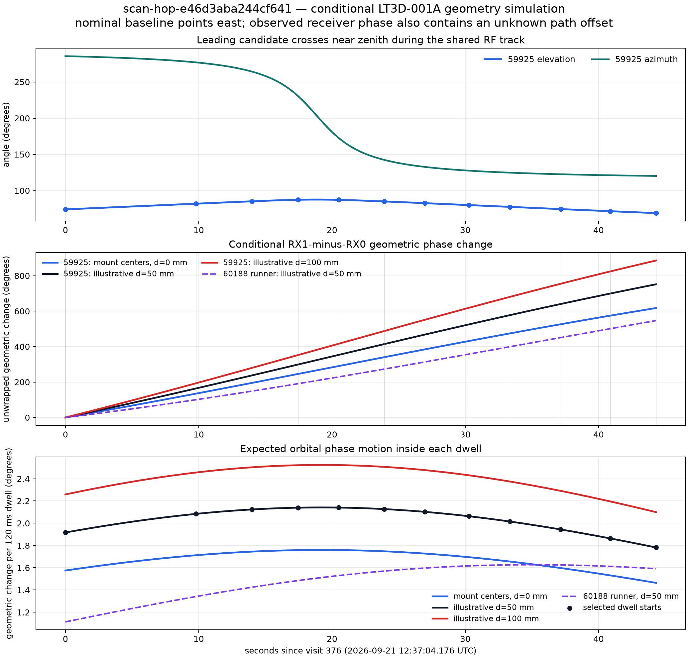
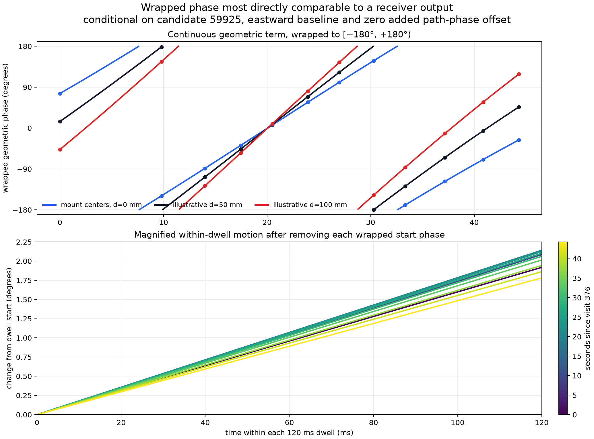

# Conditional geometric phase for the e46 shared receiver track

## Finding

The plotted cohort contains **12 dwells, not nine**. They are a sparse selection
from 106 exact shared visits between the RX0 and RX1 tracklets over 44.3067 s in
`scan-hop-e46d3aba244cf641`, channel 2 upper. The two receiver-local tracklets
have 109 and 141 observations and follow the same RF frequency trajectory. This
is strong evidence for one shared signal visit. It does not, by itself, prove a
catalogue identity.

There is also independent orbit evidence. RX0 and RX1 each ranked NORAD 59925
(`STARLINK-31959` in the frozen snapshot) first, and the paired-receiver rerun
retained 59925 as the joint leader. Its
training/evaluation RMS is 380.7/556.4 Hz, versus 1482.3/1948.9 Hz for runner-up
60188. The saved analysis still marks the identity as candidate-only, so the
simulation below is conditional on 59925 rather than a claim that 59925 is the
true satellite.



The wrapped view below is closer to what a phase estimator would display. The
top panel wraps the continuous geometric term into `[−180°, +180°)`. The bottom
panel magnifies the change during the actual 120 ms intervals at the 12 selected
dwell starts for the nominal 97.36 mm baseline, subtracting each wrapped start
phase so the small slope is visible. Each dwell contains only about two degrees
of orbital motion, although their theoretical wrapped starting phases span the
full circle.



The plotted absolute wrap locations assume zero added receiver/LNB/channel
phase. Real captures can be rotated by an unknown constant, and the retune can
change that offset independently between dwells. The reliable prediction is the
smooth within-dwell change and its sign; the vertical placement of a real dwell
requires path calibration.

Under the nominal installed interpretation—holder `+x` points east and the
provisional mapping puts RX0 at negative x and RX1 at positive x—the leading
candidate crosses close to zenith: elevation rises from 74.1 degrees to 87.6
degrees and falls to 68.9 degrees. Its azimuth moves from 285.6 to 120.2 degrees.
The east component of its line of sight therefore crosses zero, producing a
smooth, monotonic RX1-minus-RX0 geometric phase ramp.

For the illustrative 97.36 mm RF baseline, the predicted geometric term changes
by **+751.7 degrees**, or 2.09 unwrapped cycles, across the 44.3 s interval. The
rate is 14.9–17.8 degrees/s, corresponding to only **1.78–2.14 degrees during
each 120 ms dwell**. Baseline sensitivity is material: the full-window change is
617.7 degrees for the verified 80 mm mount-center separation and 885.8 degrees
for an illustrative 114.73 mm phase-center baseline. The runner-up orbit gives a
different but still smooth nominal curve, about 568 degrees over this window.

## Dwell-aligned nominal prediction

The table uses the 97.36 mm illustrative baseline. `Phase` is the geometric term
itself in an unwrapped gauge; `change` subtracts visit 376. It should not be
compared directly with independently retuned measured phase intercepts.

| Visit | Elapsed | Azimuth | Elevation | Phase | Change | Rate | Change in 120 ms |
| ---: | ---: | ---: | ---: | ---: | ---: | ---: | ---: |
| 376 | 0.0 s | 285.6° | 74.1° | −345.5° | +0.0° | 16.0°/s | 1.92° |
| 453 | 9.8 s | 277.0° | 82.0° | −181.5° | +163.9° | 17.4°/s | 2.08° |
| 486 | 14.0 s | 264.3° | 85.3° | −107.8° | +237.7° | 17.7°/s | 2.12° |
| 513 | 17.5 s | 230.5° | 87.4° | −46.4° | +299.0° | 17.8°/s | 2.14° |
| 537 | 20.5 s | 172.8° | 87.2° | +7.9° | +353.4° | 17.8°/s | 2.14° |
| 564 | 23.9 s | 142.4° | 85.0° | +69.0° | +414.5° | 17.7°/s | 2.13° |
| 588 | 27.0 s | 132.7° | 82.7° | +122.6° | +468.1° | 17.5°/s | 2.10° |
| 614 | 30.3 s | 127.5° | 80.0° | +180.1° | +525.6° | 17.2°/s | 2.06° |
| 638 | 33.3 s | 124.8° | 77.5° | +232.2° | +577.6° | 16.8°/s | 2.02° |
| 668 | 37.2 s | 122.6° | 74.5° | +295.3° | +640.8° | 16.2°/s | 1.94° |
| 697 | 40.9 s | 121.2° | 71.6° | +354.1° | +699.6° | 15.5°/s | 1.86° |
| 724 | 44.3 s | 120.2° | 68.9° | +406.3° | +751.7° | 14.9°/s | 1.78° |

## What this means for the measured phase

With `b = p_RX1 - p_RX0` and source unit vector `s`, the simulated sign is

`phi_geom = (360 f / c) dot(b, s)` degrees.

Reversing the provisional receiver-to-slot mapping reverses every value. An
unknown constant receiver/LNB/channel phase rotates the entire curve. More
critically, the scanner retunes between dwells, so the observed phase intercept
can acquire a separate offset on every dwell. The continuous geometric ramp is
real under the stated orbit and geometry, but the existing uncalibrated phase
intercepts cannot simply be unwrapped across the gaps to recover it.

Within a dwell, the orbit model predicts about two degrees of geometric motion.
The many-cycle ridges in the earlier per-sample plots are therefore not orbital
geometry alone. They are dominated by residual inter-receiver frequency/phase
evolution and channel effects. Once those nuisance terms are estimated, a
geometry-consistent residual for this candidate should be a smooth 15–18
degrees/s contribution, with only mild curvature over 120 ms.

The STL fixes the 80 mm mount centers and 20-degree included neck angle. It does
not measure the LNB electrical phase centers. The 97.36 and 114.73 mm curves use
hypothetical equal 50 and 100 mm axial phase-center offsets. The holder axis is
reported approximately east-west, but its exact installed rotation and the
physical cable trace are not recorded. Those uncertainties affect scale, sign,
and projection. They prevent this simulation from being an absolute calibrated
geometric-phase recovery.

## Reproduction and provenance

- [Per-dwell candidate values](figures/2026_09_22_e46_geometry_phase/geometry-phase-by-dwell.csv)
- [Machine-readable assumptions and summary](figures/2026_09_22_e46_geometry_phase/geometry-phase-summary.json)
- [Reproduction script](figures/2026_09_22_e46_geometry_phase/plot_geometry_phase.py)
- [The phase measurements used to select the 12 visits](figures/2026_09_22_multi_dwell_track_phase/multi-dwell-results.json)
- [Paired-receiver candidate analysis](2026_09_22_paired_receiver_identification.md)
- [LT3D-001A geometry audit](2026_09_21_lt3d001a_phase_geometry_audit.md)

The causal Space-Track snapshot was collected at
`1789992264848620245` ns with digest
`sha256:699a1342b42e7014ab0ee1ac11f72bd534cae477bf824ca7aeeb11973ac8c7c7`.
Candidate-specific fitted orbit-time adjustments are +1 s for 59925 and −5 s
for 60188. The LT3D-001A mesh digest is
`sha256:934d4fe7f26b4169f4f421e7383137f5eeb22317ae141bcdaf1fcf9e2221f487`.

Run from the research source environment:

```bash
OPENBLAS_NUM_THREADS=1 MPLCONFIGDIR=/tmp/leo-e46-geo-mpl \
  PYTHONPATH=src .venv/bin/python \
  /path/to/published/reports/figures/2026_09_22_e46_geometry_phase/plot_geometry_phase.py
```

No RF was collected and no recording was modified.
