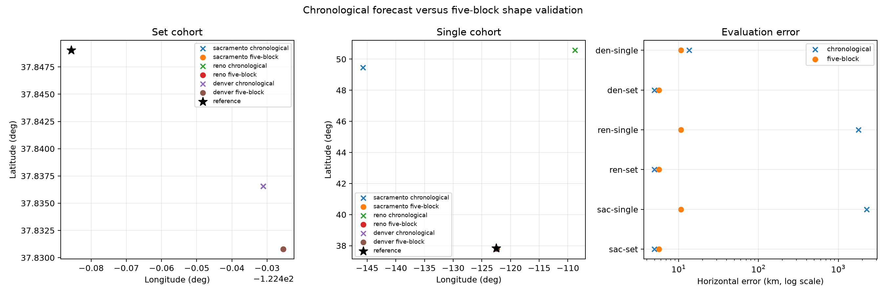

# Five-block full-trajectory blind position sensitivity

This exploratory study asks whether the severe ambiguity of one recent 300-second
scan was caused by training satellite association on only the first 60% of each
trajectory. It uses the same five RF-only scans, 165 trajectories, 5,432
observations, causal TLEs, full regional catalogue mixture, null alternative,
three independently declared 5,000 km square regions, and nominal-orbit position
model as the [chronological baseline](../2026_09_22_joint_blind_geometry/README.md).
No new RF was collected.

Within each source trajectory, observations are stably sorted by time and split
with `numpy.array_split` into five chronological index blocks. Blocks 0, 2 and 4
train; blocks 1 and 3 evaluate. The uncapped fit retains all 5,432 observations:
3,253 training and 2,179 evaluation rows. This is full-span interpolation and
shape cross-validation. It is not prediction beyond the fitted time span and
does not replace the chronological future-40% test.

Inference files and hashes were sealed before the evaluation coordinate was
opened. The combined [inference bindings](artifacts/inference-bindings.json)
record all six five-block and six chronological inputs used by the evaluation.

## Result

All three regional starts independently selected the same local mode for both
cohorts, and all 18 local fits converged. The five-scan set is still displaced
from the evaluation reference. Full-span training therefore resolves the single
scan's continental mode ambiguity in this cohort, but it does not improve the
five-scan absolute result.

| Start | Cohort | Five-block position | Five-block error | Chronological error |
|---|---|---|---:|---:|
| Sacramento | five scans | 37.830790, -122.425396 | 5.6670 km | 4.9883 km |
| Reno | five scans | 37.830787, -122.425403 | 5.6665 km | 4.9883 km |
| Denver | five scans | 37.830801, -122.425419 | 5.6647 km | 4.9892 km |
| Sacramento | single scan | 37.806764, -122.376206 | 10.7002 km | 2,258.6874 km |
| Reno | single scan | 37.806802, -122.376222 | 10.6970 km | 1,781.9652 km |
| Denver | single scan | 37.806775, -122.376244 | 10.6966 km | 13.5137 km |



Training and heldout scores are recorded in
[evaluation.json](artifacts/evaluation.json), but scores from the two partitions
are not directly comparable: their training observations, fitted offsets,
identity weights and evaluation questions differ.

## Association stability

The independent [association comparison](artifacts/association-comparison.json)
uses no position truth. The five-block partition is internally stable across
all three starts: 165/165 five-scan leaders and 39/39 single-scan leaders agree. The
five-block single and set leaders also agree for all 39 shared trajectories.

Across partitions, only 138/165 five-scan leaders agree. Of 87 trajectories for
which both partitions assign composite weight at least 0.9, 83 agree and **four
strong leaders contradict each other**. The number of weight-at-least-0.9 leaders
rises from 91 under chronological training to 128 under five-block training,
while null weight above 0.5 rises from four to seven. These weights are
uncalibrated. Sharper scores do not establish true satellite identities, and the
four strong contradictions prevent treating the five-block associations as
identity validation.

## Execution and limitations

The three 50 km global grids ran independently with one numerical thread, nice
level 10 and a 900-second bound. They completed in 315.9–323.1 seconds. Coarse
scoring used at most six rows on each side of the split; local fitting restored
all observations and refreshed every region-compatible identity at every
position. This ablation used nominal single-site geometry and did not use the
paired-receiver factor (`geometry_pair_factor_used=false`); its improvement is
not a geometry calibration. Compact per-scan training and heldout maps are
retained under `evidence/acquisitions`. They are logical repackings, not the
byte-exact original NPZ files: the per-session maps are episode-axis sums, and
the original per-episode diagnostic arrays are omitted. The exact mapping,
logical array digests, omitted files and reconstruction limits are recorded in
[the repacking receipt](evidence/acquisitions/score-map-repacking-receipt.json).

Two failed launch generations are preserved in the working evidence and were
not used:

- The first set refinement completed its numerical fit but failed before result
  serialization because the frozen source tree omitted the numerical-core file
  read solely for its final source hash. V2 added the exact already-recorded core
  bytes; model and optimizer code were unchanged.
- The first single refinement serialized the base result, then the wrapper
  rejected it because its receipt verifier required all five scan documents.
  V2 permits an exact single-session subset while still requiring every row and
  partition digest for that session; numerical code was unchanged.

Exact source hashes, acquisition seals, partition receipts, execution receipts,
all six V2 results and their refinement seals are retained in this report. The
execution parent was `bcf581186954c0bc7bd2a4a0e2ea16cb0e484160`; the later
seal environment was `b122679677a4ff998c3f255793e5e70e703c279d`. Exact frozen
source digests, rather than either surrounding Git tree, are the execution
authority. The source archive separately labels the exact set wrapper
(`4c2b15d…`), exact single wrapper (`928bf17…`), and acquisition sealer used at
execution (`651ee51…`); later audited publication helpers are not presented as
executed fit code.

This was selected after the chronological ambiguity was known, so it is an
exploratory sensitivity analysis. It supplies no calibrated confidence region,
identity truth, prospective forecast, or production qualification. The result
supports using the captured trajectory's full shape for association when the
task permits interpolation, while retaining separate chronological and
whole-scan tests for prediction claims.

## Reproduction

Extract the baseline RF/TLE input archive
`../2026_09_22_joint_blind_geometry/evidence/recent-inputs.tar.gz` into
`$EVIDENCE`. For each declared center—Sacramento `38.5816,-121.4944`, Reno
`39.5296,-119.8138`, and Denver `39.7392,-104.9903`—run the acquisition and
seal it (replace `$LAT`, `$LON`, `$START`, and `$RUN`):

```bash
OPENBLAS_NUM_THREADS=1 OMP_NUM_THREADS=1 MKL_NUM_THREADS=1 \
  .venv/bin/python tools/research/replay_five_block_regional.py \
  --evidence "$EVIDENCE" --output "$RUN" --center-lat "$LAT" \
  --center-lon "$LON" --region-size-km 5000 --spacing-km 50 \
  --max-per-partition 6
.venv/bin/python tools/research/seal_five_block_acquisition.py "$RUN"
```

The replay writes `execution-receipt.json` from the actual command, Git tree,
thread environment, and source bytes before the acquisition sealer inventories
the run. The refinement wrapper likewise writes `refinement-seal.json` only
after checking that every local fit converged and the run remained truth-free.

Run the full five-scan refinement and the strongest single-session arm from
each sealed acquisition:

```bash
OPENBLAS_NUM_THREADS=1 OMP_NUM_THREADS=1 MKL_NUM_THREADS=1 \
  .venv/bin/python tools/research/refine_five_block_position.py \
  --run "$RUN" --evidence "$EVIDENCE" --output "$RUN-set-refinement-v2"
OPENBLAS_NUM_THREADS=1 OMP_NUM_THREADS=1 MKL_NUM_THREADS=1 \
  .venv/bin/python tools/research/refine_five_block_position.py \
  --run "$RUN" --evidence "$EVIDENCE" --output "$RUN-single-refinement-v2" \
  --single-session scan-fw-1d05092feaa8f7d5
```

After all six results are sealed, render the truth-gated comparison and run the
focused checks:

```bash
.venv/bin/python tools/research/report_five_block_position.py \
  --run-root "$RUN_ROOT" \
  --baseline reports/2026_09_22_joint_blind_geometry \
  --output "$RUN_ROOT/evaluation-v2"
.venv/bin/pytest -q tests/tools/test_replay_five_block_regional.py \
  tests/tools/test_refine_five_block_position.py \
  tests/tools/test_report_five_block_position.py \
  tests/tools/test_compare_joint_partition_associations.py
```
