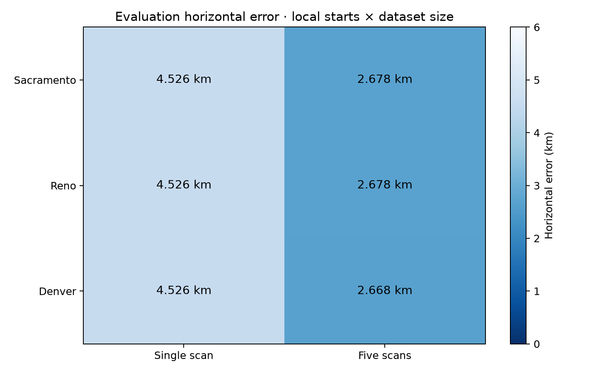
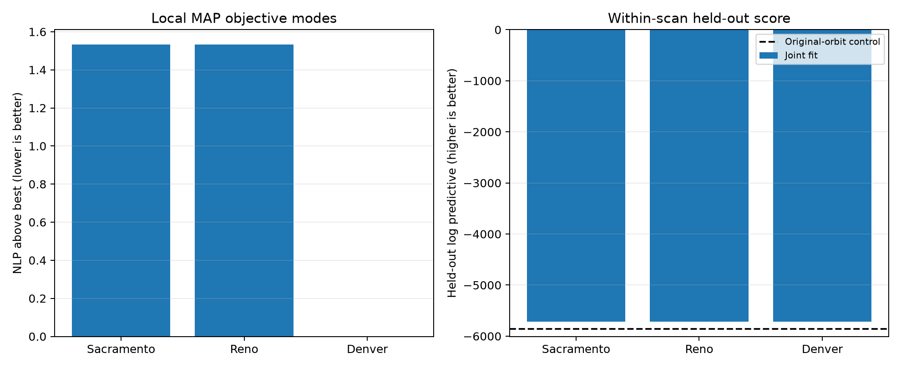

# Five-scan blind shared-orbit position study

Five blind scans reduced the evaluation error from about 4.526 km in the
single-scan result to 2.668–2.678 km across three independent local starts.
This is a useful improvement on this cohort, but it is not evidence of
calibrated confidence, a globally selected position, or a corrected satellite
orbit.

| Local start | Single scan error (km) | Five scans error (km) | Five-scan negative log posterior | Above best | Held-out log predictive | Projected gradient max |
|---|---:|---:|---:|---:|---:|---:|
| Sacramento | 4.526022 | 2.677907 | 7348.065344 | 1.533987 | -5719.360322 | 9.998e-4 |
| Reno | 4.526177 | 2.678282 | 7348.065344 | 1.533988 | -5719.360653 | 4.617e-4 |
| Denver | 4.526211 | 2.667588 | 7346.531357 | 0 | -5719.388967 | 6.697e-4 |



The data comprise 165 RF-derived tracks and 5,432 observations from five scans
over a 3.2-hour capture span. The split holds out interleaved observations
within every scan, so it measures shape interpolation within the observed span.
It is not a whole-scan or future-time holdout. The separate eight-hour
whole-scan experiment remains pending.

The matched original-orbit control scored -5861.960707 on the same held-out
construction. The three joint fits score -5719.389 to -5719.360, gains of
142.572–142.600 log-score units. These are composite likelihood scores with an
effective count of six. They should not be read as ordinary independent-sample
log likelihoods.

## Exact replay and numerical status

Every reported fit ended on L-BFGS-B's relative-objective termination condition.
The projected-gradient maxima remain between 4.62e-4 and 1.00e-3, above the
configured 1e-5 gradient tolerance, so the report records relative-objective
convergence rather than claiming tight first-order convergence.

Each solution passed independent exact propagation replay over 1,819,178
candidate cases, with the shared rate prior counted once. Maximum interpolated
versus exact Doppler differences were 3.902e-6 Hz for Reno, 3.916e-6 Hz for
Sacramento, and 5.098e-6 Hz for Denver. Objective replay differences were at
most 4.89e-9 and held-out differences at most 4.16e-9 in magnitude.

## Local modes and identity coupling



Sacramento and Reno converge to essentially the same mode. Denver reaches a
composite MAP objective lower by about 1.534 while its held-out score is about
0.029 worse. The difference corresponds to only about `exp(1.534) = 4.64` in
relative composite-MAP support before accounting for mode search, nuisance-rate
optimization, or calibration.

The strongest visible mode change occurs in the eight reported `e3bc` episode
associations containing NORADs 63792 and 55604. Sacramento and Reno keep 63792
dominant in the leading episodes and fit its shared rate near +0.01878 s/h;
55604 has negligible aggregate displayed weight and a rate near zero. Denver
splits several leading episodes between the two and moves the 55604 rate to
-0.10786 s/h while retaining 63792 near +0.01865 s/h. This supports an
identity/rate-coupled local-mode explanation. The displayed association weights
are composite MAP weights, not calibrated satellite-identity posterior
probabilities.

## Interpretation limits

The study used three local starts and therefore does not establish a global
mode. The fitted rate is a nuisance parameter inside bounded interpolation and
does not constitute acquisition of a corrected orbit. The error reduction also
does not isolate the incremental value of geometry from the additional tracks,
shared identity constraints, and shared rate parameters. A geometry-specific
gain has not been proven.

Each regional result was evaluated only after its corresponding blind fit and
exact replay qualified. Sacramento and Denver were evaluated before Reno's
exact replay completed; Reno was evaluated afterward. The position reference
is used solely for the error columns and plots. It did not select candidates,
rates, positions, or convergence.

## Reproduction and machine evidence

Run from the repository root:

```bash
.venv/bin/python reports/2026_09_22_five_scan_shared_orbit/render.py
```

[`summary.json`](summary.json) contains the plotted values, association-mode
diagnostics, dataset counts, and interpretation limits. [`provenance.json`](provenance.json)
binds all fit files, exact replay outputs and adapters, five cache manifests,
the evaluation reference, matched control, and prior single-scan evaluation by
SHA-256. The large fit and replay-adapter files remain in the research cache to
avoid copying the same full 11,106-entry rate vector many times. The three small
exact aggregate receipts are copied under [`exact/`](exact/), and compact
supporting inputs are copied under [`supporting/`](supporting/).
