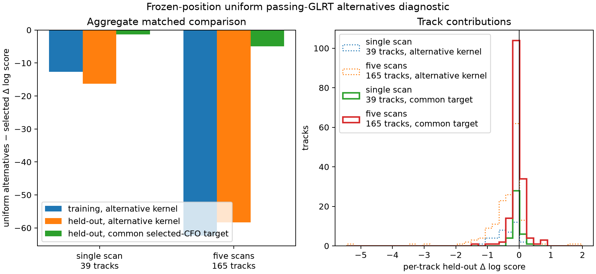

# Uniform passing-GLRT frequency alternatives at frozen blind positions

## Result

This truth-free diagnostic compares the exported selected CFO row with a uniform
mixture over deduplicated fractional-GLRT candidates that passed the existing
margin gate. It evaluates the independently sealed Sacramento single-scan and
five-scan positions without moving or selecting a position.

| Cohort | Tracks | Train Δ | Held-out Δ, uniform kernel | Held-out Δ, common selected-CFO target |
|---|---:|---:|---:|---:|
| Single scan | 39 | −12.661 | −16.287 | **−1.313** |
| Five scans | 165 | −62.330 | −58.306 | **−4.967** |

The primary fair comparison evaluates both models against the same selected-CFO
held-out rows. The alternative-trained model is still worse, by 1.313 and 4.967
composite log-score units. The larger 16.287 and 58.306 losses answer a different
question because the alternative arm also averages the held-out measurement
kernel over passing CFOs. Much of that larger penalty comes from broadening the
measurement target and must not be read as a nuisance/identity prediction loss.

There is no demonstrated improvement under uniform alternative weights and no
basis here to run automatic joint position optimization with this arm. The result
does **not** show that every treatment of GLRT alternatives is harmful. It does
not test calibrated alternative probabilities. Recorded GLRT scores are
detection statistics, not probabilities, and this experiment deliberately does
not convert them into weights.



## Method

For each RF row, passing alternatives are transformed around the selected CFO:

`selected canonical CFO + wrap(raw alternative − raw selected, 1/4.4us) × 11.2GHz/actual RF`.

Rows within 0.01 canonical Hz and 0.01 epoch sample are deduplicated. Surviving
rows receive equal weight. The selected-rank row is placed first as an explicit
profile seed even when its rank is nonzero. The threshold is defined on the
canonical CFO used by the likelihood; the source export's numerical-duplicate
summary used native values.

Each satellite candidate gets one constant CFO offset fitted only on five-block
training rows. Held-out rows use that frozen offset. The alternative model uses
a deterministic multistart mixture profile seeded by the selected trajectory
and every deduplicated alternative-index trajectory. It is a local profile
approximation, not certified global optimization or global marginalization.
Synthetic multimodal tests compare it with a dense finite grid, but that grid is
not a global proof.

Two held-out questions are retained. The original v3 question evaluates the
alternative model using the uniform alternative row kernel on held-out data. The
v4 common-target question keeps the same alternative-trained candidate offsets,
identity evidence, and alternative-trained 30 kHz null offset, then evaluates
candidate and null predictions against the selected CFO held-out row. Neither
offset nor identity is refitted on held-out data. The selected baseline is
unchanged. The common-target CFO is an exported diagnostic target, not IQ truth.

Both arms use effective count six times mean row log likelihood, the declared
250 Hz signal scale, the same full causal catalogue population divisor, and the
explicit signal/null prior. The selected null uses selected measurements at
30 kHz; the alternative null uses the same uniformly mixed alternatives and
training-only profile at 30 kHz. Candidates failing the baseline's minimum
elevation requirement at any training observation are excluded before nuisance
profiling while remaining in the full catalogue divisor.

The selected calculation is independently compared with the existing regional
`score_states` implementation. Maximum discrepancies are `1.07e-11` for the
single scan and `3.00e-11` for the set, below the required `1e-6`. Every chosen
candidate and null nuisance fit converged. The outputs therefore mark
both comparisons `qualified=true` under this declared local-profile method.

## Scope and provenance

No reference coordinate, position error, known identity, saved site candidate,
or RF collection is used. The two frozen positions come from their own sealed
five-block blind refinements. Full candidate support is verified against those
refinements for every track. The alternative source is
`/tmp/position-selected-glrt-alternatives-v3.json`, whose receipt binds the
public source port and immutable RF shards.

The v4 single diagnostic took 3.53 seconds internally; the set took 13.22
seconds internally. Both used one BLAS thread. The executed
source digest is
`sha256:0fd726fd7632aee58c8f5196d78c277ee4e575a3a6153742cdd6d0073d99ee85`.

`single-result.json` and `set-result.json` retain every track's selected and
alternative train/held-out score, visible candidate count, convergence count,
parity error and runtime. `execution-receipt.json` binds both results, their
runtime logs, the v3 alternative export, executed source and replay helper.
The original v3 outputs are preserved as `single-v3-result.json` and
`set-v3-result.json`; v4 contains both the original-kernel and common-target
questions.

Two failed development attempts are retained under `failed-runs/`:

- The first launch correctly rejected a session-level digest check that did not
  account for the outer exporter adding `source_shard_file_digest` after the
  session content digest. No result was produced.
- The next single-scan run computed all tracks but failed final serialization on
  a NumPy boolean. Its checkpoint remains `status=running` and is not a result.
  The set output from that source was superseded by the matched final rerun.

Reproduce to fresh paths with the repository tool, whose exact executed bytes
are archived under `source/`. Read access to the sealed upstream inputs is
required; the following commands use local privileged read access to those
inputs:

```bash
sudo -n env OPENBLAS_NUM_THREADS=1 OMP_NUM_THREADS=1 nice -n 10 \
  .venv/bin/python tools/research/ablate_glrt_frequency_alternatives.py \
  --refinement /tmp/recent-five-block-regional-v1/sacramento-single-refinement-v2/result.json \
  --evidence /tmp/recent-regional-evidence-v1 \
  --alternatives-input /tmp/position-selected-glrt-alternatives-v3.json \
  --output /tmp/glrt-alternatives-single-reproduction.json --budget-seconds 600

sudo -n env OPENBLAS_NUM_THREADS=1 OMP_NUM_THREADS=1 nice -n 10 \
  .venv/bin/python tools/research/ablate_glrt_frequency_alternatives.py \
  --refinement /tmp/recent-five-block-regional-v1/sacramento-set-refinement-v2/result.json \
  --evidence /tmp/recent-regional-evidence-v1 \
  --alternatives-input /tmp/position-selected-glrt-alternatives-v3.json \
  --output /tmp/glrt-alternatives-set-reproduction.json --budget-seconds 600
```

Validation:

```bash
.venv/bin/pytest -q tests/tools/test_ablate_glrt_frequency_alternatives.py
.venv/bin/ruff check tools/research/ablate_glrt_frequency_alternatives.py \
  tests/tools/test_ablate_glrt_frequency_alternatives.py
```
