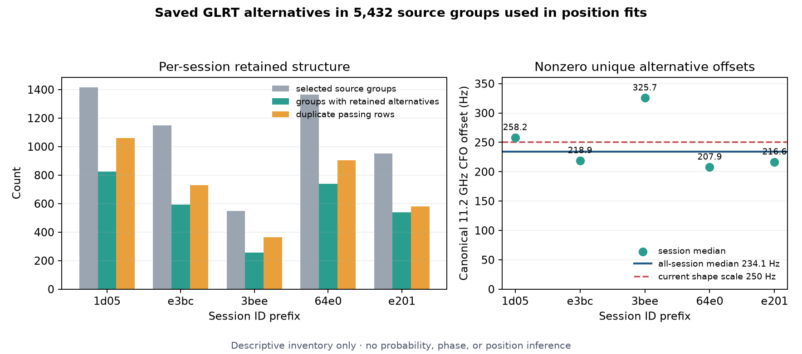

# Saved GLRT frequency alternatives for source groups used in position fits

This diagnostic inventories every saved fractional-GLRT candidate for the
5,432 source groups used by the five-session position fits. The RF-only cohort
was selected before position inference. The diagnostic reads the
complete saved scanner-analysis products through the manifest-verified public
port and joins them to the selected RF rows by source-group identity. It does
not rerun the detector, fit a position, choose a new frequency candidate, or
access truth. The exported artifact declares `inference_performed=false` and
`truth_accessed=false`.



## Inventory result

The selected groups contain 31,463 saved fractional candidates. Of these,
13,221 pass the saved fractional-margin gate. Applying the exporter's duplicate
equivalence rule removes 3,642 passing rows, leaving 9,579 unique passing
candidates: one selected anchor for each of the 5,432 groups and 4,147 nonzero
circular alternatives. A total of 2,952 selected source groups contain more
than one unique passing candidate.

| Session | Selected groups | Passing rows | Duplicate rows | Groups with alternatives | Nonzero unique alternatives | Median absolute offset (Hz) |
|:---|---:|---:|---:|---:|---:|---:|
| `1d05` | 1,415 | 3,763 | 1,060 | 824 | 1,288 | 256.0 |
| `e3bc` | 1,150 | 2,634 | 731 | 593 | 753 | 212.9 |
| `3bee` | 549 | 1,313 | 366 | 255 | 398 | 321.0 |
| `64e0` | 1,365 | 3,234 | 903 | 740 | 966 | 206.7 |
| `e201` | 953 | 2,277 | 582 | 540 | 742 | 218.5 |
| **All** | **5,432** | **13,221** | **3,642** | **2,952** | **4,147** | **233.4** |

The table's all-session median is **233.401 native Hz** after circular reduction
by the pilot-symbol alias period. Native scale varies with the group's actual
RF. Scaling every alternative to the position model's canonical 11.2 GHz
carrier gives a pooled median of **234.142 canonical Hz**. The plot compares
these per-session canonical medians with the current position model's 250 Hz
canonical signal-residual scale. Their proximity does not show better
likelihood, better positioning, calibrated probability, or a physical phase
relationship. Candidate margins are detector statistics rather than posterior
probabilities.

Duplicate passing rows are equivalent only under the declared numerical rule:
less than 0.01 Hz native-CFO separation and less than 0.01 sample total-epoch
separation. Duplicate collapse prevents repeated saved solutions from being
counted as separate alternatives; it does not establish a common transmitter
or physical signal identity.

## Authority and closure checks

All 5,432 selected source-group IDs are unique and resolve to the complete
public scanner-analysis authority for their session. Each session payload binds
the input manifest, analysis manifest, raw-recording authority, and selected RF
shard digest. The public-port timing and support fields agree with the selected
rows. The integer-alias transformation closes for every group; the maximum
absolute closure error is `4.656612873077393e-10` Hz.

The compressed [v3 export](position-selected-glrt-alternatives-v3.json.gz)
contains the full groups and candidate rows. The [execution receipt](execution-receipt.json)
binds the uncompressed and gzip digests plus the four executed source files.
Its five-entry shard inventory was reconstructed during publication from the
unchanged payload's per-session `source_shard_file_digest` fields and verified
against readable shard copies. The byte-for-byte [original execution receipt](original-execution-receipt.json)
is preserved because its top-level `input_shards` map was empty; the payload
itself already carried all five shard digests. This publication repair changed
neither the export nor any source data.
The [manifest](manifest.json) binds every published file in this directory.
The plot can be regenerated from the compressed artifact and receipt with
[`render.py`](render.py); it verifies the gzip digest and candidate accounting
before drawing.

## Reproduction

The export is read-only. Reproduction requires the same five manifest-verified
public scanner inputs and the exact position RF shards whose per-session
digests are recorded in the v3 payload. Write to a fresh output path:

```bash
sudo -n -u leo env OPENBLAS_NUM_THREADS=1 OMP_NUM_THREADS=1 \
  /home/mouse9911/gits/leo-standard-position-methods/.venv/bin/python \
  /home/mouse9911/gits/leo-standard-position-methods/tools/research/export_position_glrt_alternatives.py \
  --root /srv/bulk/leo \
  --shards /tmp/recent-position-rf-shards-v1 \
  --output /tmp/position-selected-glrt-alternatives-reproduction.json \
  --session scan-fw-1d05092feaa8f7d5 \
  --session scan-fw-e3bc0741ecf02704 \
  --session scan-fw-3bee6be6e987a34f \
  --session scan-fw-64e06d86f4746e55 \
  --session scan-fw-e201d79ba3234e2e
```

Regenerate the figure after placing the reproduced gzip and receipt under the
published filenames:

```bash
.venv/bin/python reports/2026_09_22_glrt_frequency_alternatives/render.py
```

The artifact is conditional on the pre-position RF source-group cohort. It is
an inventory of retained frequency alternatives, not evidence that any
alternative improves the position solution. It provides no carrier phase,
boresight, satellite-identity truth, or independent position validation.
